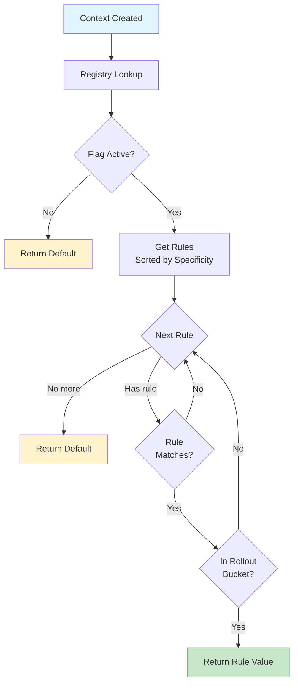

# Public API Surface Summary
# Extracted: 2025-12-15T12:01:26-05:00

## From 01-getting-started.md

# Getting Started

Type-safe flags in 5 minutes. If it compiles, it works—no runtime errors, no null checks, no string typos.

## Why Konditional?

Most feature flag systems use runtime strings. Konditional uses compile-time properties instead.

| Feature          | String-Based (Custom)                                                       | Konditional                                                                                   |
|------------------|-----------------------------------------------------------------------------|-----------------------------------------------------------------------------------------------|
| **Type Safety**  | Exclusively booleans, drives branching explosion in reality                 | Compile-time safety allows runtime usage without risk `feature { Features.FLAG }`             |
| **Evaluation**   | Hardcoded via boolean flows                                                 | Dynamic and generic, maintaining rigor of type-checking                                       |
| **Context**      | Enum class with string keys                                                 | Typed data classes with IDE autocomplete                                                      |
| **Performance**  | Shared module forces full-rebuild at compile-time, unable to leverage cache | Module changes to flags are not invalidating of task-graph for parent                         |
| **Organization** | Prefixing, shared single source by all                                      | Namespaces (compile-time isolated), with type-enforced boundaries, infitinitely divisible     |
| **Errors**       | Silent failures, null checks, type casting                                  | Guarnteed valid startup config,<br/> Update failures emerge **before** update, during parsing |

**Core benefits:** 
* No more invalid configurations, instead, compile errors.
* First-class Gradle caching support
* Modules own the feature flags they are concerned with
* Unified, single-source, for all flagging
* Your IDE knows everything.
* Built to scale to multi-tenancy, seamlessly

---

## Installation

```kotlin
// build.gradle.kts
dependencies {
    implementation("io.amichne:konditional:0.0.1")
}
```

---

## Your First Flag

Define flags as properties. The compiler enforces types:

```kotlin
import io.amichne.konditional.core.features.FeatureContainer
import io.amichne.konditional.core.Namespace
import io.amichne.konditional.context.*

object AppFeatures : FeatureContainer<Namespace.Global>(Namespace.Global) {
    val DARK_MODE by boolean(default = false) {
        rule {
            platforms(Platform.IOS)
            rollout { 50.0 }
        } returns true
    }
}

// Create context (required for evaluation)
val context = Context(
    locale = AppLocale.UNITED_STATES,
    platform = Platform.IOS,
    appVersion = Version.parse("2.1.0"),
    stableId = StableId.of("a1b2c3d4e5f6a7b8c9d0e1f2a3b4c5d6")
)

// Evaluate - returns Boolean, never null
val enabled: Boolean = feature { AppFeatures.DARK_MODE }
```

**vs String-Based Systems:**
```kotlin
// String-based - runtime lookup, can typo, type unknown
val enabled = featureFlags.getBoolean("dark-mode", false)  // No IDE help, typos fail silently

// Konditional - compile-time property, autocomplete works
val enabled = feature { AppFeatures.DARK_MODE }  // IDE knows it's Boolean
```

---

## Multiple Types

All primitives work out of the box:

```kotlin
object AppConfig : FeatureContainer<Namespace.Global>(Namespace.Global) {
    val DARK_MODE by boolean(default = false)
    val API_ENDPOINT by string(default = "https://api.example.com")
    val MAX_RETRIES by int(default = 3)
    val TIMEOUT by double(default = 30.0)
}
```

Each flag is typed—you can't accidentally treat a string as a boolean.

---

## Common Patterns

### Pattern 1: Gradual Rollout

Ship to 10% of users, then expand:

```kotlin
val NEW_CHECKOUT by boolean(default = false) {
    rule {
        platforms(Platform.ANDROID)
        rollout { 10.0 }  // Start small
    } returns true
}

// Later: increase to 50%
// Same users stay enabled (deterministic SHA-256 bucketing)
```

### Pattern 2: Platform-Specific Config

Different values per platform:

```kotlin
val API_ENDPOINT by string(default = "https://api.example.com") {
    rule { platforms(Platform.IOS) } returns "https://api-ios.example.com"
    rule { platforms(Platform.ANDROID) } returns "https://api-android.example.com"
    rule { platforms(Platform.WEB) } returns "https://api-web.example.com"
}
```

### Pattern 3: A/B Testing

Split traffic 50/50:

```kotlin
val RECOMMENDATION_ALGO by string(default = "collaborative") {
    rule { rollout { 50.0 } } returns "content-based"
}
// Same user always gets same variant (deterministic)
```

---

## Evaluation Methods

```kotlin
// Simple evaluation with default
val enabled = feature { AppFeatures.DARK_MODE }

```

---

## Organizing by Team/Domain

Use namespaces to isolate features:

```kotlin
object AuthFeatures : FeatureContainer<Namespace.Authentication>(
    Namespace.Authentication
) {
    val SOCIAL_LOGIN by boolean(default = false)
}

object PaymentFeatures : FeatureContainer<Namespace.Payments>(
    Namespace.Payments
) {
    val APPLE_PAY by boolean(default = false)
}
```

**Benefits:**
- Features can't collide across namespaces
- Each team owns their namespace
- Type system prevents cross-namespace access mistakes

---

## Key Differentiators

### 1. Compile-Time Safety
String-based: `getFlag("flag-name")` — Typos fail at runtime (or silently return defaults)
**Konditional:** `feature { Features.DARK_MODE }` — Typos fail at compile time

### 2. Offline-First Architecture
String-based (LaunchDarkly/Statsig): Network call or cache required for evaluation
**Konditional:** All evaluation happens locally. Zero network dependency.

### 3. Zero-Allocation Evaluation
String-based: HashMap lookups, type casting, object creation per evaluation
**Konditional:** Immutable data structures, lock-free reads, no GC pressure

### 4. Type-Safe Contexts
String-based: `context.put("tier", "enterprise")` — String keys, Any values, no validation
**Konditional:**
```kotlin
data class EnterpriseContext(
    // ... standard fields ...
    val subscriptionTier: SubscriptionTier  // Enum, not string - compile-time validated
) : Context
```

### 5. Deterministic Rollouts
Most systems use hashing, but Konditional's SHA-256 bucketing is:
- Platform-stable (same buckets on JVM, Android, iOS, Web)
- Independent per flag (user in 50% of Flag A ≠ in 50% of Flag B)
- Salt-controllable (change salt to redistribute users)

---

## Next Steps

**Just getting started?** You're done! Start adding flags to your code.

**Need advanced targeting?** See **[Targeting & Rollouts](04-targeting-rollouts.md)** for rules, specificity, and custom logic.

**Want custom contexts?** See **[Core Concepts](03-core-concepts.md)** for extending Context with business data.

**Migrating from another system?** See **[Migration Guide](02-migration.md)** for concept mapping and adoption patterns.

**Loading remote configs?** See **[Remote Configuration](06-remote-config.md)** for JSON serialization.

---

## Quick Reference

```kotlin
// 1. Define features
object Features : FeatureContainer<Namespace.Global>(Namespace.Global) {
    val FLAG by boolean(default = false) {
        rule { platforms(Platform.IOS); rollout { 50.0 } } returns true
    }
}

// 2. Create context
val ctx = Context(locale, platform, version, stableId)

// 3. Evaluate
val value = feature { Features.FLAG }
```

That's it. Type-safe feature flags in 3 steps.

## From 03-core-concepts.md

# Core Concepts

Design flags for your domain. This guide covers Features, Context, and Namespaces—the building blocks of type-safe
feature flags.

---

## Features

Features are type-safe flag definitions. Define them once, use them everywhere with compiler guarantees.

### FeatureContainer Pattern (Recommended)

The delegation pattern gives you property access with zero boilerplate:

```kotlin
object AppFeatures : FeatureContainer<Namespace.Global>(Namespace.Global) {
    val DARK_MODE by boolean(default = false)
    val API_ENDPOINT by string(default = "https://api.example.com")
    val MAX_RETRIES by int(default = 3)
    val TIMEOUT by double(default = 30.0)
}

// Property access, not method calls
val enabled = feature { AppFeatures.DARK_MODE }  // Type: Boolean
val endpoint = feature { AppFeatures.API_ENDPOINT }  // Type: String
```

**What you get:**

- Property names become flag keys automatically
- Type inference from default values
- IDE autocomplete
- Compile-time validation

### Supported Types

| Type    | DSL Method  | Kotlin Type   | Example Default |
|---------|-------------|---------------|-----------------|
| Boolean | `boolean()` | `Boolean`     | `false`         |
| String  | `string()`  | `String`      | `"production"`  |
| Integer | `int()`     | `Int`         | `42`            |
| Decimal | `double()`  | `Double`      | `3.14`          |
| Enum    | `enum<E>()` | `E : Enum<E>` | `LogLevel.INFO` |

### Enum Flags

For type-safe variants, use enums:

```kotlin
enum class LogLevel { DEBUG, INFO, WARN, ERROR }
enum class Theme { LIGHT, DARK, AUTO }

object AppConfig : FeatureContainer<Namespace.Global>(Namespace.Global) {
    val LOG_LEVEL by enum<LogLevel, Context>(default = LogLevel.INFO)
    val THEME by enum<Theme, Context>(default = Theme.LIGHT)
}

// Type-safe evaluation
val level: LogLevel = feature { AppConfig.LOG_LEVEL }
```

**vs string-based systems:**

```kotlin
// LaunchDarkly - strings, can typo
val level = client.stringVariation("log-level", "info")
when (level) {
    "debug" -> ...
    "deubg" -> ...  // Typo! Never matches
}

// Konditional - compiler validates
val level = feature { AppConfig.LOG_LEVEL }
when (level) {
    LogLevel.DEBUG -> ...
    LogLevel.DEUBG -> ...  // Compile error
}
```

---

## Context

Context provides the evaluation environment. Every evaluation requires context—it tells Konditional *who* is asking and
*where* they are.

### Standard Fields

All contexts must have these four fields:

```kotlin
data class Context(
    val locale: AppLocale,       // App language/region
    val platform: Platform,      // Device type
    val appVersion: Version,     // App version (semantic)
    val stableId: StableId       // User/device identifier (hex)
)
```

**Example:**

```kotlin
val context = Context(
    locale = AppLocale.UNITED_STATES,
    platform = Platform.IOS,
    appVersion = Version.parse("2.1.0"),
    stableId = StableId.of("a1b2c3d4e5f6a7b8c9d0e1f2a3b4c5d6")
)
```

### Platform

Where your code runs:

```kotlin
enum class Platform {
    IOS,        // iOS apps
    ANDROID,    // Android apps
}
```

Use in rules:

```kotlin
rule { platforms(Platform.IOS, Platform.ANDROID) } returns mobileValue
```

### AppLocale

User's language and region. 27 supported locales:

```kotlin
AppLocale.UNITED_STATES  // en-US
AppLocale.CANADA         // en-CA
AppLocale.UNITED_KINGDOM // en-GB
AppLocale.FRANCE         // fr-FR
AppLocale.JAPAN          // ja-JP
// ... 22 more
```

Use in rules:

```kotlin
rule { locales(AppLocale.UNITED_STATES, AppLocale.CANADA) } returns "en" locale
```

### Version

Semantic versioning (major.minor.patch):

```kotlin
val version = Version.parse("2.1.0")  // ParseResult<Version>
val version = Version.of(2, 1, 0)     // Direct construction
```

Use in rules for version targeting:

```kotlin
rule {
    versions {
        min(2, 0, 0)  // Minimum 2.0.0
        max(3, 0, 0)  // Below 3.0.0
    }
} returns v2Feature
```

### StableId

Stable user/device identifier for deterministic rollouts. Must be hexadecimal (32+ chars).

```kotlin
// Valid hex IDs
val id1 = StableId.of("a1b2c3d4e5f6a7b8c9d0e1f2a3b4c5d6")
val id2 = StableId.of("deadbeefcafebabe1234567890abcdef")

// Invalid - will throw
val bad = StableId.of("user-123")  // Not hex!
```

**Convert existing IDs:**

```kotlin
fun toStableId(userId: String): StableId {
    val hash = MessageDigest.getInstance("SHA-256")
        .digest(userId.toByteArray())
        .joinToString("") { "%02x".format(it) }
    return StableId.of(hash)
}
```

**Why hex?** Ensures uniform distribution across rollout buckets (0-9999).

---

## Custom Contexts

Extend Context with business-specific fields for advanced targeting.

### Enterprise Example

```kotlin
data class EnterpriseContext(
    override val locale: AppLocale,
    override val platform: Platform,
    override val appVersion: Version,
    override val stableId: StableId,
    // Custom fields
    val subscriptionTier: SubscriptionTier,
    val organizationId: String,
    val userRole: UserRole,
    val employeeCount: Int
) : Context

enum class SubscriptionTier { FREE, PRO, ENTERPRISE }
enum class UserRole { VIEWER, EDITOR, ADMIN }

object PremiumFeatures : FeatureContainer<Namespace.Global>(Namespace.Global) {
    val ADVANCED_ANALYTICS by boolean<EnterpriseContext>(default = false) {
        rule {
            extension {
                Evaluable.factory { ctx ->
                    ctx.subscriptionTier == SubscriptionTier.ENTERPRISE &&
                    ctx.employeeCount > 100
                }
            }
        } returns true
    }
}

// Evaluation with custom context
val ctx = EnterpriseContext(
    locale = AppLocale.UNITED_STATES,
    platform = Platform.WEB,
    appVersion = Version.parse("3.0.0"),
    stableId = StableId.of("..."),
    subscriptionTier = SubscriptionTier.ENTERPRISE,
    organizationId = "acme-corp",
    userRole = UserRole.ADMIN,
    employeeCount = 500
)

val enabled = feature { PremiumFeatures.ADVANCED_ANALYTICS }  // true
```

### Multi-Tenant Example

```kotlin
data class TenantContext(
    override val locale: AppLocale,
    override val platform: Platform,
    override val appVersion: Version,
    override val stableId: StableId,
    val tenantId: String,
    val featureAccess: Set<String>  // Purchased features
) : Context

object SaasFeatures : FeatureContainer<Namespace.Global>(Namespace.Global) {
    val PDF_EXPORT by boolean<TenantContext>(default = false) {
        rule {
            extension {
                Evaluable.factory { ctx ->
                    "pdf-export" in ctx.featureAccess
                }
            }
        } returns true
    }
}
```

**Key principle:** Custom contexts enable type-safe business logic in rules without hardcoding user IDs or organization
names.

---

## Namespaces

Namespaces isolate features by domain. Each namespace has its own registry—features can't collide across namespaces.

### Built-In Namespaces

```kotlin
Namespace.Global            // Shared across app
Namespace.Authentication    // Login, SSO, 2FA
Namespace.Payments          // Billing, subscriptions
Namespace.Messaging         // Chat, notifications
Namespace.Search            // Search algorithms
Namespace.Recommendations   // Personalization
```

### Using Namespaces

```kotlin
object AuthFeatures : FeatureContainer<Namespace.Authentication>(
    Namespace.Authentication
) {
    val SOCIAL_LOGIN by boolean(default = false)
    val TWO_FACTOR_AUTH by boolean(default = true)
}

object PaymentFeatures : FeatureContainer<Namespace.Payments>(
    Namespace.Payments
) {
    val APPLE_PAY by boolean(default = false)
    val STRIPE_INTEGRATION by boolean(default = true)
}

// Each namespace isolated
Namespace.Authentication.load(authConfig)  // Only affects auth features
Namespace.Payments.load(paymentConfig)     // Only affects payment features
```

### Namespace Benefits

| Benefit                    | What It Means                                              |
|----------------------------|------------------------------------------------------------|
| **Compile-time isolation** | Can't accidentally use wrong namespace's features          |
| **Runtime isolation**      | Separate registries, independent configurations            |
| **Team ownership**         | Clear boundaries (Auth team owns Authentication namespace) |
| **Independent deployment** | Update one namespace without affecting others              |

### Custom Namespaces

For team-specific domains:

```kotlin
// Sealed class ensures compile-time exhaustiveness
sealed class TeamNamespace(id: String) : Namespace.Domain(id) {
    data object Recommendations : TeamNamespace("recommendations")
    data object Analytics : TeamNamespace("analytics")
}

object RecFeatures : FeatureContainer<TeamNamespace.Recommendations>(
    TeamNamespace.Recommendations
) {
    val COLLABORATIVE_FILTERING by boolean(default = true)
}
```

**Why sealed?** Governance—new namespaces require code review and PR approval.

---

## Organizational Patterns

### Pattern 1: By Feature Domain

Organize containers by business capability:

```kotlin
object UserManagement : FeatureContainer<Namespace.Global>(Namespace.Global) {
    val PROFILE_EDITING by boolean(default = true)
    val ACCOUNT_DELETION by boolean(default = true)
}

object ContentModeration : FeatureContainer<Namespace.Global>(Namespace.Global) {
    val AUTO_MODERATION by boolean(default = false)
    val MANUAL_REVIEW by boolean(default = true)
}
```

### Pattern 2: By Platform

Separate mobile and web flags:

```kotlin
object MobileFeatures : FeatureContainer<Namespace.Global>(Namespace.Global) {
    val OFFLINE_MODE by boolean(default = true)
    val PUSH_NOTIFICATIONS by boolean(default = true)
}

object WebFeatures : FeatureContainer<Namespace.Global>(Namespace.Global) {
    val DESKTOP_NOTIFICATIONS by boolean(default = false)
    val PROGRESSIVE_WEB_APP by boolean(default = false)
}
```

### Pattern 3: By Team

Use namespaces for team isolation:

```kotlin
// Team 1: Growth
object GrowthFeatures : FeatureContainer<Namespace.Global>(Namespace.Global) {
    val REFERRAL_PROGRAM by boolean(default = false)
}

// Team 2: Monetization
object MonetizationFeatures : FeatureContainer<Namespace.Payments>(
    Namespace.Payments
) {
    val SUBSCRIPTION_UPSELL by boolean(default = true)
}
```

---

## Type Safety in Action

Konditional's type system prevents entire classes of errors:

### Impossible Runtime Type Errors

```kotlin
// LaunchDarkly - wrong type method
val retries = client.boolVariation("max-retries", false)  // Oops! Should be int
processWithRetries(retries)  // Type error at runtime

// Konditional - compiler catches it
object Config : FeatureContainer<Namespace.Global>(Namespace.Global) {
    val MAX_RETRIES by int(default = 3)
}
val retries = feature { Config.MAX_RETRIES }  // Type: Int, guaranteed
```

### Impossible Context Mismatches

```kotlin
// Wrong context type
val basicContext: Context = Context(...)
feature { PremiumFeatures.ADVANCED_ANALYTICS }  // Compile error!
// Required: EnterpriseContext, Found: Context

// Correct
val enterpriseContext: EnterpriseContext = EnterpriseContext(...)
feature { PremiumFeatures.ADVANCED_ANALYTICS }  // ✓
```

### Impossible Namespace Collisions

```kotlin
// Can't mix features across namespaces
Namespace.Authentication.load(paymentConfig)  // Compile error!
// Type mismatch
```

---

## Best Practices

### 1. Use FeatureContainer for Everything

Unless you have a specific reason (like enum-based patterns), FeatureContainer delegation is the best API.

### 2. Design Contexts for Your Domain

Don't stuff everything into one mega-context. Create focused contexts:

```kotlin
// Good - focused
data class ShoppingContext(..., val cartTotal: Double) : Context
data class CheckoutContext(..., val paymentMethod: PaymentMethod) : Context

// Bad - kitchen sink
data class AppContext(..., val cartTotal: Double?, val paymentMethod: PaymentMethod?, ...) : Context
```

### 3. Organize by Team/Domain

Use namespaces to reflect your org structure. Each team should own a namespace.

### 4. Start Simple, Extend Later

Begin with basic Context, add custom fields only when needed:

```kotlin
// Start
val context = Context(locale, platform, version, stableId)

// Later, when needed
data class CustomContext(..., val newField: String) : Context
```

### 5. Use Enums for Variants

Don't use strings when enums make sense:

```kotlin
// Bad
val THEME by string(default = "light")  // Can typo "lite"

// Good
enum class Theme { LIGHT, DARK }
val THEME by enum<Theme, Context>(default = Theme.LIGHT)
```

---

## Next Steps

**Need advanced targeting?** See [Targeting & Rollouts](04-targeting-rollouts.md) for rules, specificity, and rollout
strategies.

**Want to evaluate flags?** See [Evaluation](05-evaluation.md) for evaluation methods and error handling.

**Loading from JSON?** See [Remote Configuration](06-remote-config.md) for serialization.

## From 05-evaluation.md

# Evaluation

Predictable results, deterministic behavior. This guide covers evaluation methods and evaluation flow.

---

## Evaluation Methods

Evaluation is a total function: if it compiles, you always get a value back (either from a matching rule or the flag’s
default).

### feature { } - Recommended

Simple evaluation within a ContextAware scope:

```kotlin
// Within a ContextAware + FeatureAware scope
val darkMode = feature { Features.DARK_MODE }
applyDarkMode(darkMode)  // Always non-null
```

**Use when:**

- You have sensible defaults
- Error details don't matter
- You want the most concise API

**Most common choice for production code.**

---

## Evaluation Flow

Understanding how evaluation works helps debug unexpected behavior.

### Step-by-Step Process



### 1. Registry Lookup

```kotlin
val flag = namespace.featureFlag(Features.DARK_MODE)
```

You can’t reference an undefined flag: flags are defined in code and accessed via properties, so the compiler guarantees
you can only evaluate known flags in the correct namespace.

### 2. Flag Activity Check

```kotlin
if (!flag.isActive) {
    return defaultValue
}
```

Inactive flags always return default (kill switch behavior).

### 3. Rule Iteration (by Specificity)

Rules pre-sorted by specificity (highest first):

```kotlin
for (rule in rulesSortedBySpecificity) {
    if (rule.matches(context)) {
        return rule.value  // First match wins
    }
}
```

### 4. Rule Matching

All criteria must match (AND logic):

```kotlin
// Platform check
if (rule.platforms.isNotEmpty() && context.platform !in rule.platforms) {
    return false
}

// Locale check
if (rule.locales.isNotEmpty() && context.locale !in rule.locales) {
    return false
}

// Version check
if (!rule.versionRange.contains(context.appVersion)) {
    return false
}

// Custom extension
if (!rule.extension.matches(context)) {
    return false
}
```

Empty constraint sets match everything (no platforms = all platforms).

#### Custom Extensions

Custom rule logic is evaluated via `extension { }` and receives the flag’s context type.

```kotlin
val ADVANCED_ANALYTICS by boolean<EnterpriseContext>(default = false) {
    rule {
        extension {
            Evaluable.factory { ctx ->
                ctx.subscriptionTier == SubscriptionTier.ENTERPRISE &&
                ctx.employeeCount > 100
            }
        }
    } returns true
}
```

Because the flag is parameterized with `EnterpriseContext`, `ctx` is strongly typed in this scope.

### 5. Rollout Bucketing

Finally, check if user is in rollout bucket:

```kotlin
val bucket = stableBucket(flagKey, context.stableId, salt)
val threshold = (rollout.value * 100).toInt()
if (bucket >= threshold) {
    return false  // Not in bucket
}
```

### 6. Value Resolution

If all checks pass, return rule's value. Otherwise, continue to next rule or return default.

---

## Performance

### Time Complexity

- **Registry lookup:** O(1) hash table
- **Rule iteration:** O(n) where n = number of rules (typically < 10)
- **Rollout bucketing:** O(1) SHA-256 hash
- **Total:** O(n) where n is small

Typical flags have 1-5 rules, so evaluation is effectively O(1).

### Space Complexity

- Zero allocations during evaluation
- All data structures pre-allocated and immutable
- No string concatenation (except bucketing hash input)

**Memory per flag:** ~200-500 bytes (FlagDefinition + rules + strings)

### Concurrency

**Lock-free reads:** No synchronization required for evaluation.

```kotlin
// Multiple threads evaluating concurrently
thread1: feature { Features.DARK_MODE }  // No lock
thread2: feature { Features.DARK_MODE }  // No lock
```

**Atomic updates:** Registry uses `AtomicReference` for configuration snapshots.

```kotlin
Namespace.Global.load(newConfig)  // Atomic swap
// Readers see either old or new, never partial
```

**Scalability:** Throughput scales linearly with CPU cores (no contention).

---

## Thread Safety

### Lock-Free Evaluation

```kotlin
// Safe concurrent evaluation
val threads = (1..100).map {
    thread {
        repeat(1000) {
            val value = feature { Features.DARK_MODE }
            processValue(value)
        }
    }
}
```

**How it works:**

- Immutable data structures (`FlagDefinition`, rules)
- AtomicReference for registry
- Readers see consistent snapshot

### Atomic Updates

```kotlin
// Thread 1: Updating
Namespace.Global.load(newConfig)

// Thread 2: Reading during update
val value = feature { Features.DARK_MODE }
// Sees old OR new, never mixed
```

**Guarantees:**

- Updates are atomic (all-or-nothing)
- No torn reads
- No race conditions

---

## Testing Evaluation

### Test Rule Matching

```kotlin
@Test
fun `iOS users in US get dark mode`() {
    val context = Context(
        locale = AppLocale.UNITED_STATES,
        platform = Platform.IOS,
        appVersion = Version.parse("2.1.0"),
        stableId = StableId.of("a1b2c3d4e5f6a7b8c9d0e1f2a3b4c5d6")
    )

    val enabled = feature { Features.DARK_MODE }
    assertTrue(enabled)
}
```

### Test Determinism

```kotlin
@Test
fun `evaluation is deterministic`() {
    val context = Context(...)

    val results = (1..100).map {
        feature { Features.DARK_MODE }
    }

    assertTrue(results.distinct().size == 1, "Non-deterministic!")
}
```

### Test Rollout Distribution

```kotlin
@Test
fun `50 percent rollout distributes correctly`() {
    val sampleSize = 10_000
    val enabled = (0 until sampleSize).count { i ->
        val ctx = Context(
            ...
            stableId = StableId.of(i.toString(16).padStart(32, '0'))
        )
        feature { Features.ROLLOUT_FLAG }
    }

    val percentage = (enabled.toDouble() / sampleSize) * 100
    assertTrue(percentage in 48.0..52.0)  // ±2% variance
}
```

---

## Best Practices

### 1. Prefer feature { }

For most production code:

```kotlin
// Good - simple, clear
val enabled = feature { Features.DARK_MODE }
```

### 2. Cache Contexts

Create once, reuse for multiple evaluations:

```kotlin
// Good
val context = createUserContext(user)
val darkMode = feature { Features.DARK_MODE }
val apiEndpoint = feature { Config.API_ENDPOINT }
val maxRetries = feature { Config.MAX_RETRIES }

// Avoid
createUserContext(user) // then evaluate elsewhere
```

### 3. Test with Specific Contexts

Create test contexts for specific scenarios:

```kotlin
fun testContext(
    platform: Platform = Platform.IOS,
    locale: AppLocale = AppLocale.UNITED_STATES,
    version: String = "1.0.0",
    stableId: String = "a1b2c3d4e5f6a7b8c9d0e1f2a3b4c5d6"
) = Context(
    locale = locale,
    platform = platform,
    appVersion = Version.parse(version),
    stableId = StableId.of(stableId)
)

@Test
fun testTargeting() {
    val iosContext = testContext(platform = Platform.IOS)
    assertTrue(feature { Features.IOS_ONLY })

    val androidContext = testContext(platform = Platform.ANDROID)
    assertFalse(feature { Features.IOS_ONLY })
}
```

---

## Guarantees

| Aspect            | Guarantee                                          |
|-------------------|----------------------------------------------------|
| **Type safety**   | Return type matches flag definition (compile-time) |
| **Determinism**   | Same inputs always produce same outputs            |
| **Specificity**   | Most specific matching rule always wins            |
| **Bucketing**     | SHA-256 ensures independent, stable buckets        |
| **Performance**   | O(n) where n = rules per flag                      |
| **Thread safety** | Lock-free reads, immutable data                    |
| **Null safety**   | Never returns null                                 |

**Core principle:** If it compiles, evaluation is correct and deterministic.

---

## Next Steps

**Loading remote configs?** See [Remote Configuration](06-remote-config.md) for JSON serialization.

**Building targeting rules?** See [Targeting & Rollouts](04-targeting-rollouts.md) for rules and specificity.

**Understanding the basics?** See [Core Concepts](03-core-concepts.md) for Features and Context.

