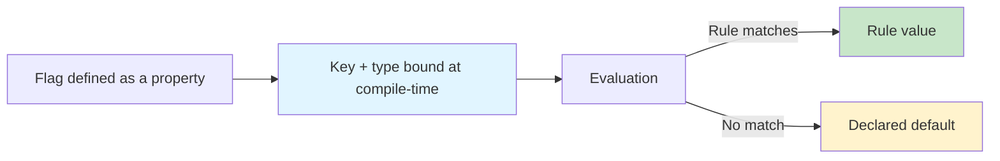
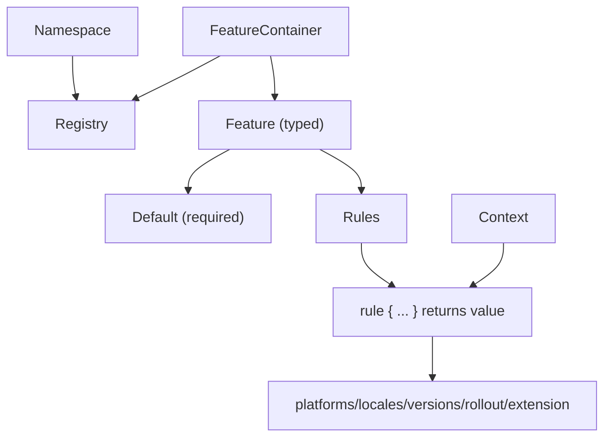
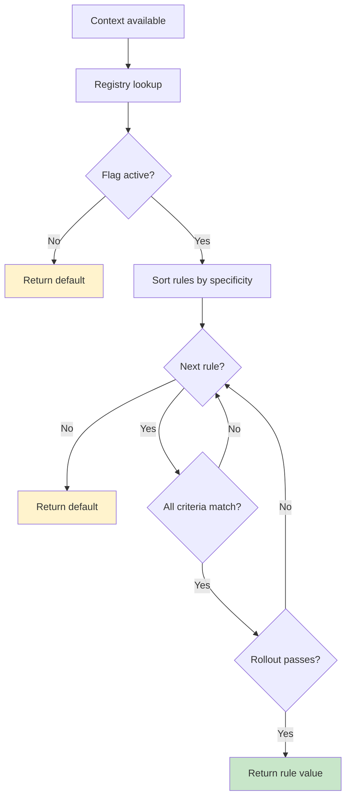

# Public API Surface Summary
# Extracted: 2025-12-17T17:28:13-05:00

## From 01-getting-started.md

# Getting Started

Konditional is a Kotlin feature-flag DSL designed to make configuration *typed*, *deterministic*, and *non-null*.
The core claim is precise: statically-defined flags have compile-time type correctness, and evaluation is total (you always get a value back).

---

## Why Konditional (and what it actually guarantees)

Most flag systems are stringly-typed: a string key selects a value and the caller chooses a “typed getter”.
That architecture creates three failure modes that are syntactically valid but semantically wrong at runtime: key typos, type mismatches, and null propagation.

Konditional changes the failure surface by binding identity and type at definition time via Kotlin properties:

- **No string keys at call sites**: flags are accessed as properties (typos become compile errors).
- **No casts at call sites**: the return type flows from the flag definition (mismatched types become compile errors).
- **No nulls from evaluation**: defaults are required, so evaluation has a total return path.



---

## Installation

```kotlin
// build.gradle.kts
dependencies {
    implementation("io.amichne:konditional:0.0.1")
}
```

---

## Your first flag

Define a flag as a delegated property in a `FeatureContainer` bound to a `Namespace`:

```kotlin
import io.amichne.konditional.core.Namespace
import io.amichne.konditional.core.features.FeatureContainer
import io.amichne.konditional.context.*

object AppFeatures : FeatureContainer<Namespace.Global>(Namespace.Global) {
    val DARK_MODE by boolean(default = false) {
        rule {
            platforms(Platform.IOS)
            rollout { 50.0 }
        } returns true
    }
}

val context = Context(
    locale = AppLocale.UNITED_STATES,
    platform = Platform.IOS,
    appVersion = Version.parse("2.1.0"),
    stableId = StableId.of("a1b2c3d4e5f6a7b8c9d0e1f2a3b4c5d6")
)

val enabled: Boolean = feature { AppFeatures.DARK_MODE }
```

Notes:
- Konditional models evaluation as context-dependent; examples assume you are evaluating within a context-aware scope.
- `feature { ... }` returns the flag’s declared Kotlin type and never returns null.

---

## A small API surface, intentionally

Supported value types (out of the box):

| Type    | DSL Method  | Kotlin Type   | Example Default |
|---------|-------------|---------------|-----------------|
| Boolean | `boolean()` | `Boolean`     | `false`         |
| String  | `string()`  | `String`      | `"production"`  |
| Integer | `int()`     | `Int`         | `42`            |
| Decimal | `double()`  | `Double`      | `3.14`          |
| Enum    | `enum<E>()` | `E : Enum<E>` | `LogLevel.INFO` |

---

## Common patterns

### Gradual rollout (deterministic)

```kotlin
val NEW_CHECKOUT by boolean(default = false) {
    rule {
        platforms(Platform.ANDROID)
        rollout { 10.0 }
    } returns true
}
```

Konditional’s rollouts are deterministic: the same `(stableId, flagKey, salt)` yields the same bucket assignment.

### Platform-specific configuration

```kotlin
val API_ENDPOINT by string(default = "https://api.example.com") {
    rule { platforms(Platform.IOS) } returns "https://api-ios.example.com"
    rule { platforms(Platform.ANDROID) } returns "https://api-android.example.com"
    rule { platforms(Platform.WEB) } returns "https://api-web.example.com"
}
```

### Variants via enums (not strings)

```kotlin
enum class Theme { LIGHT, DARK }

val THEME by enum<Theme, Context>(default = Theme.LIGHT)
```

---

## Namespaces scale ownership, not prefixes

Konditional provides `Namespace.Global`. If you need isolation boundaries beyond global, define your own namespaces in your codebase (consumer-defined), then bind `FeatureContainer`s to them.

```kotlin
sealed class AppDomain(id: String) : Namespace(id) {
    data object Auth : AppDomain("auth")
    data object Payments : AppDomain("payments")
}

object AuthFeatures : FeatureContainer<AppDomain.Auth>(AppDomain.Auth) {
    val SOCIAL_LOGIN by boolean(default = false)
}

object PaymentFeatures : FeatureContainer<AppDomain.Payments>(AppDomain.Payments) {
    val APPLE_PAY by boolean(default = false)
}
```

---

## Next steps

- Learn the building blocks: ["Core Concepts"](03-core-concepts.md)
- Write targeting rules and understand rollouts: ["Targeting & Rollouts"](04-targeting-rollouts.md)
- Understand evaluation order and determinism: ["Evaluation"](05-evaluation.md)
- Add runtime-validated JSON configuration: ["Remote Configuration"](06-remote-config.md)
- Understand the exact trust boundary: ["Theory"](07-theory.md)

## From 03-core-concepts.md

# Core Concepts

Konditional’s public surface is intentionally small. Understanding three primitives—**Features**, **Context**, and **Namespaces**—is enough to reason about correctness, organization, and runtime behavior.



---

## Features

A feature is a typed configuration value with an optional rule set. You define features as delegated properties in a `FeatureContainer`:

```kotlin
object AppFeatures : FeatureContainer<Namespace.Global>(Namespace.Global) {
    val DARK_MODE by boolean(default = false)
    val API_ENDPOINT by string(default = "https://api.example.com")
    val MAX_RETRIES by int(default = 3)
    val TIMEOUT by double(default = 30.0)
}

val enabled: Boolean = feature { AppFeatures.DARK_MODE }
val endpoint: String = feature { AppFeatures.API_ENDPOINT }
```

What this buys you:
- **Property name becomes the key** (no string keys at call sites)
- **Type flows from the delegate** (`boolean` → `Boolean`, etc.)
- **Non-null evaluation** (default is required)

### Supported types

| Type    | DSL Method  | Kotlin Type   | Example Default |
|---------|-------------|---------------|-----------------|
| Boolean | `boolean()` | `Boolean`     | `false`         |
| String  | `string()`  | `String`      | `"production"`  |
| Integer | `int()`     | `Int`         | `42`            |
| Decimal | `double()`  | `Double`      | `3.14`          |
| Enum    | `enum<E>()` | `E : Enum<E>` | `LogLevel.INFO` |

### Enums instead of strings

```kotlin
enum class LogLevel { DEBUG, INFO, WARN, ERROR }
enum class Theme { LIGHT, DARK, AUTO }

object AppConfig : FeatureContainer<Namespace.Global>(Namespace.Global) {
    val LOG_LEVEL by enum<LogLevel, Context>(default = LogLevel.INFO)
    val THEME by enum<Theme, Context>(default = Theme.LIGHT)
}

val level: LogLevel = feature { AppConfig.LOG_LEVEL }
```

Because variants are enum values, invalid variants cannot compile.

---

## Rules

Rules are a typed mapping from a set of criteria to a concrete return value:

```kotlin
val API_ENDPOINT by string(default = "https://api.example.com") {
    rule { platforms(Platform.IOS) } returns "https://api-ios.example.com"
    rule { platforms(Platform.ANDROID) } returns "https://api-android.example.com"
}
```

Criteria you can compose (within a single rule):
- `platforms(...)`
- `locales(...)`
- `versions { min(...); max(...) }`
- `rollout { percent }`
- `extension { ... }` for custom predicates

Within a rule, criteria combine as **AND**: all specified criteria must match for the rule to match.

### Custom predicates via `extension { }`

To keep business targeting logic typed (not string-based), define a custom `Context` and use `extension { }`:

```kotlin
data class EnterpriseContext(
    override val locale: AppLocale,
    override val platform: Platform,
    override val appVersion: Version,
    override val stableId: StableId,
    val subscriptionTier: SubscriptionTier,
    val employeeCount: Int
) : Context

enum class SubscriptionTier { FREE, PRO, ENTERPRISE }

object PremiumFeatures : FeatureContainer<Namespace.Global>(Namespace.Global) {
    val ADVANCED_ANALYTICS by boolean<EnterpriseContext>(default = false) {
        rule {
            extension {
                Evaluable.factory { ctx ->
                    ctx.subscriptionTier == SubscriptionTier.ENTERPRISE &&
                        ctx.employeeCount > 100
                }
            }
        } returns true
    }
}
```

Because the feature is parameterized with `EnterpriseContext`, `ctx` is strongly typed inside the predicate.

---

## Context

Context provides evaluation inputs: it tells Konditional who is asking and where they are.

Standard fields (the minimum required by the rule DSL):

```kotlin
data class Context(
    val locale: AppLocale,
    val platform: Platform,
    val appVersion: Version,
    val stableId: StableId
)
```

### StableId (deterministic rollouts)

`stableId` is a stable identifier used for deterministic bucketing. It must be hex (32+ chars):

```kotlin
val id = StableId.of("a1b2c3d4e5f6a7b8c9d0e1f2a3b4c5d6")
```

If you have an existing user ID, hash it into hex:

```kotlin
fun toStableId(userId: String): StableId {
    val hash = MessageDigest.getInstance("SHA-256")
        .digest(userId.toByteArray())
        .joinToString("") { "%02x".format(it) }
    return StableId.of(hash)
}
```

---

## Namespaces

Namespaces are isolation boundaries: each namespace has its own registry and independent configuration lifecycle.
Konditional provides `Namespace.Global`. If you need more isolation boundaries, define your own namespaces (consumer-defined) and bind containers to them.

```kotlin
sealed class AppDomain(id: String) : Namespace(id) {
    data object Auth : AppDomain("auth")
    data object Payments : AppDomain("payments")
}

object AuthFeatures : FeatureContainer<AppDomain.Auth>(AppDomain.Auth) {
    val SOCIAL_LOGIN by boolean(default = false)
    val TWO_FACTOR_AUTH by boolean(default = true)
}

object PaymentFeatures : FeatureContainer<AppDomain.Payments>(AppDomain.Payments) {
    val APPLE_PAY by boolean(default = false)
    val STRIPE_INTEGRATION by boolean(default = true)
}

AppDomain.Auth.load(authConfig)
AppDomain.Payments.load(paymentConfig)
```

### Custom namespaces (governance)

```kotlin
sealed class TeamDomain(id: String) : Namespace(id) {
    data object Recommendations : TeamDomain("recommendations")
    data object Analytics : TeamDomain("analytics")
}

object RecFeatures : FeatureContainer<TeamDomain.Recommendations>(TeamDomain.Recommendations) {
    val COLLABORATIVE_FILTERING by boolean(default = true)
}
```

---

## Type safety in action (what becomes impossible)

### Wrong value type at call site

```kotlin
object Config : FeatureContainer<Namespace.Global>(Namespace.Global) {
    val MAX_RETRIES by int(default = 3)
}

val retries: Int = feature { Config.MAX_RETRIES }
```

### Wrong context type for a feature

```kotlin
val basicContext: Context = Context(...)
feature { PremiumFeatures.ADVANCED_ANALYTICS } // Compile error (requires EnterpriseContext)
```

### Cross-namespace misuse

```kotlin
AppDomain.Auth.load(paymentConfig) // Compile error (type mismatch)
```

---

## Next steps

- Understand rule composition and rollouts: ["Targeting & Rollouts"](04-targeting-rollouts.md)
- Understand evaluation order and determinism: ["Evaluation"](05-evaluation.md)
- Understand the runtime JSON boundary: ["Remote Configuration"](06-remote-config.md)

## From 05-evaluation.md

# Evaluation

### Konditional evaluation is designed to be predictable

- **Total** — Evaluation always returns a value (rule value or default).
- **Deterministic** — The same inputs produce the same outputs.
- **Non-null** — Defaults are required, so evaluation does not return `T?`.
---

## `feature { }` (recommended)

Concise evaluation inside a context-aware scope:

```kotlin
val darkMode = feature { Features.DARK_MODE }
applyDarkMode(darkMode)
```

Use this when:
- defaults are meaningful
- you want the smallest call-site surface

---

## Explain / trace (operational debugging)

When you need to diagnose a specific user’s outcome, evaluate with a structured reason:

```kotlin
val result = Features.DARK_MODE.evaluateWithReason(context)
println(result.decision)
```

`EvaluationResult` includes:
- decision kind (rule/default/inactive/disabled)
- matched rule constraints + specificity
- deterministic rollout bucket information

---

## Evaluation flow



---

## Emergency kill switch (namespace-scoped)

```kotlin
Namespace.Global.disableAll()
// ... all evaluations in this namespace return declared defaults ...
Namespace.Global.enableAll()
```

---

## Bucketing utility (rollout debugging)

```kotlin
val info = RolloutBucketing.explain(
    stableId = context.stableId,
    featureKey = Features.DARK_MODE.key,
    salt = Namespace.Global.flag(Features.DARK_MODE).salt,
    rollout = Rampup.of(10.0),
)
println(info)
```

### Rule matching (AND semantics)

All specified criteria must match; empty constraint sets match everything.

```kotlin
for (rule in rulesSortedBySpecificity) {
    if (rule.matches(context)) {
        return rule.value
    }
}
return default
```

### Specificity ordering (most specific wins)

Rules are sorted by the number of criteria present (platforms/locales/versions/rollout).
This makes “more targeted” rules win over “more general” rules.

---

## Performance model

The evaluation path is designed to be constant-time in typical usage:
- **Registry lookup:** O(1)
- **Rule iteration:** O(n) where n is rules per flag (typically small)
- **Rollout bucketing:** O(1) SHA-256 hash

Space model:
- no allocations during evaluation
- immutable, pre-built rule structures

---

## Concurrency model

Evaluation is designed for concurrent reads:
- **Lock-free reads**: evaluation does not require synchronization.
- **Atomic updates**: configuration updates swap the active snapshot atomically (`Namespace.load`).

```kotlin
// Thread 1
Namespace.Global.load(newConfig)

// Thread 2 (during update)
val value = feature { Features.DARK_MODE } // sees old OR new, never a mixed state
```

---

## Testing evaluation

### Rule matching

```kotlin
@Test
fun `iOS users in US get dark mode`() {
    val context = Context(
        locale = AppLocale.UNITED_STATES,
        platform = Platform.IOS,
        appVersion = Version.parse("2.1.0"),
        stableId = StableId.of("a1b2c3d4e5f6a7b8c9d0e1f2a3b4c5d6")
    )

    val enabled = feature { Features.DARK_MODE }
    assertTrue(enabled)
}
```

### Determinism

```kotlin
@Test
fun `evaluation is deterministic`() {
    val context = Context(/*...*/)
    val results = (1..100).map { feature { Features.DARK_MODE } }
    assertTrue(results.distinct().size == 1, "Non-deterministic!")
}
```

### Rollout distribution (statistical sanity check)

```kotlin
@Test
fun `50 percent rollout distributes correctly`() {
    val sampleSize = 10_000
    val enabled = (0 until sampleSize).count { i ->
        val ctx = Context(/*..., */
                          stableId = StableId.of(i.toString(16).padStart(32, '0'))
        )
        feature { Features.ROLLOUT_FLAG }
    }

    val percentage = (enabled.toDouble() / sampleSize) * 100
    assertTrue(percentage in 48.0..52.0)
}
```

---

## Guarantees (and boundaries)

| Aspect      | Guarantee                      | Boundary                                            |
|-------------|--------------------------------|-----------------------------------------------------|
| Type safety | return type matches definition | compile-time for statically-defined flags           |
| Non-null    | evaluation never returns null  | relies on required defaults                         |
| Determinism | same inputs → same outputs     | excludes malformed runtime JSON (see remote config) |
| Updates     | atomic swap of configuration   | correctness depends on using `Namespace.load`       |

---

## Next steps

- Understand rollouts and bucketing inputs: ["Targeting & Rollouts"](04-targeting-rollouts.md)
- Add runtime-validated JSON configuration: ["Remote Configuration"](06-remote-config.md)

