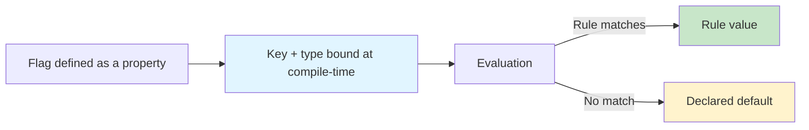
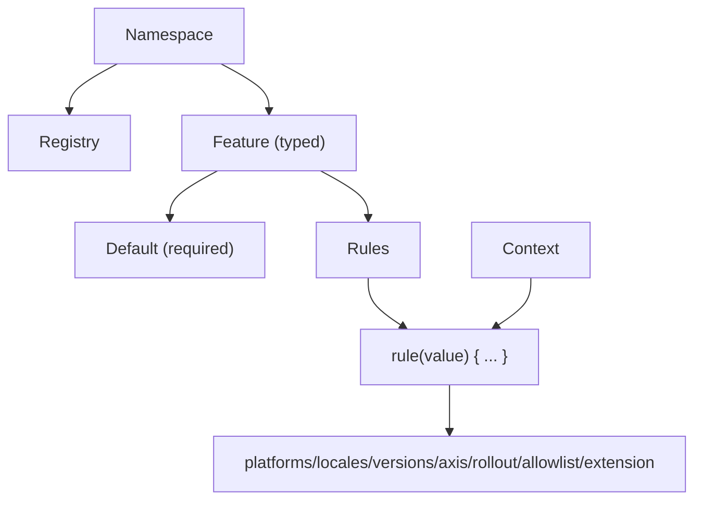
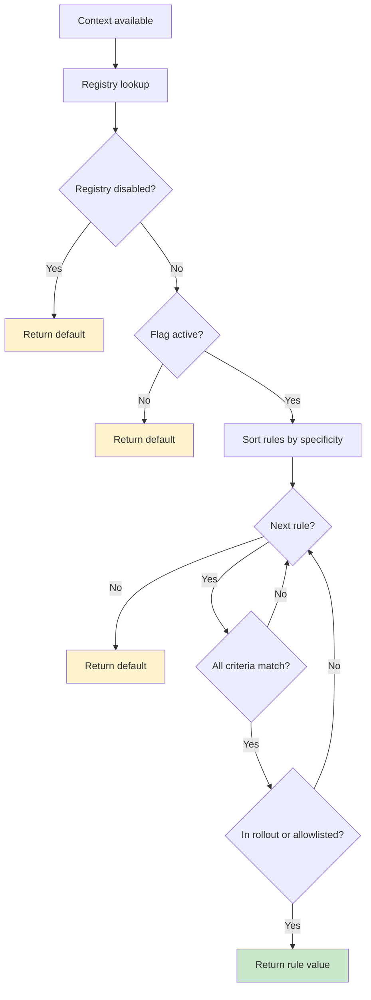

# Public API Surface Summary
# Extracted: 2025-12-18T03:06:17-05:00

## From 01-getting-started.md

# Getting Started

Konditional is a Kotlin feature-flag DSL designed to make configuration *typed*, *deterministic*, and *non-null*.
The core claim is precise: statically-defined flags have compile-time type correctness, and evaluation is total (you
always get a value back).

---

## Why Konditional (and what it actually guarantees)

Most flag systems are stringly-typed: a string key selects a value and the caller chooses a “typed getter”.
That architecture creates three failure modes that are syntactically valid but semantically wrong at runtime: key typos,
type mismatches, and null propagation.

Konditional changes the failure surface by binding identity and type at definition time via Kotlin properties:

- **No string keys at call sites**: flags are accessed as properties (typos become compile errors).
- **No casts at call sites**: the return type flows from the flag definition (mismatched types become compile errors).
- **No nulls from evaluation**: defaults are required, so evaluation has a total return path.



---

## Installation

```kotlin
// build.gradle.kts
dependencies {
    implementation("io.github.amichne:konditional:0.0.1")
}
```

---

## Your first flag

Define a flag as a delegated property on a `Namespace`:

```kotlin
import io.amichne.konditional.api.evaluate
import io.amichne.konditional.core.Namespace
import io.amichne.konditional.context.*
import io.amichne.konditional.core.id.StableId

object AppFeatures : Namespace("app") {
    val darkMode by boolean<Context>(default = false) {
        rule(true) {
            platforms(Platform.IOS)
            rollout { 50.0 }
        }
    }
}

val context = Context(
    locale = AppLocale.UNITED_STATES,
    platform = Platform.IOS,
    appVersion = Version.of(2, 1, 0),
    stableId = StableId.of("user-123"),
)

val enabled: Boolean = AppFeatures.darkMode.evaluate(context)
```

Notes:

- Evaluation is total for declared features: `evaluate(context)` always returns the flag’s declared Kotlin type (never
  null).
- Use `evaluateWithReason(context)` when you need operational traceability (“why did I get this value?”).

---

## A small API surface, intentionally

Supported value types (out of the box):

| Type       | Namespace method | Kotlin type                          | Example default |
|------------|-------------------------|--------------------------------------|-----------------|
| Boolean    | `boolean(...)`          | `Boolean`                            | `false`         |
| String     | `string(...)`           | `String`                             | `"production"`  |
| Integer    | `integer(...)`          | `Int`                                | `42`            |
| Decimal    | `double(...)`           | `Double`                             | `3.14`          |
| Enum       | `enum(...)`             | `E : Enum<E>`                        | `LogLevel.INFO` |
| Data class | `custom(...)`           | `T : KotlinEncodeable<ObjectSchema>` | `MyConfig()`    |

---

## Common patterns

### Gradual rollout (deterministic)

```kotlin
val newCheckout by boolean<Context>(default = false) {
    rule(true) {
        platforms(Platform.ANDROID)
        rollout { 10.0 }
    }
}
```

Konditional’s rollouts are deterministic: the same `(stableId, flagKey, salt)` yields the same bucket assignment.

### Platform-specific configuration

```kotlin
val apiEndpoint by string<Context>(default = "https://api.example.com") {
    rule("https://api-ios.example.com") { platforms(Platform.IOS) }
    rule("https://api-android.example.com") { platforms(Platform.ANDROID) }
    rule("https://api-web.example.com") { platforms(Platform.WEB) }
}
```

### Rollout allowlisting (internal testers)

Allowlists bypass rollout *after* a rule matches by criteria:

```kotlin
val newUi by boolean<Context>(default = false) {
    allowlist(StableId.of("tester-1"))
    rule(true) { rollout { 5.0 } }
}
```

### Variants via enums (not strings)

```kotlin
enum class Theme { LIGHT, DARK }

val theme by enum<Theme, Context>(default = Theme.LIGHT) {
    rule(Theme.DARK) { platforms(Platform.IOS) }
}
```

---

## Namespaces scale ownership, not prefixes

Define multiple namespaces when you need isolated registries (per-team, per-domain).

```kotlin
sealed class AppDomain(id: String) : Namespace(id) {
    data object Auth : AppDomain("auth") {
        val socialLogin by boolean<Context>(default = false)
    }

    data object Payments : AppDomain("payments") {
        val applePay by boolean<Context>(default = false)
    }
}
```

---

## Next steps

- Learn the building blocks: ["Core Concepts"](03-core-concepts.md)
- Write targeting rules and understand rollouts: ["Targeting & Rollouts"](04-targeting-rollouts.md)
- Understand evaluation order and determinism: ["Evaluation"](05-evaluation.md)
- Add runtime-validated JSON configuration: ["Remote Configuration"](06-remote-config.md)
- Understand the exact trust boundary: ["Theory"](07-theory.md)

## From 03-core-concepts.md

# Core Concepts

Konditional’s public surface is intentionally small. Understanding three primitives—**Features**, **Context**, and *
*Namespaces**—is enough to reason about correctness, organization, and runtime behavior.



---

## Features

A feature is a typed configuration value with an optional rule set. You define features as delegated properties on a
`Namespace`:

```kotlin
import io.amichne.konditional.api.evaluate
import io.amichne.konditional.context.Context
object AppFeatures : Namespace("app") {
    val darkMode by boolean<Context>(default = false)
    val apiEndpoint by string<Context>(default = "https://api.example.com")
    val maxRetries by integer<Context>(default = 3)
    val timeoutSeconds by double<Context>(default = 30.0)
}

val enabled: Boolean = AppFeatures.darkMode.evaluate(context)
val endpoint: String = AppFeatures.apiEndpoint.evaluate(context)
```

What this buys you:

- **Property name becomes the key** (no string keys at call sites)
- **Type flows from the delegate** (`boolean` → `Boolean`, etc.)
- **Non-null evaluation** (default is required)

### Supported types

| Type       | Namespace method | Kotlin type                          | Example default |
|------------|-------------------------|--------------------------------------|-----------------|
| Boolean    | `boolean(...)`          | `Boolean`                            | `false`         |
| String     | `string(...)`           | `String`                             | `"production"`  |
| Integer    | `integer(...)`          | `Int`                                | `42`            |
| Decimal    | `double(...)`           | `Double`                             | `3.14`          |
| Enum       | `enum(...)`             | `E : Enum<E>`                        | `LogLevel.INFO` |
| Data class | `custom(...)`           | `T : KotlinEncodeable<ObjectSchema>` | `MyConfig()`    |

### Enums instead of strings

```kotlin
enum class LogLevel { DEBUG, INFO, WARN, ERROR }
enum class Theme { LIGHT, DARK, AUTO }

object AppConfig : Namespace("app-config") {
    val LOG_LEVEL by enum<LogLevel, Context>(default = LogLevel.INFO)
    val THEME by enum<Theme, Context>(default = Theme.LIGHT)
}

val level: LogLevel = AppConfig.LOG_LEVEL.evaluate(context)
```

Because variants are enum values, invalid variants cannot compile.

---

## Rules

Rules are a typed mapping from a set of criteria to a concrete return value:

```kotlin
val apiEndpoint by string<Context>(default = "https://api.example.com") {
    rule("https://api-ios.example.com") { platforms(Platform.IOS) }
    rule("https://api-android.example.com") { platforms(Platform.ANDROID) }
}
```

Criteria you can compose (within a single rule):

- `platforms(...)`
- `locales(...)`
- `versions { min(...); max(...) }`
- `rollout { percent }`
- `allowlist(...)` (rollout bypass)
- `axis(...)` (dimensional targeting)
- `extension { ... }` for custom predicates

Within a rule, criteria combine as **AND**: all specified criteria must match for the rule to match.

### Custom predicates via `extension { }`

To keep business targeting logic typed (not string-based), define a custom `Context` and use `extension { }`:

```kotlin
data class EnterpriseContext(
    override val locale: AppLocale,
    override val platform: Platform,
    override val appVersion: Version,
    override val stableId: StableId,
    val subscriptionTier: SubscriptionTier,
    val employeeCount: Int
) : Context

enum class SubscriptionTier { FREE, PRO, ENTERPRISE }

object PremiumFeatures : Namespace("premium") {
    val ADVANCED_ANALYTICS by boolean<EnterpriseContext>(default = false) {
        rule(true) {
            extension { subscriptionTier == SubscriptionTier.ENTERPRISE && employeeCount > 100 }
        }
    }
}
```

Because the feature is parameterized with `EnterpriseContext`, the receiver inside `extension { ... }` is strongly
typed.

---

## Context

Context provides evaluation inputs: it tells Konditional who is asking and where they are.

Standard fields (the minimum required by the rule DSL):

```kotlin
val context = Context(
    locale = AppLocale.UNITED_STATES,
    platform = Platform.IOS,
    appVersion = Version.of(2, 1, 0),
    stableId = StableId.of("user-123"),
)
```

### StableId (deterministic rollouts)

`stableId` is a stable identifier used for deterministic bucketing.
`StableId.of(...)` accepts any non-blank string and normalizes it to a hex representation used for bucketing.

```kotlin
val id = StableId.of("user-123")
```

If you need cross-platform consistency, ensure all platforms pass the same canonical stable identifier string
into `StableId.of(...)` (it lowercases the input).

---

## Namespaces

Namespaces are isolation boundaries: each namespace has its own registry and independent configuration lifecycle.
Define multiple namespaces when you need more isolation boundaries.

```kotlin
sealed class AppDomain(id: String) : Namespace(id) {
    data object Auth : AppDomain("auth") {
        val socialLogin by boolean<Context>(default = false)
        val twoFactorAuth by boolean<Context>(default = true)
    }

    data object Payments : AppDomain("payments") {
        val applePay by boolean<Context>(default = false)
        val stripeIntegration by boolean<Context>(default = true)
    }
}

AppDomain.Auth.load(authConfig)
AppDomain.Payments.load(paymentConfig)
```

### Custom namespaces (governance)

```kotlin
sealed class TeamDomain(id: String) : Namespace(id) {
    data object Recommendations : TeamDomain("recommendations") {
        val COLLABORATIVE_FILTERING by boolean(default = true)
    }

    data object Analytics : TeamDomain("analytics")
}
```

```kotlin
TeamDomain.Recommendations.COLLABORATIVE_FILTERING.evaluate(context)
```

Each namespace has independent configuration lifecycle, registry, and serialization.

---

## Type safety in action (what becomes impossible)

### Wrong value type at call site

```kotlin
object Config : Namespace("config") {
    val maxRetries by integer<Context>(default = 3)
}

val retries: Int = Config.maxRetries.evaluate(context)
```

### Wrong context type for a feature

```kotlin
val basicContext: Context = Context(...)
PremiumFeatures.ADVANCED_ANALYTICS.evaluate(basicContext) // Compile error (requires EnterpriseContext)
```

---

## Next steps

- Understand rule composition and rollouts: ["Targeting & Rollouts"](04-targeting-rollouts.md)
- Understand evaluation order and determinism: ["Evaluation"](05-evaluation.md)
- Understand the runtime JSON boundary: ["Remote Configuration"](06-remote-config.md)

## From 05-evaluation.md

# Evaluation

### Konditional evaluation is designed to be predictable

- **Total** — Evaluation always returns a value (rule value or default).
- **Deterministic** — The same inputs produce the same outputs.
- **Non-null** — Defaults are required, so evaluation does not return `T?`.

---

## `Feature.evaluate(context)` (recommended)

Concise evaluation with an explicit context:

```kotlin
val darkMode = Features.darkMode.evaluate(context)
applyDarkMode(darkMode)
```

Use this when:

- defaults are meaningful
- you want the smallest call-site surface

Evaluation is always via `Feature.evaluate(...)` (or `evaluateWithReason(...)`) and requires an explicit `Context`.

---

## Explain / trace (operational debugging)

When you need to diagnose a specific user’s outcome, evaluate with a structured reason:

```kotlin
val result = Features.darkMode.evaluateWithReason(context)
println(result.decision)
```

`EvaluationResult` includes:

- decision kind (rule/default/inactive/disabled)
- matched rule constraints + specificity
- deterministic rollout bucket information

---

## Evaluation flow



---

## Emergency kill switch (namespace-scoped)

```kotlin
Features.disableAll()
// ... all evaluations in this namespace return declared defaults ...
Features.enableAll()
```

---

## Bucketing utility (rollout debugging)

```kotlin
val info = RolloutBucketing.explain(
    stableId = context.stableId,
    featureKey = Features.darkMode.key,
    salt = Features.flag(Features.darkMode).salt,
    rollout = RampUp.of(10.0),
)
println(info)
```

### Rule matching (AND semantics)

All specified criteria must match; empty constraint sets match everything.

Evaluation applies the first matching rule that is in-rollout (or allowlisted), otherwise it falls back to the default.

### Specificity ordering (most specific wins)

Rules are sorted by targeting specificity (platforms/locales/version bounds/axes) plus extension specificity.
Rollout percentage does not affect specificity; it gates whether a matching rule is applied.

---

## Performance model

The evaluation path is designed to be predictable:

- **Registry lookup:** O(1)
- **Rule iteration:** O(n) where n is rules per flag (typically small)
- **Rollout bucketing:** 0 or 1 SHA-256 hash per evaluation (bucket is computed only after a rule matches by criteria)

Space model:

- evaluation allocates a small trace object internally and may allocate for hashing inputs
- rule structures are pre-built and reused across evaluations

---

## Concurrency model

Evaluation is designed for concurrent reads:

- **Lock-free reads**: evaluation does not require synchronization.
- **Atomic updates**: configuration updates swap the active snapshot atomically (`Namespace.load`).

```kotlin
// Thread 1
Features.load(newConfig)

// Thread 2 (during update)
val value = Features.darkMode.evaluate(context) // sees old OR new, never a mixed state
```

---

## Testing evaluation

### Rule matching

```kotlin
@Test
fun `iOS users in US get dark mode`() {
    val context = Context(
        locale = AppLocale.UNITED_STATES,
        platform = Platform.IOS,
        appVersion = Version.of(2, 1, 0),
        stableId = StableId.of("user-123"),
    )

    val enabled = Features.darkMode.evaluate(context)
    assertTrue(enabled)
}
```

### Determinism

```kotlin
@Test
fun `evaluation is deterministic`() {
    val context = Context(/*...*/)
    val results = (1..100).map { Features.darkMode.evaluate(context) }
    assertTrue(results.distinct().size == 1, "Non-deterministic!")
}
```

### Rollout distribution (statistical sanity check)

```kotlin
@Test
fun `50 percent rollout distributes correctly`() {
    val sampleSize = 10_000
    val enabled = (0 until sampleSize).count { i ->
        val ctx = Context(/*..., */
                          stableId = StableId.of(i.toString(16).padStart(32, '0'))
        )
        Features.rolloutFlag.evaluate(ctx)
    }

    val percentage = (enabled.toDouble() / sampleSize) * 100
    assertTrue(percentage in 48.0..52.0)
}
```

---

## Guarantees (and boundaries)

| Aspect      | Guarantee                      | Boundary                                            |
|-------------|--------------------------------|-----------------------------------------------------|
| Type safety | return type matches definition | compile-time for statically-defined flags           |
| Non-null    | evaluation never returns null  | relies on required defaults                         |
| Determinism | same inputs → same outputs     | excludes malformed runtime JSON (see remote config) |
| Updates     | atomic swap of configuration   | correctness depends on using `Namespace.load`       |

---

## Next steps

- Understand rollouts and bucketing inputs: ["Targeting & Rollouts"](04-targeting-rollouts.md)
- Add runtime-validated JSON configuration: ["Remote Configuration"](06-remote-config.md)
