# Konditional Documentation Outline
**Comprehensive Documentation Structure for v1.0.0**

---

## 1. System Architecture

### High-Level Component Architecture

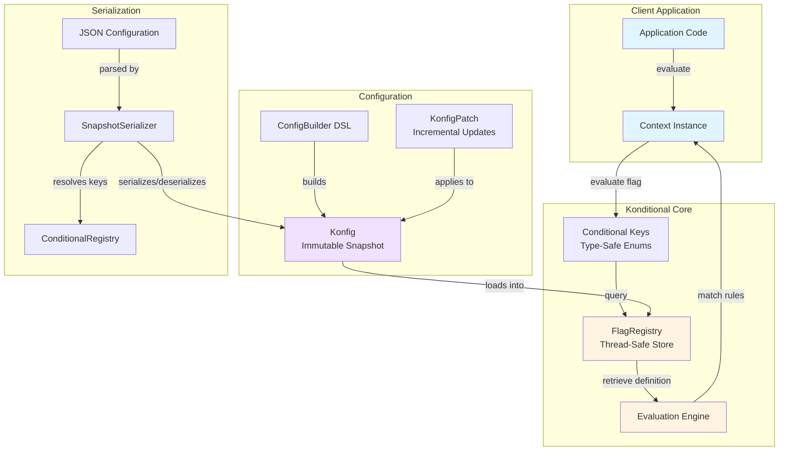

### Core Type Hierarchy

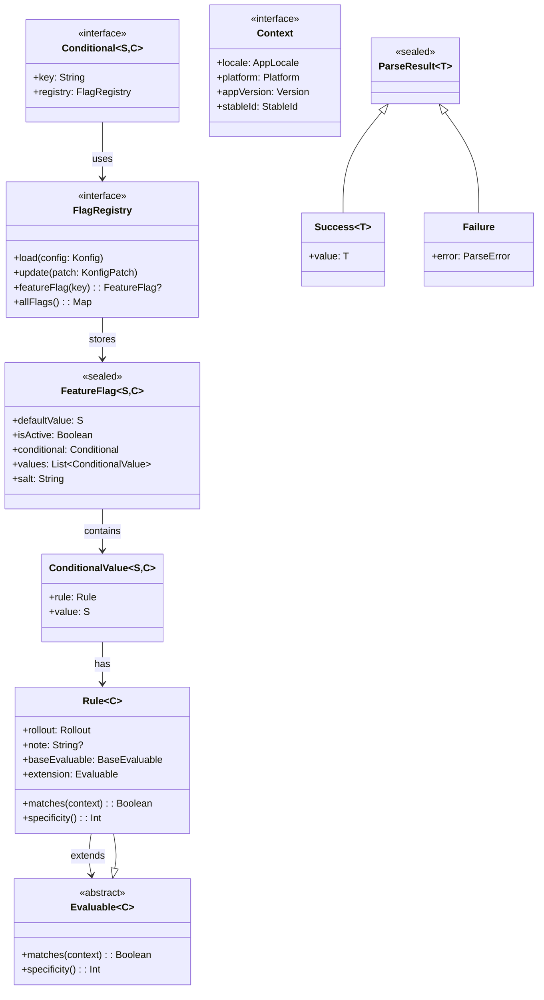

---

## 2. User Flows

### 2.1 Basic Integration Flow

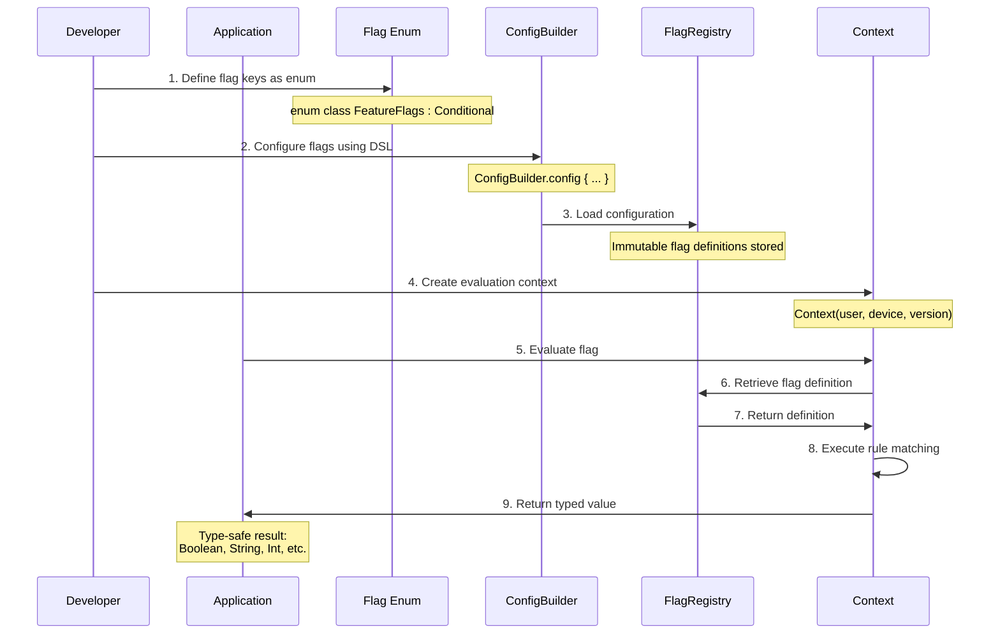

### 2.2 Flag Evaluation Decision Flow

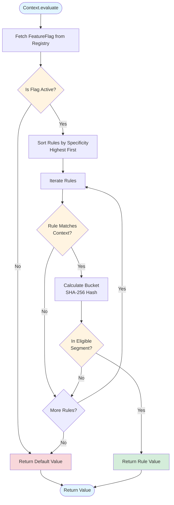

### 2.3 Configuration Lifecycle

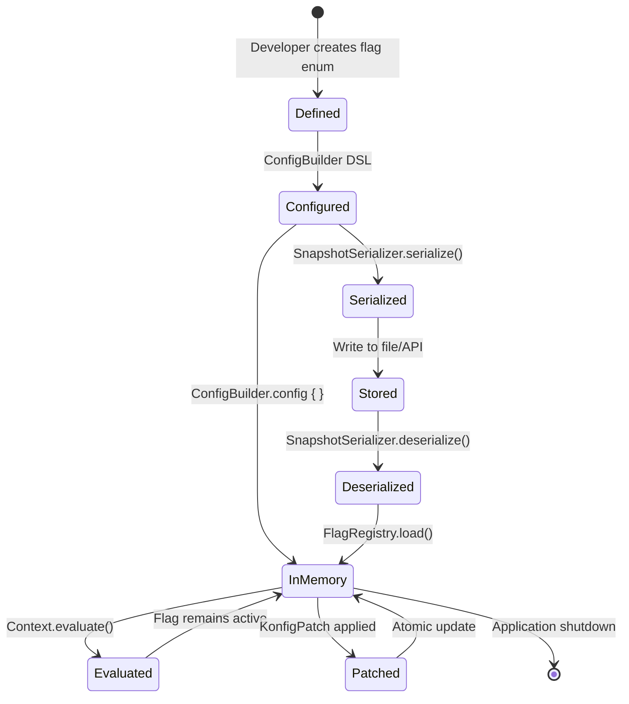

### 2.4 Runtime Update Flow

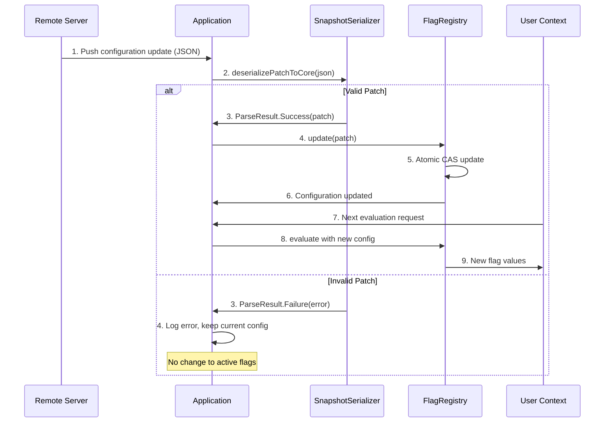

---

## 3. Core Concepts

### 3.1 Rule Specificity & Prioritization

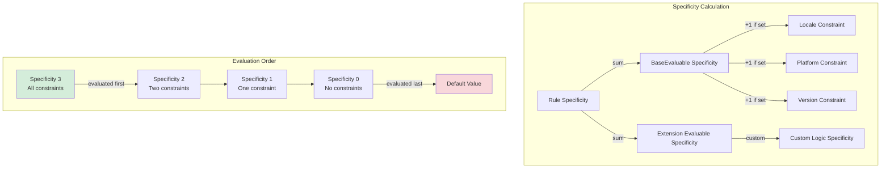

**Specificity Rules:**
- Higher specificity = evaluated first
- Tie-breaking: lexicographic by rule note
- First matching rule wins (after rollout)
- If no rules match, return default value

### 3.2 Deterministic Rollout Bucketing

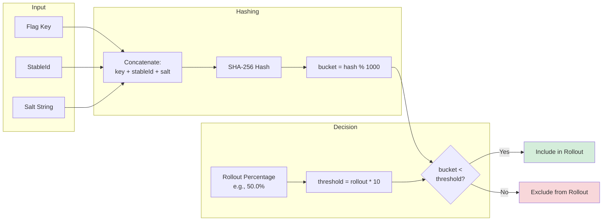

**Key Properties:**
- Deterministic: Same inputs → same bucket
- Uniform distribution: SHA-256 ensures randomness
- Stable: Changing salt resets bucketing
- Granular: 0.1% precision (1000 buckets)

### 3.3 Parse, Don't Validate Philosophy

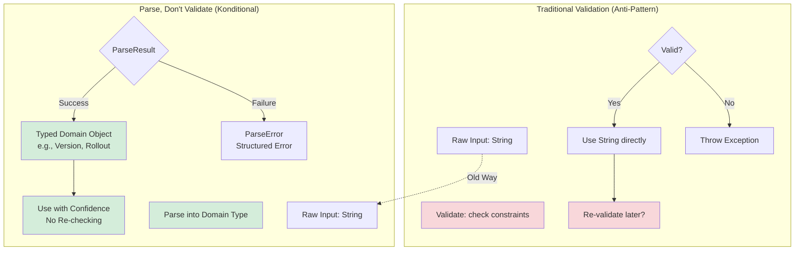

**Benefits:**
- **Type Safety**: Constraints encoded in types
- **No Redundant Checks**: Parse once at boundary
- **Composability**: Parsed types compose cleanly
- **Explicit Errors**: Structured error types
- **Compiler Support**: Type system prevents misuse

### 3.4 Extension Point Hierarchy

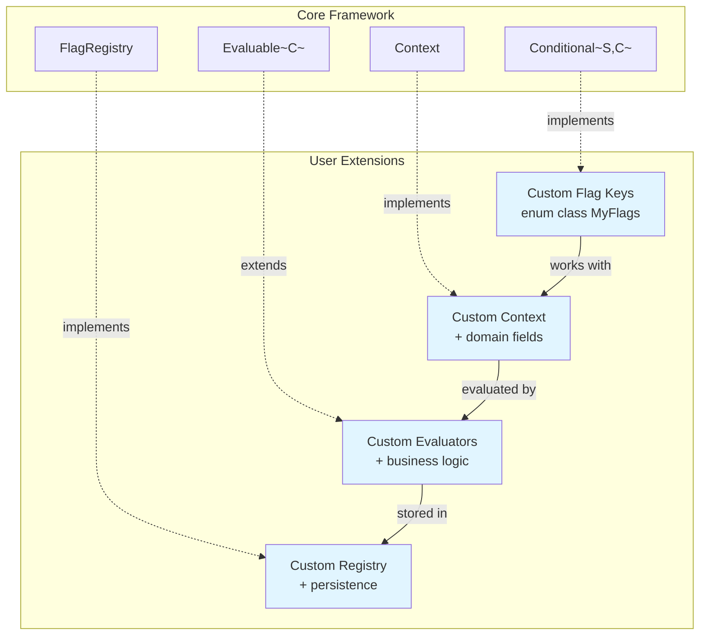

---

## 4. Public API Reference

### 4.1 Core Types

#### **Conditional<S, C>**
**Purpose**: Type-safe feature flag identifier

```kotlin
interface Conditional<S : Any, C : Context> {
    val key: String
    val registry: FlagRegistry
}
```

**Usage Pattern:**
```kotlin
enum class FeatureFlags(override val key: String) : Conditional<Boolean, AppContext> {
    DARK_MODE("dark_mode"),
    NEW_CHECKOUT("new_checkout");

    override val registry = FlagRegistry
}
```

**Type Parameters:**
- `S` - Value type (Boolean, String, Int, Double, custom)
- `C` - Context type for evaluation

---

#### **Context**
**Purpose**: Provides evaluation context for targeting

```kotlin
interface Context {
    val locale: AppLocale
    val platform: Platform
    val appVersion: Version
    val stableId: StableId
}
```

**Factory:**
```kotlin
Context(
    locale = AppLocale.EN_US,
    platform = Platform.ANDROID,
    appVersion = Version(1, 2, 3),
    stableId = HexId.from("user-123")
)
```

**Extension:**
```kotlin
data class EnterpriseContext(
    override val locale: AppLocale,
    override val platform: Platform,
    override val appVersion: Version,
    override val stableId: StableId,
    val organizationId: String,
    val subscriptionTier: Tier
) : Context
```

---

#### **FlagRegistry**
**Purpose**: Thread-safe configuration store

```kotlin
interface FlagRegistry {
    fun load(config: Konfig)
    fun update(patch: KonfigPatch)
    fun <S, C> update(definition: FeatureFlag<S, C>)
    fun konfig(): Konfig
    fun <S, C> featureFlag(key: Conditional<S, C>): FeatureFlag<S, C>?
    fun allFlags(): Map<Conditional<*, *>, FeatureFlag<*, *>>
}
```

**Default Instance:**
```kotlin
FlagRegistry // Singleton via companion object
```

---

### 4.2 DSL Builders

#### **ConfigBuilder**
**Purpose**: Declarative configuration DSL

```kotlin
ConfigBuilder.config {
    DARK_MODE with {
        default(false)

        rule {
            platforms(Platform.IOS)
            versions { min(2, 0) }
            rollout = Rollout.of(50.0)
        } implies true

        rule {
            locales(AppLocale.EN_US, AppLocale.EN_GB)
            rollout = Rollout.MAX
        } implies true

        salt("v2")
    }
}
```

**Methods:**
- `config(registry, fn)` - Build and load
- `buildSnapshot(fn)` - Build without loading (testing)

---

#### **RuleBuilder<C>**
**Purpose**: Type-safe rule definition

```kotlin
rule {
    locales(AppLocale.EN_US, AppLocale.FR_FR)
    platforms(Platform.ANDROID, Platform.IOS)
    versions {
        min(1, 0)
        max(2, 5, 10)
    }
    rollout = Rollout.of(25.0)
    note("Q4 2024 Rollout")

    extension {
        CustomEvaluator(/* ... */)
    }
}
```

**Properties:**
- `locales(...)` - Target specific locales
- `platforms(...)` - Target specific platforms
- `versions { }` - Version range constraints
- `rollout` - Percentage (0-100)
- `note` - Description (for tie-breaking)
- `extension { }` - Custom evaluator

---

### 4.3 Evaluation API

#### **Extension Functions**

```kotlin
// Evaluate single flag
fun <S, C : Context> C.evaluate(
    key: Conditional<S, C>,
    registry: FlagRegistry = FlagRegistry
): S

// Evaluate all flags
fun <C : Context> C.evaluate(
    registry: FlagRegistry = FlagRegistry
): Map<Conditional<*, *>, Any?>
```

**Usage:**
```kotlin
val context = Context(
    locale = AppLocale.EN_US,
    platform = Platform.ANDROID,
    appVersion = Version(1, 5, 0),
    stableId = HexId.from(userId)
)

// Single flag
val isDarkMode = context.evaluate(FeatureFlags.DARK_MODE)

// All flags
val allValues = context.evaluate()
```

---

### 4.4 Serialization API

#### **SnapshotSerializer**

```kotlin
class SnapshotSerializer(moshi: Moshi = defaultMoshi()) {
    // Serialize full config
    fun serialize(konfig: Konfig): String

    // Deserialize full config
    fun deserialize(json: String): ParseResult<Konfig>

    // Serialize patch
    fun serializePatch(patch: KonfigPatch): String

    // Deserialize patch
    fun deserializePatchToCore(json: String): ParseResult<KonfigPatch>

    // Apply patch to existing config
    fun applyPatch(
        currentKonfig: Konfig,
        patch: SerializablePatch
    ): ParseResult<Konfig>

    // Apply patch from JSON
    fun applyPatchJson(
        currentKonfig: Konfig,
        patchJson: String
    ): ParseResult<Konfig>
}
```

**Full Serialization Flow:**
```kotlin
val serializer = SnapshotSerializer()

// Serialize
val json = serializer.serialize(FlagRegistry.konfig())

// Deserialize
when (val result = serializer.deserialize(json)) {
    is ParseResult.Success -> FlagRegistry.load(result.value)
    is ParseResult.Failure -> handleError(result.error)
}
```

**Incremental Update Flow:**
```kotlin
val patchJson = fetchFromServer()

when (val result = serializer.applyPatchJson(FlagRegistry.konfig(), patchJson)) {
    is ParseResult.Success -> FlagRegistry.load(result.value)
    is ParseResult.Failure -> handleError(result.error)
}
```

---

#### **ConditionalRegistry**

```kotlin
object ConditionalRegistry {
    fun <S, C> register(conditional: Conditional<S, C>)

    inline fun <reified T> registerEnum()
        where T : Enum<T>, T : Conditional<*, *>

    fun get(key: String): ParseResult<Conditional<*, *>>
    fun contains(key: String): Boolean
}
```

**Registration (Required before deserialization):**
```kotlin
fun main() {
    ConditionalRegistry.registerEnum<FeatureFlags>()
    ConditionalRegistry.registerEnum<ApiConfig>()

    // Now safe to deserialize
    val result = serializer.deserialize(json)
}
```

---

### 4.5 Result Types

#### **ParseResult<T>**

```kotlin
sealed interface ParseResult<out T> {
    data class Success<T>(val value: T) : ParseResult<T>
    data class Failure(val error: ParseError) : ParseResult<Nothing>
}
```

**Usage:**
```kotlin
when (val result = serializer.deserialize(json)) {
    is ParseResult.Success -> {
        val konfig = result.value
        FlagRegistry.load(konfig)
    }
    is ParseResult.Failure -> {
        when (val error = result.error) {
            is ParseError.InvalidJson -> log("Invalid JSON: ${error.message}")
            is ParseError.ConditionalNotFound -> log("Unknown key: ${error.key}")
            is ParseError.InvalidSnapshot -> log("Invalid format: ${error.message}")
        }
    }
}
```

---

## 5. Extension Points

### 5.1 Custom Context Types

**Use Case**: Add domain-specific targeting dimensions

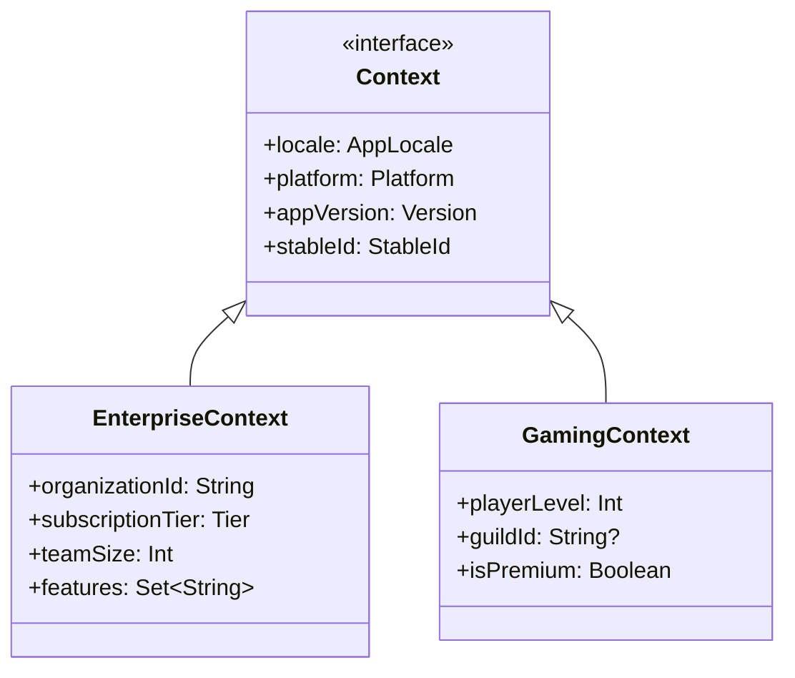

**Implementation:**
```kotlin
data class EnterpriseContext(
    override val locale: AppLocale,
    override val platform: Platform,
    override val appVersion: Version,
    override val stableId: StableId,
    val organizationId: String,
    val subscriptionTier: SubscriptionTier
) : Context

enum class EnterpriseFlags(override val key: String)
    : Conditional<Boolean, EnterpriseContext> {
    ADVANCED_ANALYTICS("advanced_analytics"),
    SSO_LOGIN("sso_login");

    override val registry = FlagRegistry
}
```

---

### 5.2 Custom Evaluators

**Use Case**: Implement custom targeting logic

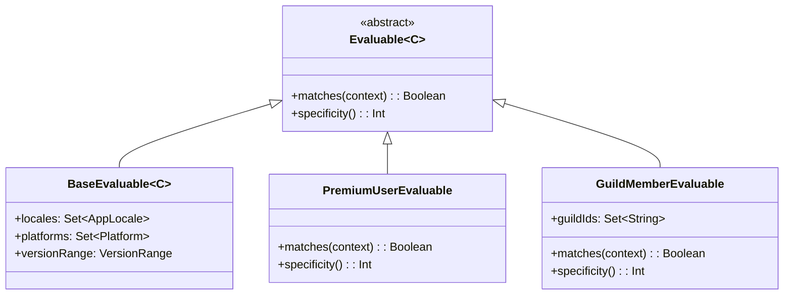

**Implementation:**
```kotlin
class PremiumUserEvaluable : Evaluable<EnterpriseContext>() {
    override fun matches(context: EnterpriseContext): Boolean {
        return context.subscriptionTier == SubscriptionTier.PREMIUM
    }

    override fun specificity(): Int = 1
}

// Usage in rules
ConfigBuilder.config {
    ADVANCED_ANALYTICS with {
        default(false)

        rule {
            extension { PremiumUserEvaluable() }
            rollout = Rollout.MAX
        } implies true
    }
}
```

---

### 5.3 Custom Value Types

**Use Case**: Return complex configuration objects

```kotlin
data class ThemeConfig(
    val primaryColor: String,
    val secondaryColor: String,
    val fontFamily: String
)

enum class ThemeFlags(override val key: String)
    : Conditional<ThemeConfig, Context> {
    APP_THEME("app_theme");

    override val registry = FlagRegistry
}

ConfigBuilder.config {
    ThemeFlags.APP_THEME with {
        default(ThemeConfig("#000", "#fff", "Roboto"))

        rule {
            locales(AppLocale.JA_JP)
        } implies ThemeConfig("#e60012", "#ffffff", "Noto Sans JP")
    }
}
```

---

### 5.4 Custom Registry Implementation

**Use Case**: Alternative storage backends

```kotlin
class DistributedFlagRegistry(
    private val cacheClient: CacheClient,
    private val eventBus: EventBus
) : FlagRegistry {

    override fun load(config: Konfig) {
        cacheClient.set("flags:snapshot", config)
        eventBus.publish(ConfigUpdatedEvent(config))
    }

    override fun <S, C> featureFlag(
        key: Conditional<S, C>
    ): FeatureFlag<S, C>? {
        val snapshot = cacheClient.get<Konfig>("flags:snapshot")
        return snapshot?.flags?.get(key) as? FeatureFlag<S, C>
    }

    // ... other methods
}
```

---

## 6. Key User Journeys

### Journey 1: First-Time Integration (5 minutes)

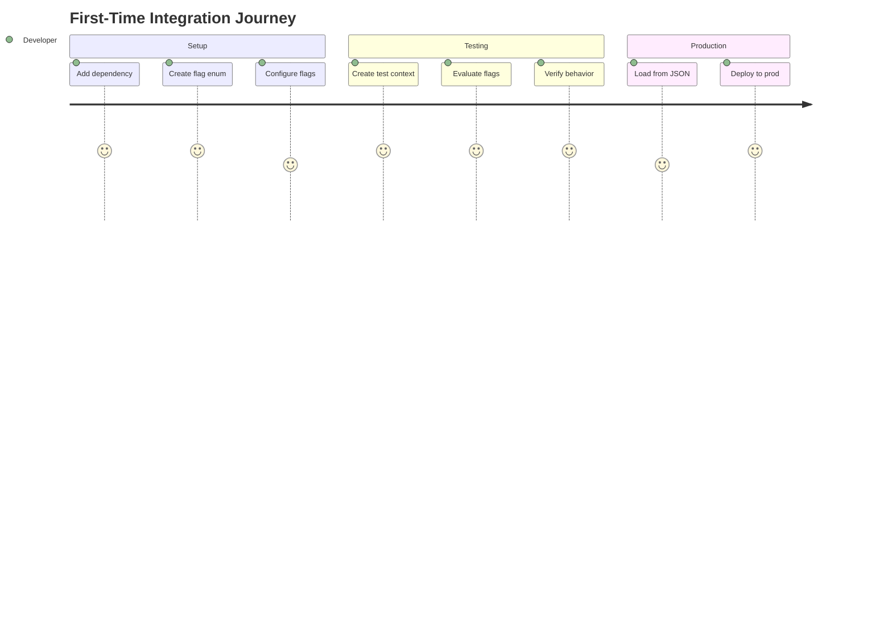

**Steps:**
1. Add Gradle dependency
2. Define flag enum implementing `Conditional`
3. Configure flags with `ConfigBuilder.config { }`
4. Create `Context` instance
5. Call `context.evaluate(FLAG_KEY)`

**Time to First Value**: ~5 minutes

---

### Journey 2: Adding Dynamic Configuration

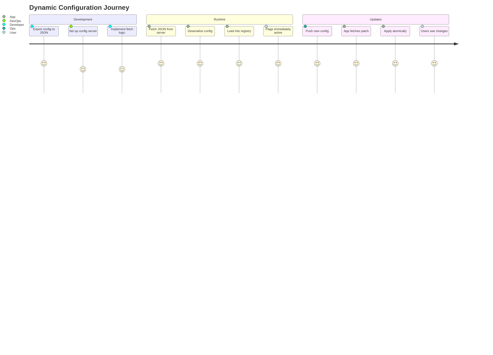

**Steps:**
1. Serialize initial config: `serializer.serialize(konfig)`
2. Store JSON in config management system
3. Implement fetch logic in application
4. Register flag enums: `ConditionalRegistry.registerEnum<T>()`
5. Deserialize and load: `serializer.deserialize(json)`
6. For updates, use `applyPatchJson(currentKonfig, patchJson)`

---

### Journey 3: Adding Custom Targeting

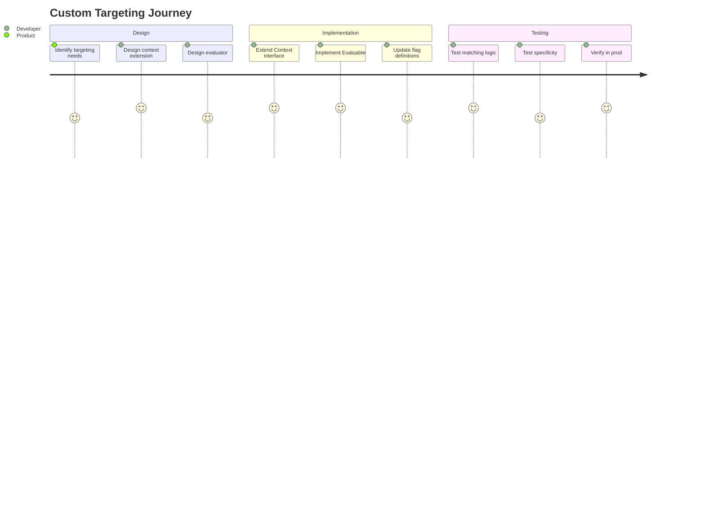

---

## 7. Comparison with Alternatives

### Konditional vs. String-Based Systems

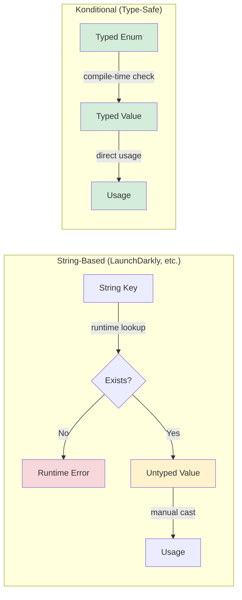

**Benefits:**
- **Compile-time safety**: Typos caught at compile time
- **Refactoring support**: IDE can rename across codebase
- **Type safety**: No runtime casting or type errors
- **Autocomplete**: Full IDE support

---

## 8. Advanced Topics

### 8.1 Thread Safety Guarantees

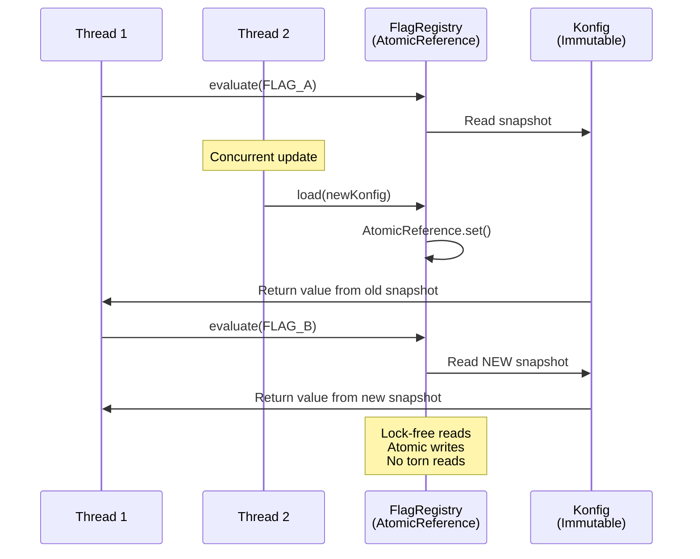

**Guarantees:**
- Lock-free reads (no contention)
- Atomic snapshot updates (CAS)
- No torn reads (immutable snapshots)
- Eventually consistent (new evaluations see new config)

---

### 8.2 Serialization Format

**Full Snapshot JSON:**
```json
{
  "flags": [
    {
      "key": "dark_mode",
      "default": true,
      "isActive": true,
      "salt": "v1",
      "rules": [
        {
          "value": false,
          "rollout": 50.0,
          "note": "Gradual rollout",
          "locales": ["en_US"],
          "platforms": ["ANDROID"],
          "versionRange": {
            "type": "FullyBound",
            "min": "1.0.0",
            "max": "2.0.0"
          }
        }
      ]
    }
  ]
}
```

**Patch JSON:**
```json
{
  "add": [
    {
      "key": "new_feature",
      "default": false,
      "isActive": true,
      "salt": "v1",
      "rules": []
    }
  ],
  "remove": ["deprecated_flag"]
}
```

---

## 9. Migration Patterns

### From String-Based System

```kotlin
// Before (String-based)
val isEnabled = featureFlags.getBoolean("dark_mode", false)

// After (Konditional)
enum class FeatureFlags(override val key: String) : Conditional<Boolean, Context> {
    DARK_MODE("dark_mode");
    override val registry = FlagRegistry
}

val isEnabled = context.evaluate(FeatureFlags.DARK_MODE)
```

### From If/Else Configuration

```kotlin
// Before
fun getTheme(user: User): Theme {
    return if (user.isPremium) {
        Theme.PREMIUM
    } else if (user.locale == "ja_JP") {
        Theme.JAPANESE
    } else {
        Theme.DEFAULT
    }
}

// After
ConfigBuilder.config {
    THEME_CONFIG with {
        default(Theme.DEFAULT)

        rule {
            extension { PremiumUserEvaluable() }
        } implies Theme.PREMIUM

        rule {
            locales(AppLocale.JA_JP)
        } implies Theme.JAPANESE
    }
}

val theme = context.evaluate(ConfigFlags.THEME_CONFIG)
```

---

## 10. Testing Strategies

### 10.1 Unit Testing Flags

```kotlin
@Test
fun `dark mode is enabled for premium iOS users on v2+`() {
    // Arrange
    val testRegistry = FakeRegistry()
    ConfigBuilder.config(testRegistry) {
        DARK_MODE with {
            default(false)
            rule {
                platforms(Platform.IOS)
                versions { min(2, 0) }
                extension { PremiumUserEvaluable() }
            } implies true
        }
    }

    val context = TestContext(
        platform = Platform.IOS,
        appVersion = Version(2, 1, 0),
        isPremium = true
    )

    // Act
    val result = context.evaluate(FeatureFlags.DARK_MODE, testRegistry)

    // Assert
    assertThat(result).isTrue()
}
```

### 10.2 Testing Rollouts

```kotlin
@Test
fun `50 percent rollout distributes users evenly`() {
    ConfigBuilder.config {
        FEATURE with {
            default(false)
            rule { rollout = Rollout.of(50.0) } implies true
        }
    }

    val userIds = (1..1000).map { "user-$it" }
    val contexts = userIds.map { userId ->
        Context(
            locale = AppLocale.EN_US,
            platform = Platform.ANDROID,
            appVersion = Version(1, 0, 0),
            stableId = HexId.from(userId)
        )
    }

    val enabledCount = contexts.count { it.evaluate(FEATURE) }

    // Should be ~50% (with statistical variance)
    assertThat(enabledCount).isIn(450..550)
}
```

### 10.3 Serialization Round-Trip Testing

```kotlin
@Test
fun `serialization round-trip preserves configuration`() {
    val original = ConfigBuilder.buildSnapshot {
        MY_FLAG with {
            default(true)
            rule { /* ... */ } implies false
        }
    }

    val serializer = SnapshotSerializer()
    val json = serializer.serialize(original)

    val parsed = serializer.deserialize(json)

    assertThat(parsed).isInstanceOf<ParseResult.Success>()
    val restored = (parsed as ParseResult.Success).value

    assertThat(restored.flags).isEqualTo(original.flags)
}
```

---

## Summary

This documentation structure provides:

1. **Clear Visual Architecture** - Mermaid diagrams for system understanding
2. **User-Focused Flows** - Step-by-step guidance for common tasks
3. **Comprehensive API Reference** - Public interfaces with examples
4. **Extension Points** - Clear customization pathways
5. **Comparison Context** - Why Konditional vs alternatives
6. **Testing Guidance** - Patterns for reliable tests
7. **Migration Support** - Paths from existing systems

**Next Steps:**
1. Generate detailed content for each section
2. Add code examples for every public API
3. Create interactive tutorials
4. Build quickstart templates
5. Add troubleshooting guide
