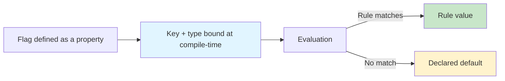

# Getting Started

Konditional is a Kotlin feature-flag DSL designed to make configuration *typed*, *deterministic*, and *non-null*.
The core claim is precise: statically-defined flags have compile-time type correctness, and evaluation is total (you always get a value back).

---

## Why Konditional (and what it actually guarantees)

Most flag systems are stringly-typed: a string key selects a value and the caller chooses a “typed getter”.
That architecture creates three failure modes that are syntactically valid but semantically wrong at runtime: key typos, type mismatches, and null propagation.

Konditional changes the failure surface by binding identity and type at definition time via Kotlin properties:

- **No string keys at call sites**: flags are accessed as properties (typos become compile errors).
- **No casts at call sites**: the return type flows from the flag definition (mismatched types become compile errors).
- **No nulls from evaluation**: defaults are required, so evaluation has a total return path.



---

## Installation

```kotlin
// build.gradle.kts
dependencies {
    implementation("io.amichne:konditional:0.0.1")
}
```

---

## Your first flag

Define a flag as a delegated property in a `FeatureContainer` bound to a `Namespace`:

```kotlin
import io.amichne.konditional.core.Namespace
import io.amichne.konditional.core.features.FeatureContainer
import io.amichne.konditional.context.*

object AppFeatures : FeatureContainer<Namespace.Global>(Namespace.Global) {
    val DARK_MODE by boolean(default = false) {
        rule {
            platforms(Platform.IOS)
            rollout { 50.0 }
        } returns true
    }
}

val context = Context(
    locale = AppLocale.UNITED_STATES,
    platform = Platform.IOS,
    appVersion = Version.parse("2.1.0"),
    stableId = StableId.of("a1b2c3d4e5f6a7b8c9d0e1f2a3b4c5d6")
)

val enabled: Boolean = feature { AppFeatures.DARK_MODE }
```

Notes:
- Konditional models evaluation as context-dependent; examples assume you are evaluating within a context-aware scope.
- `feature { ... }` returns the flag’s declared Kotlin type and never returns null.

---

## A small API surface, intentionally

Supported value types (out of the box):

| Type    | DSL Method  | Kotlin Type   | Example Default |
|---------|-------------|---------------|-----------------|
| Boolean | `boolean()` | `Boolean`     | `false`         |
| String  | `string()`  | `String`      | `"production"`  |
| Integer | `int()`     | `Int`         | `42`            |
| Decimal | `double()`  | `Double`      | `3.14`          |
| Enum    | `enum<E>()` | `E : Enum<E>` | `LogLevel.INFO` |

---

## Common patterns

### Gradual rollout (deterministic)

```kotlin
val NEW_CHECKOUT by boolean(default = false) {
    rule {
        platforms(Platform.ANDROID)
        rollout { 10.0 }
    } returns true
}
```

Konditional’s rollouts are deterministic: the same `(stableId, flagKey, salt)` yields the same bucket assignment.

### Platform-specific configuration

```kotlin
val API_ENDPOINT by string(default = "https://api.example.com") {
    rule { platforms(Platform.IOS) } returns "https://api-ios.example.com"
    rule { platforms(Platform.ANDROID) } returns "https://api-android.example.com"
    rule { platforms(Platform.WEB) } returns "https://api-web.example.com"
}
```

### Variants via enums (not strings)

```kotlin
enum class Theme { LIGHT, DARK }

val THEME by enum<Theme, Context>(default = Theme.LIGHT)
```

---

## Namespaces scale ownership, not prefixes

Konditional provides `Namespace.Global`. If you need isolation boundaries beyond global, define your own namespaces in your codebase (consumer-defined), then bind `FeatureContainer`s to them.

```kotlin
sealed class AppDomain(id: String) : Namespace(id) {
    data object Auth : AppDomain("auth")
    data object Payments : AppDomain("payments")
}

object AuthFeatures : FeatureContainer<AppDomain.Auth>(AppDomain.Auth) {
    val SOCIAL_LOGIN by boolean(default = false)
}

object PaymentFeatures : FeatureContainer<AppDomain.Payments>(AppDomain.Payments) {
    val APPLE_PAY by boolean(default = false)
}
```

---

## Next steps

- Learn the building blocks: ["Core Concepts"](03-core-concepts.md)
- Write targeting rules and understand rollouts: ["Targeting & Rollouts"](04-targeting-rollouts.md)
- Understand evaluation order and determinism: ["Evaluation"](05-evaluation.md)
- Add runtime-validated JSON configuration: ["Remote Configuration"](06-remote-config.md)
- Understand the exact trust boundary: ["Theory"](07-theory.md)
