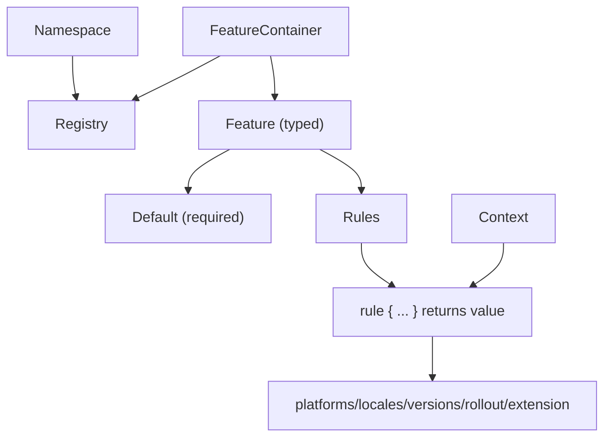

# Core Concepts

Konditional’s public surface is intentionally small. Understanding three primitives—**Features**, **Context**, and **Namespaces**—is enough to reason about correctness, organization, and runtime behavior.



---

## Features

A feature is a typed configuration value with an optional rule set. You define features as delegated properties in a `FeatureContainer`:

```kotlin
object AppFeatures : FeatureContainer<Namespace.Global>(Namespace.Global) {
    val DARK_MODE by boolean(default = false)
    val API_ENDPOINT by string(default = "https://api.example.com")
    val MAX_RETRIES by int(default = 3)
    val TIMEOUT by double(default = 30.0)
}

val enabled: Boolean = feature { AppFeatures.DARK_MODE }
val endpoint: String = feature { AppFeatures.API_ENDPOINT }
```

What this buys you:
- **Property name becomes the key** (no string keys at call sites)
- **Type flows from the delegate** (`boolean` → `Boolean`, etc.)
- **Non-null evaluation** (default is required)

### Supported types

| Type    | DSL Method  | Kotlin Type   | Example Default |
|---------|-------------|---------------|-----------------|
| Boolean | `boolean()` | `Boolean`     | `false`         |
| String  | `string()`  | `String`      | `"production"`  |
| Integer | `int()`     | `Int`         | `42`            |
| Decimal | `double()`  | `Double`      | `3.14`          |
| Enum    | `enum<E>()` | `E : Enum<E>` | `LogLevel.INFO` |

### Enums instead of strings

```kotlin
enum class LogLevel { DEBUG, INFO, WARN, ERROR }
enum class Theme { LIGHT, DARK, AUTO }

object AppConfig : FeatureContainer<Namespace.Global>(Namespace.Global) {
    val LOG_LEVEL by enum<LogLevel, Context>(default = LogLevel.INFO)
    val THEME by enum<Theme, Context>(default = Theme.LIGHT)
}

val level: LogLevel = feature { AppConfig.LOG_LEVEL }
```

Because variants are enum values, invalid variants cannot compile.

---

## Rules

Rules are a typed mapping from a set of criteria to a concrete return value:

```kotlin
val API_ENDPOINT by string(default = "https://api.example.com") {
    rule { platforms(Platform.IOS) } returns "https://api-ios.example.com"
    rule { platforms(Platform.ANDROID) } returns "https://api-android.example.com"
}
```

Criteria you can compose (within a single rule):
- `platforms(...)`
- `locales(...)`
- `versions { min(...); max(...) }`
- `rollout { percent }`
- `extension { ... }` for custom predicates

Within a rule, criteria combine as **AND**: all specified criteria must match for the rule to match.

### Custom predicates via `extension { }`

To keep business targeting logic typed (not string-based), define a custom `Context` and use `extension { }`:

```kotlin
data class EnterpriseContext(
    override val locale: AppLocale,
    override val platform: Platform,
    override val appVersion: Version,
    override val stableId: StableId,
    val subscriptionTier: SubscriptionTier,
    val employeeCount: Int
) : Context

enum class SubscriptionTier { FREE, PRO, ENTERPRISE }

object PremiumFeatures : FeatureContainer<Namespace.Global>(Namespace.Global) {
    val ADVANCED_ANALYTICS by boolean<EnterpriseContext>(default = false) {
        rule {
            extension {
                Evaluable.factory { ctx ->
                    ctx.subscriptionTier == SubscriptionTier.ENTERPRISE &&
                        ctx.employeeCount > 100
                }
            }
        } returns true
    }
}
```

Because the feature is parameterized with `EnterpriseContext`, `ctx` is strongly typed inside the predicate.

---

## Context

Context provides evaluation inputs: it tells Konditional who is asking and where they are.

Standard fields (the minimum required by the rule DSL):

```kotlin
data class Context(
    val locale: AppLocale,
    val platform: Platform,
    val appVersion: Version,
    val stableId: StableId
)
```

### StableId (deterministic rollouts)

`stableId` is a stable identifier used for deterministic bucketing. It must be hex (32+ chars):

```kotlin
val id = StableId.of("a1b2c3d4e5f6a7b8c9d0e1f2a3b4c5d6")
```

If you have an existing user ID, hash it into hex:

```kotlin
fun toStableId(userId: String): StableId {
    val hash = MessageDigest.getInstance("SHA-256")
        .digest(userId.toByteArray())
        .joinToString("") { "%02x".format(it) }
    return StableId.of(hash)
}
```

---

## Namespaces

Namespaces are isolation boundaries: each namespace has its own registry and independent configuration lifecycle.
Konditional provides `Namespace.Global`. If you need more isolation boundaries, define your own namespaces (consumer-defined) and bind containers to them.

```kotlin
sealed class AppDomain(id: String) : Namespace(id) {
    data object Auth : AppDomain("auth")
    data object Payments : AppDomain("payments")
}

object AuthFeatures : FeatureContainer<AppDomain.Auth>(AppDomain.Auth) {
    val SOCIAL_LOGIN by boolean(default = false)
    val TWO_FACTOR_AUTH by boolean(default = true)
}

object PaymentFeatures : FeatureContainer<AppDomain.Payments>(AppDomain.Payments) {
    val APPLE_PAY by boolean(default = false)
    val STRIPE_INTEGRATION by boolean(default = true)
}

AppDomain.Auth.load(authConfig)
AppDomain.Payments.load(paymentConfig)
```

### Custom namespaces (governance)

```kotlin
sealed class TeamDomain(id: String) : Namespace(id) {
    data object Recommendations : TeamDomain("recommendations")
    data object Analytics : TeamDomain("analytics")
}

object RecFeatures : FeatureContainer<TeamDomain.Recommendations>(TeamDomain.Recommendations) {
    val COLLABORATIVE_FILTERING by boolean(default = true)
}
```

---

## Type safety in action (what becomes impossible)

### Wrong value type at call site

```kotlin
object Config : FeatureContainer<Namespace.Global>(Namespace.Global) {
    val MAX_RETRIES by int(default = 3)
}

val retries: Int = feature { Config.MAX_RETRIES }
```

### Wrong context type for a feature

```kotlin
val basicContext: Context = Context(...)
feature { PremiumFeatures.ADVANCED_ANALYTICS } // Compile error (requires EnterpriseContext)
```

### Cross-namespace misuse

```kotlin
AppDomain.Auth.load(paymentConfig) // Compile error (type mismatch)
```

---

## Next steps

- Understand rule composition and rollouts: ["Targeting & Rollouts"](04-targeting-rollouts.md)
- Understand evaluation order and determinism: ["Evaluation"](05-evaluation.md)
- Understand the runtime JSON boundary: ["Remote Configuration"](06-remote-config.md)
