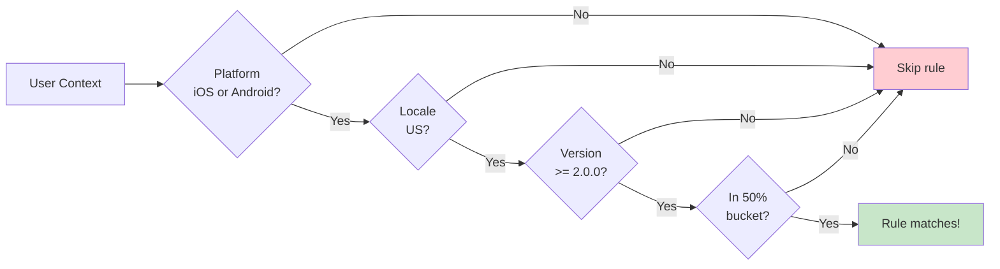
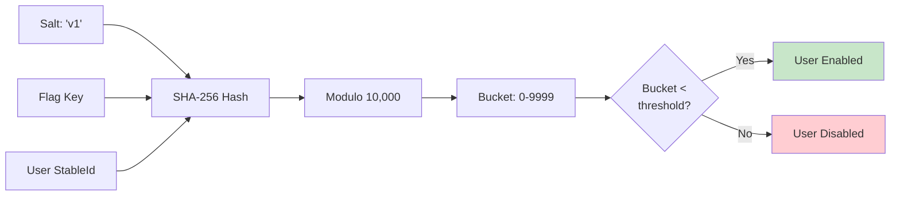
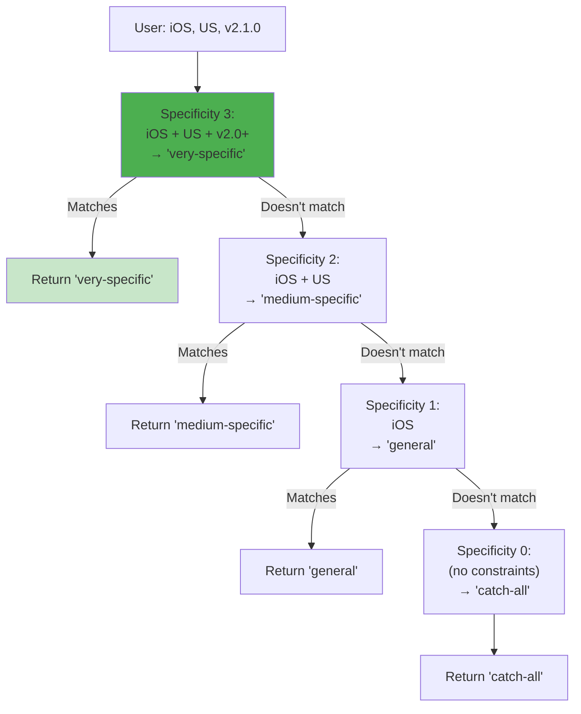

# Targeting & Rollouts

Ship safely with precise control. Rules let you target specific users and roll out features gradually.

---

## Basic Targeting

Target users by platform, locale, or version using simple, readable criteria.

### Platform Targeting

```kotlin
val API_ENDPOINT by string(default = "https://api.example.com") {
    rule { platforms(Platform.IOS) } returns "https://api-ios.example.com"
    rule { platforms(Platform.ANDROID) } returns "https://api-android.example.com"
    rule { platforms(Platform.WEB) } returns "https://api-web.example.com"
}
```

Multiple platforms (OR logic):

```kotlin
rule { platforms(Platform.IOS, Platform.ANDROID) } returns "mobile value"
```

### Locale Targeting

```kotlin
val WELCOME_MESSAGE by string(default = "Hello!") {
    rule { locales(AppLocale.UNITED_STATES, AppLocale.CANADA) } returns "Welcome!"
    rule { locales(AppLocale.FRANCE) } returns "Bienvenue!"
    rule { locales(AppLocale.JAPAN) } returns "ようこそ!"
}
```

### Version Targeting

Target users on specific version ranges:

```kotlin
val NEW_UI by boolean(default = false) {
    rule {
        versions { min(2, 0, 0) }  // Version >= 2.0.0
    } returns true
}

val LEGACY_SUPPORT by boolean(default = false) {
    rule {
        versions { max(2, 0, 0) }  // Version < 2.0.0
    } returns true
}

val TRANSITION_FEATURE by boolean(default = false) {
    rule {
        versions {
            min(1, 5, 0)  // >= 1.5.0
            max(2, 0, 0)  // < 2.0.0
        }
    } returns true
}
```

---

## Combining Criteria

All criteria must match (AND logic):

```kotlin
val PREMIUM_FEATURE by boolean(default = false) {
    rule {
        platforms(Platform.IOS, Platform.ANDROID)  // Must be mobile
        locales(AppLocale.UNITED_STATES)          // AND US locale
        versions { min(2, 0, 0) }                  // AND version >= 2.0.0
        rollout { 50.0 }                           // AND in 50% bucket
    } returns true
}
```

**Flow:**



---

## Rollout Strategies

Deploy features incrementally using deterministic percentage-based rollouts.

### Gradual Rollout

Start small, expand over time:

```kotlin
// Day 1: 10% of users
val NEW_CHECKOUT by boolean(default = false) {
    rule { rollout { 10.0 } } returns true
}

// Day 3: 50% (includes original 10%)
val NEW_CHECKOUT by boolean(default = false) {
    rule { rollout { 50.0 } } returns true
}

// Day 7: 100% (everyone)
val NEW_CHECKOUT by boolean(default = false) {
    rule { rollout { 100.0 } } returns true
}
```

**Key property:** Same users stay enabled (deterministic bucketing).

### Segmented Rollout

Different percentages for different segments:

```kotlin
val BETA_FEATURE by boolean<EnterpriseContext>(default = false) {
    // 100% for internal users
    rule {
        extension {
            Evaluable.factory { ctx -> ctx.organizationId == "internal" }
        }
    } returns true

    // 50% for enterprise customers
    rule {
        extension {
            Evaluable.factory { ctx ->
                ctx.subscriptionTier == SubscriptionTier.ENTERPRISE
            }
        }
        rollout { 50.0 }
    } returns true

    // 10% for everyone else
    rule { rollout { 10.0 } } returns true
}
```

### Platform-Specific Rollout

Roll out to platforms independently:

```kotlin
val NEW_FEATURE by boolean(default = false) {
    rule {
        platforms(Platform.ANDROID)
        rollout { 100.0 }  // 100% Android
    } returns true

    rule {
        platforms(Platform.IOS)
        rollout { 25.0 }  // 25% iOS (testing)
    } returns true
}
```

---

## Rollout Bucketing

Konditional uses SHA-256 hashing for deterministic user bucketing.

### How It Works



**Algorithm:**

```kotlin
fun bucket(flagKey: String, stableId: StableId, salt: String): Int {
    val input = "$salt:$flagKey:${stableId.id}"
    val hash = SHA256(input)
    val intValue = hash.take(4).toInt()
    return intValue % 10_000  // 0-9999 (0.01% granularity)
}

// Check if user is in rollout
val threshold = (rollout.value * 100).toInt()  // 50.0 → 5000
val userBucket = bucket("dark_mode", user.stableId, "v1")
val enabled = userBucket < threshold
```

### Bucketing Properties

| Property            | Benefit                                                                  |
|---------------------|--------------------------------------------------------------------------|
| **Deterministic**   | Same user always gets same bucket                                        |
| **Independent**     | Each flag has separate bucketing (user in 50% of Flag A ≠ 50% of Flag B) |
| **Platform-stable** | Same bucket on JVM, Android, iOS, Web                                    |
| **Redistributable** | Change salt to reassign buckets                                          |
| **Fine-grained**    | 0.01% granularity (10,000 buckets)                                       |

### Salt-Based Redistribution

Change salt to redistribute users:

```kotlin
// Original
val EXPERIMENT by boolean(default = false) {
    salt("v1")
    rule { rollout { 50.0 } } returns true
}

// New bucketing (different 50% of users)
val EXPERIMENT by boolean(default = false) {
    salt("v2")  // Changed!
    rule { rollout { 50.0 } } returns true
}
```

**Use cases:**

- Reset A/B test for new experiment
- Fix skewed distribution
- Run same flag with different user sample

---

## Specificity & Rule Ordering

When multiple rules match, the most specific rule wins. Rules are auto-sorted by specificity (highest first).

### Specificity Calculation

```
specificity = (platforms specified? 1 : 0)
            + (locales specified? 1 : 0)
            + (versions specified? 1 : 0)
            + extension.specificity()
```

### Examples

```kotlin
val VALUE by string(default = "default") {
    // Specificity = 3 (platform + locale + version)
    rule {
        platforms(Platform.IOS)
        locales(AppLocale.UNITED_STATES)
        versions { min(2, 0, 0) }
    } returns "very-specific"

    // Specificity = 2 (platform + locale)
    rule {
        platforms(Platform.IOS)
        locales(AppLocale.UNITED_STATES)
    } returns "medium-specific"

    // Specificity = 1 (platform only)
    rule {
        platforms(Platform.IOS)
    } returns "general"

    // Specificity = 0 (no constraints)
    rule { } returns "catch-all"
}
```

**Evaluation order:**



**Key insight:** More specific rules override general rules automatically.

---

## Custom Targeting Logic

Use `extension { }` for business logic beyond platform/locale/version.

### Context-Parameterized Evaluation

`extension { }` runs as part of rule matching and receives the **same context** used for evaluation.

Crucially, the context type is **parameterized by the flag**:

- `boolean<Context>(...)` (or `boolean(...)`) → `ctx` is a `Context`
- `boolean<EnterpriseContext>(...)` → `ctx` is an `EnterpriseContext`

That means your custom rule logic is fully type-safe: you can only access fields that exist on that flag’s context, and
the compiler prevents mixing unrelated contexts.

### Simple Extension

```kotlin
val PREMIUM_FEATURE by boolean<EnterpriseContext>(default = false) {
    rule {
        extension {
            Evaluable.factory { ctx ->
                ctx.subscriptionTier == SubscriptionTier.ENTERPRISE
            }
        }
    } returns true
}
```

### Complex Extension

Combine multiple business conditions:

```kotlin
val ADVANCED_ANALYTICS by boolean<EnterpriseContext>(default = false) {
    rule {
        platforms(Platform.WEB)  // Technical constraint
        extension {              // Business logic
            object : Evaluable<EnterpriseContext> {
                override fun matches(ctx: EnterpriseContext) =
                    ctx.subscriptionTier == SubscriptionTier.ENTERPRISE &&
                    ctx.employeeCount > 100 &&
                    ctx.userRole == UserRole.ADMIN

                override fun specificity() = 3  // Three conditions
            }
        }
    } returns true
}
```

**Extension specificity adds to total:**

```
Total = platform (1) + extension (3) = 4
```

### Specificity Guidelines

`Evaluable.specificity()` feeds into rule ordering. Keep it:

- **Deterministic**: same value every time
- **Comparable**: higher means “more constrained / more specific”
- **Aligned**: roughly reflects how many independent checks you’re performing

### Reusable Evaluables

Create evaluable classes for common patterns:

```kotlin
class SubscriptionTierEvaluable(
    private val allowedTiers: Set<SubscriptionTier>
) : Evaluable<EnterpriseContext> {
    override fun matches(ctx: EnterpriseContext) =
        ctx.subscriptionTier in allowedTiers

    override fun specificity() = 1
}

// Reuse across features
val FEATURE_A by boolean<EnterpriseContext>(default = false) {
    rule {
        extension {
            SubscriptionTierEvaluable(setOf(SubscriptionTier.ENTERPRISE))
        }
    } returns true
}

val FEATURE_B by boolean<EnterpriseContext>(default = false) {
    rule {
        extension {
            SubscriptionTierEvaluable(setOf(
                SubscriptionTier.PRO,
                SubscriptionTier.ENTERPRISE
            ))
        }
    } returns true
}
```

---

## Best Practices

### 1. Start with Small Rollouts

Begin with 10%, monitor metrics, then expand:

```kotlin
// Phase 1: Canary
rule { rollout { 10.0 } } returns true

// Phase 2: Expand (if metrics look good)
rule { rollout { 50.0 } } returns true

// Phase 3: Full rollout
rule { rollout { 100.0 } } returns true
```

### 2. Use Specificity to Your Advantage

Write rules from most to least specific:

```kotlin
// Good - clear intent
rule { platforms(Platform.IOS); locales(AppLocale.UNITED_STATES) } returns "ios-us"
rule { platforms(Platform.IOS) } returns "ios-all"
rule { } returns "default"

// Also works, but less clear
rule { } returns "default"
rule { platforms(Platform.IOS) } returns "ios-all"
rule { platforms(Platform.IOS); locales(AppLocale.UNITED_STATES) } returns "ios-us"
```

### 3. Document Non-Obvious Rules

Use `note()` for complex targeting:

```kotlin
rule {
    platforms(Platform.ANDROID)
    versions { min(1, 9, 0); max(2, 1, 0) }
    rollout { 15.0 }
    note("Workaround for Android bug #1234 - affects v1.9.0-2.0.x")
} returns workaroundValue
```

### 4. Keep Rule Count Low

Fewer rules = faster evaluation:

```kotlin
// Good: 2-3 rules
val FEATURE by boolean(default = false) {
    rule { platforms(Platform.IOS) } returns true
    rule { versions { min(2, 0, 0) } } returns true
}

// Avoid: 20+ rules (consider redesigning with custom context)
```

### 5. Test Rollout Distribution

Verify rollouts distribute evenly:

```kotlin
@Test
fun `50 percent rollout distributes correctly`() {
    val sampleSize = 1000
    val enabled = (0 until sampleSize).count { i ->
        val ctx = Context(..., stableId = StableId.of("user-$i"))
        feature { Features.ROLLOUT_FLAG }
    }

    val percentage = (enabled.toDouble() / sampleSize) * 100
    assertTrue(percentage in 48.0..52.0)  // ±2% variance
}
```

---

## Common Patterns

### Pattern 1: Kill Switch

Emergency disable without deployment:

```kotlin
val PAYMENT_PROCESSING by boolean(default = true)
// Can be set to false via remote JSON update
```

### Pattern 2: A/B Test

Split users 50/50:

```kotlin
val RECOMMENDATION_ALGO by string(default = "collaborative") {
    salt("experiment-2024-q1")
    rule { rollout { 50.0 } } returns "content-based"
}
```

### Pattern 3: Beta Program

100% for beta users, 0% for others:

```kotlin
val BETA_FEATURE by boolean<AppContext>(default = false) {
    rule {
        extension {
            Evaluable.factory { ctx -> ctx.betaTester }
        }
    } returns true
}
```

---

## Next Steps

**Need to evaluate flags?** See [Evaluation](05-evaluation.md) for evaluation methods and flow.

**Want remote updates?** See [Remote Configuration](06-remote-config.md) for JSON serialization.

**Understanding the basics?** See [Core Concepts](03-core-concepts.md) for Features, Context, and Namespaces.
