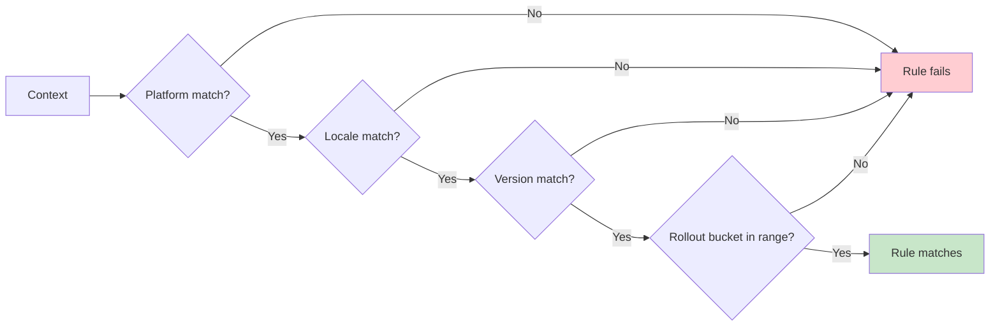
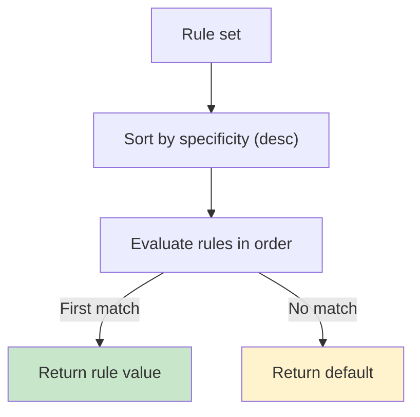

# Targeting & Rollouts

Rules let you target specific contexts and roll out behavior safely. A rule is a typed mapping:

```
criteria(context) -> returns value
```

Two properties define how rules behave:
- **AND semantics within a rule**: all specified criteria must match.
- **Specificity ordering across rules**: the most specific matching rule wins.

---

## Criteria you can combine

### Platform

```kotlin
val API_ENDPOINT by string(default = "https://api.example.com") {
    rule { platforms(Platform.IOS) } returns "https://api-ios.example.com"
    rule { platforms(Platform.ANDROID) } returns "https://api-android.example.com"
    rule { platforms(Platform.WEB) } returns "https://api-web.example.com"
}
```

Multiple platforms combine as OR:

```kotlin
rule { platforms(Platform.IOS, Platform.ANDROID) } returns "mobile value"
```

### Locale

```kotlin
val WELCOME_MESSAGE by string(default = "Hello!") {
    rule { locales(AppLocale.UNITED_STATES, AppLocale.CANADA) } returns "Welcome!"
    rule { locales(AppLocale.FRANCE) } returns "Bienvenue!"
    rule { locales(AppLocale.JAPAN) } returns "ようこそ!"
}
```

### Version ranges

```kotlin
val NEW_UI by boolean(default = false) {
    rule { versions { min(2, 0, 0) } } returns true
}
```

```kotlin
val LEGACY_SUPPORT by boolean(default = false) {
    rule { versions { max(2, 0, 0) } } returns true
}
```

### Percentage rollout

```kotlin
val NEW_CHECKOUT by boolean(default = false) {
    rule { rollout { 10.0 } } returns true
}
```

Rollouts are deterministic: the same `(stableId, flagKey, salt)` produces the same bucket assignment.

### Custom predicates via `extension { }`

```kotlin
val ADVANCED_ANALYTICS by boolean<EnterpriseContext>(default = false) {
    rule {
        extension {
            Evaluable.factory { ctx ->
                ctx.subscriptionTier == SubscriptionTier.ENTERPRISE &&
                    ctx.employeeCount > 100
            }
        }
    } returns true
}
```

---

## AND semantics inside a rule

All criteria in a rule must match:

```kotlin
val PREMIUM_FEATURE by boolean(default = false) {
    rule {
        platforms(Platform.IOS, Platform.ANDROID)
        locales(AppLocale.UNITED_STATES)
        versions { min(2, 0, 0) }
        rollout { 50.0 }
    } returns true
}
```



---

## Specificity: which rule wins

Konditional orders rules by **specificity** before evaluating them. Specificity is the count of criteria present on a rule:

```
specificity(rule):
  +1 if platforms is set
  +1 if locales is set
  +1 if versions has bounds
  +1 if rollout is set
```

Rules are evaluated in descending specificity; the first rule whose criteria all match determines the value. If no rules match, the default is returned.



---

## Deterministic rollout bucketing (SHA-256)

Rollouts are computed locally. The bucketing input is stable and per-flag:

```
input = "$stableId:$flagKey:$salt"
hash = SHA256(input)
percentage = (hash % 10000) / 100.0   // ["0.00, 100.00)
```

This yields three operational properties:
- **Deterministic**: same inputs → same bucket
- **Per-flag isolation**: changing one flag does not affect other flags’ buckets
- **Salt-controlled redistribution**: changing `salt` re-buckets users for that flag

```mermaid
flowchart LR
  Id[stableId"] --> In["stableId:flagKey:salt"]
  Key["flagKey"] --> In
  Salt["salt"] --> In
  In --> H["SHA-256"]
  H --> M["mod 10,000"]
  M --> P["percentage 0.00..99.99"]
  P --> T{< rollout % ?}
  T -->|Yes| Enabled["In rollout"]
  T -->|No| Disabled["Out of rollout"]
  style Enabled fill:#c8e6c9
  style Disabled fill:#ffcdd2
```

---

## Next steps

- Understand evaluation flow and performance: ["Evaluation"](05-evaluation.md)
- Understand the compile-time vs runtime boundary: ["Theory"](07-theory.md)
