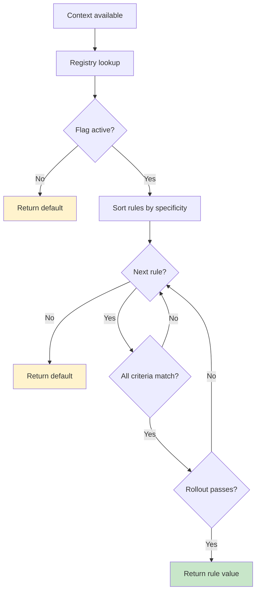

# Evaluation

Konditional evaluation is designed to be predictable:
- **Total**: evaluation always returns a value (rule value or default).
- **Deterministic**: the same inputs produce the same outputs.
- **Non-null**: defaults are required, so evaluation does not return `T?`.

---

## `feature { }` (recommended)

Concise evaluation inside a context-aware scope:

```kotlin
val darkMode = feature { Features.DARK_MODE }
applyDarkMode(darkMode)
```

Use this when:
- defaults are meaningful
- you want the smallest call-site surface

---

## Evaluation flow (what happens)



### Rule matching (AND semantics)

All specified criteria must match; empty constraint sets match everything.

```kotlin
for (rule in rulesSortedBySpecificity) {
    if (rule.matches(context)) {
        return rule.value
    }
}
return default
```

### Specificity ordering (most specific wins)

Rules are sorted by the number of criteria present (platforms/locales/versions/rollout).
This makes “more targeted” rules win over “more general” rules.

---

## Performance model

The evaluation path is designed to be constant-time in typical usage:
- **Registry lookup:** O(1)
- **Rule iteration:** O(n) where n is rules per flag (typically small)
- **Rollout bucketing:** O(1) SHA-256 hash

Space model:
- no allocations during evaluation
- immutable, pre-built rule structures

---

## Concurrency model

Evaluation is designed for concurrent reads:
- **Lock-free reads**: evaluation does not require synchronization.
- **Atomic updates**: configuration updates swap the active snapshot atomically (`Namespace.load`).

```kotlin
// Thread 1
Namespace.Global.load(newConfig)

// Thread 2 (during update)
val value = feature { Features.DARK_MODE } // sees old OR new, never a mixed state
```

---

## Testing evaluation

### Rule matching

```kotlin
@Test
fun `iOS users in US get dark mode`() {
    val context = Context(
        locale = AppLocale.UNITED_STATES,
        platform = Platform.IOS,
        appVersion = Version.parse("2.1.0"),
        stableId = StableId.of("a1b2c3d4e5f6a7b8c9d0e1f2a3b4c5d6")
    )

    val enabled = feature { Features.DARK_MODE }
    assertTrue(enabled)
}
```

### Determinism

```kotlin
@Test
fun `evaluation is deterministic`() {
    val context = Context(...)
    val results = (1..100).map { feature { Features.DARK_MODE } }
    assertTrue(results.distinct().size == 1, "Non-deterministic!")
}
```

### Rollout distribution (statistical sanity check)

```kotlin
@Test
fun `50 percent rollout distributes correctly`() {
    val sampleSize = 10_000
    val enabled = (0 until sampleSize).count { i ->
        val ctx = Context(
            ...,
            stableId = StableId.of(i.toString(16).padStart(32, '0'))
        )
        feature { Features.ROLLOUT_FLAG }
    }

    val percentage = (enabled.toDouble() / sampleSize) * 100
    assertTrue(percentage in 48.0..52.0)
}
```

---

## Guarantees (and boundaries)

| Aspect | Guarantee | Boundary |
|---|---|---|
| Type safety | return type matches definition | compile-time for statically-defined flags |
| Non-null | evaluation never returns null | relies on required defaults |
| Determinism | same inputs → same outputs | excludes malformed runtime JSON (see remote config) |
| Updates | atomic swap of configuration | correctness depends on using `Namespace.load` |

---

## Next steps

- Understand rollouts and bucketing inputs: ["Targeting & Rollouts"](04-targeting-rollouts.md)
- Add runtime-validated JSON configuration: ["Remote Configuration"](06-remote-config.md)
