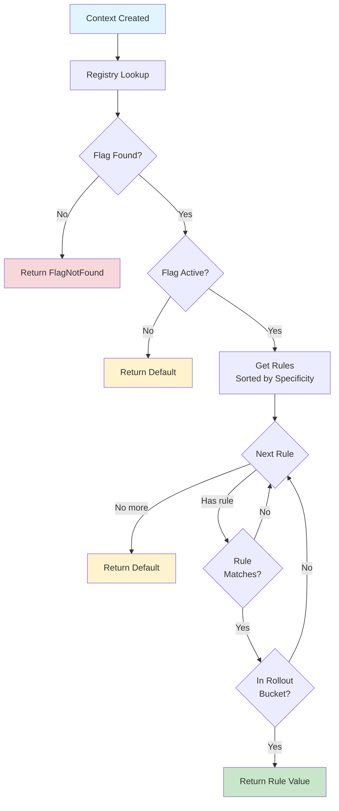

# Evaluation

Predictable results, graceful errors. This guide covers evaluation methods, evaluation flow, and error handling.

---

## Evaluation Methods

Choose based on your error handling needs.

### feature { } - Recommended

Simple evaluation within a ContextAware scope:

```kotlin
// Within a ContextAware + FeatureAware scope
val darkMode = feature { Features.DARK_MODE }
applyDarkMode(darkMode)  // Always non-null
```

**Use when:**

- You have sensible defaults
- Error details don't matter
- You want the most concise API

**Most common choice for production code.**

### featureSafe { } - Explicit Error Handling

Returns explicit result type with all failure modes:

```kotlin
when (val result = featureSafe { Features.DARK_MODE }) {
    is EvaluationResult.Success -> {
        val value: Boolean = result.value
        applyDarkMode(value)
    }
    is EvaluationResult.FlagNotFound -> {
        logWarning("Flag ${result.key} not registered")
        applyDarkMode(false)  // Fallback
    }
    is EvaluationResult.EvaluationError -> {
        logError("Evaluation failed", result.error)
        applyDarkMode(false)  // Fallback
    }
}
```

**Use when:**

- You need robust error handling
- Different failures require different actions
- Production systems with logging/monitoring

---

## Evaluation Flow

Understanding how evaluation works helps debug unexpected behavior.

### Step-by-Step Process



### 1. Registry Lookup

```kotlin
val flag = namespace.featureFlag(Features.DARK_MODE)
if (flag == null) {
    return EvaluationResult.FlagNotFound(key)
}
```

Flag must be registered in namespace. Cross-namespace lookups fail.

### 2. Flag Activity Check

```kotlin
if (!flag.isActive) {
    return defaultValue
}
```

Inactive flags always return default (kill switch behavior).

### 3. Rule Iteration (by Specificity)

Rules pre-sorted by specificity (highest first):

```kotlin
for (rule in rulesSortedBySpecificity) {
    if (rule.matches(context)) {
        return rule.value  // First match wins
    }
}
```

### 4. Rule Matching

All criteria must match (AND logic):

```kotlin
// Platform check
if (rule.platforms.isNotEmpty() && context.platform !in rule.platforms) {
    return false
}

// Locale check
if (rule.locales.isNotEmpty() && context.locale !in rule.locales) {
    return false
}

// Version check
if (!rule.versionRange.contains(context.appVersion)) {
    return false
}

// Custom extension
if (!rule.extension.matches(context)) {
    return false
}
```

Empty constraint sets match everything (no platforms = all platforms).

### 5. Rollout Bucketing

Finally, check if user is in rollout bucket:

```kotlin
val bucket = stableBucket(flagKey, context.stableId, salt)
val threshold = (rollout.value * 100).toInt()
if (bucket >= threshold) {
    return false  // Not in bucket
}
```

### 6. Value Resolution

If all checks pass, return rule's value. Otherwise, continue to next rule or return default.

---

## Error Handling

Konditional follows "parse, don't validate" principle—errors are values, not exceptions.

### EvaluationResult

Sealed interface with three cases:

```kotlin
sealed interface EvaluationResult<out T> {
    data class Success<T>(val value: T) : EvaluationResult<T>
    data class FlagNotFound(val key: String) : EvaluationResult<Nothing>
    data class EvaluationError(val key: String, val error: Throwable) : EvaluationResult<Nothing>
}
```

### Utility Methods

```kotlin
// Transform success value
result.map { value -> value.toString() }

// Fold to single type
result.fold(
    onSuccess = { value -> "Value: $value" },
    onFlagNotFound = { "Not found: $it" },
    onEvaluationError = { key, error -> "Error in $key: ${error.message}" }
)

// Get or else
result.getOrElse { fallback }
result.getOrNull()
result.getOrDefault(fallback)
```

### ParseResult

For parsing operations (Version, JSON):

```kotlin
sealed interface ParseResult<out T> {
    data class Success<T>(val value: T) : ParseResult<T>
    data class Failure(val error: ParseError) : ParseResult<Nothing>
}

sealed class ParseError {
    data class InvalidVersion(val raw: String, val message: String) : ParseError()
    // ... other parse errors
}
```

**Example:**

```kotlin
when (val result = Version.parse("2.1.0")) {
    is ParseResult.Success -> use(result.value)
    is ParseResult.Failure -> logError(result.error.toString())
}
```

---

## Performance

### Time Complexity

- **Registry lookup:** O(1) hash table
- **Rule iteration:** O(n) where n = number of rules (typically < 10)
- **Rollout bucketing:** O(1) SHA-256 hash
- **Total:** O(n) where n is small

Typical flags have 1-5 rules, so evaluation is effectively O(1).

### Space Complexity

- Zero allocations during evaluation
- All data structures pre-allocated and immutable
- No string concatenation (except bucketing hash input)

**Memory per flag:** ~200-500 bytes (FlagDefinition + rules + strings)

### Concurrency

**Lock-free reads:** No synchronization required for evaluation.

```kotlin
// Multiple threads evaluating concurrently
thread1: feature { Features.DARK_MODE }  // No lock
thread2: feature { Features.DARK_MODE }  // No lock
```

**Atomic updates:** Registry uses `AtomicReference` for configuration snapshots.

```kotlin
Namespace.Global.load(newConfig)  // Atomic swap
// Readers see either old or new, never partial
```

**Scalability:** Throughput scales linearly with CPU cores (no contention).

---

## Thread Safety

### Lock-Free Evaluation

```kotlin
// Safe concurrent evaluation
val threads = (1..100).map {
    thread {
        repeat(1000) {
            val value = feature { Features.DARK_MODE }
            processValue(value)
        }
    }
}
```

**How it works:**

- Immutable data structures (`FlagDefinition`, rules)
- AtomicReference for registry
- Readers see consistent snapshot

### Atomic Updates

```kotlin
// Thread 1: Updating
Namespace.Global.load(newConfig)

// Thread 2: Reading during update
val value = feature { Features.DARK_MODE }
// Sees old OR new, never mixed
```

**Guarantees:**

- Updates are atomic (all-or-nothing)
- No torn reads
- No race conditions

---

## Testing Evaluation

### Test Rule Matching

```kotlin
@Test
fun `iOS users in US get dark mode`() {
    val context = Context(
        locale = AppLocale.UNITED_STATES,
        platform = Platform.IOS,
        appVersion = Version.parse("2.1.0"),
        stableId = StableId.of("a1b2c3d4e5f6a7b8c9d0e1f2a3b4c5d6")
    )

    val result = featureSafe { Features.DARK_MODE }
    assertTrue(result is EvaluationResult.Success && result.value)
}
```

### Test Determinism

```kotlin
@Test
fun `evaluation is deterministic`() {
    val context = Context(...)

    val results = (1..100).map {
        feature { Features.DARK_MODE }
    }

    assertTrue(results.distinct().size == 1, "Non-deterministic!")
}
```

### Test Rollout Distribution

```kotlin
@Test
fun `50 percent rollout distributes correctly`() {
    val sampleSize = 10_000
    val enabled = (0 until sampleSize).count { i ->
        val ctx = Context(
            ...
            stableId = StableId.of("user-$i")
        )
        feature { Features.ROLLOUT_FLAG }
    }

    val percentage = (enabled.toDouble() / sampleSize) * 100
    assertTrue(percentage in 48.0..52.0)  // ±2% variance
}
```

---

## Best Practices

### 1. Prefer feature { }

For most production code:

```kotlin
// Good - simple, clear
val enabled = feature { Features.DARK_MODE }

// Good - when error handling matters
when (val result = featureSafe { Features.DARK_MODE }) {
    is EvaluationResult.Success -> use(result.value)
    else -> logAndFallback()
}
```

### 2. Cache Contexts

Create once, reuse for multiple evaluations:

```kotlin
// Good
val context = createUserContext(user)
val darkMode = feature { Features.DARK_MODE }
val apiEndpoint = feature { Config.API_ENDPOINT }
val maxRetries = feature { Config.MAX_RETRIES }

// Avoid
createUserContext(user) // then evaluate elsewhere
```

### 3. Test with Specific Contexts

Create test contexts for specific scenarios:

```kotlin
fun testContext(
    platform: Platform = Platform.IOS,
    locale: AppLocale = AppLocale.UNITED_STATES,
    version: String = "1.0.0",
    stableId: String = "a1b2c3d4e5f6a7b8c9d0e1f2a3b4c5d6"
) = Context(
    locale = locale,
    platform = platform,
    appVersion = Version.parse(version),
    stableId = StableId.of(stableId)
)

@Test
fun testTargeting() {
    val iosContext = testContext(platform = Platform.IOS)
    assertTrue(feature { Features.IOS_ONLY })

    val androidContext = testContext(platform = Platform.ANDROID)
    assertFalse(feature { Features.IOS_ONLY })
}
```

---

## Guarantees

| Aspect            | Guarantee                                          |
|-------------------|----------------------------------------------------|
| **Type safety**   | Return type matches flag definition (compile-time) |
| **Determinism**   | Same inputs always produce same outputs            |
| **Specificity**   | Most specific matching rule always wins            |
| **Bucketing**     | SHA-256 ensures independent, stable buckets        |
| **Performance**   | O(n) where n = rules per flag (< 10)               |
| **Thread safety** | Lock-free reads, immutable data                    |
| **Null safety**   | Never returns null (with OrDefault methods)        |

**Core principle:** If it compiles, evaluation is correct and deterministic.

---

## Next Steps

**Loading remote configs?** See [Remote Configuration](06-remote-config.md) for JSON serialization.

**Building targeting rules?** See [Targeting & Rollouts](04-targeting-rollouts.md) for rules and specificity.

**Understanding the basics?** See [Core Concepts](03-core-concepts.md) for Features and Context.
