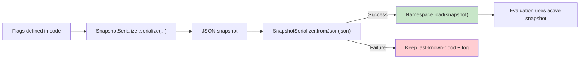

# Remote Configuration

Konditional supports dynamic configuration via JSON, but treats JSON as a **trust boundary**:
- compile-time guarantees apply to statically-defined flags and rules
- runtime JSON is accepted only after validation (`ParseResult.Success`), otherwise rejected (`ParseResult.Failure`)

---

## The lifecycle (end-to-end)



---

## Exporting configuration

```kotlin
val json = SnapshotSerializer.serialize(Namespace.Global.configuration())
```

Use this when you want to externalize a namespace’s current configuration state into JSON for storage or transport.

---

## Loading configuration (validated boundary)

```kotlin
val json = File("flags.json").readText()
when (val result = SnapshotSerializer.fromJson(json)) {
    is ParseResult.Success -> Namespace.Global.load(result.value)
    is ParseResult.Failure -> handleError(result.error)
}
```

The contract is explicit:
- **Success** means you have a type-correct, internally consistent snapshot representation (validated at the boundary).
- **Failure** means the payload is rejected before it can affect evaluation.

---

## Incremental updates via patching

```kotlin
when (val result = SnapshotSerializer.applyPatchJson(currentConfig, patchJson)) {
    is ParseResult.Success -> Namespace.Global.load(result.value)
    is ParseResult.Failure -> handleError(result.error)
}
```

This supports applying incremental JSON updates, then atomically swapping the active configuration via `Namespace.load`.

---

## Error handling model (`ParseResult`)

Remote configuration is designed to force explicit handling of invalid input:

```kotlin
sealed class ParseResult<out T> {
    data class Success<T>(val value: T) : ParseResult<T>()
    data class Failure(val error: ParseError) : ParseResult<Nothing>()
}
```

Operationally, treat failures as non-fatal: keep last-known-good configuration, log for alerting, and retry on the next update.

---

## Hot-reload semantics (atomicity)

`Namespace.load(newConfiguration)` applies updates with atomic replacement semantics:
- readers see either the old snapshot or the new snapshot
- readers never see a partially-applied configuration

This aligns with the evaluation model documented in ["Evaluation"](05-evaluation.md).

---

## What’s validated (and what is not)

Validated at the boundary:
- JSON syntax validity
- schema/structure validity
- value type checking against declared feature types

Not validated by the type system:
- semantic correctness (e.g., whether 50% is the intended rollout)
- business correctness (e.g., whether the targeted segment is correct)

---

## Integration patterns

### Polling

```kotlin
while (running) {
    val json = fetchFromServer()
    when (val result = SnapshotSerializer.fromJson(json)) {
        is ParseResult.Success -> Namespace.Global.load(result.value)
        is ParseResult.Failure -> log.error("Config parse failed: ${result.error}")
    }
    delay(pollInterval)
}
```

### Push-based (streams)

```kotlin
configStream.collect { json ->
    when (val result = SnapshotSerializer.fromJson(json)) {
        is ParseResult.Success -> Namespace.Global.load(result.value)
        is ParseResult.Failure -> log.error("Config parse failed: ${result.error}")
    }
}
```

---

## Where Kontracts fits

Konditional uses Kontracts (a standalone, zero-dependency JSON Schema DSL) for schema validation of configuration payloads.

---

## Next steps

- Understand the “if it compiles” claim boundary: ["Theory"](07-theory.md)
- Understand bucketing determinism inputs: ["Targeting & Rollouts"](04-targeting-rollouts.md)
- See the concrete snapshot/patch payload shapes: ["Persistence & Storage Format"](08-persistence-format.md)
