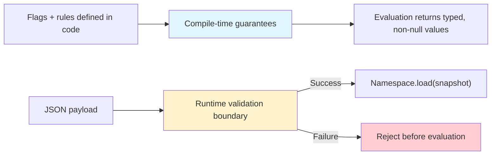

# Theory: What “If it compiles, it works” means

Konditional’s core claim is intentionally narrow and testable: **for statically-defined flags and rules, the compiler
enforces type correctness and evaluation is non-null**. When configuration crosses the JSON boundary, correctness is
established via validation and explicit error handling (`ParseResult`), not via compile-time guarantees.



---

## The three failures of stringly-typed flags

Traditional flag systems are stringly-typed: a string key selects a value and the caller chooses a typed getter. That
architecture introduces three classes of runtime failure:

1. **Key mismatch**: `"dark_mode"` vs `"darkMode"` silently returns a default or null.
2. **Type mismatch**: retrieving a boolean flag as a string is syntactically valid but semantically wrong.
3. **Null propagation**: missing configurations surface as `null` and leak into business logic.

Konditional targets this gap: prevent categories of runtime failure by moving key/type binding into the type system.

---

## Mechanism 1: Property delegation binds identity + type

Flags are delegated properties in a `FeatureContainer`:

```kotlin
object AppFeatures : FeatureContainer<Namespace.Global>(Namespace.Global) {
    val darkMode by boolean(default = false)
    val timeout by double(default = 30.0)
    val maxRetries by int(default = 3)
}
```

Because the delegate (`boolean`, `double`, `int`, …) determines the type parameter, the compiler knows the declared type
at the definition site and carries it forward.

**Guarantee**: the declared type of a feature is statically known and cannot drift without code changes the compiler
re-checks.

---

## Mechanism 2: Rule return types are constrained

Rules must return a value of the feature’s declared type:

```kotlin
val timeout by double(default = 30.0) {
    rule { platforms(Platform.ANDROID) } returns 45.0
}
```

**Guarantee**: statically-defined rule return values are type-checked at compile time.

Boundary: this applies to rules defined in code; JSON-loaded configurations are validated at the parse boundary.

---

## Mechanism 3: Evaluation site preserves the concrete type

Evaluation preserves the type parameter from definition to usage:

```kotlin
val isDarkMode: Boolean = feature { AppFeatures.darkMode }
val timeout: Double = feature { AppFeatures.timeout }
```

**Guarantee**: no casts are required at call sites; incompatible assignments are compile errors.

---

## Mechanism 4: Required defaults eliminate nulls

Every feature requires a default:

```kotlin
val darkMode by boolean(default = false)
```

**Guarantee**: evaluation is total—if no rules match, the default is returned—and does not return null.

---

## Mechanism 5: Namespace isolation is structural

Containers are bound to a namespace type, and namespaces have separate registries:

```kotlin
sealed class AppDomain(id: String) : Namespace(id) {
    data object Auth : AppDomain("auth")
    data object Payments : AppDomain("payments")
}

object AuthFeatures : FeatureContainer<AppDomain.Auth>(AppDomain.Auth) { ... }
object PaymentFeatures : FeatureContainer<AppDomain.Payments>(AppDomain.Payments) { ... }
```

**Guarantee**: feature key collisions across namespaces cannot occur (separate registries bound at the type level).

**Boundary**: defining conflicting keys within the same namespace is a design error that can be detected at runtime during
registration.

---

## The trust boundary: runtime JSON

When configuration is loaded from JSON, compile-time guarantees necessarily end. Konditional establishes correctness at
the boundary:

```kotlin
val json = File("flags.json").readText()
when (val result = SnapshotSerializer.fromJson(json)) {
    is ParseResult.Success -> Namespace.Global.load(result.value)
    is ParseResult.Failure -> logError("Parse failed: ${result.error}")
}
```

The guarantee is qualified:

- **Guaranteed**: invalid JSON is detected and rejected before it can affect evaluation.

- **Not guaranteed**: Semantic correctness of the configuration (rollout percentage, targeting intent, business
  correctness).

---

## Summary: what is guaranteed vs what is not

| Claim                           | Guarantee level              | Mechanism                                   |
|---------------------------------|------------------------------|---------------------------------------------|
| No typos in flag keys           | Compile-time                 | property access, not strings                |
| Return type matches definition  | Compile-time                 | generic type propagation                    |
| Rule return types are correct   | Compile-time                 | constrained rule DSL                        |
| Evaluation is never null        | Compile-time                 | required defaults                           |
| Namespace isolation             | Compile-time                 | type-bound containers + separate registries |
| Remote config type safety       | Runtime (validated boundary) | `ParseResult.Success` / `Failure`           |
| Semantic correctness of configs | Not guaranteed               | human/process responsibility                |

---

## Next steps

- See the runtime boundary mechanics: ["Remote Configuration"](06-remote-config.md)
- See deterministic behavior and concurrency claims in practice: ["Evaluation"](05-evaluation.md)
