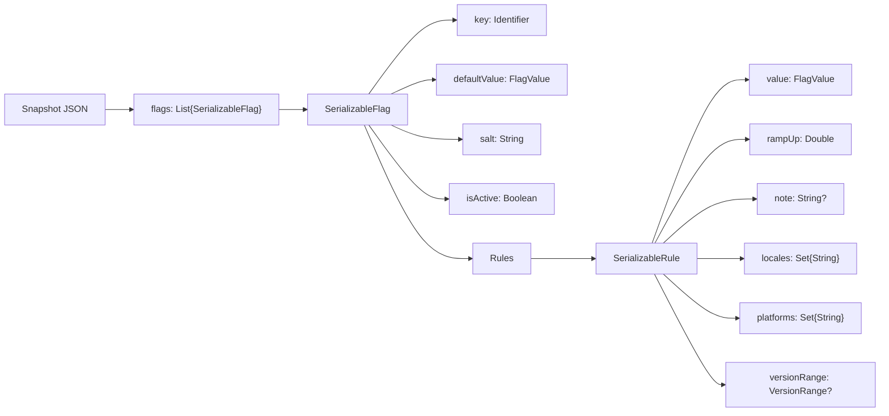

# Persistence & Storage Format

This page documents the JSON formats used to persist and transport Konditional configuration:

- **Snapshot**: the full configuration payload (`SnapshotSerializer.serialize(...)`)
- **Patch**: an incremental update payload (`SnapshotSerializer.applyPatchJson(...)`)

These formats are intentionally storage-agnostic: you can store the JSON in files, a database, or ship it over the
network.

---

## Mental model: what is persisted

At persistence time, the library serializes a list of **flag definitions**:



---

## Identifier format (`key`)

Each flag is stored under a stable **Identifier** string:

```
value::${namespaceIdentifierSeed}::${featureKey}
```

Where:

- `${namespaceIdentifierSeed}` is `Namespace.identifierSeed` (defaults to the namespace `id`)
- `${featureKey}` is the feature key (typically the Kotlin property name)

Example (Global namespace, `DARK_MODE`):

```
value::global::DARK_MODE
```

---

## Value encoding (`FlagValue`)

Both `defaultValue` and each rule’s `value` are encoded as a tagged object:

```json
{
  "type": "BOOLEAN",
  "value": true
}
```

Supported shapes:

| Kind       | JSON shape                                                                                  |
|------------|---------------------------------------------------------------------------------------------|
| Boolean    | `{ "type": "BOOLEAN", "value": ${boolean} }`                                                |
| String     | `{ "type": "STRING", "value": "${string}" }`                                                |
| Int        | `{ "type": "INT", "value": ${int} }`                                                        |
| Double     | `{ "type": "DOUBLE", "value": ${double} }`                                                  |
| Enum       | `{ "type": "ENUM", "value": "${enumName}", "enumClassName": "${fqcn}" }`                    |
| Data class | `{ "type": "DATA_CLASS", "dataClassName": "${fqcn}", "value": { ...primitive fields... } }` |

The `DATA_CLASS` representation stores a primitive map of fields along with the fully qualified class name.

---

## Version range encoding (`versionRange`)

Rules may include a `versionRange` object. It uses a discriminator and optional bounds:

```json
{
  "type": "MIN_AND_MAX_BOUND",
  "min": {
    "major": 2,
    "minor": 0,
    "patch": 0
  },
  "max": {
    "major": 4,
    "minor": 0,
    "patch": 0
  }
}
```

Valid `type` values:

- `UNBOUNDED`
- `MIN_BOUND` (requires `min`)
- `MAX_BOUND` (requires `max`)
- `MIN_AND_MAX_BOUND` (requires `min` and `max`)

---

## Generic templates (Kotlin-style)

### Snapshot template

```kotlin
val snapshotJson = """
{
  "flags": [
    {
      "key": "value::${namespaceSeed}::${featureKey}",
      "defaultValue": {
        "type": "${valueType}",
        "value": ${defaultValueJson},
        "...": "${typeSpecificFields}"
      },
      "salt": "${salt}",
      "isActive": ${isActive},
      "rules": [
        {
          "value": {
            "type": "${valueType}",
            "value": ${ruleValueJson},
            "...": "${typeSpecificFields}"
          },
          "rampUp": ${rolloutPercent},
          "note": "${optionalNoteOrNull}",
          "locales": ["${APP_LOCALE_ENUM_NAME}", "..."],
          "platforms": ["${PLATFORM_ENUM_NAME}", "..."],
          "versionRange": {
            "type": "${UNBOUNDED|MIN_BOUND|MAX_BOUND|MIN_AND_MAX_BOUND}",
            "min": { "major": ${minMajor}, "minor": ${minMinor}, "patch": ${minPatch} },
            "max": { "major": ${maxMajor}, "minor": ${maxMinor}, "patch": ${maxPatch} }
          }
        }
      ]
    }
  ]
}
"""
```

### Patch template

```kotlin
val patchJson = """
{
  "flags": [
    { "...": "SerializableFlag objects (same shape as snapshot)" }
  ],
  "removeKeys": [
    "value::${namespaceSeed}::${featureKeyToRemove}",
    "value::${namespaceSeed}::${anotherKey}"
  ]
}
"""
```

---

## Parse boundary and failure modes

Deserialization reconstructs configurations by looking up each `key` in an internal registry of known features.

- If a key is not registered, parsing fails with `ParseError.FeatureNotFound`.
- JSON syntax/shape errors fail with `ParseError.InvalidJson` / `ParseError.InvalidSnapshot`.

Operationally: treat parse failures as “reject update, keep last-known-good”.

---

## JSON examples

??? example "Snapshot: booleans + string variants, with version ranges"
    ```json
    {
      "flags": [
        {
          "key": "value::global::DARK_MODE",
          "defaultValue": { "type": "BOOLEAN", "value": false },
          "salt": "v1",
          "isActive": true,
          "rules": [
            {
              "value": { "type": "BOOLEAN", "value": true },
              "rampUp": 50.0,
              "note": "iOS gradual rollout",
              "locales": ["UNITED_STATES"],
              "platforms": ["IOS"],
              "versionRange": { "type": "MIN_BOUND", "min": { "major": 2, "minor": 0, "patch": 0 } }
            }
          ]
        },
        {
          "key": "value::global::API_ENDPOINT",
          "defaultValue": { "type": "STRING", "value": "https://api.example.com" },
          "salt": "v1",
          "isActive": true,
          "rules": [
            {
              "value": { "type": "STRING", "value": "https://api-ios.example.com" },
              "rampUp": 100.0,
              "note": "iOS endpoint",
              "locales": [],
              "platforms": ["IOS"],
              "versionRange": { "type": "UNBOUNDED" }
            },
            {
              "value": { "type": "STRING", "value": "https://api-android.example.com" },
              "rampUp": 100.0,
              "note": "Android endpoint",
              "locales": [],
              "platforms": ["ANDROID"],
              "versionRange": { "type": "UNBOUNDED" }
            }
          ]
        }
      ]
    }
    ```

??? example "Snapshot: enum value payload"
    ```json
    {
      "flags": [
        {
          "key": "value::global::THEME",
          "defaultValue": {
            "type": "ENUM",
            "value": "LIGHT",
            "enumClassName": "com.example.Theme"
          },
          "salt": "v1",
          "isActive": true,
          "rules": [
            {
              "value": {
                "type": "ENUM",
                "value": "DARK",
                "enumClassName": "com.example.Theme"
              },
              "rampUp": 100.0,
              "note": "Dark theme for iOS",
              "locales": [],
              "platforms": ["IOS"],
              "versionRange": { "type": "UNBOUNDED" }
            }
          ]
        }
      ]
    }
    ```

??? example "Patch: update one flag, remove one flag"
    ```json
    {
      "flags": [
        {
          "key": "value::global::DARK_MODE",
          "defaultValue": { "type": "BOOLEAN", "value": false },
          "salt": "v1",
          "isActive": true,
          "rules": [
            {
              "value": { "type": "BOOLEAN", "value": true },
              "rampUp": 100.0,
              "note": "Rollout complete",
              "locales": [],
              "platforms": [],
              "versionRange": { "type": "UNBOUNDED" }
            }
          ]
        }
      ],
      "removeKeys": [
        "value::global::LEGACY_SUPPORT"
      ]
    }
    ```

??? example "Consumer Configuration Lifecycle Sample"
    ```json
    {
      "flags": [
        {
          "key": "value::consumer-lifecycle-3f02840e-abd0-4447-9bdc-0a8f41ca530e::darkMode",
          "defaultValue": {
            "type": "BOOLEAN",
            "value": false
          },
          "salt": "v1",
          "isActive": true,
          "rules": [
            {
              "value": {
                "type": "BOOLEAN",
                "value": true
              },
              "rampUp": 100.0,
              "note": "iOS fully enabled",
              "locales": [],
              "platforms": [
                "IOS"
              ],
              "versionRange": {
                "type": "UNBOUNDED"
              }
            }
          ]
        },
        {
          "key": "value::consumer-lifecycle-3f02840e-abd0-4447-9bdc-0a8f41ca530e::apiEndpoint",
          "defaultValue": {
            "type": "STRING",
            "value": "https://api.example.com"
          },
          "salt": "v1",
          "isActive": true,
          "rules": [
            {
              "value": {
                "type": "STRING",
                "value": "https://api-web.example.com"
              },
              "rampUp": 100.0,
              "note": "Web endpoint override",
              "locales": [],
              "platforms": [
                "WEB"
              ],
              "versionRange": {
                "type": "UNBOUNDED"
              }
            }
          ]
        },
        {
          "key": "value::consumer-lifecycle-3f02840e-abd0-4447-9bdc-0a8f41ca530e::maxRetries",
          "defaultValue": {
            "type": "INT",
            "value": 3
          },
          "salt": "v1",
          "isActive": true,
          "rules": [
            {
              "value": {
                "type": "INT",
                "value": 5
              },
              "rampUp": 100.0,
              "note": "More retries on v2+",
              "locales": [],
              "platforms": [],
              "versionRange": {
                "type": "MIN_BOUND",
                "min": {
                  "major": 2,
                  "minor": 0,
                  "patch": 0
                }
              }
            }
          ]
        },
        {
          "key": "value::consumer-lifecycle-3f02840e-abd0-4447-9bdc-0a8f41ca530e::theme",
          "defaultValue": {
            "type": "ENUM",
            "value": "LIGHT",
            "enumClassName": "io.amichne.konditional.serialization.ConsumerConfigurationLifecycleTest$Theme"
          },
          "salt": "v1",
          "isActive": true,
          "rules": [
            {
              "value": {
                "type": "ENUM",
                "value": "DARK",
                "enumClassName": "io.amichne.konditional.serialization.ConsumerConfigurationLifecycleTest$Theme"
              },
              "rampUp": 100.0,
              "note": "Dark theme for FR locale",
              "locales": [
                "FRANCE"
              ],
              "platforms": [],
              "versionRange": {
                "type": "UNBOUNDED"
              }
            }
          ]
        },
        {
          "key": "value::consumer-lifecycle-3f02840e-abd0-4447-9bdc-0a8f41ca530e::userSettings",
          "defaultValue": {
            "type": "DATA_CLASS",
            "dataClassName": "io.amichne.konditional.serialization.ConsumerConfigurationLifecycleTest$UserSettings",
            "value": {
              "enabled": true,
              "maxRetries": 3.0,
              "theme": "light",
              "timeoutSeconds": 30.0
            }
          },
          "salt": "v1",
          "isActive": true,
          "rules": [
            {
              "value": {
                "type": "DATA_CLASS",
                "dataClassName": "io.amichne.konditional.serialization.ConsumerConfigurationLifecycleTest$UserSettings",
                "value": {
                  "enabled": false,
                  "maxRetries": 5.0,
                  "theme": "dark",
                  "timeoutSeconds": 10.0
                }
              },
              "rampUp": 100.0,
              "note": "Custom settings for iOS",
              "locales": [],
              "platforms": [
                "IOS"
              ],
              "versionRange": {
                "type": "UNBOUNDED"
              }
            }
          ]
        }
      ]
    }
    ```
