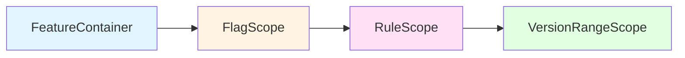

# Builder DSL

Konditional provides a type-safe, expressive DSL for configuring feature flags. The DSL uses Kotlin's receiver types and
inline functions to create a fluent configuration interface while maintaining compile-time safety.

## Overview

The configuration DSL consists of three main scope levels:

1. **FeatureContainer**: Top-level container for organizing related features
2. **FlagScope**: Individual flag configuration within delegation
3. **RuleScope**: Rule definition within a flag
4. **VersionRangeScope**: Version constraint definition

```kotlin
object MyFeatures : FeatureContainer<Taxonomy.Global>(Taxonomy.Global) {
    val MY_FLAG by boolean(default = true) {  // FlagScope
        rule {  // RuleScope
            platforms(Platform.IOS)
        } implies false
    }
}
```

### DSL Scope Hierarchy



## FeatureContainer

The outermost scope for defining flag configurations.

### config Function

Entry point for flag configuration:

```kotlin
config(registry: FlagRegistry = FlagRegistry) {
    // Flag configurations
}
```

**Parameters:**

- `registry`: Target registry (defaults to singleton)

**Usage:**

```kotlin
// Configure singleton registry
config {
    MyFeature.FLAG_A with { /* ... */ }
    MyFeature.FLAG_B with { /* ... */ }
}

// Configure custom registry
val testRegistry = FlagRegistry.create()
config(testRegistry) {
    MyFeature.FLAG_A with { /* ... */ }
}
```

### Feature Configuration

Use the `with` infix function to configure features:

```kotlin
config {
    MyFeature.DARK_MODE with {
        default(false)
        // ... rules
    }

    MyFeature.API_ENDPOINT with {
        default("https://api.prod.example.com")
        // ... rules
    }
}
```

## FlagScope

Scope for configuring individual flags.

### default()

Sets the default value returned when no rules match:

```kotlin
MyFeature.BOOLEAN_FLAG with {
    default(false)  // Boolean
}

MyFeature.STRING_FLAG with {
    default("production")  // String
}

MyFeature.INT_FLAG with {
    default(42)  // Int
}

MyFeature.CONFIG_FLAG with {
    default(Config(url = "https://prod.example.com", timeout = 30))  // Complex type
}
```

**Note:** The default value type must match the feature's declared type.

### salt()

Sets the hash salt for rollout bucketing:

```kotlin
MyFeature.EXPERIMENT with {
    default(false)
    salt("v1")  // Initial experiment

    rule {
        rollout = Rollout.of(50.0)
    }.implies(true)
}
```

Changing the salt redistributes users across rollout buckets.

### rule()

Defines a targeting rule:

```kotlin
MyFeature.FLAG with {
    default(false)

    rule {
        // ... targeting criteria
    }.implies(true)
}
```

Returns a `Rule` object that must be associated with a value using `implies`.

### implies

Associates a rule with its value:

```kotlin
rule {
    platforms(Platform.IOS)
}.implies(true)  // When rule matches, return true
```

## RuleScope

Scope for defining rule targeting criteria.

### platforms()

Specify target platforms:

```kotlin
rule {
    platforms(Platform.IOS, Platform.ANDROID)
}.implies(value)

rule {
    platforms(Platform.WEB)
}.implies(webValue)
```

Empty platforms = match all.

### locales()

Specify target locales:

```kotlin
rule {
    locales(AppLocale.EN_US, AppLocale.EN_CA)
}.implies(value)

rule {
    locales(AppLocale.FR_FR)
}.implies(frenchValue)
```

Empty locales = match all.

### versions()

Specify version range using VersionRangeScope:

```kotlin
rule {
    versions {
        min(2, 0, 0)  // Minimum version
        max(3, 0, 0)  // Maximum version
    }
}.implies(value)
```

### rollout

Set rollout percentage:

```kotlin
rule {
    platforms(Platform.IOS)
    rollout = Rollout.of(25.0)  // 25% rollout
}.implies(value)
```

Values: 0.0 to 100.0 (use `Rollout.MAX` for 100.0)

### extension()

Add custom evaluation logic:

```kotlin
rule {
    extension {
        object : Evaluable<EnterpriseContext>() {
            override fun matches(context: EnterpriseContext): Boolean =
                context.subscriptionTier == SubscriptionTier.ENTERPRISE

            override fun specificity(): Int = 1
        }
    }
}.implies(value)
```

### note()

Add documentation to rules:

```kotlin
rule {
    platforms(Platform.IOS)
    rollout = Rollout.of(10.0)
    note("Initial iOS canary deployment")
}.implies(value)
```

## VersionRangeScope

Scope for defining version constraints.

### min()

Set minimum version (inclusive):

```kotlin
versions {
    min(2, 0, 0)  // >= 2.0.0
}

versions {
    min(1, 5, 3)  // >= 1.5.3
}
```

### max()

Set maximum version (inclusive):

```kotlin
versions {
    max(3, 0, 0)  // <= 3.0.0
}

versions {
    max(2, 9, 99)  // <= 2.9.99
}
```

### Combined

Define version range:

```kotlin
versions {
    min(2, 0, 0)  // >= 2.0.0
    max(3, 0, 0)  // <= 3.0.0
}

// Exact version
versions {
    min(2, 1, 5)
    max(2, 1, 5)  // Exactly 2.1.5
}
```

## Complete Examples

### Simple Boolean Flag

```kotlin
config {
    MyFeatures.DARK_MODE with {
        default(false)

        rule {
            platforms(Platform.IOS, Platform.ANDROID)
            rollout = Rollout.of(50.0)
            note("Mobile dark mode, 50% rollout")
        }.implies(true)
    }
}
```

### Custom Context with Extensions

```kotlin
config {
    EnterpriseFeatures.ADVANCED_ANALYTICS with {
        default(false)

        // Enterprise tier customers
        rule {
            extension {
                object : Evaluable<EnterpriseContext>() {
                    override fun matches(context: EnterpriseContext): Boolean =
                        context.subscriptionTier == SubscriptionTier.ENTERPRISE

                    override fun specificity(): Int = 1
                }
            }
            rollout = Rollout.MAX
            note("Full rollout for enterprise customers")
        }.implies(true)

        // Professional tier with admin role
        rule {
            extension {
                object : Evaluable<EnterpriseContext>() {
                    override fun matches(context: EnterpriseContext): Boolean =
                        context.subscriptionTier == SubscriptionTier.PROFESSIONAL &&
                        context.userRole == UserRole.ADMIN

                    override fun specificity(): Int = 2
                }
            }
            rollout = Rollout.of(50.0)
            note("50% rollout for professional admins")
        }.implies(true)
    }
}
```

## Exporting Configurations

To export a configuration snapshot for serialization or testing, use the registry's `konfig()` method:

```kotlin
// Define features using FeatureContainer
object MyFeatures : FeatureContainer<Taxonomy.Global>(Taxonomy.Global) {
    val FLAG_A by boolean(default = false)
    val FLAG_B by boolean(default = true)
}

// Get the current configuration snapshot
val snapshot = Taxonomy.Global.registry.konfig()

// Serialize it
val json = SnapshotSerializer.default.serialize(snapshot)

// Or load it into another registry for testing
testRegistry.load(snapshot)
```

**Use cases:**

- Exporting current configuration state
- Testing with isolated registries
- Building configurations programmatically
- Serializing configurations
- External configuration management

## Type Safety

The DSL provides compile-time type safety:

```kotlin
config {
    // Type-safe: Boolean feature expects Boolean values
    MyBooleanFeature.FLAG with {
        default(false)
        rule { platforms(Platform.IOS) }.implies(true)  // OK
        // rule { platforms(Platform.IOS) }.implies("true")  // Compile error!
    }

    // Type-safe: String feature expects String values
    MyStringFeature.API_URL with {
        default("https://prod.example.com")
        rule { platforms(Platform.WEB) }.implies("https://staging.example.com")  // OK
        // rule { platforms(Platform.WEB) }.implies(true)  // Compile error!
    }
}
```

## DSL Markers

The DSL uses `@FeatureFlagDsl` annotation to prevent invalid scope nesting. All scope interfaces are marked with this annotation, ensuring compile-time safety and preventing constructions like nesting `rule` inside `rule` or `config` inside `rule`.

## Best Practices

**Organize by Feature Area**: Separate configurations into dedicated files (e.g., `UIConfig.kt`, `ApiConfig.kt`) and initialize them together. This improves maintainability and code organization.

**Use Named Values**: Extract complex values into named variables for clarity, especially for configuration objects used multiple times.

**Extract Complex Extensions**: Create reusable `Evaluable` classes for custom logic instead of inline anonymous objects. This improves testability and reusability.

**Document with `note()`**: Add context to rules using `note()`, especially for experiments and gradual rollouts. Include tracking IDs, ownership, duration, and rationale.

**Maintain Salt Hygiene**: Document salt changes and their purpose. Changing salt redistributes rollout buckets, so track versions carefully.

## Next Steps

- **[Rules](Rules.md)**: Understand rule evaluation
- **[Flags](Flags.md)**: Learn about feature patterns
- **[Overview](index.md)**: Back to API overview
