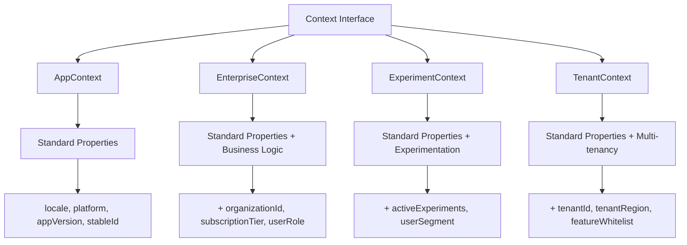

# Context API

The `Context` interface defines the evaluation environment for feature flags. It provides standard targeting dimensions while allowing domain-specific extensions for custom business logic.

## Base Context Interface

The base `Context` interface defines four required properties:

```kotlin
interface Context {
    val locale: AppLocale
    val platform: Platform
    val appVersion: Version
    val stableId: StableId
}
```

### Standard Properties

#### locale: AppLocale

Represents the user's language and regional settings. Used for localization-based targeting.

```kotlin
enum class AppLocale {
    EN_US,
    EN_CA,
    EN_GB,
    FR_FR,
    DE_DE,
    ES_ES,
    JA_JP,
    ZH_CN,
    // ... other locales
}
```

#### platform: Platform

Identifies the platform where the application is running.

```kotlin
enum class Platform {
    IOS,
    ANDROID,
    WEB,
    DESKTOP,
    SERVER
}
```

#### appVersion: Version

Semantic version of the application, used for version-based targeting.

```kotlin
data class Version(
    val major: Int,
    val minor: Int,
    val patch: Int
) : Comparable<Version>

// Create versions
val version = Version(2, 5, 0)
val parsed = Version.parse("2.5.0")
```

#### stableId: StableId

A stable, unique identifier used for deterministic rollout bucketing. This ensures users consistently see the same variation across sessions.

```kotlin
// Create from any unique identifier
val stableId = StableId.of("user-12345")
val stableId = StableId.of(userId)
val stableId = StableId.of(deviceId)
```

The `StableId` is crucial for consistent user experience. The same ID will always hash to the same bucket, ensuring that once a user is assigned to a rollout group, they remain in that group.

## Creating Context Instances

### Factory Method

Use the companion object factory for basic contexts:

```kotlin
val context = Context(
    locale = AppLocale.EN_US,
    platform = Platform.IOS,
    appVersion = Version(2, 5, 0),
    stableId = StableId.of("user-123")
)
```

### Data Classes

For production use, create data class implementations:

```kotlin
data class AppContext(
    override val locale: AppLocale,
    override val platform: Platform,
    override val appVersion: Version,
    override val stableId: StableId
) : Context

val context = AppContext(
    locale = AppLocale.EN_US,
    platform = Platform.IOS,
    appVersion = Version(2, 5, 0),
    stableId = StableId.of("user-123")
)
```

## Custom Context Extensions

Extend the base `Context` interface to add domain-specific targeting fields. This is one of Konditional's most powerful features, allowing you to target flags based on your business logic.



### Example: Enterprise Context

Add organization and subscription information for enterprise features:

```kotlin
data class EnterpriseContext(
    override val locale: AppLocale,
    override val platform: Platform,
    override val appVersion: Version,
    override val stableId: StableId,
    val organizationId: String,
    val subscriptionTier: SubscriptionTier,
    val userRole: UserRole
) : Context

enum class SubscriptionTier { FREE, PROFESSIONAL, ENTERPRISE }
enum class UserRole { VIEWER, EDITOR, ADMIN, OWNER }
```

Use custom context fields in rule extensions:

```kotlin
enum class EnterpriseFeatures(
    override val key: String
) : Feature<EncodableValue.BooleanEncodeable, Boolean, EnterpriseContext> {
    ADVANCED_ANALYTICS("advanced_analytics"),
    BULK_EXPORT("bulk_export");

    override val registry: FlagRegistry = FlagRegistry
}

config {
    EnterpriseFeatures.ADVANCED_ANALYTICS with {
        default(false)
        rule {
            extension {
                object : Evaluable<EnterpriseContext>() {
                    override fun matches(context: EnterpriseContext): Boolean =
                        context.subscriptionTier == SubscriptionTier.ENTERPRISE
                    override fun specificity(): Int = 1
                }
            }
        }.implies(true)
    }
}
```

Other common extension patterns include experimentation contexts (for A/B testing with `activeExperiments` and `userSegment` fields) and multi-tenant contexts (with `tenantId`, `tenantRegion`, and feature whitelists).

## Context Patterns

### Immutability

Always use immutable data classes for thread safety. Use `val` for all properties and leverage Kotlin's `copy()` for modifications:

```kotlin
// Good: Immutable data class
data class AppContext(...) : Context

// Bad: Mutable properties
class MutableContext(override var locale: AppLocale, ...) : Context  // Don't do this
```

### Context Factories

Create factory functions for common context creation patterns:

```kotlin
object ContextFactory {
    fun fromRequest(request: HttpRequest): AppContext =
        AppContext(
            locale = parseLocale(request.headers["Accept-Language"]),
            platform = detectPlatform(request.headers["User-Agent"]),
            appVersion = parseVersion(request.headers["X-App-Version"]),
            stableId = StableId.of(request.cookies["user_id"] ?: generateAnonymousId())
        )

    fun fromUser(user: User, device: Device): AppContext =
        AppContext(user.preferredLocale, device.platform, device.appVersion, StableId.of(user.id))
}
```

### Context Builders

For complex contexts with many optional fields, use builders to improve readability and ensure all required fields are set.

## StableId Best Practices

The `stableId` is critical for consistent rollout behavior. Choose identifiers based on targeting level:

```kotlin
// User-level: Use user ID
val stableId = StableId.of(userId)

// Device-level: Use device ID
val stableId = StableId.of(deviceId)

// Anonymous: Generate and persist
val stableId = StableId.of(getOrCreateAnonymousId())
```

The identifier must be **persistent** (survives restarts), **unique** (per user/device/session), and **consistent** (same value across requests). For anonymous users, generate a UUID and store it in localStorage or cookies.

## Context Polymorphism

Konditional's type system supports context polymorphism through generic type parameters. Features are bound to specific context types:

```kotlin
// Feature requiring base Context
val basicFeature: Feature<EncodableValue.BooleanEncodeable, Boolean, Context> =
    Feature("basic")

// Feature requiring EnterpriseContext
val enterpriseFeature: Feature<EncodableValue.BooleanEncodeable, Boolean, EnterpriseContext> =
    Feature("enterprise")

// Base context can only evaluate basic features
val baseContext: Context = Context(...)
baseContext.evaluateSafe(basicFeature)  // OK
// baseContext.evaluateSafe(enterpriseFeature)  // Compile error!

// Enterprise context can evaluate both
val enterpriseContext: EnterpriseContext = EnterpriseContext(...)
enterpriseContext.evaluateSafe(basicFeature)  // OK (subtype of Context)
enterpriseContext.evaluateSafe(enterpriseFeature)  // OK
```

This type safety ensures you can only evaluate flags with contexts that provide the necessary information.

## Common Patterns

### Default Context for Testing

Create a default context for unit tests:

```kotlin
object TestContext {
    val default = Context(
        locale = AppLocale.EN_US,
        platform = Platform.WEB,
        appVersion = Version(1, 0, 0),
        stableId = StableId.of("test-user")
    )

    fun withPlatform(platform: Platform) = default.copy(platform = platform)
    fun withVersion(version: Version) = default.copy(appVersion = version)
}
```

### Context Middleware

Extract context from HTTP requests in a consistent way:

```kotlin
class ContextMiddleware : Interceptor {
    override fun intercept(chain: Interceptor.Chain): Response {
        val request = chain.request()
        val context = buildContext(request)

        // Store in thread-local or request scope
        ContextHolder.set(context)

        return chain.proceed(request)
    }

    private fun buildContext(request: Request): AppContext {
        return AppContext(
            locale = parseLocale(request.header("Accept-Language")),
            platform = parsePlatform(request.header("User-Agent")),
            appVersion = parseVersion(request.header("X-App-Version")),
            stableId = StableId.of(request.cookie("user_id"))
        )
    }
}
```

## Next Steps

- **[Rules](Rules.md)**: Learn how rules use context for targeting
- **[Overview](index.md)**: Back to API overview
- **[Architecture](Architecture.md)**: Understand how context flows through evaluation
