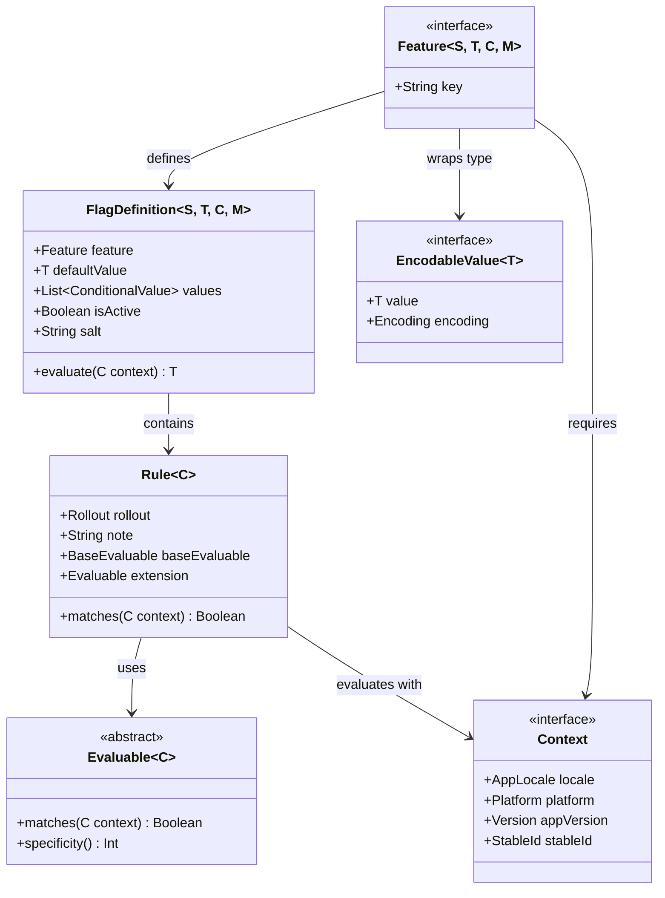
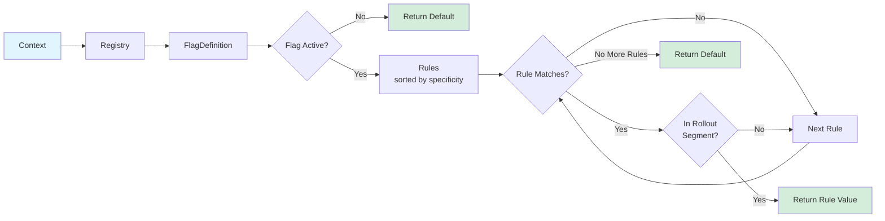
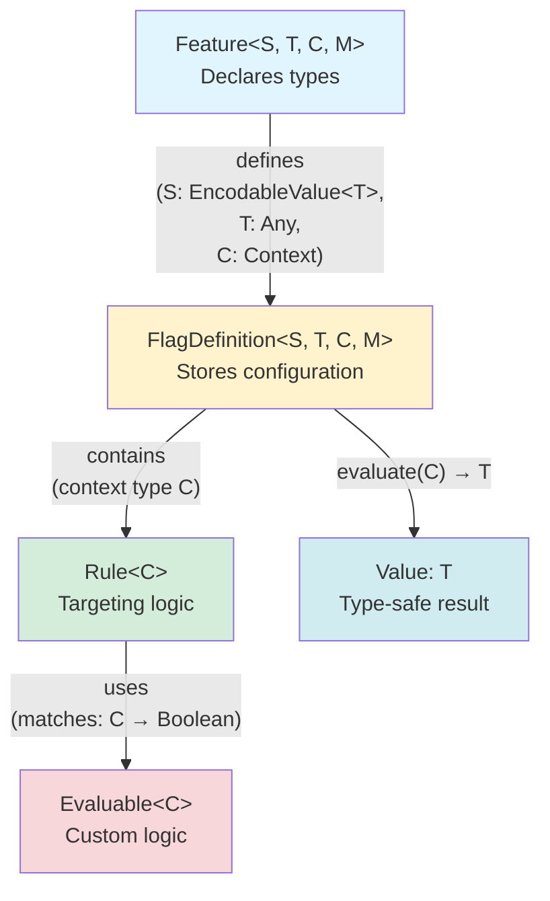

# Core Concepts: The Type-Safe Building Blocks

This document explains the fundamental types that make Konditional's compile-time type safety possible.

---

## The Type Safety Architecture

Konditional's type safety comes from **generic type parameters** that flow through every component. The diagram below shows how the core types relate to each other:



---

## Feature: Your Type-Safe Flag Definition

### What It Is

A `Feature` is your entry point for defining a flag. It's typically implemented as an enum member:

```kotlin
enum class Features(override val key: String) : Conditional<Boolean, Context> {
    DARK_MODE("dark_mode")
}
```

### Type Parameters Explained

```kotlin
interface Feature<S : EncodableValue<T>, T : Any, C : Context, M : Module> {
    val key: String
}
```

- **`S: EncodableValue<T>`** - Internal wrapper for serialization (you never interact with this directly)
- **`T: Any`** - The actual value type returned by `evaluate()` (e.g., `Boolean`, `String`, `Int`)
- **`C: Context`** - The evaluation context required (defines what information is available during evaluation)
- **`M: Module`** - The module namespace for organizing flags (prevents key collisions)

**What this guarantees:**
- `DARK_MODE` always returns `Boolean`, never `String` or `Int`
- Evaluation requires `Context`, not some other type
- The compiler enforces these at every usage site

### Common Feature Patterns

```kotlin
// Boolean flags
enum class Features(override val key: String) : Conditional<Boolean, Context> {
    DARK_MODE("dark_mode")
}

// String configuration
enum class ApiConfig(override val key: String) : Conditional<String, Context> {
    ENDPOINT("api_endpoint")
}

// Integer limits
enum class Limits(override val key: String) : Conditional<Int, Context> {
    MAX_RETRIES("max_retries")
}

// Custom data classes
data class ThemeConfig(val primaryColor: String, val fontSize: Int)
enum class Theme(override val key: String) : Conditional<ThemeConfig, Context> {
    APP_THEME("app_theme")
}
```

---

## EncodableValue: Making Invalid Types Unrepresentable

### The Problem It Solves

**String-based systems:** Any type can be stored, leading to runtime errors

```kotlin
config.set("timeout", "not-a-number")  // ✓ Compiles
val timeout: Int = config.getInt("timeout")  // 💣 Runtime error
```

**Konditional:** Only supported types can exist

```kotlin
enum class Config(override val key: String) : Conditional<Int, Context> {
    TIMEOUT("timeout")
}

config {
    Config.TIMEOUT with {
        default("not-a-number")  // ✗ Type mismatch: Required Int, found String
    }
}
```

### Supported Types

```kotlin
sealed interface EncodableValue<T : Any> {
    enum class Encoding {
        BOOLEAN,   // Boolean values
        STRING,    // String values
        INTEGER,   // Int values
        DECIMAL,   // Double values
        JSON       // Arbitrary data classes (serialized as JSON)
    }
}
```

**Built-in encodeable types:**

| Kotlin Type     | EncodableValue Wrapper    | Encoding  |
|-----------------|---------------------------|-----------|
| `Boolean`       | `BooleanEncodeable`       | `BOOLEAN` |
| `String`        | `StringEncodeable`        | `STRING`  |
| `Int`           | `IntEncodeable`           | `INTEGER` |
| `Double`        | `DecimalEncodeable`       | `DECIMAL` |
| Data classes    | `JsonObjectEncodeable<T>` | `JSON`    |
| Custom wrappers | `CustomEncodeable<T, P>`  | Varies    |

### How It Works

When you define a flag, the type parameter automatically selects the right wrapper:

```kotlin
enum class Features(override val key: String) : Conditional<Boolean, Context> {
    DARK_MODE("dark_mode")  // Compiler infers: BooleanEncodeable wrapper
}

enum class ApiConfig(override val key: String) : Conditional<String, Context> {
    ENDPOINT("api_endpoint")  // Compiler infers: StringEncodeable wrapper
}
```

**You never interact with wrappers directly** - they're internal. You just specify the value type (`Boolean`, `String`,
etc.) and the compiler handles the rest.

### Custom Types via JSON

Data classes are automatically serialized as JSON:

```kotlin
data class ThemeConfig(val primaryColor: String, val fontSize: Int)

enum class Theme(override val key: String) : Conditional<ThemeConfig, Context> {
    APP_THEME("app_theme")
}

config {
    Theme.APP_THEME with {
        default(ThemeConfig("#FFFFFF", 14))
        rule { platforms(Platform.IOS) }.implies(ThemeConfig("#000000", 16))
    }
}
```

### The "Parse, Don't Validate" Principle

Invalid types cannot be represented - if your flag compiles, its type is supported:

```kotlin
enum class BadConfig(override val key: String) : Conditional<MyWeirdType, Context> {
    BAD_FLAG("bad_flag")  // ✗ Compile error: No EncodableEvidence for MyWeirdType
}
```

---

## Context: Type-Safe Evaluation Environment

### What It Provides

Context carries the information needed to evaluate flags:

```kotlin
interface Context {
    val locale: AppLocale        // User's locale (e.g., EN_US, FR_FR)
    val platform: Platform       // Platform (IOS, ANDROID, WEB, etc.)
    val appVersion: Version      // App version (e.g., 2.1.0)
    val stableId: StableId       // Stable user ID for rollout bucketing
}
```

### Why Context Is Type-Safe

Context requirements are explicit in the type signature:

```kotlin
data class EnterpriseContext(
    override val locale: AppLocale,
    override val platform: Platform,
    override val appVersion: Version,
    override val stableId: StableId,
    val subscriptionTier: SubscriptionTier  // Custom field
) : Context

enum class PremiumFeatures(override val key: String) :
    Conditional<Boolean, EnterpriseContext> {  // Type documents requirement
    DATA_EXPORT("export_enabled")
}

// Compiler enforces correct context
val basicContext: Context = basicContext(...)
basicContext.evaluate(PremiumFeatures.DATA_EXPORT)  // ✗ Type mismatch

val enterpriseContext: EnterpriseContext = EnterpriseContext(...)
enterpriseContext.evaluate(PremiumFeatures.DATA_EXPORT)  // ✓ Compiles
```

### Custom Context Extensions

Extend `Context` with domain-specific fields:

```kotlin
data class AppContext(
    override val locale: AppLocale,
    override val platform: Platform,
    override val appVersion: Version,
    override val stableId: StableId,
    val userId: String,
    val subscriptionTier: SubscriptionTier,
    val organizationId: String?
) : Context

enum class SubscriptionTier { FREE, PROFESSIONAL, ENTERPRISE }
```

This enables type-safe access to business fields in rules, with compiler-enforced context requirements and IDE auto-complete.

### Context Polymorphism

Different flags can require different contexts:

```kotlin
enum class BasicFeatures(override val key: String) : Conditional<Boolean, Context> {
    DARK_MODE("dark_mode")
}

enum class PremiumFeatures(override val key: String) : Conditional<Boolean, AppContext> {
    DATA_EXPORT("export_enabled")
}

// Type system enforces correct context
val basic: Context = basicContext(...)
basic.evaluate(BasicFeatures.DARK_MODE)  // ✓ Works

val app: AppContext = AppContext(...)
app.evaluate(BasicFeatures.DARK_MODE)     // ✓ Works (AppContext extends Context)
app.evaluate(PremiumFeatures.DATA_EXPORT) // ✓ Works
```

---

## Rule: Declarative Targeting Logic

### What It Is

A `Rule` defines **when** a value should be used:

```kotlin
config {
    Features.DARK_MODE with {
        default(false)

        rule {
            platforms(Platform.IOS)  // ← Targeting criteria
        }.implies(true)              // ← Value when rule matches
    }
}
```

### Structure

```kotlin
class Rule<C : Context>(
    val rollout: Rollout,                  // Percentage rollout (0-100)
    val note: String?,                     // Optional description
    val baseEvaluable: BaseEvaluable<C>,   // Built-in targeting (platform, locale, version)
    val extension: Evaluable<C>            // Custom targeting logic
)
```

### Base Targeting

**Built-in targeting criteria:**

```kotlin
rule {
    platforms(Platform.IOS, Platform.ANDROID)  // Platform targeting
    locales(AppLocale.EN_US, AppLocale.EN_GB)  // Locale targeting
    versions { min(2, 0, 0) }                  // Version targeting
    rollout = Rollout.of(50.0)                 // 50% rollout
    note("iOS/Android 50% rollout")           // Documentation
}.implies(true)
```

**All criteria must match** for the rule to match:

- Platform must be in specified set
- Locale must be in specified set
- Version must be in specified range
- Context must be in rollout bucket (if < 100%)

### Custom Targeting via Extensions

For business logic, use custom evaluables:

```kotlin
rule {
    extension {
        object : Evaluable<AppContext>() {
            override fun matches(context: AppContext): Boolean =
                context.subscriptionTier == SubscriptionTier.ENTERPRISE

            override fun specificity(): Int = 1
        }
    }
}.implies(true)
```

### Type Safety in Rules

**Value type is enforced:**

```kotlin
enum class Features(override val key: String) : Conditional<Boolean, Context> {
    DARK_MODE("dark_mode")
}

config {
    Features.DARK_MODE with {
        default(false)  // ✓ Boolean

        rule {
            platforms(Platform.IOS)
        }.implies(true)  // ✓ Boolean

        rule {
            platforms(Platform.ANDROID)
        }.implies("enabled")  // ✗ Type mismatch: Required Boolean, found String
    }
}
```

**Context type is enforced:**

```kotlin
enum class PremiumFeatures(override val key: String) : Conditional<Boolean, AppContext> {
    DATA_EXPORT("export_enabled")
}

config {
    PremiumFeatures.DATA_EXPORT with {
        default(false)

        rule {
            extension {
                object : Evaluable<AppContext>() {  // ✓ Correct context type
                    override fun matches(context: AppContext): Boolean =
                        context.subscriptionTier == SubscriptionTier.PREMIUM
                    override fun specificity(): Int = 1
                }
            }
        }.implies(true)

        rule {
            extension {
                object : Evaluable<Context>() {  // ✗ Type mismatch: Required AppContext
                    override fun matches(context: Context): Boolean = true
                    override fun specificity(): Int = 0
                }
            }
        }.implies(true)
    }
}
```

---

## FlagDefinition: The Internal Representation

### What It Is

`FlagDefinition` is the internal representation of a configured flag:

```kotlin
data class FlagDefinition<S : EncodableValue<T>, T : Any, C : Context, M : Module>(
    val feature: Feature<S, T, C, M>,
    val defaultValue: T,
    val values: List<ConditionalValue<S, T, C, M>>,
    val isActive: Boolean,
    val salt: String
)
```

**You never create these directly** - the builder DSL creates them for you.

### What It Does

1. **Stores configuration**: Default value and conditional values
2. **Evaluates flags**: Matches rules against context
3. **Handles rollouts**: Bucketing via SHA-256 hashing
4. **Enforces type safety**: Generic type parameters flow through

### Evaluation Logic

The evaluation flow follows this process:



```kotlin
fun evaluate(context: C): T {
    if (!isActive) return defaultValue

    // Iterate through rules (sorted by specificity)
    for (conditionalValue in values) {
        if (conditionalValue.rule.matches(context) &&
            isInEligibleSegment(context.stableId, rollout)
        ) {
            return conditionalValue.value  // ← Type T guaranteed
        }
    }

    return defaultValue  // ← Type T guaranteed
}
```

**Type guarantee:** `evaluate()` always returns type `T`, never null, never wrong type.

---

## How Components Compose

### The Type Flow

Types flow through the entire system, ensuring end-to-end type safety:



```kotlin
// 1. Define feature with types
enum class Features : Conditional<Boolean, Context> {
    DARK_MODE("dark_mode")  // Type parameters: Boolean, Context
}

// 2. Configure with type-safe DSL
config {
    Features.DARK_MODE with {
        default(false)  // ← Must be Boolean
        rule { ... }.implies(true)  // ← Must be Boolean
    }
}

// 3. Internal FlagDefinition created: FlagDefinition<BooleanEncodeable, Boolean, Context>

// 4. Evaluate with type-safe return
val result: Boolean = context.evaluate(Features.DARK_MODE)
//          ↑ Type guaranteed by Feature's type parameter
```

### Design Principles in Action

1. **Type Safety First** - Generic type parameters enforce constraints, invalid types are unrepresentable
2. **Parse, Don't Validate** - Configuration validated at definition time, evaluation never fails with type errors
3. **Composition Over Inheritance** - Rules compose base + extension evaluables, features compose key + type + context

---

## Summary: The Type Safety Guarantees

| Component          | Type Safety Guarantee                                   |
|--------------------|---------------------------------------------------------|
| **Feature**        | Generic type parameters enforce value and context types |
| **EncodableValue** | Only supported types can be stored                      |
| **Context**        | Context requirements explicit in type parameter         |
| **Rule**           | Value type and context type enforced in builders        |
| **FlagDefinition** | Returns exactly the declared type, never null           |

**Core Principle:** If it compiles, the types are correct. No runtime type errors possible.

---

## Next Steps

- **[Evaluation Deep Dive](./Evaluation.md)** - Understand rule matching and specificity
- **[Registry and Concurrency](./RegistryAndConcurrency.md)** - Thread safety and performance
- **[Builders Guide](./Builders.md)** - Master the DSL
- **[Context Guide](./Context.md)** - Design custom contexts
