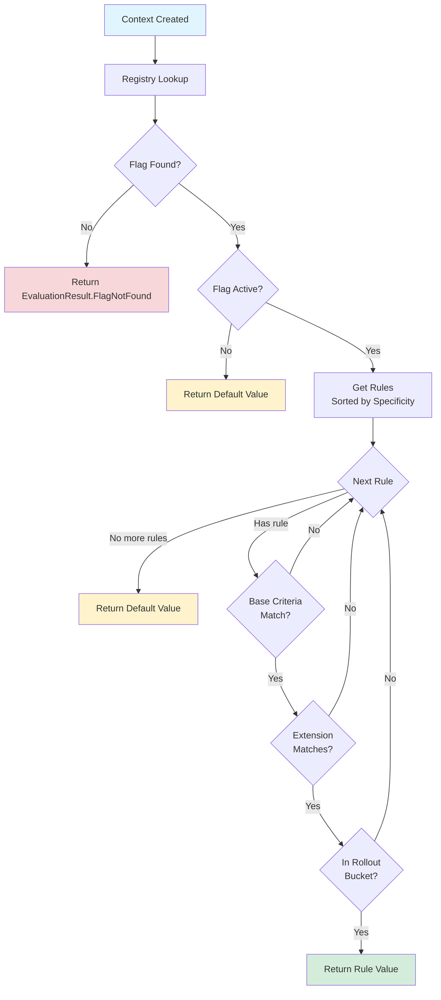
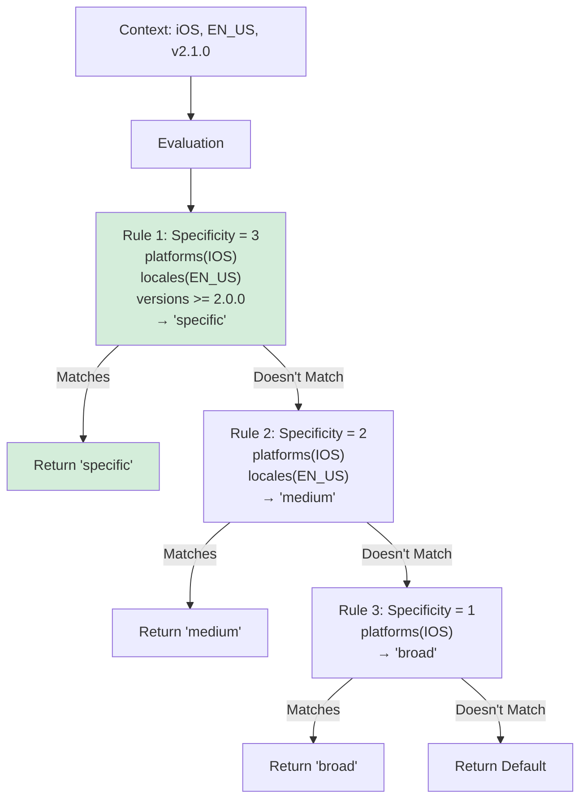

# Evaluation: Flag Evaluation Mechanics

This document explains how Konditional evaluates feature flags, from context creation through rule matching to value resolution. Understanding the evaluation flow helps you write effective targeting rules and debug unexpected behavior.

---

## Overview

Feature flag evaluation is the process of determining which value to return for a given context. Konditional's evaluation engine:

- **Deterministic**: Same context always produces same value
- **Type-safe**: Returns exactly the declared type, never null
- **Lock-free**: Multiple threads can evaluate concurrently without contention
- **Fast**: O(n) complexity where n = number of rules (typically < 10)

The evaluation process follows a precise flow: context validation → registry lookup → flag activity check → rule matching → rollout bucketing → value resolution.

---

## Evaluation Methods

Konditional provides four evaluation methods, each with different error handling semantics. Choose based on your application's needs.

### evaluateSafe() - Explicit Error Handling

**Recommended for most use cases.** Returns a typed result that distinguishes between success, flag not found, and evaluation errors:

```kotlin
val result: EvaluationResult<Boolean> = context.evaluateSafe(AppFeatures.DARK_MODE)

when (result) {
    is EvaluationResult.Success -> {
        val value: Boolean = result.value
        applyDarkMode(value)
    }
    is EvaluationResult.FlagNotFound -> {
        logWarning("Flag not registered: ${result.key}")
        applyDarkMode(false)  // Fallback
    }
    is EvaluationResult.EvaluationError -> {
        logError("Evaluation failed for ${result.key}", result.error)
        applyDarkMode(false)  // Fallback
    }
}
```

**Benefits:**
- Explicit error handling without exceptions
- Distinguish between "flag not found" and "evaluation error"
- Type-safe pattern matching
- Easy to adapt to custom error types via `fold()`

**Use when:**
- You need to handle different error cases differently
- You're building production systems with robust error handling
- You want explicit control over failure behavior

### evaluateOrNull() - Nullable Fallback

Returns the value on success, null on any failure:

```kotlin
val darkMode: Boolean? = context.evaluateOrNull(AppFeatures.DARK_MODE)

if (darkMode != null) {
    applyDarkMode(darkMode)
} else {
    // Flag not found or evaluation failed
    applyDarkMode(false)
}

// Or use safe call operator
context.evaluateOrNull(AppFeatures.DARK_MODE)?.let { applyDarkMode(it) }
```

**Use when:**
- You don't need to distinguish between error types
- Null is an acceptable fallback
- You're working in nullable-friendly contexts

### evaluateOrDefault() - Default Value Fallback

Returns the value on success, a provided default on any failure:

```kotlin
val darkMode: Boolean = context.evaluateOrDefault(
    key = AppFeatures.DARK_MODE,
    default = false
)

applyDarkMode(darkMode)  // Always non-null
```

**Benefits:**
- Simplest API - no error handling needed
- Non-null return guaranteed
- Explicit default value documents expected fallback

**Use when:**
- You have a sensible default value
- You don't need error details
- You want the most concise API

### evaluateOrThrow() - Exception-Based

Returns the value on success, throws exception on failure:

```kotlin
try {
    val darkMode: Boolean = context.evaluateOrThrow(AppFeatures.DARK_MODE)
    applyDarkMode(darkMode)
} catch (e: FlagNotFoundException) {
    logError("Flag not registered", e)
} catch (e: FlagEvaluationException) {
    logError("Evaluation failed", e)
}
```

**Throws:**
- `FlagNotFoundException` - Flag not registered
- `FlagEvaluationException` - Evaluation error (wraps underlying exception)

**Use sparingly!** Prefer `evaluateSafe()` for explicit error handling.

**Use when:**
- Flag not existing is a programmer error (should never happen in production)
- You're in an exception-based codebase
- You want fail-fast behavior during development

---

## Evaluation Flow

The evaluation process follows a deterministic sequence of steps:



### Step-by-Step Breakdown

**1. Registry Lookup**

```kotlin
val flag = key.module.featureFlag(key)
if (flag == null) {
    return EvaluationResult.FlagNotFound(key.key)
}
```

The flag must be registered in the correct namespace's registry. Cross-namespace lookups will not find the flag.

**2. Flag Activity Check**

```kotlin
if (!flag.isActive) {
    return defaultValue
}
```

Inactive flags always return the default value, regardless of rules. This provides a kill switch for flags.

**3. Rule Iteration (by Specificity)**

Rules are pre-sorted by specificity (highest first). Evaluation iterates in specificity order:

```kotlin
for (conditionalValue in rulesSortedBySpecificity) {
    if (ruleMatches(conditionalValue.rule, context)) {
        return conditionalValue.value  // First match wins
    }
}
```

**4. Base Criteria Matching**

All base criteria must match (AND logic):

```kotlin
// Platform check (if specified)
if (rule.platforms.isNotEmpty() && context.platform !in rule.platforms) {
    return false  // Skip this rule
}

// Locale check (if specified)
if (rule.locales.isNotEmpty() && context.locale !in rule.locales) {
    return false  // Skip this rule
}

// Version check (if specified)
if (!rule.versionRange.contains(context.appVersion)) {
    return false  // Skip this rule
}
```

Empty constraint sets match everything (e.g., no platforms specified = all platforms match).

**5. Extension Matching**

If the rule has custom extension logic, it must also match:

```kotlin
if (!rule.extension.matches(context)) {
    return false  // Skip this rule
}
```

**6. Rollout Bucketing**

Finally, the context must fall into the rollout bucket:

```kotlin
if (!isInRolloutBucket(context.stableId, rollout)) {
    return false  // Skip this rule
}
```

**7. Value Resolution**

If all checks pass, return the rule's value. Otherwise, continue to next rule or return default.

---

## Rule Matching Logic

Rules use **AND logic** - all specified criteria must match for the rule to match.

### Base Matching

Standard targeting criteria from `BaseEvaluable`:

```kotlin
rule {
    platforms(Platform.IOS, Platform.ANDROID)  // Must be iOS OR Android
    locales(AppLocale.EN_US, AppLocale.EN_CA)  // AND English (US or Canada)
    versions {
        min(2, 0, 0)  // AND version >= 2.0.0
    }
}.returns(true)
```

**Constraint behavior:**
- **Empty set**: Matches all (e.g., no platforms = all platforms)
- **Non-empty set**: Context value must be in set (OR within the set)
- **Multiple constraints**: All constraints must match (AND across constraints)

### Extension Matching

Custom targeting logic via `Evaluable`:

```kotlin
rule {
    platforms(Platform.WEB)  // Base: must be web
    extension {              // AND extension must match
        object : Evaluable<EnterpriseContext>() {
            override fun matches(context: EnterpriseContext): Boolean =
                context.subscriptionTier == SubscriptionTier.ENTERPRISE &&
                context.organizationId.startsWith("partner-")

            override fun specificity(): Int = 2  // Two constraints
        }
    }
}.returns(premiumValue)
```

**Both must match:** Base criteria AND extension logic.

### Rollout Matching

After all criteria match, rollout determines final eligibility:

```kotlin
rule {
    platforms(Platform.IOS)  // Must match
    locales(AppLocale.EN_US) // Must match
    rollout = Rollout.of(25.0)  // AND must be in 25% bucket
}.returns(true)
```

Rollout is evaluated last (after all other criteria) to avoid unnecessary bucketing computation.

---

## Specificity Ordering

Rules are automatically sorted by **specificity** (most specific first). When multiple rules match, the highest-specificity rule wins.

### Specificity Calculation

```kotlin
specificity = baseSpecificity + extensionSpecificity
```

**Base specificity** (0-3):
- Platform constraint: +1
- Locale constraint: +1
- Version constraint: +1

**Extension specificity**: Value returned by `extension.specificity()`

### Specificity Examples

```kotlin
// Specificity = 0 (no constraints)
rule {
    rollout = Rollout.MAX
}.returns(defaultValue)

// Specificity = 1 (platform only)
rule {
    platforms(Platform.IOS)
}.returns(iosValue)

// Specificity = 2 (platform + locale)
rule {
    platforms(Platform.IOS)
    locales(AppLocale.EN_US)
}.returns(iosEnglishValue)

// Specificity = 3 (platform + locale + version)
rule {
    platforms(Platform.IOS)
    locales(AppLocale.EN_US)
    versions { min(2, 0, 0) }
}.returns(iosEnglishV2Value)

// Specificity = 4 (platform + locale + version + extension)
rule {
    platforms(Platform.IOS)
    locales(AppLocale.EN_US)
    versions { min(2, 0, 0) }
    extension {
        object : Evaluable<Context>() {
            override fun matches(context: Context) = true
            override fun specificity() = 1  // +1 to total
        }
    }
}.returns(verySpecificValue)
```

### Evaluation Order Visualization



**Key insight:** More specific rules are tried first, ensuring precise targeting overrides general targeting.

---

## Rollout Bucketing Algorithm

Rollout bucketing determines which percentage of users see a feature. Konditional uses SHA-256-based hashing for deterministic, stable bucketing.

### Algorithm

```kotlin
fun bucket(flagKey: String, stableId: StableId, salt: String): Int {
    // 1. Create hash input
    val input = "$salt:$flagKey:${stableId.id}"

    // 2. SHA-256 hash
    val hash: ByteArray = SHA256(input.toBytes())

    // 3. Take first 4 bytes as 32-bit integer
    val intValue: Int = (
        (hash[0] & 0xFF) << 24 |
        (hash[1] & 0xFF) << 16 |
        (hash[2] & 0xFF) << 8  |
        (hash[3] & 0xFF)
    )

    // 4. Modulo 10,000 for 0.01% granularity
    return intValue % 10_000  // 0-9999
}

fun isInRollout(bucket: Int, rollout: Rollout): Boolean {
    val threshold = (rollout.value * 100).roundToInt()  // 25.0 → 2500
    return bucket < threshold
}
```

### Bucketing Properties

**Deterministic**

Same inputs always produce same bucket:

```kotlin
val user1 = StableId.of("abc123")
bucket("dark_mode", user1, "v1")  // Always returns same value (e.g., 4234)
bucket("dark_mode", user1, "v1")  // 4234 again
bucket("dark_mode", user1, "v1")  // 4234 again
```

**Independent per Flag**

Each flag has its own bucketing space:

```kotlin
val user = StableId.of("abc123")
bucket("dark_mode", user, "v1")      // 4234 → In 50% rollout ✓
bucket("new_checkout", user, "v1")   // 7821 → NOT in 50% rollout ✗
```

Same user can be in different buckets for different flags.

**Salt-Dependent**

Changing salt redistributes users:

```kotlin
val user = StableId.of("abc123")
bucket("dark_mode", user, "v1")  // 4234 → In 50% rollout ✓
bucket("dark_mode", user, "v2")  // 1256 → Still in 50% rollout ✓
bucket("dark_mode", user, "v2")  // 1256 (deterministic with new salt)
```

Use salt changes to:
- Reset A/B tests
- Fix biased distributions
- Run new experiments on the same flag

**Platform-Stable**

SHA-256 produces identical results across platforms:
- JVM (Java 17+)
- Android
- Kotlin/Native (iOS, Desktop)
- Kotlin/JS (Web)

Same user gets same experience everywhere.

### Granularity

Bucketing uses 0-9999 range (10,000 buckets), providing **0.01% granularity**:

```kotlin
Rollout.of(0.01)   // 1 in 10,000 users
Rollout.of(0.5)    // 50 in 10,000 users
Rollout.of(1.0)    // 100 in 10,000 users (1%)
Rollout.of(25.0)   // 2,500 in 10,000 users (25%)
Rollout.of(50.0)   // 5,000 in 10,000 users (50%)
Rollout.of(100.0)  // All users (no bucketing check)
```

### Edge Cases

**0% Rollout**

```kotlin
Rollout.of(0.0)  // No users match (short-circuits bucketing)
```

Evaluation skips bucketing computation and returns false immediately.

**100% Rollout**

```kotlin
Rollout.MAX  // All users match (short-circuits bucketing)
```

Evaluation skips bucketing computation and returns true immediately.

---

## Type Safety Guarantees

Konditional's type system ensures correct types at every stage of evaluation.

### Compile-Time Type Safety

**Value type enforcement:**

```kotlin
object AppFeatures : FeatureContainer<Namespace.Global>(Namespace.Global) {
    val DARK_MODE by boolean(default = false)
}

// Compiler infers return type
val darkMode: Boolean = context.evaluateOrDefault(AppFeatures.DARK_MODE, default = false)
//            ↑ Type guaranteed by AppFeatures.DARK_MODE's type parameter

// Compile error: type mismatch
val darkMode: String = context.evaluateOrDefault(AppFeatures.DARK_MODE, default = false)
//            ✗ Type error: Required Boolean, found String
```

**Context type enforcement:**

```kotlin
data class EnterpriseContext(
    override val locale: AppLocale,
    override val platform: Platform,
    override val appVersion: Version,
    override val stableId: StableId,
    val subscriptionTier: SubscriptionTier
) : Context

object PremiumFeatures : FeatureContainer<Namespace.Payments>(
    Namespace.Payments
) {
    // This feature requires EnterpriseContext
    val DATA_EXPORT by boolean(default = false)
}

val basicContext: Context = Context(...)
// Type error: EnterpriseContext required
basicContext.evaluateOrDefault(PremiumFeatures.DATA_EXPORT, false)  // ✗

val enterpriseContext: EnterpriseContext = EnterpriseContext(...)
enterpriseContext.evaluateOrDefault(PremiumFeatures.DATA_EXPORT, false)  // ✓
```

### Runtime Type Safety

**Non-null guarantees:**

```kotlin
// evaluateOrDefault() always returns T, never null
val value: Boolean = context.evaluateOrDefault(AppFeatures.DARK_MODE, false)  // Never null

// evaluateSafe() wraps value in Success, never null
when (val result = context.evaluateSafe(AppFeatures.DARK_MODE)) {
    is EvaluationResult.Success -> {
        val value: Boolean = result.value  // Never null
    }
    // ...
}
```

**No type coercion:**

Traditional systems allow runtime type errors:

```kotlin
// String-based system
config.set("retries", "not a number")  // ✓ Compiles
val retries: Int = config.getInt("retries")  // 💣 Runtime error or default
```

Konditional makes this impossible:

```kotlin
object AppConfig : FeatureContainer<Namespace.Global>(Namespace.Global) {
    val RETRIES by int(default = 3)
}

// ✗ Compile error: Required Int, found String
val RETRIES by int(default = "not a number")
```

---

## Performance Characteristics

### Time Complexity

**Evaluation**: O(n) where n = number of rules per flag

```kotlin
// Worst case: iterate all rules
for (rule in rulesSortedBySpecificity) {  // O(n)
    if (matches(rule)) {  // O(1) per rule
        return rule.value
    }
}
```

Typical flags have 1-5 rules, so evaluation is effectively O(1) in practice.

**Registry lookup**: O(1) hash table lookup

**Rollout bucketing**: O(1) SHA-256 hash + modulo

**Total**: O(n) where n is typically < 10

### Space Complexity

**Zero allocations during evaluation**

All data structures are pre-allocated and immutable:
- Rules sorted once at configuration time
- No intermediate objects created
- No string concatenation (except for bucketing hash input)

**Memory footprint per flag**: ~200-500 bytes

- FlagDefinition overhead: ~100 bytes
- Per-rule overhead: ~50-100 bytes
- Strings (key, notes): variable

### Concurrency Performance

**Lock-free reads**: No synchronization required

```kotlin
// Multiple threads evaluating concurrently
thread1: context.evaluateOrDefault(AppFeatures.DARK_MODE, false)  // No lock
thread2: context.evaluateOrDefault(AppFeatures.DARK_MODE, false)  // No lock
thread3: context.evaluateOrDefault(AppFeatures.DARK_MODE, false)  // No lock
```

**Atomic updates**: Registry updates use `AtomicReference`

```kotlin
// Update sees either old or new configuration atomically
Namespace.Global.load(newKonfig)  // Atomic swap
```

**Scalability**: Evaluation throughput scales linearly with CPU cores (no contention).

---

## Thread Safety

Konditional is designed for concurrent access without locks.

### Lock-Free Reads

Flag evaluation requires no synchronization:

```kotlin
// Safe concurrent evaluation
val threads = (1..100).map { threadId ->
    thread {
        repeat(1000) {
            val value = context.evaluateOrDefault(AppFeatures.DARK_MODE, false)
            processValue(value)
        }
    }
}
threads.forEach { it.join() }
```

**How it works:**
- Immutable data structures (`FlagDefinition`, `Konfig`)
- AtomicReference for registry snapshot
- Readers see consistent snapshot (old or new, never partial)

### Atomic Updates

Registry updates are atomic:

```kotlin
// Thread 1: Updating configuration
Namespace.Global.load(newKonfig)  // Atomic swap

// Thread 2: Reading during update
val value = context.evaluateOrDefault(AppFeatures.DARK_MODE, false)  // Sees old OR new, never mixed
```

**Guarantees:**
- Updates are atomic (all-or-nothing)
- Readers never see partial updates
- No torn reads

### Independent Evaluations

Each evaluation is stateless:

```kotlin
// No shared mutable state
fun evaluateOrDefault(key: Feature, default: T): T {
    // Only reads from immutable data structures
    // No writes, no locks, no shared state
    return flag.evaluate(context) ?: default
}
```

**Benefits:**
- No race conditions
- No deadlocks
- Predictable performance

---

## Testing Evaluation

### Unit Testing Rules

Test that rules evaluate correctly for different contexts:

```kotlin
@Test
fun `iOS users in EN_US locale get dark mode`() {
    // Arrange
    val context = Context(
        locale = AppLocale.EN_US,
        platform = Platform.IOS,
        appVersion = Version.parse("2.1.0"),
        stableId = StableId.of("test-user")
    )

    // Act
    val result = context.evaluateSafe(AppFeatures.DARK_MODE)

    // Assert
    assertTrue(result is EvaluationResult.Success && result.value == true)
}

@Test
fun `Android users get default value`() {
    val context = Context(
        locale = AppLocale.EN_US,
        platform = Platform.ANDROID,
        appVersion = Version.parse("2.1.0"),
        stableId = StableId.of("test-user")
    )

    val result = context.evaluateSafe(AppFeatures.DARK_MODE)

    assertTrue(result is EvaluationResult.Success && result.value == false)
}
```

### Testing Rollouts

Test rollout distribution over many users:

```kotlin
@Test
fun `50 percent rollout distributes correctly`() {
    // Test over many users
    val sampleSize = 10_000
    val enabledCount = (0 until sampleSize).count { i ->
        val context = Context(
            locale = AppLocale.EN_US,
            platform = Platform.IOS,
            appVersion = Version.parse("1.0.0"),
            stableId = StableId.of("user-$i")
        )
        context.evaluateOrDefault(AppFeatures.ROLLOUT_FLAG, default = false)
    }

    // Assert approximately 50% (allow 2% variance)
    val percentage = (enabledCount.toDouble() / sampleSize) * 100
    assertTrue(percentage in 48.0..52.0, "Got $percentage%, expected ~50%")
}
```

### Testing Determinism

Verify same context always returns same value:

```kotlin
@Test
fun `evaluation is deterministic`() {
    val context = Context(
        locale = AppLocale.EN_US,
        platform = Platform.IOS,
        appVersion = Version.parse("2.1.0"),
        stableId = StableId.of("user-123")
    )

    // Evaluate many times
    val results = (1..100).map {
        context.evaluateOrDefault(AppFeatures.DARK_MODE, default = false)
    }

    // All results must be identical
    assertTrue(results.distinct().size == 1, "Non-deterministic evaluation")
}
```

### Testing Specificity Order

Verify higher specificity rules take precedence:

```kotlin
@Test
fun `more specific rules override general rules`() {
    object TestFeatures : FeatureContainer<Namespace.Global>(Namespace.Global) {
        val VALUE by string(default = "default") {
            // Specificity = 1 (general)
            rule {
                platforms(Platform.IOS)
            } returns "ios-general"

            // Specificity = 2 (specific)
            rule {
                platforms(Platform.IOS)
                locales(AppLocale.EN_US)
            } returns "ios-english-specific"
        }
    }

    // Context matches both rules
    val context = Context(
        locale = AppLocale.EN_US,
        platform = Platform.IOS,
        appVersion = Version.parse("1.0.0"),
        stableId = StableId.of("user-123")
    )

    // Higher specificity wins
    val result = context.evaluateOrDefault(TestFeatures.VALUE, default = "")
    assertEquals("ios-english-specific", result)
}
```

---

## Best Practices

### Choose the Right Evaluation Method

**For production code:**
```kotlin
// Use evaluateSafe for explicit error handling
when (val result = context.evaluateSafe(AppFeatures.DARK_MODE)) {
    is EvaluationResult.Success -> process(result.value)
    is EvaluationResult.FlagNotFound -> logWarning("Flag not found")
    is EvaluationResult.EvaluationError -> logError("Evaluation failed", result.error)
}
```

**For simple cases:**
```kotlin
// Use evaluateOrDefault for concise code with sensible defaults
val enabled = context.evaluateOrDefault(AppFeatures.DARK_MODE, default = false)
```

**Avoid evaluateOrThrow** unless flag not existing is a programmer error.

### Keep Rule Count Low

Each flag iterates rules until match. Keep rules minimal:

```kotlin
// ✓ Good: 2-3 rules
val FEATURE by boolean(default = false) {
    rule { platforms(Platform.IOS) } returns true
    rule { versions { min(2, 0, 0) } } returns true
}

// ✗ Avoid: Too many rules
val FEATURE by boolean(default = false) {
    // 20+ rules = slower evaluation
}
```

If you have many rules, consider redesigning with custom context fields and extension logic.

### Use Specificity to Your Advantage

Write rules from most to least specific. While Konditional sorts automatically, this mental model makes configurations clearer:

```kotlin
val VALUE by string(default = "default") {
    // Most specific (evaluated first)
    rule {
        platforms(Platform.IOS)
        locales(AppLocale.EN_US)
        versions { min(2, 0, 0) }
    } returns "ios-en-v2"

    // Less specific (evaluated second)
    rule {
        platforms(Platform.IOS)
    } returns "ios-all"
}
```

### Cache Contexts When Possible

Creating contexts is cheap, but reusing them is cheaper:

```kotlin
// ✓ Good: Create once, reuse for multiple evaluations
val context = createUserContext(user)
val darkMode = context.evaluateOrDefault(AppFeatures.DARK_MODE, false)
val apiEndpoint = context.evaluateOrDefault(AppConfig.API_ENDPOINT, "default")
val maxRetries = context.evaluateOrDefault(AppConfig.MAX_RETRIES, 3)

// ✗ Avoid: Recreating context for each evaluation
createUserContext(user).evaluateOrDefault(AppFeatures.DARK_MODE, false)
createUserContext(user).evaluateOrDefault(AppConfig.API_ENDPOINT, "default")
createUserContext(user).evaluateOrDefault(AppConfig.MAX_RETRIES, 3)
```

### Test Rollout Distributions

When using rollouts, verify distribution over sample population:

```kotlin
@Test
fun `rollout distribution is balanced`() {
    val sampleSize = 5000
    val enabledCount = (0 until sampleSize).count { i ->
        val ctx = Context(
            locale = AppLocale.EN_US,
            platform = Platform.IOS,
            appVersion = Version.parse("1.0.0"),
            stableId = StableId.of("user-$i")
        )
        ctx.evaluateOrDefault(AppFeatures.ROLLOUT_FLAG, false)
    }

    val percentage = (enabledCount.toDouble() / sampleSize) * 100
    // Expected 25%, allow 2% variance
    assertTrue(percentage in 23.0..27.0)
}
```

### Document Complex Rules

Use `note()` to explain non-obvious targeting:

```kotlin
rule {
    platforms(Platform.IOS)
    rollout = Rollout.of(15.0)
    note("Targeting high-value iOS users - approved by PM on 2024-01-15")
} returns true
```

Notes appear in serialized JSON and help with debugging.

---

## Examples

### Example 1: Simple Boolean Flag

```kotlin
object AppFeatures : FeatureContainer<Namespace.Global>(Namespace.Global) {
    val DARK_MODE by boolean(default = false) {
        rule {
            platforms(Platform.IOS, Platform.ANDROID)
            rollout = Rollout.of(50.0)
        } returns true
    }
}

// Evaluation
val context = Context(
    locale = AppLocale.EN_US,
    platform = Platform.IOS,
    appVersion = Version.parse("2.1.0"),
    stableId = StableId.of("user-abc123")
)

val isDarkMode = context.evaluateOrDefault(AppFeatures.DARK_MODE, default = false)

if (isDarkMode) {
    applyDarkTheme()
} else {
    applyLightTheme()
}
```

### Example 2: Multi-Rule Configuration

```kotlin
object ApiConfig : FeatureContainer<Namespace.Global>(Namespace.Global) {
    val ENDPOINT by string(default = "https://api.prod.example.com") {
        // Specificity = 2: iOS + version
        rule {
            platforms(Platform.IOS)
            versions { min(3, 0, 0) }
        } returns "https://api-v3-ios.example.com"

        // Specificity = 1: iOS only
        rule {
            platforms(Platform.IOS)
        } returns "https://api-ios.example.com"

        // Specificity = 1: Android only
        rule {
            platforms(Platform.ANDROID)
        } returns "https://api-android.example.com"
    }
}

// iOS v3.0.0 → "https://api-v3-ios.example.com" (highest specificity)
// iOS v2.0.0 → "https://api-ios.example.com" (medium specificity)
// Android → "https://api-android.example.com" (medium specificity)
// Web → "https://api.prod.example.com" (default)
```

### Example 3: Gradual Rollout Strategy

```kotlin
object NewFeatures : FeatureContainer<Namespace.Global>(Namespace.Global) {
    val NEW_CHECKOUT by boolean(default = false) {
        salt("v1")  // Change to redistribute users

        rule {
            platforms(Platform.ANDROID)
            rollout = Rollout.of(10.0)  // Start with 10%
            note("Phase 1: Initial Android rollout")
        } returns true
    }
}

// Phase 1: 10% of Android users
// Monitor metrics, then increase:

object NewFeatures : FeatureContainer<Namespace.Global>(Namespace.Global) {
    val NEW_CHECKOUT by boolean(default = false) {
        salt("v1")

        rule {
            platforms(Platform.ANDROID)
            rollout = Rollout.of(50.0)  // Increased to 50%
            note("Phase 2: Expanded Android rollout")
        } returns true
    }
}

// Phase 2: 50% of Android users
// Users in initial 10% stay enabled (deterministic bucketing)
```

### Example 4: Custom Context Extension

```kotlin
data class EnterpriseContext(
    override val locale: AppLocale,
    override val platform: Platform,
    override val appVersion: Version,
    override val stableId: StableId,
    val subscriptionTier: SubscriptionTier,
    val organizationId: String,
) : Context

enum class SubscriptionTier { FREE, PROFESSIONAL, ENTERPRISE }

object PremiumFeatures : FeatureContainer<Namespace.Payments>(
    Namespace.Payments
) {
    val DATA_EXPORT by boolean(default = false) {
        rule {
            platforms(Platform.WEB)
            extension {
                object : Evaluable<EnterpriseContext>() {
                    override fun matches(context: EnterpriseContext): Boolean =
                        context.subscriptionTier == SubscriptionTier.ENTERPRISE

                    override fun specificity(): Int = 1
                }
            }
        } returns true
    }
}

// Evaluation
val context = EnterpriseContext(
    locale = AppLocale.EN_US,
    platform = Platform.WEB,
    appVersion = Version.parse("1.0.0"),
    stableId = StableId.of("user-123"),
    subscriptionTier = SubscriptionTier.ENTERPRISE,
    organizationId = "acme-corp"
)

val canExport = context.evaluateOrDefault(PremiumFeatures.DATA_EXPORT, default = false)
```

### Example 5: A/B Testing

```kotlin
object Experiments : FeatureContainer<Namespace.Global>(Namespace.Global) {
    val RECOMMENDATION_ALGORITHM by string(default = "collaborative") {
        salt("experiment-2024-01")  // Unique salt for this experiment

        rule {
            rollout = Rollout.of(50.0)  // 50/50 split
            note("A/B test: collaborative vs content-based recommendations")
        } returns "content-based"
    }
}

// 50% of users get "collaborative" (default)
// 50% of users get "content-based" (rule)
// Assignment is stable per user across sessions
```

---

## Summary: Evaluation Guarantees

| Aspect            | Guarantee                                                     |
|-------------------|---------------------------------------------------------------|
| **Type safety**   | Return type matches flag definition, enforced at compile time |
| **Determinism**   | Same inputs always produce same output                        |
| **Specificity**   | Most specific matching rule always wins                       |
| **Bucketing**     | SHA-256 ensures independent, stable buckets per flag          |
| **Performance**   | O(n) where n = rules per flag (typically < 10)                |
| **Thread safety** | Lock-free reads, immutable data                               |
| **Null safety**   | Never returns null, default value guaranteed                  |

**Core Principle:** Evaluation is deterministic, type-safe, and performant.

---

## Next Steps

- **[Results](Results.md)** - Deep dive into EvaluationResult and error handling patterns
- **[Rules](Rules.md)** - Master advanced targeting and custom evaluables
- **[Context](Context.md)** - Design custom contexts for business logic
- **[Configuration](Configuration.md)** - Complete DSL reference
- **[Registry](Registry.md)** - Namespace and concurrency management
- **[Overview](index.md)** - Back to API overview
