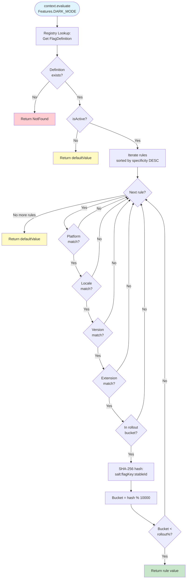
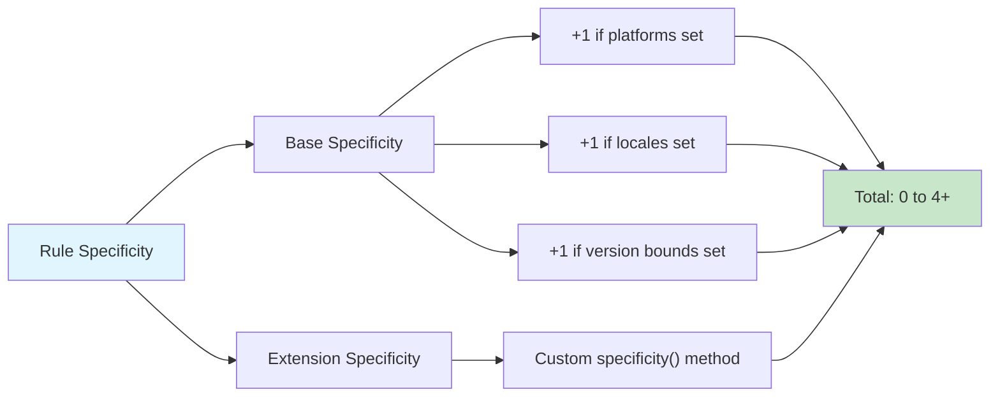
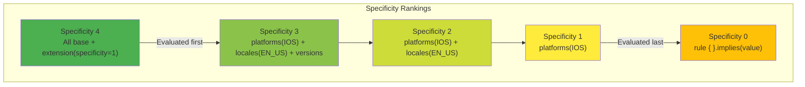
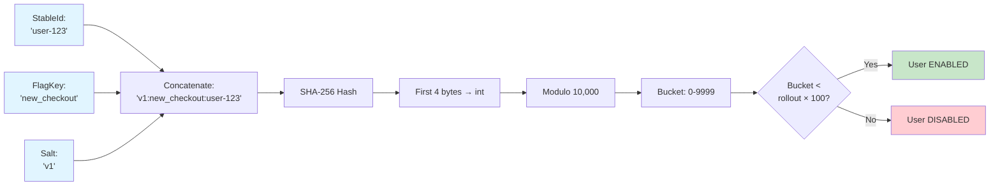

# Evaluation: Deterministic Flag Resolution

This document explains how Konditional evaluates flags, including rule matching, specificity ordering, and rollout
bucketing.

---

## The Evaluation Flow



---

## Rule Matching

For a rule to match, **all criteria must be true** (AND logic):

```kotlin
config {
    Features.PREMIUM_EXPORT with {
        default(false)
        rule {
            platforms(Platform.IOS)           // Must be iOS
            versions { min(2, 0, 0) }         // AND version >= 2.0.0
            rollout = Rollout.of(50.0)        // AND in 50% bucket
        }.implies(true)
    }
}

// Match requires ALL conditions
val context = AppContext(
    platform = Platform.IOS,        // ✓
    appVersion = Version(2, 1, 0),  // ✓
    stableId = StableId.of("user-123")
)
context.evaluate(Features.PREMIUM_EXPORT)  // true (if in bucket)
```

### Matching Rules

**Platform:** `context.platform in platforms` (empty = all match)
**Locale:** `context.locale in locales` (empty = all match)
**Version:** `context.appVersion in [min, max)` (empty = all match)
**Extension:** Custom `Evaluable` with business logic

```kotlin
// Combined matching
rule {
    platforms(Platform.IOS)
    versions { min(2, 0, 0); max(3, 0, 0) }  // [2.0.0, 3.0.0)
    extension {
        object : Evaluable<AppContext>() {
            override fun matches(context: AppContext): Boolean =
                context.subscriptionTier == SubscriptionTier.ENTERPRISE
            override fun specificity(): Int = 1
        }
    }
}.implies(value)
// Matches if: iOS AND version in range AND enterprise tier
```

---

## Specificity Ordering

When multiple rules match, **the most specific rule wins**. Rules are sorted by specificity (DESC), then by note text for tie-breaking.

### Specificity Calculation



**Formula:** `specificity = (platforms ? 1 : 0) + (locales ? 1 : 0) + (versions ? 1 : 0) + extension.specificity()`

### Ordering Examples



### Example with Sorting

```kotlin
config {
    Features.THEME with {
        default("light")

        rule { platforms(Platform.IOS) }.implies("dark-ios")              // Specificity: 1
        rule {
            platforms(Platform.IOS)
            locales(AppLocale.EN_US)
        }.implies("dark-us-ios")                                           // Specificity: 2
    }
}

val context = basicContext(platform = Platform.IOS, locale = AppLocale.EN_US)
context.evaluate(Features.THEME)  // "dark-us-ios" (more specific wins)
```

**Tie-breaking:** If specificities match, rules are sorted by `note` text alphabetically.

**Performance:** Rules sorted once at configuration time; evaluation is O(n) where n < 10 typically.

---

## Rollout Bucketing

Konditional uses **SHA-256 hashing** for deterministic, independent bucketing per flag.

### Bucketing Algorithm



```kotlin
fun stableBucket(flagKey: String, stableId: StableId, salt: String): Int {
    val hash = SHA256("$salt:$flagKey:${stableId.id}")
    return hash.take(4).toInt() % 10_000  // 0-9999 (0.01% granularity)
}

fun isInEligibleSegment(bucket: Int, rollout: Rollout): Boolean {
    if (rollout <= 0.0) return false
    if (rollout >= 100.0) return true
    return bucket < (rollout.value * 100).toInt()
}
```

### Key Properties

| Property            | Benefit                                                  |
|---------------------|----------------------------------------------------------|
| **Deterministic**   | Same inputs → same bucket (always)                       |
| **Independent**     | Each flag has separate bucketing space                   |
| **Platform-Stable** | Same bucket across JVM, Android, iOS, web                |
| **Fine-Grained**    | 0.01% granularity (0-9999 bucket range)                  |
| **Redistributable** | Change salt to reassign buckets without code deployment  |

```kotlin
// Deterministic: Always same result
val context = basicContext(stableId = StableId.of("user-123"))
context.evaluate(Features.NEW_CHECKOUT)  // true
context.evaluate(Features.NEW_CHECKOUT)  // true (always)

// Independent: Different flags have different buckets
SHA256("v1:feature_a:user-123")  // Bucket for feature A
SHA256("v1:feature_b:user-123")  // Bucket for feature B (independent)

// Redistributable: Change salt to reassign
config { Features.X with { salt("v1") }}  // Original bucketing
config { Features.X with { salt("v2") }}  // New bucket assignments
```

---

## Type Safety Guarantees

| Guarantee           | String-Based (Runtime Error)              | Konditional (Compile-Time Safe)           |
|---------------------|-------------------------------------------|-------------------------------------------|
| **Non-null result** | `value as Boolean` may throw              | Default value required                    |
| **Correct type**    | ClassCastException possible               | Generic type enforced                     |
| **Correct context** | Missing fields fail at runtime            | Context type parameter enforced           |
| **Deterministic**   | hashCode() varies by platform             | SHA-256 bucketing, sorted rules           |
| **Thread-safe**     | Requires locks                            | Lock-free reads, immutable data           |

```kotlin
// Type-safe evaluation
val enabled: Boolean = context.evaluate(Features.DARK_MODE)
//          ↑ Non-null    ↑ Type-checked   ↑ Enum member   ↑ Context enforced
```

---

## Evaluation Performance

**Complexity:** O(1) lookup + O(n) matching + O(1) bucketing = **O(n)** where n = rules per flag (typically < 10)

| Operation       | Time       | Details                                      |
|-----------------|------------|----------------------------------------------|
| **Lookup**      | O(1)       | HashMap lookup by feature key                |
| **Matching**    | O(n)       | Iterate pre-sorted rules until first match   |
| **Bucketing**   | O(1)       | SHA-256 hash computation (fixed-length)      |
| **Memory**      | Zero alloc | Immutable, pre-allocated data structures     |

**Characteristics:** Lock-free reads, predictable latency, cache-friendly sequential access

---

## Testing Evaluation

```kotlin
// Test specificity ordering
@Test
fun `most specific rule wins`() {
    config(registry) {
        Features.THEME with {
            default("light")
            rule { platforms(Platform.IOS) }.implies("dark-ios")              // Specificity: 1
            rule { platforms(Platform.IOS); locales(AppLocale.EN_US) }.implies("dark-us-ios")  // Specificity: 2
        }
    }

    val context = basicContext(platform = Platform.IOS, locale = AppLocale.EN_US)
    assertEquals("dark-us-ios", context.evaluate(Features.THEME))  // Most specific wins
}

// Test deterministic bucketing
@Test
fun `rollout bucketing is deterministic`() {
    config(registry) {
        Features.NEW_CHECKOUT with {
            default(false)
            rule { rollout = Rollout.of(50.0) }.implies(true)
        }
    }

    val context = basicContext(stableId = StableId.of("user-123"))
    val result1 = context.evaluate(Features.NEW_CHECKOUT)
    val result2 = context.evaluate(Features.NEW_CHECKOUT)
    assertEquals(result1, result2)  // Always same result
}

// Test rollout distribution
@Test
fun `rollout percentage approximate`() {
    val enabled = (1..1000).count { i ->
        basicContext(stableId = StableId.of("user-$i")).evaluate(Features.NEW_CHECKOUT)
    }
    assertTrue(enabled in 450..550)  // ~50% with 10% variance
}
```

---

## Summary: Evaluation Guarantees

| Aspect            | Guarantee                                                     |
|-------------------|---------------------------------------------------------------|
| **Type safety**   | Return type matches flag definition, enforced at compile time |
| **Determinism**   | Same inputs always produce same output                        |
| **Specificity**   | Most specific matching rule always wins                       |
| **Bucketing**     | SHA-256 ensures independent, stable buckets per flag          |
| **Performance**   | O(n) where n = rules per flag (typically < 10)                |
| **Thread safety** | Lock-free reads, immutable data                               |
| **Null safety**   | Never returns null, default value guaranteed                  |

**Core Principle:** Evaluation is deterministic, type-safe, and performant.

---

## Next Steps

- **[Registry and Concurrency](./RegistryAndConcurrency.md)** - Thread safety and atomic updates
- **[Core Concepts](./CoreConcepts.md)** - Back to type system fundamentals
- **[Rules Guide](./Rules.md)** - Advanced rule patterns
- **[Context Guide](./Context.md)** - Design evaluation contexts
