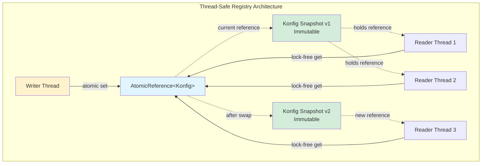

# Registry and Concurrency: Thread-Safe Flag Management

This document explains how Konditional achieves thread-safe configuration management without locks.

---

## The FlagRegistry Interface

### What It Does

`FlagRegistry` is the central storage for all flag configurations:

```kotlin
interface FlagRegistry {
    // Load complete configuration (atomic replacement)
    fun load(config: Konfig)

    // Apply incremental patch
    fun update(patch: KonfigPatch)

    // Update single flag
    fun <S : EncodableValue<T>, T : Any, C : Context, M : Module> update(
        definition: FlagDefinition<S, T, C, M>
    )

    // Read current configuration
    fun konfig(): Konfig

    // Lookup specific flag
    fun <S : EncodableValue<T>, T : Any, C : Context, M : Module> featureFlag(
        key: Feature<S, T, C, M>
    ): FlagDefinition<S, T, C, M>?

    // Read all flags
    fun allFlags(): Map<Feature<*, *, *>, FlagDefinition<*, *, *, *>>
}
```

### Default Implementation

Konditional provides a singleton registry backed by `AtomicReference`:

```kotlin
object FlagRegistry : FlagRegistry by SingletonFlagRegistry

internal class SingletonFlagRegistry : FlagRegistry {
    private val konfigRef = AtomicReference<Konfig>(Konfig.EMPTY)

    override fun load(config: Konfig) {
        konfigRef.set(config)  // Atomic swap
    }

    override fun featureFlag(key: Feature<S, T, C, M>): FlagDefinition<S, T, C, M>? {
        return konfigRef.get().flags[key]  // Lock-free read
    }

    // ... other methods
}
```

---

## Thread Safety Model

### Lock-Free Reads

**Traditional lock-based approach:**

```kotlin
class ConfigService {
    private val lock = ReentrantReadWriteLock()
    private var config: Map<String, Any> = emptyMap()

    fun getBoolean(key: String): Boolean? {
        lock.readLock().lock()  // ⚠️ Contention on reads
        try {
            return config[key] as? Boolean
        } finally {
            lock.readLock().unlock()
        }
    }
}
```

**Problems:** Read contention under high load, writes block all reads, potential deadlocks, performance overhead.

**Konditional's AtomicReference solution:**

```kotlin
class SingletonFlagRegistry : FlagRegistry {
    private val konfigRef = AtomicReference<Konfig>(Konfig.EMPTY)

    override fun featureFlag(key: Feature<S, T, C, M>): FlagDefinition<S, T, C, M>? {
        return konfigRef.get().flags[key]  // Lock-free, no contention
    }

    override fun load(config: Konfig) {
        konfigRef.set(config)  // Atomic swap, doesn't block reads
    }
}
```

**Benefits:**
- Zero lock contention
- Reads never block
- Writes don't block reads
- No deadlock possible
- Hardware-level atomic operations

### Immutable Data Structures

All configuration data is **immutable**:

```kotlin
// Konfig: Immutable snapshot
data class Konfig(
    val flags: Map<Feature<*, *, *>, FlagDefinition<*, *, *, *>>
)

// FlagDefinition: Immutable configuration
data class FlagDefinition<S, T, C, M>(
    val feature: Feature<S, T, C, M>,
    val defaultValue: T,
    val values: List<ConditionalValue<S, T, C, M>>,
    val isActive: Boolean,
    val salt: String
)
```

**Why this matters:**

```kotlin
// Thread A: Reading configuration
val definition = registry.featureFlag(Features.DARK_MODE)
val result = definition?.evaluate(context)

// Thread B: Updating configuration (concurrent)
registry.load(newConfig)

// Thread A's definition reference remains valid
// Sees consistent snapshot (either old or new, never partial)
```

**Guarantee:** Concurrent evaluations see **either old configuration or new configuration**, never a mix.

---

## Atomic Configuration Updates

### Full Config Replacement

```kotlin
val newConfig = config {
    Features.DARK_MODE with { default(false) }
    Features.NEW_CHECKOUT with { default(false) }
}

FlagRegistry.load(newConfig)  // Atomic swap - all flags update together
```

**Properties:** Atomic (all flags update together), consistent (readers see old OR new), lock-free, fast (single memory write).

### Incremental Patching

For remote config updates, use patches:

```kotlin
val patchJson = """
{
  "flags": [
    {
      "key": "dark_mode",
      "default": true,
      "rules": [...]
    }
  ],
  "removeKeys": ["deprecated_flag"]
}
"""

when (val result = SnapshotSerializer.default.deserializeKonfigPatch(patchJson)) {
    is ParseResult.Success -> FlagRegistry.update(result.value)
    is ParseResult.Failure -> logger.error("Patch failed: ${result.error}")
}
```

**Implementation:**

```kotlin
override fun update(patch: KonfigPatch) {
    val current = konfigRef.get()
    val newFlags = current.flags.toMutableMap()
    patch.addOrUpdate.forEach { newFlags[it.feature] = it }
    patch.remove.forEach { newFlags.remove(it) }
    konfigRef.set(Konfig(newFlags.toMap()))  // Atomic swap
}
```

**Properties:** Incremental, atomic, type-safe.

---

## Architecture Overview



**Key Properties:**
- **Lock-free reads:** Multiple threads read simultaneously without contention
- **Immutable snapshots:** Each Konfig is immutable; updates create new snapshots
- **Atomic updates:** Writer swaps reference atomically; readers see old or new (never partial)
- **Consistent views:** Readers holding a reference maintain consistent view even after updates

---

## Concurrency Guarantees

### Read-Read: Always Safe

```kotlin
// Thread A
val result1 = context.evaluate(Features.DARK_MODE)

// Thread B (concurrent)
val result2 = context.evaluate(Features.DARK_MODE)

// Both read from AtomicReference - lock-free, no contention
```

### Read-Write: Safe, Consistent Snapshots

```kotlin
// Thread A: Evaluating
val definition = registry.featureFlag(Features.DARK_MODE)
val result = definition?.evaluate(context)

// Thread B: Updating (concurrent)
FlagRegistry.load(newConfig)

// Thread A's definition remains valid
// Sees complete old config OR complete new config, never mixed
```

### Write-Write: Last Write Wins

```kotlin
// Thread A
FlagRegistry.load(configA)

// Thread B (concurrent)
FlagRegistry.load(configB)

// Last write wins (AtomicReference semantics)
```

**Note:** For complex write coordination, use external synchronization:

```kotlin
synchronized(updateLock) {
    val current = FlagRegistry.konfig()
    val updated = applyBusinessLogic(current)
    FlagRegistry.load(updated)
}
```

---

## Performance Characteristics

### Memory Model

**Konditional uses immutable snapshots:**

```kotlin
private val konfigRef = AtomicReference<Konfig>(...)
konfigRef.set(newKonfig)  // Old snapshot GC'd when no references remain
```

**Benefits:** Structural sharing, predictable GC, no fragmentation.

### Performance Comparison

| Operation          | String-Based (Locks)     | Konditional (Lock-Free) |
|--------------------|--------------------------|-------------------------|
| **Read**           | 50-200 ns (uncontended)  | 5-10 ns                 |
| **Read (contended)** | 500-5000 ns (lock wait) | 5-10 ns (no contention) |
| **Write**          | Blocks all reads         | No impact on reads      |
| **Throughput**     | ~1-10M ops/sec          | ~100M+ ops/sec          |

**Key advantage:** Lock-free reads scale linearly with CPU cores without contention.

---

## Testing Thread Safety

### Concurrent Read-Write Test

```kotlin
@Test
fun `concurrent reads during write are safe`() = runBlocking {
    val registry = FlagRegistry.create()

    config(registry) {
        Features.DARK_MODE with { default(false) }
    }

    val context = basicContext()

    // Launch 1000 concurrent readers
    val readerJobs = (1..1000).map {
        launch(Dispatchers.Default) {
            repeat(100) {
                // Lock-free read
                context.evaluate(Features.DARK_MODE, registry)
            }
        }
    }

    // Concurrent writer
    val writerJob = launch(Dispatchers.Default) {
        repeat(10) {
            // Atomic update
            config(registry) {
                Features.DARK_MODE with { default(true) }
            }
            delay(10)
        }
    }

    // All complete without exceptions or data races
    readerJobs.joinAll()
    writerJob.join()
}
```

**What this tests:**
- Concurrent reads don't block each other
- Writes don't block reads
- No exceptions from race conditions
- Readers see consistent snapshots (old or new, never mixed)

---

## Custom Registry Implementations

### When to Implement Custom Registry

Common use cases:
- Database-backed configuration with persistence
- Distributed cache (Redis, Memcached)
- Multi-tenant registries (per-tenant config)
- Audit logging (track all config changes)

### Example: Database-Backed Registry

```kotlin
class DatabaseBackedRegistry(
    private val database: Database
) : FlagRegistry {

    private val konfigRef = AtomicReference<Konfig>(loadFromDb())

    override fun load(config: Konfig) {
        // Persist to database
        database.transaction {
            deleteAllFlags()
            config.flags.forEach { (feature, definition) ->
                insertFlag(feature, definition)
            }
        }

        // Update in-memory cache atomically
        konfigRef.set(config)
    }

    override fun featureFlag(key: Feature<S, T, C, M>): FlagDefinition<S, T, C, M>? {
        // Read from in-memory cache (lock-free)
        return konfigRef.get().flags[key]
    }

    private fun loadFromDb(): Konfig {
        return database.query {
            val flags = selectAllFlags()
            Konfig(flags.associateBy { it.feature })
        }
    }
}
```

**Pattern:** Maintain lock-free in-memory cache backed by persistent storage.

---

## Best Practices

### Do: Use Immutable Snapshots

```kotlin
// ✓ Good: Build complete config, then load atomically
val newConfig = config {
    Features.DARK_MODE with { default(false) }
    Features.NEW_CHECKOUT with { default(false) }
}
FlagRegistry.load(newConfig)
```

### Don't: Update Flags One-By-One

```kotlin
// ✗ Bad: Multiple updates = multiple intermediate states
Features.DARK_MODE.update { default(false) }
Features.NEW_CHECKOUT.update { default(false) }
// Between updates, config is inconsistent!
```

### Do: Handle Parse Errors Before Applying

```kotlin
// ✓ Good: Parse, validate, then apply
when (val result = SnapshotSerializer.default.deserialize(json)) {
    is ParseResult.Success -> {
        FlagRegistry.load(result.value)
    }
    is ParseResult.Failure -> {
        logger.error("Parse error: ${result.error}")
    }
}
```

### Do: Use Test Registries for Tests

```kotlin
// ✓ Good: Isolated registry per test
@Test
fun `test feature`() {
    val testRegistry = FlagRegistry.create()
    config(testRegistry) {
        Features.DARK_MODE with { default(false) }
    }
    val result = context.evaluate(Features.DARK_MODE, testRegistry)
    assertFalse(result)
}
```

---

## Summary: Concurrency Guarantees

| Aspect                     | Guarantee                                           |
|----------------------------|-----------------------------------------------------|
| **Read safety**            | Lock-free, no contention, scales linearly           |
| **Write safety**           | Atomic updates, consistent snapshots                |
| **Read-write interaction** | Writes don't block reads                            |
| **Data consistency**       | Readers see complete old OR new config, never mixed |
| **Memory safety**          | Immutable data, no race conditions                  |
| **Performance**            | ~100M+ reads/sec, <10ns latency                     |

**Core Principle:** Thread safety through immutability and atomic references, not locks.

---

## Next Steps

- **[Core Concepts](./CoreConcepts.md)** - Understand the type system
- **[Evaluation](./Evaluation.md)** - How flags are evaluated
- **[Serialization](./Serialization.md)** - Remote config and JSON handling
- **[Testing](./Testing.md)** - Test patterns and factories
