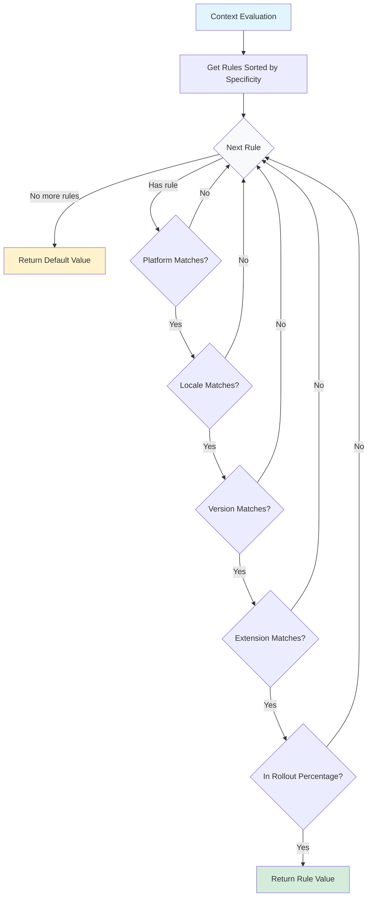

# Rules & Evaluables

Rules define targeting criteria and rollout strategies for feature flags. The Konditional rule system is built on a composable architecture that separates standard targeting (platform, locale, version) from custom domain logic through the `Evaluable` abstraction.

## Rule Fundamentals

A **Rule** specifies conditions that must be met for a particular value to be returned. Rules are the core mechanism for conditional feature flag behavior in Konditional.

Rules combine:

- **Standard targeting criteria**: Platform, locale, and version constraints
- **Custom evaluation logic**: Extensions for domain-specific targeting
- **Rollout percentage**: Gradual deployment to a percentage of matching users
- **Documentation notes**: Optional metadata explaining the rule's purpose

```kotlin
rule {
    platforms(Platform.IOS, Platform.ANDROID)
    locales(AppLocale.EN_US, AppLocale.EN_CA)
    versions {
        min(2, 0, 0)
        max(3, 0, 0)
    }
    rollout = Rollout.of(50.0)
    note("Mobile-only feature, 50% gradual rollout")
}.implies(true)
```

**Key concept**: All constraints in a rule must match for the rule to apply. If any constraint fails (platform doesn't match, version out of range, rollout bucket excluded), the rule is skipped and evaluation continues to the next rule.

## Basic Targeting

### Platform Targeting

Target specific platforms (`Platform.IOS`, `Platform.ANDROID`, `Platform.WEB`, `Platform.DESKTOP`, `Platform.SERVER`):

```kotlin
rule {
    platforms(Platform.IOS, Platform.ANDROID)
}.implies(mobileValue)
```

### Locale Targeting

Target users based on language and region:

```kotlin
rule {
    locales(AppLocale.EN_US, AppLocale.EN_CA, AppLocale.EN_GB)
}.implies(englishValue)
```

### Version Targeting

Target specific version ranges using semantic versioning:

```kotlin
// Minimum version only
rule {
    versions { min(2, 0, 0) }  // Version 2.0.0 or higher
}.implies(newFeatureValue)

// Maximum version only
rule {
    versions { max(1, 9, 9) }  // Version 1.9.9 or lower
}.implies(legacyValue)

// Version range
rule {
    versions {
        min(1, 5, 0)  // >= 1.5.0
        max(2, 0, 0)  // <= 2.0.0
    }
}.implies(transitionValue)

// Exact version targeting
rule {
    versions {
        min(2, 1, 3)
        max(2, 1, 3)
    }
}.implies(specificVersionValue)
```

### Combined Targeting

Combine multiple criteria - all must match:

```kotlin
rule {
    platforms(Platform.IOS, Platform.ANDROID)
    locales(AppLocale.EN_US)
    versions {
        min(2, 0, 0)
    }
}.implies(mobileEnglishV2Value)
```

## Rollouts

Rollouts enable gradual feature deployment to a percentage of users who match the rule criteria. Users are assigned to rollout buckets using hash-based bucketing on their `stableId`.

### Basic Rollout

```kotlin
rule {
    platforms(Platform.IOS)
    rollout = Rollout.of(25.0)  // 25% of iOS users
}.implies(true)

// Common rollout values
Rollout.of(0.0)    // 0% - effectively disabled
Rollout.of(10.0)   // 10% - canary/pilot
Rollout.of(50.0)   // 50% - A/B test
Rollout.MAX        // 100% - full rollout
```

### Rollout Characteristics

- **Deterministic**: Same user (by `stableId`) always gets the same assignment
- **Independent**: Each flag has its own bucketing space
- **Stable**: Assignments don't change unless you modify the salt

### Rollout Strategies

#### Gradual Rollout

Increase rollout percentage over time for safe feature deployment:

```kotlin
// Phase 1: Start with 10%
config {
    MyFeature.NEW_CHECKOUT with {
        default(false)
        rule {
            rollout = Rollout.of(10.0)
            note("Initial rollout - Phase 1")
        }.implies(true)
    }
}

// Phase 2: Increase to 50%, then eventually to 100%
config {
    MyFeature.NEW_CHECKOUT with {
        default(false)
        rule {
            rollout = Rollout.MAX  // Full rollout
        }.implies(true)
    }
}
```

#### Segmented Rollout

Different rollout percentages for different user segments:

```kotlin
config {
    MyFeature.BETA_FEATURE with {
        default(false)

        // 100% for internal users
        rule {
            extension {
                object : Evaluable<EnterpriseContext>() {
                    override fun matches(context: EnterpriseContext) =
                        context.organizationId == "internal"
                    override fun specificity() = 1
                }
            }
            rollout = Rollout.MAX
        }.implies(true)

        // 25% for enterprise customers
        rule {
            extension {
                object : Evaluable<EnterpriseContext>() {
                    override fun matches(context: EnterpriseContext) =
                        context.subscriptionTier == SubscriptionTier.ENTERPRISE
                    override fun specificity() = 1
                }
            }
            rollout = Rollout.of(25.0)
        }.implies(true)
    }
}
```

### Rollout Salt

The salt affects hash-based bucketing. Changing the salt redistributes users across rollout buckets:

```kotlin
config {
    MyFeature.EXPERIMENT with {
        default(false)
        salt("v1")  // Change to "v2" to redistribute users
        rule {
            rollout = Rollout.of(50.0)
        }.implies(true)
    }
}
```

Use cases: Reset A/B tests, fix biased distributions, or run new experiments on the same feature.

## Rule Evaluation Order

Rules are evaluated in order of **specificity** (highest first). When multiple rules match, the first matching rule (by specificity) determines the value.

### Specificity Calculation

Specificity is the sum of specified constraints. Rules with higher specificity are evaluated first:

```kotlin
// Specificity = 0 (no constraints - matches everything)
rule {
    rollout = Rollout.MAX
}.implies(value)

// Specificity = 1 (one constraint)
rule {
    platforms(Platform.IOS)
}.implies(value)

// Specificity = 2 (two constraints)
rule {
    platforms(Platform.IOS)
    locales(AppLocale.EN_US)
}.implies(value)

// Specificity = 3 (three constraints)
rule {
    platforms(Platform.IOS)
    locales(AppLocale.EN_US)
    versions { min(2, 0, 0) }
}.implies(value)

// Custom extensions contribute their own specificity
rule {
    platforms(Platform.IOS)  // +1 specificity
    extension {
        object : Evaluable<Context>() {
            override fun matches(context: Context) = true
            override fun specificity() = 1  // +1 specificity
        }
    }
}.implies(value)  // Total specificity = 2
```

**How specificity affects evaluation**: When a context matches multiple rules, only the highest-specificity matching rule's value is returned. This ensures more specific targeting overrides general targeting.

### Rule Evaluation Flow



### Evaluation Example

```kotlin
config {
    MyFeature.THEME with {
        default("light")

        // Specificity = 2, evaluated first
        rule {
            platforms(Platform.IOS)
            locales(AppLocale.EN_US)
        }.implies("dark-us")

        // Specificity = 1, evaluated second
        rule {
            platforms(Platform.IOS)
        }.implies("dark-ios")
    }
}

// iOS + EN_US → "dark-us" (matches both, highest specificity wins)
// iOS + FR_FR → "dark-ios" (matches only second rule)
```

## Custom Extensions

Extensions allow domain-specific targeting beyond standard criteria using the `Evaluable` abstraction:

```kotlin
abstract class Evaluable<C : Context> {
    open fun matches(context: C): Boolean = true
    open fun specificity(): Int = 0
}
```

### Pattern 1: Inline Extensions

For simple, one-off targeting logic:

```kotlin
rule {
    platforms(Platform.WEB)
    extension {
        object : Evaluable<EnterpriseContext>() {
            override fun matches(context: EnterpriseContext): Boolean {
                return context.subscriptionTier == SubscriptionTier.ENTERPRISE &&
                       context.userRole == UserRole.ADMIN
            }
            override fun specificity(): Int = 2
        }
    }
}.implies(enterpriseAdminValue)
```

### Pattern 2: Reusable Extension Classes

For complex logic used across multiple features:

```kotlin
class SubscriptionTierEvaluable(
    private val allowedTiers: Set<SubscriptionTier>
) : Evaluable<EnterpriseContext>() {
    override fun matches(context: EnterpriseContext): Boolean =
        context.subscriptionTier in allowedTiers
    override fun specificity(): Int = 1
}

// Use in multiple rules
config {
    MyFeature.PREMIUM_FEATURES with {
        default(false)
        rule {
            extension {
                SubscriptionTierEvaluable(setOf(
                    SubscriptionTier.PROFESSIONAL,
                    SubscriptionTier.ENTERPRISE
                ))
            }
        }.implies(true)
    }
}
```

## Rule Composition

Rules compose base targeting with custom extensions - all must match:

```kotlin
rule {
    platforms(Platform.WEB)         // 1. Base targeting
    extension {                     // 2. Custom logic
        object : Evaluable<EnterpriseContext>() {
            override fun matches(context: EnterpriseContext) =
                context.organizationId == "enterprise-123"
            override fun specificity() = 1
        }
    }
    rollout = Rollout.of(50.0)     // 3. Rollout bucketing
}.implies(value)
```

## Rule Notes

Add documentation to rules using `note()` for clarity:

```kotlin
rule {
    platforms(Platform.IOS)
    rollout = Rollout.of(25.0)
    note("Gradual rollout to iOS users - Phase 1 of mobile launch")
}.implies(true)
```

## Best Practices

### Think in Specificity

Design rules from most to least specific. While Konditional sorts automatically, this mental model creates clearer configurations:

```kotlin
config {
    MyFeature.VALUE with {
        default("default")

        // Most specific
        rule {
            platforms(Platform.IOS)
            locales(AppLocale.EN_US)
            versions { min(2, 0, 0) }
        }.implies("specific")

        // Less specific
        rule {
            platforms(Platform.IOS)
        }.implies("broad")
    }
}
```

### Separate Concerns

Use standard targeting for technical criteria and extensions for business logic:

```kotlin
rule {
    platforms(Platform.WEB)  // Technical targeting
    extension {              // Business logic
        SubscriptionTierEvaluable(setOf(SubscriptionTier.ENTERPRISE))
    }
}.implies(value)
```

### Document Complex Logic

Add notes to explain non-obvious targeting decisions:

```kotlin
rule {
    rollout = Rollout.of(15.0)
    note("Targeting high-value users - approved by PM on 2024-01-15")
}.implies(value)
```

### Test Your Rules

Create unit tests for complex rule logic:

```kotlin
@Test
fun `enterprise users on web get premium features`() {
    val context = EnterpriseContext(
        platform = Platform.WEB,
        subscriptionTier = SubscriptionTier.ENTERPRISE,
        stableId = StableId.of("test-user"),
        // ...
    )
    val result = context.evaluateSafe(MyFeature.PREMIUM)
    assertTrue(result is EvaluationResult.Success && result.value)
}
```

### Empty Constraints Match All

Omitted constraints match everything - useful for broad default rules:

```kotlin
rule {
    rollout = Rollout.MAX  // Matches all contexts
}.implies(defaultValue)
```

## Next Steps

- **[Flags](Flags.md)**: Learn about feature flag registration
- **[Builders](Builders.md)**: Master the rule DSL
- **[Context](Context.md)**: Understand custom context extensions
- **[Overview](index.md)**: Back to API overview
