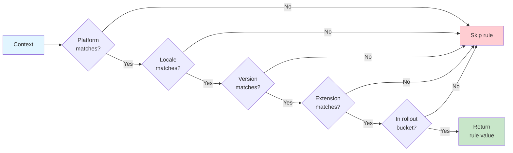
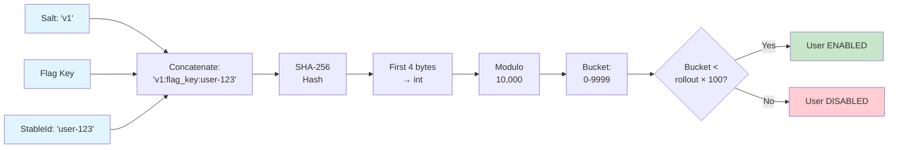
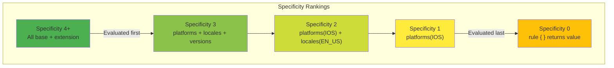
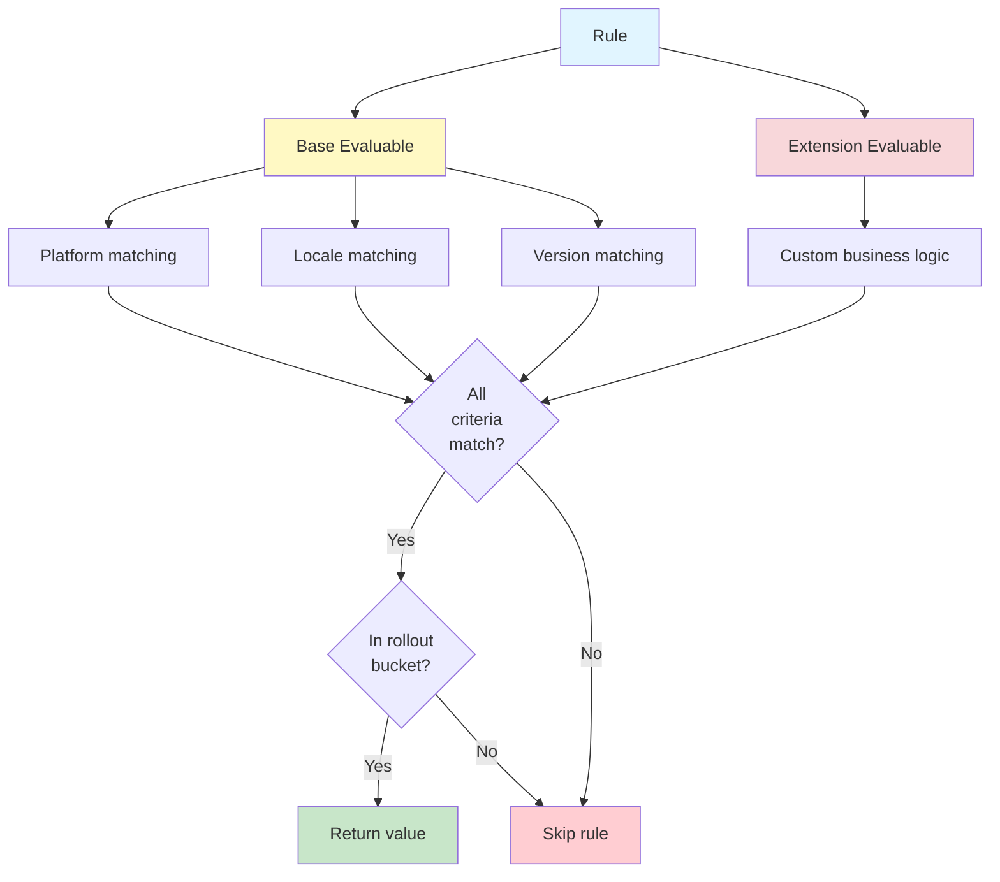

# Rules: Advanced Targeting and Rollouts

This guide covers Konditional's rule system for sophisticated feature flag targeting, including platform/locale/version targeting, custom business logic, rollout strategies, and specificity-based evaluation ordering.

---

## Table of Contents

- [Rule Fundamentals](#rule-fundamentals)
- [RuleScope DSL](#rulescope-dsl)
- [Basic Targeting](#basic-targeting)
- [Version Targeting](#version-targeting)
- [Rollout Strategies](#rollout-strategies)
- [Specificity and Ordering](#specificity-and-ordering)
- [Custom Evaluables](#custom-evaluables)
- [Rule Composition](#rule-composition)
- [Best Practices](#best-practices)
- [Testing Rules](#testing-rules)

---

## Rule Fundamentals

### What Are Rules?

A **Rule** defines **when** a specific value should be used for a feature flag. Rules combine targeting criteria (platform, locale, version, custom logic) with rollout percentages to enable sophisticated feature deployment strategies.

```kotlin
object AppFeatures : FeatureContainer<Namespace.Global>(Namespace.Global) {
    val DARK_MODE by boolean(default = false) {
        rule {
            platforms(Platform.IOS)
            rollout { 50.0 }
        } returns true
    }
}
```

### How Rules Work

**All criteria must match** for a rule to apply (AND logic):



If any criterion fails, the rule is skipped and evaluation continues to the next rule.

---

## RuleScope DSL

The `RuleScope` interface provides the DSL for configuring rules. All methods are available within `rule { }` blocks:

### Available Methods

```kotlin
interface RuleScope<C : Context> {
    // Platform targeting
    fun platforms(vararg ps: Platform)

    // Locale targeting
    fun locales(vararg appLocales: AppLocale)

    // Version range targeting
    fun versions(build: VersionRangeScope.() -> Unit)

    // Custom business logic
    fun extension(function: () -> Evaluable<C>)

    // Documentation note
    fun note(text: String)

    // Rollout percentage (0-100)
    fun rollout(function: () -> Number)
}
```

### Basic Rule Structure

```kotlin
rule {
    platforms(Platform.IOS, Platform.ANDROID)
    locales(AppLocale.EN_US, AppLocale.EN_CA)
    versions {
        min(2, 0, 0)
        max(3, 0, 0)
    }
    extension {
        // Custom business logic
    }
    rollout { 50.0 }
    note("Mobile users, English locales, 50% rollout")
} returns value
```

**All targeting criteria are optional** - omitted criteria match everything.

---

## Basic Targeting

### Platform Targeting

Target specific platforms using `platforms()`:

```kotlin
// Single platform
rule {
    platforms(Platform.IOS)
} returns "ios-value"

// Multiple platforms (OR logic within platforms)
rule {
    platforms(Platform.IOS, Platform.ANDROID)
} returns "mobile-value"
```

**Available platforms:**
- `Platform.IOS`
- `Platform.ANDROID`
- `Platform.WEB`
- `Platform.DESKTOP`
- `Platform.SERVER`

**Empty means all**: Omitting `platforms()` matches all platforms.

### Locale Targeting

Target users by language and region using `locales()`:

```kotlin
// Single locale
rule {
    locales(AppLocale.EN_US)
} returns "us-english"

// Multiple locales
rule {
    locales(AppLocale.EN_US, AppLocale.EN_CA, AppLocale.EN_GB)
} returns "english-value"
```

**Available locales:**
`EN_US`, `EN_CA`, `EN_GB`, `FR_FR`, `DE_DE`, `ES_US`, `ES_ES`, `IT_IT`, `PT_BR`, `JA_JP`, `ZH_CN`, `KO_KR`, `HI_IN`, `AR_SA`, `RU_RU`, `NL_NL`, `SV_SE`, `PL_PL`, `TR_TR`, `TH_TH`

**Empty means all**: Omitting `locales()` matches all locales.

### Combined Targeting

Combine multiple criteria - **all must match**:

```kotlin
rule {
    platforms(Platform.IOS, Platform.ANDROID)  // Must be iOS or Android
    locales(AppLocale.EN_US)                   // AND must be US English
    rollout { 50.0 }                           // AND must be in 50% bucket
} returns value
```

---

## Version Targeting

The `versions { }` block provides semantic version targeting through the `VersionRangeScope` interface.

### VersionRangeScope Methods

```kotlin
interface VersionRangeScope {
    // Minimum version (inclusive)
    fun min(major: Int, minor: Int = 0, patch: Int = 0)

    // Maximum version (exclusive)
    fun max(major: Int, minor: Int = 0, patch: Int = 0)
}
```

### Version Ranges

```kotlin
// Minimum version only (>= 2.0.0)
rule {
    versions { min(2, 0, 0) }
} returns "new-feature"

// Maximum version only (< 2.0.0)
rule {
    versions { max(2, 0, 0) }
} returns "legacy-value"

// Bounded range [1.5.0, 2.0.0)
rule {
    versions {
        min(1, 5, 0)  // >= 1.5.0
        max(2, 0, 0)  // < 2.0.0
    }
} returns "transition-value"

// Exact version targeting
rule {
    versions {
        min(2, 1, 3)
        max(2, 1, 4)  // Matches only 2.1.3
    }
} returns "specific-version"
```

### Version Range Types

Internally, version ranges are represented by sealed class types:

| Type | Description | Example |
|------|-------------|---------|
| `FullyBound` | Min and max specified | `min(1, 0, 0); max(2, 0, 0)` |
| `LeftBound` | Only min specified | `min(2, 0, 0)` |
| `RightBound` | Only max specified | `max(2, 0, 0)` |
| `Unbounded` | No bounds (matches all) | *(omit versions block)* |

**Empty means all**: Omitting the `versions { }` block matches all versions.

---

## Rollout Strategies

Rollouts enable gradual feature deployment using deterministic, SHA-256-based bucketing.

### Setting Rollout Percentage

Use the `rollout { }` function with a percentage value (0-100):

```kotlin
rule {
    platforms(Platform.IOS)
    rollout { 25.0 }  // 25% of iOS users
} returns true

// Common rollout values
rollout { 0.0 }    // 0% - effectively disabled
rollout { 10.0 }   // 10% - canary/pilot
rollout { 50.0 }   // 50% - A/B test
rollout { 100.0 }  // 100% - full rollout (default if omitted)
```

### Rollout Bucketing

Konditional uses **SHA-256 hashing** for deterministic user bucketing:



**Key Properties:**

| Property | Benefit |
|----------|---------|
| **Deterministic** | Same user always gets same bucket |
| **Independent** | Each flag has separate bucketing space |
| **Platform-Stable** | Same bucket across JVM, Android, iOS, web |
| **Fine-Grained** | 0.01% granularity (10,000 buckets) |
| **Redistributable** | Change salt to reassign buckets |

### Gradual Rollout Pattern

Increase rollout percentage over time for safe deployment:

```kotlin
// Phase 1: Start with 10%
val NEW_CHECKOUT by boolean(default = false) {
    rule {
        rollout { 10.0 }
        note("Phase 1 - Initial rollout")
    } returns true
}

// Phase 2: Increase to 50%
val NEW_CHECKOUT by boolean(default = false) {
    rule {
        rollout { 50.0 }
        note("Phase 2 - Expanded rollout")
    } returns true
}

// Phase 3: Full rollout
val NEW_CHECKOUT by boolean(default = false) {
    rule {
        rollout { 100.0 }
        note("Phase 3 - Complete rollout")
    } returns true
}
```

### Segmented Rollout Pattern

Different rollout percentages for different user segments:

```kotlin
val BETA_FEATURE by boolean(default = false) {
    // 100% for internal users (highest specificity)
    rule {
        extension {
            Evaluable.factory { ctx: EnterpriseContext ->
                ctx.organizationId == "internal"
            }
        }
        rollout { 100.0 }
    } returns true

    // 50% for enterprise customers
    rule {
        extension {
            Evaluable.factory { ctx: EnterpriseContext ->
                ctx.subscriptionTier == SubscriptionTier.ENTERPRISE
            }
        }
        rollout { 50.0 }
    } returns true

    // 10% for all other users
    rule {
        rollout { 10.0 }
    } returns true
}
```

### Changing Salt for Redistribution

The `salt` affects bucketing. Change it to redistribute users:

```kotlin
val EXPERIMENT by boolean(default = false) {
    salt("v1")  // Original bucketing
    rule {
        rollout { 50.0 }
    } returns true
}

// Later: Redistribute users by changing salt
val EXPERIMENT by boolean(default = false) {
    salt("v2")  // New bucketing - different users enabled
    rule {
        rollout { 50.0 }
    } returns true
}
```

**Use cases**: Reset A/B tests, fix biased distributions, run new experiments.

---

## Specificity and Ordering

When multiple rules match a context, **the most specific rule wins**. Rules are automatically sorted by specificity (descending) at configuration time.

### Specificity Calculation

**Formula:**
```
specificity = (platforms specified? 1 : 0)
            + (locales specified? 1 : 0)
            + (version range specified? 1 : 0)
            + extension.specificity()
```



### Specificity Examples

```kotlin
// Specificity = 0 (no constraints)
rule {
} returns "default-value"

// Specificity = 1 (one constraint)
rule {
    platforms(Platform.IOS)
} returns "ios-value"

// Specificity = 2 (two constraints)
rule {
    platforms(Platform.IOS)
    locales(AppLocale.EN_US)
} returns "ios-us-value"

// Specificity = 3 (three constraints)
rule {
    platforms(Platform.IOS)
    locales(AppLocale.EN_US)
    versions { min(2, 0, 0) }
} returns "ios-us-v2-value"

// Specificity = 4 (base + extension)
rule {
    platforms(Platform.IOS)
    locales(AppLocale.EN_US)
    versions { min(2, 0, 0) }
    extension {
        object : Evaluable<EnterpriseContext> {
            override fun matches(context: EnterpriseContext) =
                context.subscriptionTier == SubscriptionTier.ENTERPRISE
            override fun specificity() = 1  // Adds +1 to total
        }
    }
} returns "enterprise-ios-us-v2-value"
```

### Evaluation Order Example

```kotlin
val THEME by string(default = "light") {
    // Specificity = 2, evaluated FIRST
    rule {
        platforms(Platform.IOS)
        locales(AppLocale.EN_US)
    } returns "dark-us-ios"

    // Specificity = 1, evaluated SECOND
    rule {
        platforms(Platform.IOS)
    } returns "dark-ios"
}

// iOS + EN_US → "dark-us-ios" (most specific wins)
// iOS + FR_FR → "dark-ios" (only second rule matches)
// Android + * → "light" (default, no rules match)
```

### Tie-Breaking

When multiple rules have the same specificity, rules are sorted by `note` text alphabetically:

```kotlin
rule {
    platforms(Platform.IOS)
    note("A - First rule")
} returns value1

rule {
    platforms(Platform.IOS)
    note("B - Second rule")
} returns value2

// Both have specificity 1, sorted by note: "A" before "B"
```

---

## Custom Evaluables

The `Evaluable` interface enables custom business logic beyond standard targeting.

### Evaluable Interface

```kotlin
fun interface Evaluable<in C : Context> : Specifier {
    fun matches(context: C): Boolean

    companion object {
        fun <C : Context> factory(matcher: (C) -> Boolean): Evaluable<C>
    }
}

interface Specifier {
    fun specificity(): Int = 1
}
```

### Pattern 1: Factory Function (Simplest)

For simple lambda-based logic:

```kotlin
rule {
    extension {
        Evaluable.factory { ctx: EnterpriseContext ->
            ctx.subscriptionTier == SubscriptionTier.ENTERPRISE &&
            ctx.organizationId.startsWith("ent-")
        }
    }
} returns value
```

**Note**: Factory-created evaluables have default `specificity() = 1`.

### Pattern 2: Object Expression

For inline logic with custom specificity:

```kotlin
rule {
    extension {
        object : Evaluable<EnterpriseContext> {
            override fun matches(context: EnterpriseContext): Boolean {
                return context.subscriptionTier == SubscriptionTier.ENTERPRISE &&
                       context.userRole == UserRole.ADMIN &&
                       context.organizationSize > 1000
            }

            override fun specificity(): Int = 3  // Three conditions = specificity 3
        }
    }
} returns value
```

### Pattern 3: Reusable Classes

For complex logic used across multiple features:

```kotlin
class SubscriptionTierEvaluable(
    private val allowedTiers: Set<SubscriptionTier>
) : Evaluable<EnterpriseContext> {
    override fun matches(context: EnterpriseContext): Boolean =
        context.subscriptionTier in allowedTiers

    override fun specificity(): Int = 1
}

// Reuse across features
val PREMIUM_EXPORT by boolean(default = false) {
    rule {
        extension {
            SubscriptionTierEvaluable(setOf(
                SubscriptionTier.PROFESSIONAL,
                SubscriptionTier.ENTERPRISE
            ))
        }
    } returns true
}

val ADVANCED_ANALYTICS by boolean(default = false) {
    rule {
        extension {
            SubscriptionTierEvaluable(setOf(SubscriptionTier.ENTERPRISE))
        }
    } returns true
}
```

### Specificity Best Practices

**Match specificity to constraint count:**

```kotlin
object : Evaluable<AppContext> {
    override fun matches(context: AppContext) =
        context.userId.startsWith("test-")  // 1 condition

    override fun specificity() = 1  // Match constraint count
}

object : Evaluable<AppContext> {
    override fun matches(context: AppContext) =
        context.subscriptionTier == SubscriptionTier.ENTERPRISE &&
        context.userRole == UserRole.ADMIN &&
        context.organizationSize > 100  // 3 conditions

    override fun specificity() = 3  // Match constraint count
}
```

This ensures more specific business logic is evaluated before less specific logic.

---

## Rule Composition

Rules compose **base targeting** (platform/locale/version) with **custom extensions** - all criteria must match.

### Composition Architecture



**Matching formula:**
```kotlin
rule.matches(context) =
    baseEvaluable.matches(context) && extension.matches(context)
```

**Specificity formula:**
```kotlin
rule.specificity() =
    baseEvaluable.specificity() + extension.specificity()
```

### Composition Example

```kotlin
rule {
    // Base targeting (specificity = 2)
    platforms(Platform.WEB)
    locales(AppLocale.EN_US)

    // Custom extension (specificity = 1)
    extension {
        object : Evaluable<EnterpriseContext> {
            override fun matches(context: EnterpriseContext) =
                context.organizationId.startsWith("ent-")
            override fun specificity() = 1
        }
    }

    // Rollout bucketing
    rollout { 50.0 }
} returns value
// Total specificity = 2 + 1 = 3
```

This rule matches only when:
1. Platform is WEB **AND**
2. Locale is EN_US **AND**
3. Organization ID starts with "ent-" **AND**
4. User is in the 50% rollout bucket

---

## Best Practices

### 1. Design Rules from Specific to General

While Konditional auto-sorts by specificity, organizing rules from most to least specific makes configurations clearer:

```kotlin
val API_ENDPOINT by string(default = "https://api.prod.com") {
    // Most specific: enterprise iOS users on v2
    rule {
        platforms(Platform.IOS)
        versions { min(2, 0, 0) }
        extension {
            Evaluable.factory { ctx: EnterpriseContext ->
                ctx.subscriptionTier == SubscriptionTier.ENTERPRISE
            }
        }
    } returns "https://api-enterprise-ios-v2.com"

    // Less specific: all enterprise users
    rule {
        extension {
            Evaluable.factory { ctx: EnterpriseContext ->
                ctx.subscriptionTier == SubscriptionTier.ENTERPRISE
            }
        }
    } returns "https://api-enterprise.com"

    // Least specific: iOS users
    rule {
        platforms(Platform.IOS)
    } returns "https://api-ios.com"
}
```

### 2. Separate Technical and Business Concerns

Use base targeting for technical criteria, extensions for business logic:

```kotlin
rule {
    // Technical targeting
    platforms(Platform.WEB)
    versions { min(2, 0, 0) }

    // Business logic
    extension {
        SubscriptionTierEvaluable(setOf(SubscriptionTier.ENTERPRISE))
    }
} returns value
```

### 3. Document Non-Obvious Logic

Use `note()` to explain complex targeting decisions:

```kotlin
rule {
    platforms(Platform.ANDROID)
    versions {
        min(1, 9, 0)
        max(2, 1, 0)
    }
    rollout { 15.0 }
    note("Workaround for Android bug #1234 - affects v1.9.0-2.0.x only")
} returns workaroundValue
```

### 4. Use Type-Safe Custom Contexts

Define custom contexts for domain-specific targeting:

```kotlin
data class EnterpriseContext(
    override val locale: AppLocale,
    override val platform: Platform,
    override val appVersion: Version,
    override val stableId: StableId,
    val subscriptionTier: SubscriptionTier,
    val organizationId: String,
    val userRole: UserRole,
) : Context

// Use in features
enum class EnterpriseFeatures(override val key: String) :
    Conditional<Boolean, EnterpriseContext> {
    ADVANCED_ANALYTICS("advanced_analytics")
}

// Extensions are type-safe
rule {
    extension {
        Evaluable.factory { ctx: EnterpriseContext ->
            ctx.subscriptionTier == SubscriptionTier.ENTERPRISE  // ✓ Type-safe
        }
    }
} returns true
```

### 5. Match Specificity to Constraint Count

Your custom `specificity()` should reflect the number of constraints:

```kotlin
// 1 constraint → specificity 1
object : Evaluable<AppContext> {
    override fun matches(context: AppContext) =
        context.userId.startsWith("beta-")
    override fun specificity() = 1
}

// 3 constraints → specificity 3
object : Evaluable<AppContext> {
    override fun matches(context: AppContext) =
        context.subscriptionTier == SubscriptionTier.ENTERPRISE &&
        context.userRole == UserRole.ADMIN &&
        context.organizationSize > 1000
    override fun specificity() = 3
}
```

### 6. Test Rollout Distribution

For probabilistic rollouts, test with multiple stable IDs:

```kotlin
@Test
fun `50 percent rollout distributes approximately evenly`() {
    val enabled = (1..1000).count { i ->
        val ctx = Context(
            locale = AppLocale.EN_US,
            platform = Platform.IOS,
            appVersion = Version(1, 0, 0),
            stableId = StableId.of("user-$i")
        )
        ctx.evaluateOrDefault(Features.NEW_FEATURE, default = false)
    }

    // Expect ~50% with 10% variance
    assertTrue(enabled in 450..550)
}
```

---

## Testing Rules

### Test Rule Matching

```kotlin
@Test
fun `enterprise iOS users on v2 get premium endpoint`() {
    val context = EnterpriseContext(
        platform = Platform.IOS,
        appVersion = Version(2, 1, 0),
        subscriptionTier = SubscriptionTier.ENTERPRISE,
        stableId = StableId.of("test-user"),
        // ...
    )

    val result = context.evaluateSafe(Features.API_ENDPOINT)
    assertEquals("https://api-enterprise-ios-v2.com",
                 (result as EvaluationResult.Success).value)
}
```

### Test Specificity Ordering

```kotlin
@Test
fun `most specific rule wins when multiple match`() {
    val context = Context(
        platform = Platform.IOS,
        locale = AppLocale.EN_US,
        appVersion = Version(1, 0, 0),
        stableId = StableId.of("test-user")
    )

    val result = context.evaluateOrDefault(Features.THEME, default = "light")

    // Both rules match, but specificity=2 wins over specificity=1
    assertEquals("dark-us-ios", result)
}
```

### Test Rollout Determinism

```kotlin
@Test
fun `rollout is deterministic for same user`() {
    val context = Context(
        platform = Platform.IOS,
        locale = AppLocale.EN_US,
        appVersion = Version(1, 0, 0),
        stableId = StableId.of("user-123")
    )

    val result1 = context.evaluateOrDefault(Features.NEW_FEATURE, default = false)
    val result2 = context.evaluateOrDefault(Features.NEW_FEATURE, default = false)

    assertEquals(result1, result2)  // Always same result
}
```

### Test Custom Evaluables

```kotlin
@Test
fun `custom evaluable matches correct contexts`() {
    val evaluable = SubscriptionTierEvaluable(setOf(
        SubscriptionTier.PROFESSIONAL,
        SubscriptionTier.ENTERPRISE
    ))

    val enterpriseCtx = mockEnterpriseContext(
        subscriptionTier = SubscriptionTier.ENTERPRISE
    )
    assertTrue(evaluable.matches(enterpriseCtx))

    val basicCtx = mockEnterpriseContext(
        subscriptionTier = SubscriptionTier.BASIC
    )
    assertFalse(evaluable.matches(basicCtx))
}
```

---

## Summary: Rule System Guarantees

| Aspect | Guarantee |
|--------|-----------|
| **Matching Logic** | All criteria must match (AND logic) |
| **Specificity** | More specific rules always evaluated first |
| **Rollout Bucketing** | SHA-256 ensures deterministic, independent bucketing |
| **Type Safety** | Context and value types enforced at compile time |
| **Determinism** | Same inputs always produce same outputs |
| **Composability** | Base + extension evaluables compose cleanly |
| **Thread Safety** | Lock-free reads, immutable rule data |

**Core Principle**: Rules provide compile-time type-safe, deterministic targeting with automatic specificity-based ordering.

---

## Next Steps

- **[Evaluation](./Evaluation.md)** - Deep dive into flag evaluation mechanics
- **[Context](./Context.md)** - Design custom evaluation contexts
- **[Features](./Features.md)** - Feature flag definition patterns
- **[Overview](./index.md)** - Complete API overview
