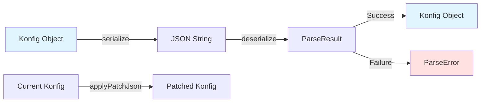

# Serialization

Konditional provides JSON serialization for feature flag configurations, enabling external configuration management, snapshot storage, and dynamic updates.

## Overview

The serialization system allows you to:

- Export flag configurations to JSON
- Import configurations from JSON
- Apply incremental patches to existing configurations
- Store configurations in databases or file systems
- Load configurations from remote servers

## SnapshotSerializer

The `SnapshotSerializer` class handles all serialization operations.

### Creating a Serializer

```kotlin
// Use default instance
val serializer = SnapshotSerializer.default

// Or create with custom Moshi instance
val customMoshi = Moshi.Builder()
    // ... custom configuration
    .build()
val serializer = SnapshotSerializer(customMoshi)
```

## Serializing Configurations

### Basic Serialization

Export a `Konfig` to JSON by getting a snapshot from the registry:

```kotlin
// Get current configuration
val currentKonfig = FlagRegistry.konfig()

// Serialize
val json = SnapshotSerializer.default.serialize(currentKonfig)

// Save to file
File("flags.json").writeText(json)
```

## Deserializing Configurations

### Basic Deserialization

Import configuration from JSON:

```kotlin
val json = File("flags.json").readText()

when (val result = SnapshotSerializer.default.deserialize(json)) {
    is ParseResult.Success -> {
        val konfig = result.value
        FlagRegistry.load(konfig)
        println("Configuration loaded successfully")
    }
    is ParseResult.Failure -> {
        println("Failed to parse: ${result.error}")
    }
}
```

### Error Handling

The deserialization API returns `ParseResult` for explicit error handling:

```kotlin
sealed interface ParseResult<out T> {
    data class Success<T>(val value: T) : ParseResult<T>
    data class Failure(val error: ParseError) : ParseResult<Nothing>
}

sealed interface ParseError {
    data class InvalidJson(val message: String) : ParseError
    data class InvalidSnapshot(val message: String) : ParseError
    data class UnsupportedVersion(val version: String) : ParseError
}
```

Usage:

```kotlin
val result = SnapshotSerializer.default.deserialize(json)

result.fold(
    onSuccess = { konfig ->
        FlagRegistry.load(konfig)
    },
    onFailure = { error ->
        when (error) {
            is ParseError.InvalidJson -> logError("Malformed JSON: ${error.message}")
            is ParseError.InvalidSnapshot -> logError("Invalid snapshot: ${error.message}")
            is ParseError.UnsupportedVersion -> logError("Unsupported version: ${error.version}")
        }
    }
)
```

## Serialization Flow



## JSON Format Reference

### Snapshot Structure

A complete snapshot contains an array of flag definitions:

```json
{
  "flags": [
    {
      "key": "dark_mode",
      "valueType": "BOOLEAN",
      "defaultValue": false,
      "isActive": true,
      "salt": "v1",
      "rules": [
        {
          "locales": ["en_US"],
          "platforms": ["IOS"],
          "versionRange": { "type": "UNBOUNDED" },
          "rollout": 100.0,
          "note": "iOS users get dark mode",
          "value": true
        }
      ]
    }
  ]
}
```

### Supported Value Types

- **`BOOLEAN`**: `true` or `false`
- **`STRING`**: Text values
- **`INTEGER`**: Whole numbers
- **`DECIMAL`**: Floating point numbers
- **`JSON`**: Arbitrary JSON objects

### Version Range Types

- **`UNBOUNDED`**: All versions
- **`MIN_BOUND`**: Minimum version (>= specified version)
- **`MAX_BOUND`**: Maximum version (<= specified version)
- **`MIN_AND_MAX_BOUND`**: Both minimum and maximum bounds

Version objects use semantic versioning: `{ "major": 2, "minor": 0, "patch": 0 }`

## Patches

Apply incremental updates to configurations without replacing the entire snapshot.

### Creating Patches

Patches are not directly created via DSL but through the internal serialization model. However, you can apply patches from JSON:

```json
{
  "flags": [
    {
      "key": "new_feature",
      "valueType": "BOOLEAN",
      "defaultValue": false,
      "isActive": true,
      "salt": "v1",
      "rules": []
    }
  ],
  "removeKeys": ["old_feature"]
}
```

### Applying Patches

```kotlin
// Get current configuration
val currentKonfig = FlagRegistry.konfig()

// Apply patch from JSON
val patchJson = """
{
  "flags": [...],
  "removeKeys": [...]
}
""".trimIndent()

when (val result = SnapshotSerializer.default.applyPatchJson(currentKonfig, patchJson)) {
    is ParseResult.Success -> {
        val updatedKonfig = result.value
        FlagRegistry.load(updatedKonfig)
    }
    is ParseResult.Failure -> {
        logError("Failed to apply patch: ${result.error}")
    }
}
```

## Remote Configuration

Load configurations from remote servers and poll for updates:

```kotlin
class RemoteConfigLoader(
    private val apiClient: HttpClient,
    private val serializer: SnapshotSerializer = SnapshotSerializer.default
) {
    suspend fun loadConfiguration(url: String): Result<Konfig> {
        return try {
            val json = apiClient.get(url).bodyAsText()
            when (val result = serializer.deserialize(json)) {
                is ParseResult.Success -> Result.success(result.value)
                is ParseResult.Failure -> Result.failure(
                    ConfigurationException("Parse error: ${result.error}")
                )
            }
        } catch (e: Exception) {
            Result.failure(e)
        }
    }

    // Poll for updates
    fun startPolling(configUrl: String, intervalMs: Long, scope: CoroutineScope): Job {
        return scope.launch {
            while (isActive) {
                loadConfiguration(configUrl)
                    .onSuccess { FlagRegistry.load(it) }
                    .onFailure { logError("Poll failed", it) }
                delay(intervalMs)
            }
        }
    }
}
```

Usage:

```kotlin
val loader = RemoteConfigLoader(httpClient)

// One-time load
loader.loadConfiguration("https://config.example.com/flags.json")
    .onSuccess { FlagRegistry.load(it) }

// Continuous polling
val pollingJob = loader.startPolling(
    configUrl = "https://config.example.com/flags.json",
    intervalMs = 60_000,
    scope = applicationScope
)
```

## Database Storage

Persist configurations to a database:

```kotlin
class ConfigurationRepository(
    private val database: Database,
    private val serializer: SnapshotSerializer = SnapshotSerializer.default
) {
    fun save(name: String, konfig: Konfig) {
        val json = serializer.serialize(konfig)
        database.execute(
            "INSERT INTO configurations (name, json, updated_at) VALUES (?, ?, ?) " +
            "ON CONFLICT (name) DO UPDATE SET json = ?, updated_at = ?",
            name, json, Instant.now(), json, Instant.now()
        )
    }

    fun load(name: String): Konfig? {
        val json = database.queryString(
            "SELECT json FROM configurations WHERE name = ?",
            name
        ) ?: return null

        return when (val result = serializer.deserialize(json)) {
            is ParseResult.Success -> result.value
            is ParseResult.Failure -> {
                logError("Failed to deserialize: ${result.error}")
                null
            }
        }
    }
}
```

For versioned configurations with rollback capability, add `version`, `timestamp`, `author`, and `description` columns to track configuration history.

## Best Practices

### Validation

Validate configurations after deserialization:

```kotlin
fun validateConfiguration(konfig: Konfig): List<String> {
    val errors = mutableListOf<String>()

    konfig.flags.forEach { (feature, definition) ->
        // Check for required flags
        if (feature.key in requiredFlags && !definition.isActive) {
            errors.add("Required flag ${feature.key} is inactive")
        }

        // Validate rollout percentages
        definition.values.forEach { conditionalValue ->
            if (conditionalValue.rule.rollout.value !in 0.0..100.0) {
                errors.add("Invalid rollout for ${feature.key}: ${conditionalValue.rule.rollout.value}")
            }
        }
    }

    return errors
}

// Use validation
when (val result = SnapshotSerializer.default.deserialize(json)) {
    is ParseResult.Success -> {
        val errors = validateConfiguration(result.value)
        if (errors.isEmpty()) {
            FlagRegistry.load(result.value)
        } else {
            logError("Configuration validation failed: $errors")
        }
    }
    is ParseResult.Failure -> logError("Parse error: ${result.error}")
}
```

### Backup and Restore

Implement backup mechanism:

```kotlin
class ConfigurationBackup(
    private val backupDir: File,
    private val serializer: SnapshotSerializer = SnapshotSerializer.default
) {
    fun backup(name: String = "backup-${Instant.now().epochSecond}") {
        val konfig = FlagRegistry.konfig()
        val json = serializer.serialize(konfig)
        val backupFile = File(backupDir, "$name.json")
        backupFile.writeText(json)
        logInfo("Configuration backed up to ${backupFile.absolutePath}")
    }

    fun restore(name: String): Boolean {
        val backupFile = File(backupDir, "$name.json")
        if (!backupFile.exists()) {
            logError("Backup file not found: $name")
            return false
        }

        val json = backupFile.readText()
        return when (val result = serializer.deserialize(json)) {
            is ParseResult.Success -> {
                FlagRegistry.load(result.value)
                logInfo("Configuration restored from $name")
                true
            }
            is ParseResult.Failure -> {
                logError("Failed to restore: ${result.error}")
                false
            }
        }
    }

    fun listBackups(): List<String> {
        return backupDir.listFiles { file -> file.extension == "json" }
            ?.map { it.nameWithoutExtension }
            ?.sorted()
            ?: emptyList()
    }
}
```

### Testing Serialization

Test serialization round-trips:

```kotlin
@Test
fun `serialization round-trip preserves configuration`() {
    // Define features using FeatureContainer
    object MyFeatures : FeatureContainer<Taxonomy.Global>(Taxonomy.Global) {
        val DARK_MODE by boolean(default = false) {
            rule {
                platforms(Platform.IOS)
                locales(AppLocale.EN_US)
                versions {
                    min(2, 0, 0)
                }
                rollout = Rollout.of(50.0)
            } implies true
        }
    }

    // Get the configuration snapshot
    val original = Taxonomy.Global.registry.konfig()

    // Serialize
    val json = SnapshotSerializer.default.serialize(original)

    // Deserialize
    val result = SnapshotSerializer.default.deserialize(json)
    assertTrue(result is ParseResult.Success)

    val deserialized = (result as ParseResult.Success).value

    // Compare
    assertEquals(original.flags.size, deserialized.flags.size)
    // ... additional assertions
}
```

## Next Steps

- **[Architecture](Architecture.md)**: Understand how serialization fits into the overall design
- **[Overview](index.md)**: Back to API overview
