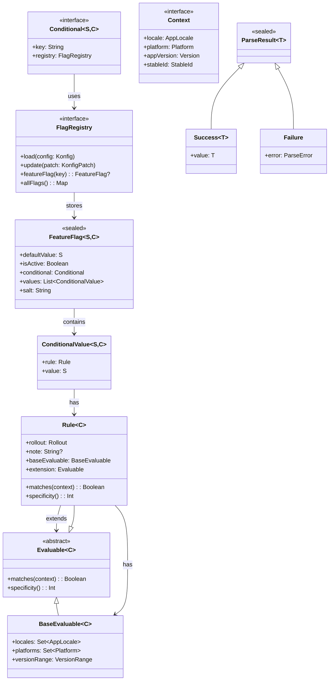
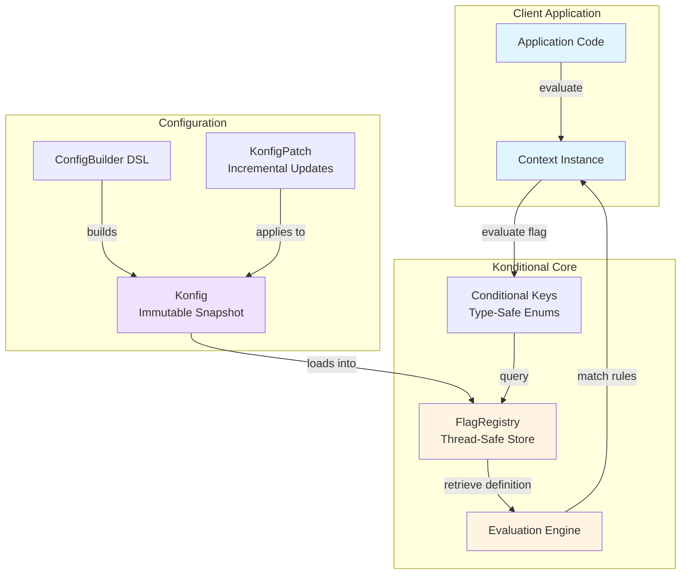
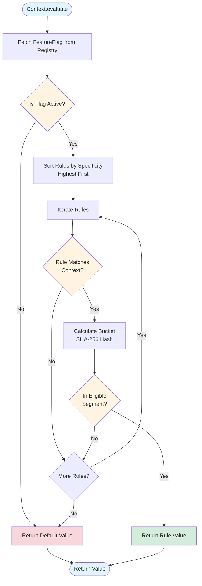
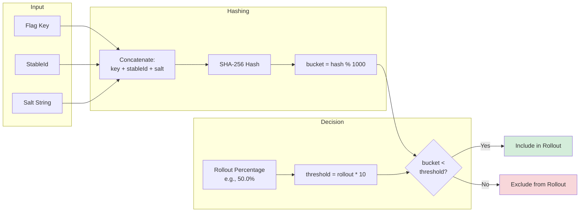
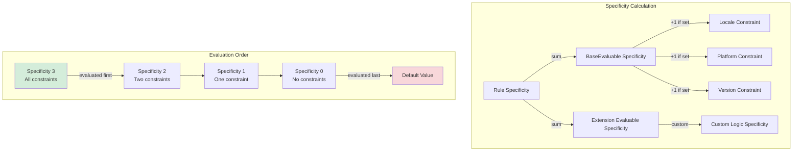
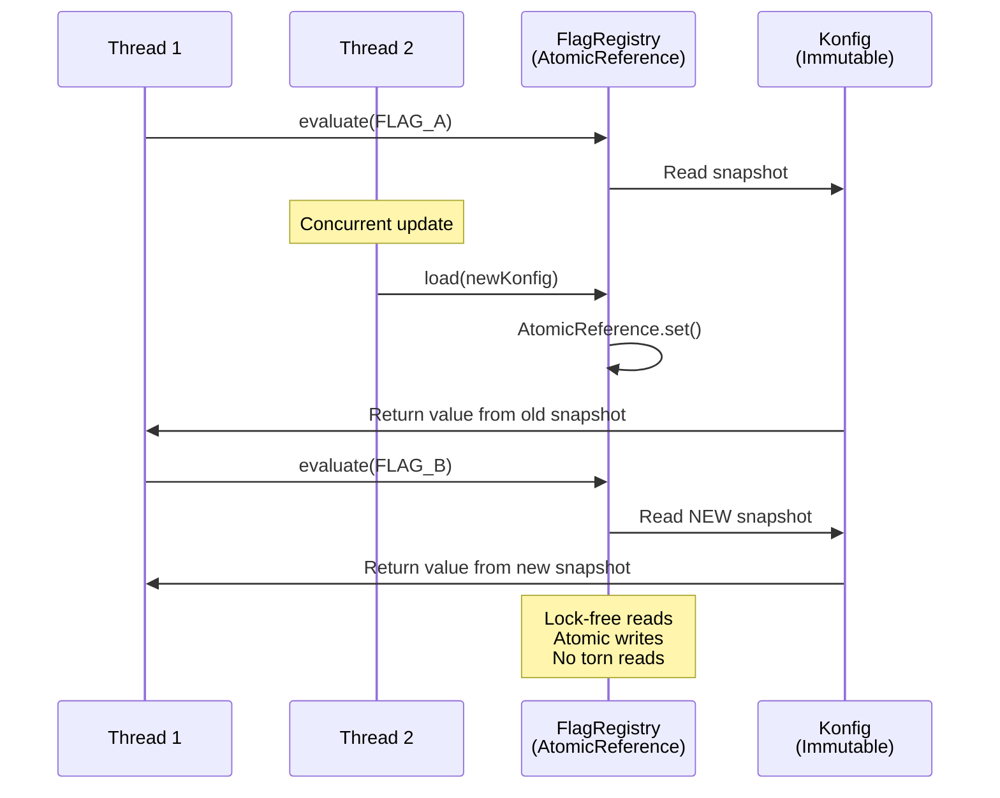

# Architecture Overview

This document describes the high-level architecture of Konditional and how its core components work together to provide type-safe, deterministic feature flag evaluation.

## Type Hierarchy



## Core Concepts

### 1. Conditional<S, C>

`Conditional<S : Any, C : Context>` is the central abstraction representing a feature flag or configuration value.

- **S**: The value type returned when evaluating this conditional (e.g., `Boolean`, `String`, custom types)
- **C**: The context type used for evaluation (e.g., `Context`, `EnterpriseContext`)

```kotlin
interface Conditional<S : Any, C : Context> {
    val key: String
    val registry: FlagRegistry
}
```

Typically implemented as an enum for convenience:

```kotlin
enum class Features(override val key: String) : Conditional<Boolean, Context> {
    DARK_MODE("dark_mode"),
    NEW_UI("new_ui");

    override val registry = FlagRegistry
}
```

**Note**: The `with` method was removed in recent versions. Use the `ConfigBuilder` DSL instead for flag configuration.

### 2. Context

`Context` defines what information is available for rule evaluation. The base interface provides:

- `locale`: Application locale
- `platform`: Platform (iOS, Android, Web)
- `appVersion`: Semantic version
- `stableId`: Unique identifier for deterministic bucketing

You can extend this interface with your own fields:

```kotlin
data class EnterpriseContext(
    override val locale: AppLocale,
    override val platform: Platform,
    override val appVersion: Version,
    override val stableId: StableId,
    val organizationId: String,
    val subscriptionTier: SubscriptionTier,
) : Context
```

### 3. FeatureFlag<S, C>

`FeatureFlag<S : Any, C : Context>` (sealed class) contains the evaluation logic for a conditional:

- **conditional**: Reference to the `Conditional<S, C>` this flag evaluates
- **values**: List of `ConditionalValue<S, C>` (rule → value mappings)
- **defaultValue**: Value returned when no rules match
- **isActive**: Whether the flag is enabled (if false, always returns default)
- **salt**: String used in hash function for bucketing independence

```kotlin
sealed class FeatureFlag<S : Any, C : Context>(
    val defaultValue: S,
    val isActive: Boolean,
    val conditional: Conditional<S, C>,
    val values: List<ConditionalValue<S, C>>,
    val salt: String = "v1"
)
```

**Evaluation Logic**:
1. If `isActive` is false, return `defaultValue`
2. Sort `values` by rule specificity (descending)
3. Find first rule that matches the context
4. Check if user is in the eligible bucket for that rule's rollout percentage
5. Return the associated value, or default if no match

**Implementation**: The concrete implementation is `FlagDefinition<S, C>` (internal/package-private).

### 4. Evaluable<C> (Base Abstraction)

`Evaluable<C : Context>` is the foundation for composable rule evaluation:

```kotlin
abstract class Evaluable<C : Context> {
    internal open fun matches(context: C): Boolean = true
    internal open fun specificity(): Int = 0
}
```

**Purpose**: Provides a composable abstraction for rule evaluation logic that can be combined and extended.

**Key Features**:
- **Composability**: Multiple Evaluables can be composed together
- **Default behavior**: Returns true (matches all) with 0 specificity
- **Extension point**: Subclasses override to add custom matching logic

### 5. BaseEvaluable<C>

`BaseEvaluable<C : Context>` encapsulates standard client targeting logic:

```kotlin
data class BaseEvaluable<C : Context>(
    val locales: Set<AppLocale> = emptySet(),
    val platforms: Set<Platform> = emptySet(),
    val versionRange: VersionRange = Unbounded,
) : Evaluable<C>()
```

**Matching**: A rule matches if ALL specified constraints are satisfied:
- If `locales` is empty, any locale matches; otherwise context.locale must be in the set
- If `platforms` is empty, any platform matches; otherwise context.platform must be in the set
- If `versionRange` is unbounded, any version matches; otherwise context.appVersion must be in range

**Specificity**: Calculated as:
```kotlin
(if (locales.isNotEmpty()) 1 else 0) +
(if (platforms.isNotEmpty()) 1 else 0) +
(if (versionRange != Unbounded) 1 else 0)
```

Ranges from 0 (no constraints) to 3 (all constraints specified).

### 6. Rule<C> (Composable Implementation)

`Rule<C : Context>` composes standard targeting with extensible evaluation:

```kotlin
data class Rule<C : Context>(
    val rollout: Rollout = Rollout.of(100.0),
    val note: String? = null,
    val baseEvaluable: BaseEvaluable<C> = BaseEvaluable(),
    val extension: Evaluable<C> = object : Evaluable<C>() {},
) : Evaluable<C>()
```

**Composition Architecture**:
- **baseEvaluable**: Handles standard locale, platform, and version targeting
- **extension**: Allows custom domain-specific evaluation logic
- Both must match for the rule to match: `baseEvaluable.matches(context) && extension.matches(context)`
- Total specificity is the sum: `baseEvaluable.specificity() + extension.specificity()`

**DSL Constructor**: The `RuleBuilder` DSL provides a more convenient way to create rules:
```kotlin
rule {
    locales(AppLocale.EN_US)
    platforms(Platform.IOS)
    versions { min(2, 0) }
    rollout = Rollout.of(50.0)
    note("iOS US users on v2.0+")
} implies true
```

This creates a `BaseEvaluable` internally with the specified constraints.

### 7. ConditionalValue<S, C>

`ConditionalValue<S : Any, C : Context>` maps a rule to its output value:

```kotlin
data class ConditionalValue<S : Any, C : Context>(
    val rule: Rule<C>,
    val value: S
)
```

Created using the `implies` infix operator in the DSL:

```kotlin
rule {
    platforms(Platform.IOS)
    rollout = Rollout.of(50.0)
} implies true
```

### 8. FlagRegistry Interface

`FlagRegistry` is the abstraction for managing feature flag configurations:

```kotlin
interface FlagRegistry {
    fun load(config: Konfig)
    fun update(patch: KonfigPatch)
    fun <S, C> update(definition: FeatureFlag<S, C>)
    fun konfig(): Konfig
    fun <S, C> featureFlag(key: Conditional<S, C>): FeatureFlag<S, C>?
    fun allFlags(): Map<Conditional<*, *>, FeatureFlag<*, *>>
}

// Default singleton registry
companion object FlagRegistry : FlagRegistry by SingletonFlagRegistry

// Extension functions for evaluation
fun <S : Any, C : Context> C.evaluate(
    key: Conditional<S, C>,
    registry: FlagRegistry = FlagRegistry
): S

fun <C : Context> C.evaluate(
    registry: FlagRegistry = FlagRegistry
): Map<Conditional<*, *>, Any?>
```

**Key features**:
- **Abstraction**: `FlagRegistry` interface allows custom implementations
- **Atomic updates**: `Konfig` is replaced atomically using `AtomicReference` in default implementation
- **Lock-free reads**: Evaluation reads from a stable snapshot
- **Incremental updates**: Support for `KonfigPatch` for efficient partial updates
- **Type safety**: Maintains type safety between `Conditional<S, C>` and `FeatureFlag<S, C>`

**Default Implementation**: `SingletonFlagRegistry` (object) provides thread-safe singleton behavior.

## System Architecture



## Evaluation Flow



**Detailed Steps**:

1. Application calls: `context.evaluate(Features.DARK_MODE)`
2. Extension function uses `FlagRegistry` (singleton) by default
3. Registry retrieves `FeatureFlag<S, C>` for `Features.DARK_MODE` from current `Konfig`
4. Check if flag `isActive` (if false, return `defaultValue`)
5. Sort `values` (ConditionalValue list) by rule specificity (most specific first)
6. For each `ConditionalValue` (in order):
   - Check if `rule.matches(context)`
   - If matches, check if user is in eligible bucket via SHA-256
   - If eligible, return the `value`
7. If no rule matches, return `defaultValue`

## Deterministic Bucketing

Each rule has a `rollout` percentage (0-100%). To determine if a user is eligible:

1. Compute `bucket = SHA-256("$flagKey:$stableId:$salt") mod 1000`
2. User is eligible if `bucket < (rollout * 10)`

**Properties**:
- **Deterministic**: Same `stableId` + `flagKey` + `salt` always produces same bucket
- **Independent**: Different `flagKey` values produce independent buckets (no correlation)
- **Granular**: 1,000 buckets allows 0.1% precision in rollout percentages



## Rule Specificity & Prioritization



**Specificity Rules:**
- Higher specificity = evaluated first
- Tie-breaking: lexicographic by rule note
- First matching rule wins (after rollout check)
- If no rules match, return default value

## Composable Architecture

Konditional's architecture is built on composition rather than inheritance. The key abstraction is `Evaluable<C>`, which provides two core operations:

- **matches(context: C)**: Determines if a context satisfies the criteria
- **specificity()**: Returns a numeric value for precedence ordering

This simple interface enables powerful composition patterns:

### Composition in Rule

The `Rule<C>` class demonstrates composition by combining two Evaluables:

```kotlin
data class Rule<C : Context>(
    val baseEvaluable: BaseEvaluable<C>,
    val extension: Evaluable<C>
) : Evaluable<C>() {
    override fun matches(context: C): Boolean =
        baseEvaluable.matches(context) && extension.matches(context)

    override fun specificity(): Int =
        baseEvaluable.specificity() + extension.specificity()
}
```

This design provides:
- **Separation of concerns**: Standard targeting is separate from custom logic
- **Reusability**: Custom Evaluables can be reused across multiple rules
- **Predictable precedence**: Specificity values compose additively
- **Extension without modification**: Add custom logic without changing Rule class

### Benefits of Composable Design

1. **Testability**: Each Evaluable can be tested independently
2. **Flexibility**: Mix and match different evaluation strategies
3. **Type safety**: Composition preserves type parameters throughout
4. **Clear semantics**: AND composition for matching, SUM composition for specificity

## Type Safety Architecture

The generic type parameters `<S : Any, C : Context>` flow through the entire system:

```
Conditional<S, C>
    ↓
FlagDefinition<S, C>
    ↓
TargetedValue<S, C>
    ↓
Rule<C> extends Evaluable<C>
    ↓
UserClientEvaluator<C> + extension: Evaluable<C>

FlagEntry<S, C> wraps FlagDefinition<S, C>
    ↓
Map<Conditional<*, *>, FlagEntry<*, *>> stores all flags
    ↓
Retrieval casts FlagEntry<*, *> to FlagEntry<S, C>
    ↓
FlagEntry.evaluate(context: C): S maintains type safety
```

The `FlagEntry` wrapper is crucial: it ensures that when we retrieve a flag by key, the associated condition has matching type parameters. While an unchecked cast is still needed (due to type erasure), the wrapper makes it structurally safe - the types are guaranteed to match if the key matches.

## Thread Safety



**Reads** (evaluation):
- Lock-free: read from `AtomicReference<Konfig>`
- Konfig is immutable once created
- Multiple threads can evaluate concurrently
- No contention between readers

**Writes** (configuration updates):
- `AtomicReference.set()` provides atomic snapshot replacement
- Writers never block readers
- Later writes win if concurrent
- Eventually consistent: new evaluations see new config

## DSL Architecture

The configuration DSL is built with type-safe builders:

```kotlin
ConfigBuilder
    ↓ creates
FlagBuilder<S, C>
    ↓ creates
RuleBuilder<C>
    ↓ creates
Rule<C>

FlagBuilder combines:
- TargetedValue<S, C> instances (from rule { } implies value)
- Default value
- Fallback value
    ↓ builds
FlagDefinition<S, C>
    ↓ wrapped in
FlagEntry<S, C>
    ↓ added to
Snapshot
```

The DSL ensures:
- Type parameters match throughout construction
- Required fields (default value) are provided
- Rules and values have compatible types

## Extension Points

Konditional is designed for extension through its composable architecture:

1. **Custom Contexts**: Implement `Context` interface with your fields
2. **Custom Value Types**: Use any `S : Any` type in `Conditional<S, C>`
3. **Custom Evaluables**: Extend `Evaluable<C>` to create reusable evaluation logic
4. **Rule Extensions**: Use the `extension` parameter in `Rule<C>` to add custom logic
5. **Custom Builders**: Extend builders to add domain-specific DSL methods

### Example: Custom Evaluable

```kotlin
class SubscriptionTierEvaluator<C : EnterpriseContext>(
    val requiredTier: SubscriptionTier
) : Evaluable<C>() {
    override fun matches(context: C): Boolean =
        context.subscriptionTier >= requiredTier

    override fun specificity(): Int = 1
}
```

### Example: Using Custom Evaluable in Rules

```kotlin
// Compose custom evaluable with standard targeting
Rule(
    rollout = Rollout.of(100.0),
    locales = setOf(AppLocale.EN_US),
    platforms = setOf(Platform.IOS),
    extension = SubscriptionTierEvaluator(SubscriptionTier.ENTERPRISE)
)

// Or create more complex compositions
Rule(
    rollout = Rollout.of(50.0),
    extension = object : Evaluable<EnterpriseContext>() {
        override fun matches(context: EnterpriseContext): Boolean {
            return context.subscriptionTier >= SubscriptionTier.PREMIUM &&
                   context.userRole in setOf(UserRole.ADMIN, UserRole.OWNER)
        }
        override fun specificity(): Int = 2
    }
)
```

This composable design allows you to build reusable evaluation logic that can be mixed and matched across different rules.

## Performance Characteristics

- **Evaluation**: O(n) where n = number of surjections for a flag
  - Typically very small (1-10 rules per flag)
  - Sorted once when condition is created
  - First match wins (early exit)

- **Memory**: O(f × r) where f = number of flags, r = average rules per flag
  - Snapshots are immutable and shared
  - No per-request allocation

- **Bucketing**: O(1) hash computation
  - SHA-256 with small input
  - No synchronization required

## Summary

Konditional's architecture prioritizes:
- **Type safety**: Generics flow through the entire system
- **Composability**: `Evaluable<C>` abstraction enables flexible composition of evaluation logic
- **Determinism**: SHA-256 based bucketing with same inputs → same outputs
- **Thread safety**: Lock-free reads with atomic updates
- **Extensibility**: Generic parameters allow custom contexts, value types, and evaluation strategies
- **Separation of concerns**: Standard targeting separated from custom logic through composition
- **Performance**: Simple evaluation with no synchronization on read path
