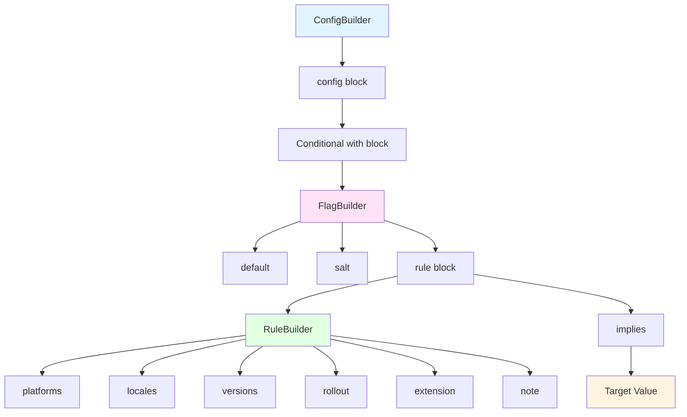
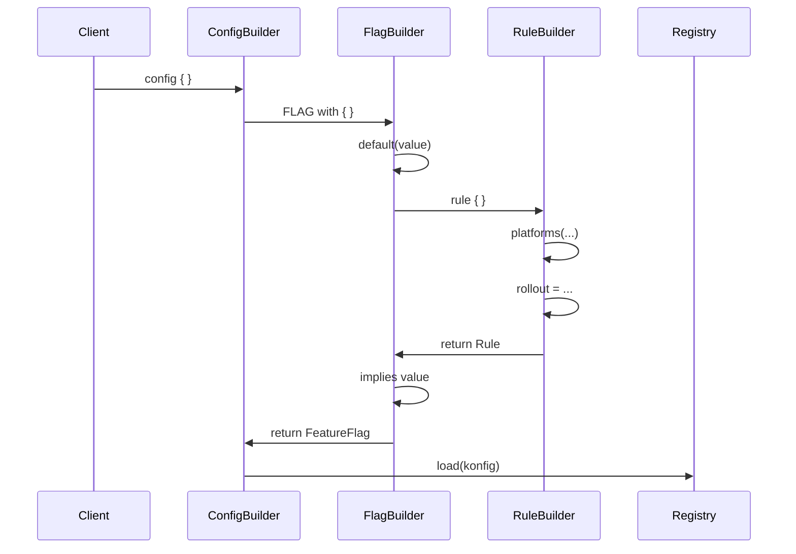

# Builder DSL

Konditional provides a type-safe DSL for declaratively defining feature flags and their rules. The DSL uses Kotlin's builder pattern and infix notation for readable, maintainable flag configurations.

## ConfigBuilder

The entry point for defining flag configurations.

```kotlin
@FeatureFlagDsl
class ConfigBuilder
```

### Creating Configurations

#### Load Directly into Registry

```kotlin
import io.amichne.konditional.builders.ConfigBuilder

ConfigBuilder.config {
    MY_FLAG with {
        default(value = false)
        // rules...
    }
}
// Configuration is immediately loaded into FlagRegistry
```

#### Build Snapshot for Later Use

```kotlin
val konfig = ConfigBuilder.buildSnapshot {
    MY_FLAG with {
        default(value = false)
    }
}

// Load later
FlagRegistry.load(konfig)

// Or serialize
val json = SnapshotSerializer.default.serialize(konfig)
```

### Custom Registry

```kotlin
ConfigBuilder.config(registry = customRegistry) {
    MY_FLAG with {
        default(value = false)
    }
}
```

## FlagBuilder

Configures individual feature flags within a ConfigBuilder block.

```kotlin
@FeatureFlagDsl
class FlagBuilder<S : Any, C : Context>
```

### Defining Flags

```kotlin
MY_FLAG with {
    // Required: set default value
    default(value = false)

    // Optional: set salt for hashing
    salt("v2")

    // Optional: define targeting rules
    rule {
        platforms(Platform.IOS)
        rollout = Rollout.of(50.0)
    } implies true
}
```

### Default Value

Every flag must have a default value returned when no rules match:

```kotlin
MY_FLAG with {
    default(value = false)
}
```

For complex types:

```kotlin
CONFIG_FLAG with {
    default(
        value = FeatureConfig(
            timeout = 5000,
            retries = 3,
            endpoint = "https://api.example.com"
        )
    )
}
```

### Salt

Optional salt string for deterministic hashing (defaults to "v1"):

```kotlin
MY_FLAG with {
    default(value = false)
    salt("v2")  // Use different salt for different bucketing
}
```

### Rules and Implications

Define targeting rules and their associated values using the `rule { } implies value` syntax:

```kotlin
MY_FLAG with {
    default(value = false)

    // Simple rule
    rule {
        platforms(Platform.IOS)
    } implies true

    // Multiple rules
    rule {
        platforms(Platform.ANDROID)
        rollout = Rollout.of(50.0)
    } implies true

    rule {
        locales(AppLocale.EN_US, AppLocale.EN_CA)
        platforms(Platform.WEB)
    } implies false
}
```

## RuleBuilder

Configures individual targeting rules within a FlagBuilder block.

```kotlin
@FeatureFlagDsl
class RuleBuilder<C : Context>
```

### Platform Targeting

Target specific platforms:

```kotlin
rule {
    platforms(Platform.IOS)
} implies true

// Multiple platforms
rule {
    platforms(Platform.IOS, Platform.ANDROID)
} implies true
```

### Locale Targeting

Target specific locales:

```kotlin
rule {
    locales(AppLocale.EN_US)
} implies true

// Multiple locales
rule {
    locales(AppLocale.EN_US, AppLocale.EN_CA, AppLocale.ES_US)
} implies true
```

### Version Targeting

Target version ranges:

```kotlin
rule {
    versions {
        min(Version(2, 0, 0))  // >= 2.0.0
    }
} implies true

rule {
    versions {
        max(Version(3, 0, 0))  // < 3.0.0
    }
} implies true

rule {
    versions {
        min(Version(2, 0, 0))  // >= 2.0.0 and < 3.0.0
        max(Version(3, 0, 0))
    }
} implies true

rule {
    versions {
        exactly(Version(2, 5, 0))  // exactly 2.5.0
    }
} implies true
```

### Rollout Percentage

Gradually roll out features to a percentage of users:

```kotlin
rule {
    rollout = Rollout.of(25.0)  // 25% of users
} implies true

rule {
    rollout = Rollout.of(50)    // 50% of users (Int also works)
} implies true

rule {
    rollout = Rollout.of("75.5")  // 75.5% of users (String also works)
} implies true
```

Rollout uses deterministic hashing with StableId for consistent bucketing.

### Notes

Add documentation to rules:

```kotlin
rule {
    note("iOS beta users only")
    platforms(Platform.IOS)
    rollout = Rollout.of(10.0)
} implies true
```

### Custom Extension Logic

Add custom evaluation logic beyond standard targeting:

```kotlin
rule {
    extension {
        object : Evaluable<EnterpriseContext>() {
            override fun matches(context: EnterpriseContext): Boolean {
                return context.subscriptionTier == SubscriptionTier.PREMIUM &&
                       context.organizationId.startsWith("enterprise-")
            }

            override fun specificity(): Int = 2
        }
    }
} implies true
```

### Combining Criteria

All criteria in a rule must match (AND logic):

```kotlin
rule {
    platforms(Platform.IOS)
    locales(AppLocale.EN_US)
    versions {
        min(Version(2, 0, 0))
    }
    rollout = Rollout.of(50.0)
} implies true
// Matches if: iOS AND EN_US AND >= 2.0.0 AND in rollout bucket
```

Multiple rules provide OR logic:

```kotlin
MY_FLAG with {
    default(value = false)

    // iOS users get true
    rule {
        platforms(Platform.IOS)
    } implies true

    // OR Android users with >= 2.0.0 get true
    rule {
        platforms(Platform.ANDROID)
        versions {
            min(Version(2, 0, 0))
        }
    } implies true
}
```

## Complete Examples

### Simple Boolean Toggle

```kotlin
ConfigBuilder.config {
    ENABLE_NEW_UI with {
        default(value = false)

        rule {
            platforms(Platform.IOS, Platform.ANDROID)
            rollout = Rollout.of(100.0)
        } implies true
    }
}
```

### Phased Rollout

```kotlin
ConfigBuilder.config {
    BETA_FEATURE with {
        default(value = false)

        // Phase 1: Internal testing (5%)
        rule {
            note("Internal testing phase")
            rollout = Rollout.of(5.0)
        } implies true

        // Phase 2: Beta users (25%)
        rule {
            note("Beta users")
            rollout = Rollout.of(25.0)
        } implies true

        // Phase 3: General availability (100%)
        rule {
            note("General availability")
            rollout = Rollout.of(100.0)
        } implies true
    }
}
```

### Platform-Specific Rollout

```kotlin
ConfigBuilder.config {
    NEW_CHECKOUT with {
        default(value = false)

        // Full rollout on iOS
        rule {
            platforms(Platform.IOS)
            versions {
                min(Version(2, 0, 0))
            }
        } implies true

        // 50% rollout on Android
        rule {
            platforms(Platform.ANDROID)
            versions {
                min(Version(2, 0, 0))
            }
            rollout = Rollout.of(50.0)
        } implies true

        // Not available on Web yet
    }
}
```

### Configuration Flag

```kotlin
data class ApiConfig(
    val endpoint: String,
    val timeout: Int,
    val retries: Int
)

val API_CONFIG: Conditional<ApiConfig, AppContext> =
    Conditional("api_config")

ConfigBuilder.config {
    API_CONFIG with {
        default(
            value = ApiConfig(
                endpoint = "https://api.example.com",
                timeout = 5000,
                retries = 3
            )
        )

        // Beta endpoint for testing
        rule {
            note("Beta API endpoint")
            rollout = Rollout.of(10.0)
        } implies ApiConfig(
            endpoint = "https://beta-api.example.com",
            timeout = 10000,
            retries = 5
        )
    }
}
```

### Regional Configuration

```kotlin
ConfigBuilder.config {
    FEATURE_ENABLED with {
        default(value = false)

        // North American launch
        rule {
            note("North America")
            locales(AppLocale.EN_US, AppLocale.EN_CA, AppLocale.ES_US)
            versions {
                min(Version(1, 5, 0))
            }
        } implies true

        // International markets
        rule {
            note("International markets")
            locales(AppLocale.HI_IN)
            versions {
                min(Version(2, 0, 0))
            }
            rollout = Rollout.of(50.0)
        } implies true
    }
}
```

### Extended Context Targeting

```kotlin
data class EnterpriseContext(
    override val locale: AppLocale,
    override val platform: Platform,
    override val appVersion: Version,
    override val stableId: StableId,
    val subscriptionTier: SubscriptionTier,
    val organizationSize: Int
) : Context

enum class SubscriptionTier { FREE, BASIC, PREMIUM, ENTERPRISE }

val PREMIUM_FEATURE: Conditional<Boolean, EnterpriseContext> =
    Conditional("premium_feature")

ConfigBuilder.config {
    PREMIUM_FEATURE with {
        default(value = false)

        rule {
            note("Premium and Enterprise tiers")
            extension {
                object : Evaluable<EnterpriseContext>() {
                    override fun matches(context: EnterpriseContext): Boolean =
                        context.subscriptionTier in setOf(
                            SubscriptionTier.PREMIUM,
                            SubscriptionTier.ENTERPRISE
                        )

                    override fun specificity(): Int = 1
                }
            }
        } implies true

        rule {
            note("Large Basic tier organizations (>100 users)")
            extension {
                object : Evaluable<EnterpriseContext>() {
                    override fun matches(context: EnterpriseContext): Boolean =
                        context.subscriptionTier == SubscriptionTier.BASIC &&
                        context.organizationSize > 100

                    override fun specificity(): Int = 2
                }
            }
        } implies true
    }
}
```

### Multi-Variant Flag

```kotlin
enum class CheckoutVariant {
    CONTROL, VARIANT_A, VARIANT_B
}

val CHECKOUT_VARIANT: Conditional<CheckoutVariant, AppContext> =
    Conditional("checkout_variant")

ConfigBuilder.config {
    CHECKOUT_VARIANT with {
        default(value = CheckoutVariant.CONTROL)

        // 33% get Variant A
        rule {
            note("Variant A")
            rollout = Rollout.of(33.0)
        } implies CheckoutVariant.VARIANT_A

        // 33% get Variant B
        rule {
            note("Variant B")
            rollout = Rollout.of(66.0)  // 66% total, so 33% additional
        } implies CheckoutVariant.VARIANT_B

        // Remaining 34% get control (default)
    }
}
```

## DSL Structure Diagram



## Builder Flow



## Best Practices

### 1. One Configuration Block

Define all flags in a single configuration block during initialization:

```kotlin
fun initializeFlags() {
    ConfigBuilder.config {
        FEATURE_A with { ... }
        FEATURE_B with { ... }
        FEATURE_C with { ... }
    }
}
```

### 2. Rule Specificity Ordering

More specific rules are evaluated first. Order doesn't matter in the DSL:

```kotlin
MY_FLAG with {
    default(value = "default")

    // These are automatically ordered by specificity
    rule {
        // Specificity: 3 (locale + platform + version)
        locales(AppLocale.EN_US)
        platforms(Platform.IOS)
        versions { min(Version(2, 0, 0)) }
    } implies "very-specific"

    rule {
        // Specificity: 2 (locale + platform)
        locales(AppLocale.EN_US)
        platforms(Platform.IOS)
    } implies "less-specific"

    rule {
        // Specificity: 1 (platform only)
        platforms(Platform.IOS)
    } implies "least-specific"
}
```

### 3. Use Notes for Documentation

Add notes to explain rule intent:

```kotlin
rule {
    note("iOS beta program - 10% of users for testing")
    platforms(Platform.IOS)
    rollout = Rollout.of(10.0)
} implies true
```

### 4. Extract Complex Rules

Extract complex extension logic to named classes:

```kotlin
class PremiumUserEvaluable : Evaluable<EnterpriseContext>() {
    override fun matches(context: EnterpriseContext): Boolean =
        context.subscriptionTier in setOf(
            SubscriptionTier.PREMIUM,
            SubscriptionTier.ENTERPRISE
        ) && context.accountAge > 30

    override fun specificity(): Int = 2
}

ConfigBuilder.config {
    PREMIUM_FEATURE with {
        default(value = false)
        rule {
            extension { PremiumUserEvaluable() }
        } implies true
    }
}
```

### 5. Validate Configurations

Build snapshots in tests to validate flag definitions:

```kotlin
@Test
fun validateFlagConfiguration() {
    val konfig = ConfigBuilder.buildSnapshot {
        MY_FLAG with {
            default(value = false)
            rule { platforms(Platform.IOS) } implies true
        }
    }

    assertEquals(1, konfig.flags.size)
    assertTrue(konfig.flags.containsKey(MY_FLAG))
}
```

## Related Documentation

- [Core API](Core.md) - Conditional and FeatureFlag types
- [Rules System](Rules.md) - Rule evaluation and composition
- [Context](Context.md) - Context types and extension
- [Flag Registry](Flags.md) - Loading and managing configurations
