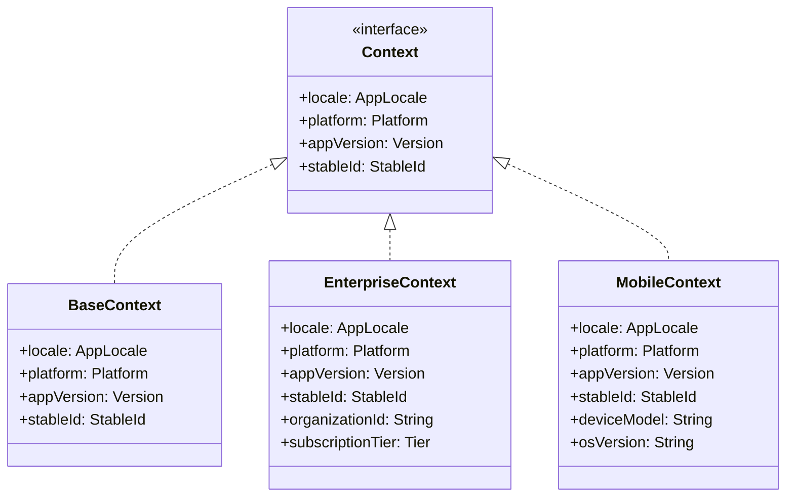

# Context System

The Context system provides the evaluation dimensions for feature flags. Contexts are passed to flags during evaluation to determine which rules match.

## Context Interface

```kotlin
interface Context {
    val locale: AppLocale
    val platform: Platform
    val appVersion: Version
    val stableId: StableId
}
```

### Standard Properties

- **locale**: Application locale for region/language targeting
- **platform**: Deployment platform (iOS, Android, Web)
- **appVersion**: Semantic version for version-based targeting
- **stableId**: Unique identifier for deterministic rollout bucketing

## Creating Contexts

### Factory Method

```kotlin
val context = Context(
    locale = AppLocale.EN_US,
    platform = Platform.IOS,
    appVersion = Version(1, 2, 3),
    stableId = StableId.of("550e8400-e29b-41d4-a716-446655440000")
)
```

### Data Class Implementation

```kotlin
data class AppContext(
    override val locale: AppLocale,
    override val platform: Platform,
    override val appVersion: Version,
    override val stableId: StableId
) : Context

val context = AppContext(
    locale = AppLocale.EN_US,
    platform = Platform.ANDROID,
    appVersion = Version(2, 0, 0),
    stableId = StableId.of(userId)
)
```

## Context Extension

Extend Context to add custom targeting dimensions:

```kotlin
data class EnterpriseContext(
    override val locale: AppLocale,
    override val platform: Platform,
    override val appVersion: Version,
    override val stableId: StableId,
    val organizationId: String,
    val subscriptionTier: SubscriptionTier,
    val isAdmin: Boolean
) : Context

enum class SubscriptionTier {
    FREE, BASIC, PREMIUM, ENTERPRISE
}
```

### Using Extended Contexts

```kotlin
// Define flags with custom context type
val PREMIUM_FEATURE: Conditional<Boolean, EnterpriseContext> =
    Conditional("premium_feature")

ConfigBuilder.config {
    PREMIUM_FEATURE with {
        default(value = false)

        rule {
            // Use custom extension for tier targeting
            extension {
                object : Evaluable<EnterpriseContext>() {
                    override fun matches(context: EnterpriseContext): Boolean =
                        context.subscriptionTier in setOf(
                            SubscriptionTier.PREMIUM,
                            SubscriptionTier.ENTERPRISE
                        )

                    override fun specificity(): Int = 1
                }
            }
        } implies true
    }
}

// Evaluate with extended context
val context = EnterpriseContext(
    locale = AppLocale.EN_US,
    platform = Platform.WEB,
    appVersion = Version(1, 0, 0),
    stableId = StableId.of(userId),
    organizationId = "acme-corp",
    subscriptionTier = SubscriptionTier.PREMIUM,
    isAdmin = true
)

val isEnabled = context.evaluate(PREMIUM_FEATURE)
```

## Context Properties

### AppLocale

Enum representing application locales:

```kotlin
enum class AppLocale {
    EN_US,  // English - United States
    ES_US,  // Spanish - United States
    EN_CA,  // English - Canada
    HI_IN   // Hindi - India
}
```

Extend with your supported locales:

```kotlin
enum class CustomLocale {
    EN_US, EN_GB, FR_FR, DE_DE, JA_JP, ZH_CN
}

data class CustomContext(
    val customLocale: CustomLocale,
    override val locale: AppLocale,  // Map to closest AppLocale
    override val platform: Platform,
    override val appVersion: Version,
    override val stableId: StableId
) : Context
```

### Platform

Enum representing deployment platforms:

```kotlin
enum class Platform {
    IOS,
    ANDROID,
    WEB
}
```

Target specific platforms in rules:

```kotlin
rule {
    platforms(Platform.IOS, Platform.ANDROID)
} implies true
```

### Version

Semantic version with major, minor, and patch components:

```kotlin
data class Version(
    val major: Int,
    val minor: Int,
    val patch: Int
) : Comparable<Version>
```

#### Creating Versions

```kotlin
// Constructor
val v1 = Version(1, 2, 3)

// Factory method
val v2 = Version.of(2, 0, 0)

// Parsing strings
val v3 = Version.parse("1.5.2")  // Version(1, 5, 2)
val v4 = Version.parse("2.0")    // Version(2, 0, 0)
val v5 = Version.parse("3")      // Version(3, 0, 0)

// Default version
val vDefault = Version.default  // Version(-1, -1, -1)
```

#### Version Comparison

```kotlin
val v1 = Version(1, 0, 0)
val v2 = Version(1, 5, 0)
val v3 = Version(2, 0, 0)

println(v1 < v2)  // true
println(v2 < v3)  // true
println(v1 == Version(1, 0, 0))  // true
```

### StableId

Type-safe wrapper for stable identifiers used in rollout bucketing:

```kotlin
sealed interface StableId {
    val id: String
    val hexId: HexId
}
```

#### Creating StableIds

```kotlin
// From UUID string (automatically normalized to hex)
val id1 = StableId.of("550e8400-e29b-41d4-a716-446655440000")

// From user ID
val id2 = StableId.of(userId)

// From device ID
val id3 = StableId.of(deviceId)
```

StableId validates and normalizes identifiers to hexadecimal format for consistent hashing.

## Context Evaluation

### Evaluation Extension Functions

The Context system provides extension functions for evaluating flags:

```kotlin
// Evaluate single flag (throws if not found)
fun <S : Any, C : Context> C.evaluate(
    key: Conditional<S, C>,
    registry: FlagRegistry = FlagRegistry
): S

// Evaluate all flags
fun <C : Context> C.evaluate(
    registry: FlagRegistry = FlagRegistry
): Map<Conditional<*, *>, Any?>
```

### Single Flag Evaluation

```kotlin
val MY_FLAG: Conditional<Boolean, MyContext> = Conditional("my_flag")

// Evaluate single flag
val value: Boolean = context.evaluate(MY_FLAG)

// With custom registry
val value2: Boolean = context.evaluate(MY_FLAG, registry = customRegistry)
```

### Batch Evaluation

```kotlin
// Evaluate all flags in registry
val allValues: Map<Conditional<*, *>, Any?> = context.evaluate()

allValues.forEach { (conditional, value) ->
    println("${conditional.key}: $value")
}

// Filter to specific flags
val myFlags = listOf(FLAG_A, FLAG_B, FLAG_C)
val values = context.evaluate().filterKeys { it in myFlags }
```

## Context Polymorphism

Konditional supports context type polymorphism through Kotlin's type system:



### Hierarchical Contexts

```kotlin
// Base context for all flags
interface AppContext : Context

// Specialized context for authenticated users
interface AuthenticatedContext : AppContext {
    val userId: String
    val accountType: AccountType
}

// Specialized context for premium features
interface PremiumContext : AuthenticatedContext {
    val subscriptionLevel: Int
    val expirationDate: LocalDate
}

// Flags can target any level of the hierarchy
val PUBLIC_FLAG: Conditional<Boolean, AppContext> = Conditional("public_feature")
val USER_FLAG: Conditional<Boolean, AuthenticatedContext> = Conditional("user_feature")
val PREMIUM_FLAG: Conditional<Boolean, PremiumContext> = Conditional("premium_feature")

// More specific contexts can evaluate more general flags
val premiumContext: PremiumContext = ...
premiumContext.evaluate(PUBLIC_FLAG)    // OK
premiumContext.evaluate(USER_FLAG)      // OK
premiumContext.evaluate(PREMIUM_FLAG)   // OK

// Less specific contexts cannot evaluate more specific flags
val appContext: AppContext = ...
appContext.evaluate(PUBLIC_FLAG)    // OK
// appContext.evaluate(USER_FLAG)   // Compile error!
```

## Common Patterns

### Application-Wide Context

```kotlin
class ContextProvider(
    private val localeProvider: LocaleProvider,
    private val platformDetector: PlatformDetector,
    private val versionProvider: VersionProvider,
    private val userIdProvider: UserIdProvider
) {
    fun current(): AppContext = AppContext(
        locale = localeProvider.current(),
        platform = platformDetector.detect(),
        appVersion = versionProvider.current(),
        stableId = StableId.of(userIdProvider.currentUserId())
    )
}

// Use throughout application
val context = contextProvider.current()
val isFeatureEnabled = context.evaluate(MY_FLAG)
```

### Context Caching

```kotlin
class CachedContextProvider {
    private var cachedContext: AppContext? = null
    private var lastUpdate = System.currentTimeMillis()
    private val cacheTimeout = 60_000L // 1 minute

    fun current(): AppContext {
        val now = System.currentTimeMillis()
        if (cachedContext == null || now - lastUpdate > cacheTimeout) {
            cachedContext = buildContext()
            lastUpdate = now
        }
        return cachedContext!!
    }

    private fun buildContext(): AppContext = AppContext(
        locale = getCurrentLocale(),
        platform = getCurrentPlatform(),
        appVersion = getCurrentVersion(),
        stableId = StableId.of(getUserId())
    )
}
```

### Testing Contexts

```kotlin
object TestContexts {
    fun minimal() = Context(
        locale = AppLocale.EN_US,
        platform = Platform.WEB,
        appVersion = Version(0, 0, 1),
        stableId = StableId.of("test-user-id")
    )

    fun withPlatform(platform: Platform) = minimal().copy(platform = platform)

    fun withVersion(version: Version) = minimal().copy(appVersion = version)

    fun withLocale(locale: AppLocale) = minimal().copy(locale = locale)
}

@Test
fun testIOSFeature() {
    val context = TestContexts.withPlatform(Platform.IOS)
    val value = context.evaluate(IOS_FEATURE)
    assertTrue(value)
}
```

### Dynamic Context Resolution

```kotlin
class DynamicContextResolver {
    fun resolve(request: HttpRequest): AppContext {
        val locale = request.headers["Accept-Language"]?.let {
            parseLocale(it)
        } ?: AppLocale.EN_US

        val platform = request.headers["User-Agent"]?.let {
            detectPlatform(it)
        } ?: Platform.WEB

        val version = request.headers["App-Version"]?.let {
            Version.parse(it)
        } ?: Version.default

        val userId = request.session["user_id"] ?: "anonymous"

        return AppContext(
            locale = locale,
            platform = platform,
            appVersion = version,
            stableId = StableId.of(userId)
        )
    }
}
```

## Best Practices

### 1. Keep Contexts Lightweight

Only include properties needed for targeting:

```kotlin
// Good - focused context
data class AppContext(
    override val locale: AppLocale,
    override val platform: Platform,
    override val appVersion: Version,
    override val stableId: StableId,
    val isPremium: Boolean
) : Context

// Avoid - too much data
data class BloatedContext(
    override val locale: AppLocale,
    override val platform: Platform,
    override val appVersion: Version,
    override val stableId: StableId,
    val userProfile: UserProfile,      // Heavy object
    val preferences: Preferences,      // Heavy object
    val sessionHistory: List<Event>   // Large collection
) : Context
```

### 2. Use StableId for Users, Not Sessions

StableId should be consistent across sessions for deterministic bucketing:

```kotlin
// Good - stable across sessions
StableId.of(userId)

// Bad - changes every session
StableId.of(sessionId)
```

### 3. Provide Context Factories

Make context creation consistent:

```kotlin
object Contexts {
    fun forUser(userId: String): AppContext = AppContext(
        locale = getUserLocale(userId),
        platform = getUserPlatform(userId),
        appVersion = getAppVersion(),
        stableId = StableId.of(userId)
    )

    fun forAnonymous(): AppContext = AppContext(
        locale = AppLocale.EN_US,
        platform = Platform.WEB,
        appVersion = getAppVersion(),
        stableId = StableId.of("anonymous-${generateId()}")
    )
}
```

### 4. Validate Extended Properties

When extending Context, validate custom properties:

```kotlin
data class EnterpriseContext(
    override val locale: AppLocale,
    override val platform: Platform,
    override val appVersion: Version,
    override val stableId: StableId,
    val organizationId: String,
    val subscriptionTier: SubscriptionTier
) : Context {
    init {
        require(organizationId.isNotBlank()) {
            "organizationId cannot be blank"
        }
    }
}
```

## Related Documentation

- [Core API](Core.md) - Conditional and evaluation basics
- [Rules System](Rules.md) - Using context in rule matching
- [Builders](Builders.md) - Building flags with context types
- [Examples](examples/) - Complete context usage examples
