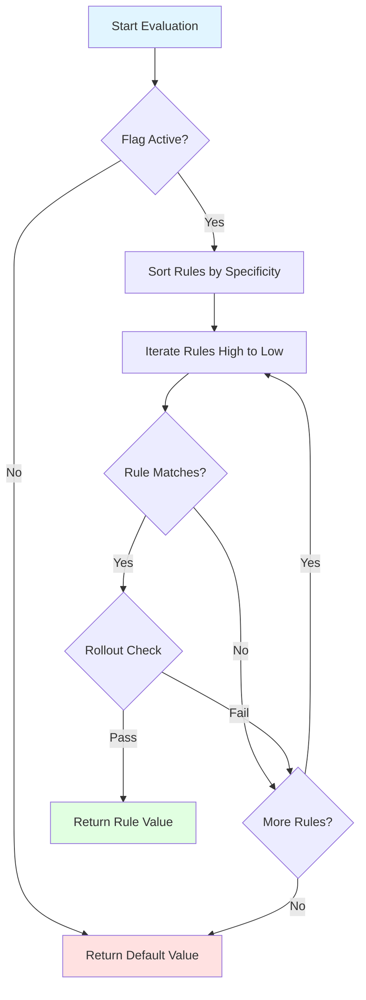

# Core API

The core API provides the fundamental types and operations for working with feature flags.

## Conditional

A `Conditional<S, C>` is a typed key that identifies a feature flag in the registry.

```kotlin
interface Conditional<S : Any, C : Context> {
    val registry: FlagRegistry
    val key: String

    fun update(definition: FeatureFlag<S, C>)
}
```

### Creating Conditionals

```kotlin
// Using the invoke operator
val MY_FLAG: Conditional<Boolean, MyContext> =
    Conditional("my_flag")

// With custom registry
val MY_FLAG: Conditional<Boolean, MyContext> =
    Conditional("my_flag", registry = customRegistry)
```

### Type Parameters

- `S`: The value type this flag returns (must be non-nullable)
- `C`: The context type used for evaluation

### Common Patterns

#### Enum-Based Flags

```kotlin
enum class Features(override val key: String) : Conditional<Boolean, AppContext> {
    ENABLE_NEW_UI("enable_new_ui"),
    ENABLE_ANALYTICS("enable_analytics");

    override val registry: FlagRegistry = FlagRegistry
}

// Usage
val isEnabled = context.evaluate(Features.ENABLE_NEW_UI)
```

#### Sealed Class Flags

```kotlin
sealed class StringFlags(override val key: String) : Conditional<String, AppContext> {
    override val registry: FlagRegistry = FlagRegistry

    data object ApiEndpoint : StringFlags("api_endpoint")
    data object ThemeColor : StringFlags("theme_color")
}

// Usage
val endpoint = context.evaluate(StringFlags.ApiEndpoint)
```

## FeatureFlag

A `FeatureFlag<S, C>` defines the complete behavior of a flag.

```kotlin
sealed class FeatureFlag<S : Any, C : Context>(
    val defaultValue: S,
    val isActive: Boolean,
    val conditional: Conditional<S, C>,
    val values: List<ConditionalValue<S, C>>,
    val salt: String = "v1"
)
```

### Properties

- **defaultValue**: Returned when no rules match or flag is inactive
- **isActive**: If false, always returns defaultValue
- **conditional**: The key identifying this flag
- **values**: List of rules paired with target values
- **salt**: Salt string for deterministic hashing

### Construction

Feature flags are typically constructed via the Builder DSL (see [Builders](Builders.md)), but can be created directly:

```kotlin
val flag = FeatureFlag(
    conditional = MY_FLAG,
    bounds = listOf(
        ConditionalValue(
            rule = Rule(
                rollout = Rollout.of(50.0),
                locales = setOf(AppLocale.EN_US)
            ),
            value = true
        )
    ),
    defaultValue = false,
    salt = "v1",
    isActive = true
)
```

## Evaluation Results

### EvaluationResult

Type-safe result type for flag evaluation operations.

```kotlin
sealed interface EvaluationResult<out S> {
    data class Success<S>(val value: S) : EvaluationResult<S>
    data class FlagNotFound(val key: String) : EvaluationResult<Nothing>
    data class EvaluationError(val key: String, val error: Throwable) : EvaluationResult<Nothing>
}
```

### Usage Patterns

```kotlin
import io.amichne.konditional.core.result.EvaluationResult

// Pattern matching
when (val result = evaluateSafe(MY_FLAG, context)) {
    is EvaluationResult.Success -> println("Value: ${result.value}")
    is EvaluationResult.FlagNotFound -> println("Flag not found: ${result.key}")
    is EvaluationResult.EvaluationError -> println("Error: ${result.error}")
}

// Folding to custom types
val kotlinResult: Result<Boolean> = when (val result = evaluateSafe(MY_FLAG, context)) {
    is EvaluationResult.Success -> Result.success(result.value)
    is EvaluationResult.FlagNotFound -> Result.failure(Exception(result.key))
    is EvaluationResult.EvaluationError -> Result.failure(result.error)
}
```

### ParseResult

Type-safe result for parsing operations (deserialization, validation).

```kotlin
sealed interface ParseResult<out T> {
    data class Success<T>(val value: T) : ParseResult<T>
    data class Failure(val error: ParseError) : ParseResult<Nothing>
}
```

#### ParseError Types

```kotlin
sealed interface ParseError {
    data class InvalidJson(val message: String) : ParseError
    data class InvalidSnapshot(val message: String) : ParseError
    data class MissingKey(val key: String) : ParseError
    data class InvalidType(val expected: String, val actual: String) : ParseError
}
```

### Usage Example

```kotlin
val serializer = SnapshotSerializer.default

// Deserialize with type-safe error handling
when (val result = serializer.deserialize(json)) {
    is ParseResult.Success -> {
        registry.load(result.value)
        println("Loaded ${result.value.flags.size} flags")
    }
    is ParseResult.Failure -> when (val error = result.error) {
        is ParseError.InvalidJson -> println("Invalid JSON: ${error.message}")
        is ParseError.InvalidSnapshot -> println("Invalid snapshot: ${error.message}")
        is ParseError.MissingKey -> println("Missing key: ${error.key}")
        is ParseError.InvalidType -> println("Type mismatch: ${error.expected} vs ${error.actual}")
    }
}
```

## Value Types

### ValueType (Internal)

Internal sealed hierarchy representing the types of values flags can produce. Users typically don't interact with this directly.

## Type Safety Examples

### Compile-Time Safety

```kotlin
// Type-safe flag definitions
val BOOLEAN_FLAG: Conditional<Boolean, MyContext> = Conditional("bool_flag")
val STRING_FLAG: Conditional<String, MyContext> = Conditional("string_flag")
val INT_FLAG: Conditional<Int, MyContext> = Conditional("int_flag")

// Compiler enforces correct types
val boolValue: Boolean = context.evaluate(BOOLEAN_FLAG) // OK
val stringValue: String = context.evaluate(STRING_FLAG) // OK

// Won't compile - type mismatch
// val wrongType: String = context.evaluate(BOOLEAN_FLAG) // Compile error!
```

### Custom Value Types

```kotlin
// Any non-nullable type works
data class FeatureConfig(
    val timeout: Int,
    val retries: Int,
    val endpoint: String
)

val CONFIG_FLAG: Conditional<FeatureConfig, MyContext> =
    Conditional("feature_config")

ConfigBuilder.config {
    CONFIG_FLAG with {
        default(
            value = FeatureConfig(
                timeout = 5000,
                retries = 3,
                endpoint = "https://api.example.com"
            )
        )
    }
}

// Type-safe evaluation
val config: FeatureConfig = context.evaluate(CONFIG_FLAG)
println("Timeout: ${config.timeout}ms")
```

## Evaluation Flow Diagram



## Best Practices

### 1. Use Enums for Related Flags

```kotlin
enum class FeatureToggles(override val key: String) : Conditional<Boolean, AppContext> {
    NEW_CHECKOUT("new_checkout"),
    FAST_SHIPPING("fast_shipping"),
    LOYALTY_PROGRAM("loyalty_program");

    override val registry: FlagRegistry = FlagRegistry
}
```

### 2. Group by Value Type

```kotlin
// Boolean toggles
object Toggles {
    val FEATURE_A: Conditional<Boolean, AppContext> = Conditional("feature_a")
    val FEATURE_B: Conditional<Boolean, AppContext> = Conditional("feature_b")
}

// String configuration
object Config {
    val API_URL: Conditional<String, AppContext> = Conditional("api_url")
    val THEME: Conditional<String, AppContext> = Conditional("theme")
}
```

### 3. Define Once, Use Everywhere

```kotlin
// In shared module
object AppFlags {
    val ENABLE_DARK_MODE: Conditional<Boolean, AppContext> = Conditional("dark_mode")
}

// In feature module
class SettingsViewModel {
    fun isDarkModeEnabled(): Boolean =
        appContext.evaluate(AppFlags.ENABLE_DARK_MODE)
}
```

### 4. Handle Evaluation Safely

```kotlin
// Throwing version (use when flag must exist)
fun getCriticalValue(): String =
    context.evaluate(CRITICAL_FLAG)

// Safe version (use when flag may not exist)
fun getOptionalValue(): String? =
    when (val result = evaluateSafe(OPTIONAL_FLAG, context)) {
        is EvaluationResult.Success -> result.value
        else -> null
    }
```

## Related Documentation

- [Context System](Context.md) - Context types and evaluation
- [Flag Registry](Flags.md) - Managing flag configurations
- [Rules System](Rules.md) - Rule composition and matching
- [Builders](Builders.md) - DSL for flag definition
