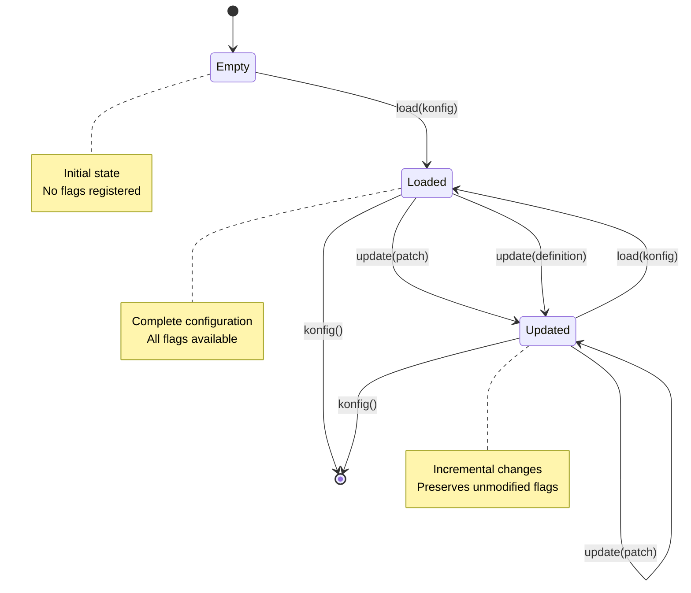

# Flag Registry API

The `FlagRegistry` manages the lifecycle of feature flag configurations, providing thread-safe operations for loading, updating, and querying flags.

## FlagRegistry Interface

```kotlin
interface FlagRegistry {
    fun load(config: Konfig)
    fun update(patch: KonfigPatch)
    fun <S : Any, C : Context> update(definition: FeatureFlag<S, C>)
    fun konfig(): Konfig
    fun <S : Any, C : Context> featureFlag(key: Conditional<S, C>): FeatureFlag<S, C>?
    fun allFlags(): Map<Conditional<*, *>, FeatureFlag<*, *>>
}
```

## Default Singleton Registry

The companion object delegates to `SingletonFlagRegistry`, providing a thread-safe, global registry:

```kotlin
// Access the default registry
val registry = FlagRegistry

// All operations use atomic updates
registry.load(konfig)
```

## Operations

### Loading Complete Configurations

Replace the entire registry with a new configuration atomically:

```kotlin
import io.amichne.konditional.builders.ConfigBuilder

ConfigBuilder.config {
    MY_FLAG with {
        default(value = false)
        rule {
            platforms(Platform.IOS)
        } implies true
    }

    ANOTHER_FLAG with {
        default(value = "default")
    }
}

// Registry is now loaded with these flags
```

Alternatively, build a snapshot and load explicitly:

```kotlin
val konfig = ConfigBuilder.buildSnapshot {
    MY_FLAG with {
        default(value = false)
    }
}

FlagRegistry.load(konfig)
```

### Applying Patches

Update specific flags without replacing the entire configuration:

```kotlin
import io.amichne.konditional.core.instance.KonfigPatch

// Create a patch
val patch = KonfigPatch.patch {
    add(newFlagDefinition)
    remove(OLD_FLAG)
}

// Apply atomically
FlagRegistry.update(patch)
```

Build a patch from current state:

```kotlin
val currentKonfig = FlagRegistry.konfig()

val patch = KonfigPatch.from(currentKonfig) {
    add(updatedFlagDefinition)
    remove(DEPRECATED_FLAG)
}

FlagRegistry.update(patch)
```

### Updating Individual Flags

Update a single flag definition:

```kotlin
import io.amichne.konditional.builders.FlagBuilder.Companion.flag

val updatedFlag = MY_FLAG.flag {
    default(value = true)
    rule {
        rollout = Rollout.of(100.0)
    } implies false
}

FlagRegistry.update(updatedFlag)
```

Or use the Conditional's update method:

```kotlin
MY_FLAG.update(updatedFlag)
```

### Querying Flags

#### Get Specific Flag

```kotlin
val flag: FeatureFlag<Boolean, MyContext>? =
    FlagRegistry.featureFlag(MY_FLAG)

if (flag != null) {
    println("Default value: ${flag.defaultValue}")
    println("Active: ${flag.isActive}")
    println("Rules: ${flag.values.size}")
}
```

#### Get All Flags

```kotlin
val allFlags: Map<Conditional<*, *>, FeatureFlag<*, *>> =
    FlagRegistry.allFlags()

println("Total flags: ${allFlags.size}")

allFlags.forEach { (conditional, flag) ->
    println("Flag: ${conditional.key}, Active: ${flag.isActive}")
}
```

#### Get Current Snapshot

```kotlin
val snapshot: Konfig = FlagRegistry.konfig()

println("Snapshot contains ${snapshot.flags.size} flags")

// Snapshot is immutable and can be safely serialized
val json = SnapshotSerializer.default.serialize(snapshot)
```

## Konfig

A `Konfig` represents an immutable snapshot of flag configurations:

```kotlin
data class Konfig internal constructor(
    val flags: Map<Conditional<*, *>, FeatureFlag<*, *>>
)
```

### Creating Snapshots

```kotlin
// Via ConfigBuilder
val konfig = ConfigBuilder.buildSnapshot {
    FLAG_A with { default(value = true) }
    FLAG_B with { default(value = "value") }
}

// Load into registry
FlagRegistry.load(konfig)
```

## KonfigPatch

A `KonfigPatch` represents incremental changes to a configuration:

```kotlin
data class KonfigPatch internal constructor(
    val flags: Map<Conditional<*, *>, FeatureFlag<*, *>>,
    val removeKeys: Set<Conditional<*, *>>
)
```

### Creating Patches

#### Empty Patch

```kotlin
val emptyPatch = KonfigPatch.empty()
```

#### Patch Builder

```kotlin
val patch = KonfigPatch.patch {
    // Add or update flags
    add(newFlagDefinition)
    add(updatedFlagDefinition)

    // Remove flags
    remove(OLD_FLAG)
    remove(DEPRECATED_FLAG)
}
```

#### From Current Snapshot

```kotlin
val currentKonfig = FlagRegistry.konfig()

val patch = KonfigPatch.from(currentKonfig) {
    add(MY_FLAG.flag {
        default(value = true)
    })
}
```

### Applying Patches

#### Directly to Registry

```kotlin
FlagRegistry.update(patch)
```

#### To a Snapshot

```kotlin
val currentKonfig = FlagRegistry.konfig()
val newKonfig = patch.applyTo(currentKonfig)

// Load the patched configuration
FlagRegistry.load(newKonfig)
```

## Thread Safety

The singleton registry uses atomic operations for all mutations:

```kotlin
// Safe from multiple threads
Thread {
    FlagRegistry.update(patch1)
}.start()

Thread {
    FlagRegistry.update(patch2)
}.start()

// All reads see consistent snapshots
val snapshot = FlagRegistry.konfig()
```

### Immutable Snapshots

Konfig snapshots are immutable and safe to share:

```kotlin
val snapshot1 = FlagRegistry.konfig()

// Update the registry
FlagRegistry.update(patch)

val snapshot2 = FlagRegistry.konfig()

// snapshot1 is unchanged
assert(snapshot1 != snapshot2)
```

## Registry Lifecycle Diagram



## Common Patterns

### Application Startup

```kotlin
class Application {
    fun onCreate() {
        // Load initial configuration
        ConfigBuilder.config {
            FEATURE_A with { default(value = false) }
            FEATURE_B with { default(value = "default") }
        }

        // Flags are now available
        println("Registry loaded: ${FlagRegistry.allFlags().size} flags")
    }
}
```

### Remote Configuration Updates

```kotlin
class FlagService {
    private val serializer = SnapshotSerializer.default

    suspend fun fetchAndApplyRemoteConfig() {
        val json = httpClient.get("/api/flags")

        when (val result = serializer.deserialize(json)) {
            is ParseResult.Success -> {
                FlagRegistry.load(result.value)
                println("Loaded remote configuration")
            }
            is ParseResult.Failure -> {
                println("Failed to parse: ${result.error}")
            }
        }
    }

    suspend fun fetchAndApplyPatch() {
        val json = httpClient.get("/api/flags/patch")

        when (val result = serializer.deserializePatchToCore(json)) {
            is ParseResult.Success -> {
                FlagRegistry.update(result.value)
                println("Applied patch")
            }
            is ParseResult.Failure -> {
                println("Failed to parse patch: ${result.error}")
            }
        }
    }
}
```

### Testing with Custom Registry

```kotlin
class TestFlagRegistry : FlagRegistry {
    private val flags = mutableMapOf<Conditional<*, *>, FeatureFlag<*, *>>()

    override fun load(config: Konfig) {
        flags.clear()
        flags.putAll(config.flags)
    }

    override fun konfig(): Konfig = Konfig(flags.toMap())

    // Implement other methods...
}

class MyTest {
    private val testRegistry = TestFlagRegistry()

    @Test
    fun testWithCustomFlags() {
        val konfig = ConfigBuilder.buildSnapshot {
            TEST_FLAG with {
                default(value = true)
            }
        }

        testRegistry.load(konfig)

        // Use test registry for evaluation
        val context = MyContext(...)
        val value = context.evaluate(TEST_FLAG, registry = testRegistry)

        assertEquals(true, value)
    }
}
```

### Hot Reloading in Development

```kotlin
class DevelopmentFlagManager {
    private val watcher = FileWatcher("/path/to/flags.json")

    init {
        watcher.onChange { file ->
            val json = file.readText()
            when (val result = SnapshotSerializer.default.deserialize(json)) {
                is ParseResult.Success -> {
                    FlagRegistry.load(result.value)
                    println("Reloaded flags from ${file.name}")
                }
                is ParseResult.Failure -> {
                    println("Failed to reload: ${result.error}")
                }
            }
        }
    }
}
```

### Graceful Degradation

```kotlin
class ResilientFlagService {
    private var lastGoodKonfig: Konfig? = null

    suspend fun updateFlags() {
        try {
            val json = fetchRemoteFlags()
            when (val result = SnapshotSerializer.default.deserialize(json)) {
                is ParseResult.Success -> {
                    lastGoodKonfig = result.value
                    FlagRegistry.load(result.value)
                }
                is ParseResult.Failure -> {
                    // Fall back to last known good configuration
                    lastGoodKonfig?.let { FlagRegistry.load(it) }
                }
            }
        } catch (e: Exception) {
            // Network error - keep current configuration
            println("Failed to fetch flags, keeping current config")
        }
    }
}
```

## Best Practices

### 1. Load Configuration Early

Load flags during application initialization before they're needed:

```kotlin
class Application {
    fun onCreate() {
        loadFlags() // Synchronous initial load
        startRemoteFlagSync() // Async updates
    }
}
```

### 2. Use Patches for Incremental Updates

When only a few flags change, use patches instead of full snapshots:

```kotlin
// Efficient - only updates changed flags
val patch = KonfigPatch.patch {
    add(updatedFlag)
}
FlagRegistry.update(patch)

// Less efficient - replaces everything
FlagRegistry.load(newKonfig)
```

### 3. Validate Before Loading

Use ParseResult to validate configurations before applying:

```kotlin
when (val result = serializer.deserialize(json)) {
    is ParseResult.Success -> {
        // Validation passed, safe to load
        FlagRegistry.load(result.value)
    }
    is ParseResult.Failure -> {
        // Handle invalid configuration
        reportError(result.error)
    }
}
```

### 4. Snapshot for Consistency

Capture a snapshot when you need a consistent view across multiple evaluations:

```kotlin
val snapshot = FlagRegistry.konfig()

// Evaluate multiple flags against the same snapshot
val results = listOf(FLAG_A, FLAG_B, FLAG_C).map { flag ->
    snapshot.flags[flag]?.evaluate(context)
}
```

## Related Documentation

- [Core API](Core.md) - Conditional and FeatureFlag types
- [Serialization](Serialization.md) - JSON serialization and deserialization
- [Builders](Builders.md) - DSL for building configurations
- [Context](Context.md) - Evaluation contexts
