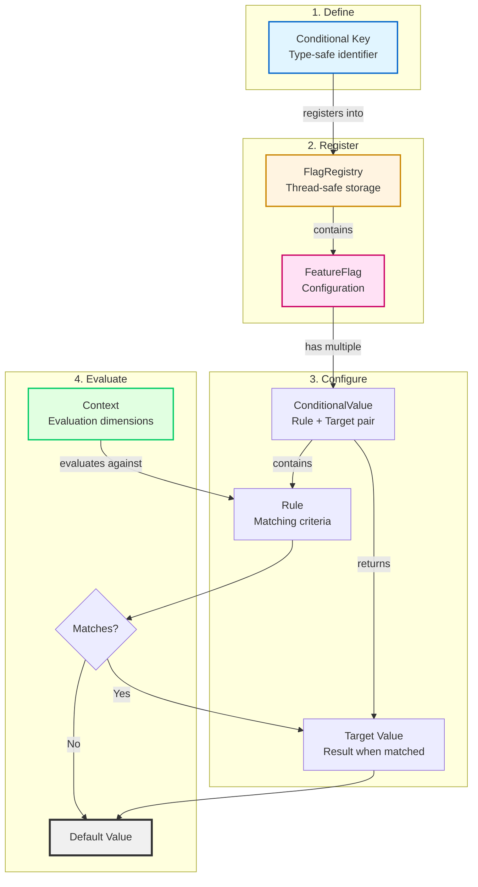
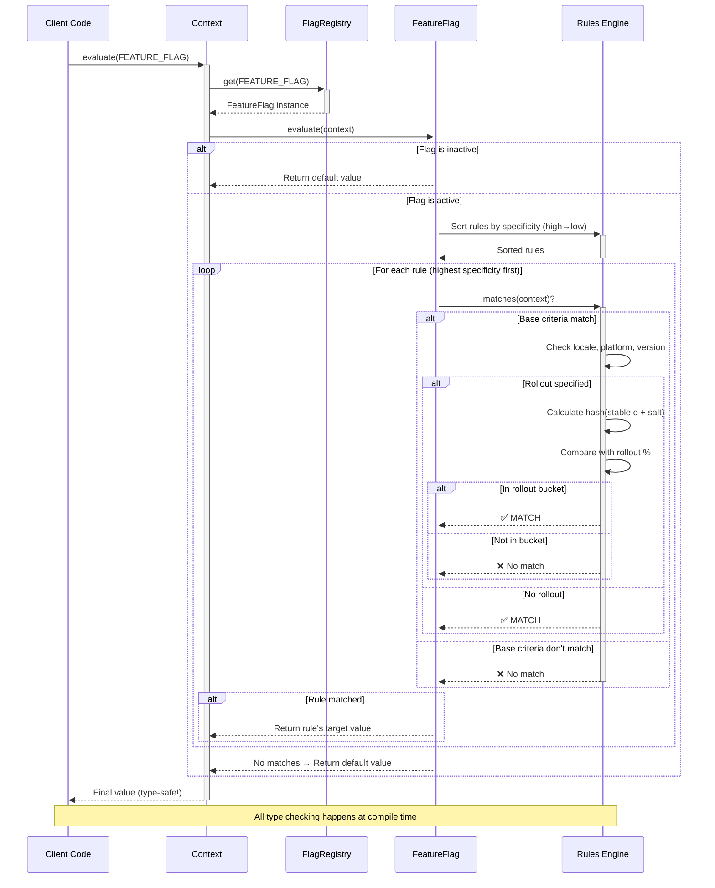

# Konditional API Overview

Konditional is a type-safe, composable feature flag library for Kotlin that follows Parse Don't Validate principles. It enables context-driven conditional logic with compile-time safety and runtime flexibility.

## Core Concepts

### 1. Conditionals

A `Conditional<S, C>` is a typed feature flag key that identifies a flag in the registry.

- `S`: The value type the flag returns (Boolean, String, custom types, etc.)
- `C`: The context type used for evaluation

```kotlin
val ENABLE_FEATURE: Conditional<Boolean, MyContext> =
    Conditional("enable_feature")
```

### 2. Context

`Context` provides the evaluation dimensions for feature flags:

- **locale**: Application locale (AppLocale)
- **platform**: Deployment platform (Platform)
- **appVersion**: Semantic version (Version)
- **stableId**: Unique identifier for deterministic bucketing (StableId)

Extend `Context` to add custom targeting dimensions.

### 3. Feature Flags

`FeatureFlag<S, C>` defines the behavior of a flag:

- Default value when no rules match
- List of conditional values (rule + target value pairs)
- Active/inactive state
- Salt for deterministic hashing

### 4. Rules

`Rule<C>` defines matching criteria:

- **Base matching**: locale, platform, version range
- **Extension matching**: custom logic via `Evaluable<C>`
- **Rollout**: percentage-based gradual deployment
- **Specificity**: precedence when multiple rules match

### 5. Registry

`FlagRegistry` manages flag configurations:

- Thread-safe singleton registry (default)
- Load complete snapshots
- Apply incremental patches
- Update individual flags

## Architecture



<details>
<summary><strong>Architecture Walkthrough</strong></summary>

1. **Define**: Create a `Conditional<S, C>` key with value type `S` and context type `C`
2. **Register**: Store the flag configuration in `FlagRegistry` (thread-safe singleton)
3. **Configure**: Define rules and their target values using the builder DSL
4. **Evaluate**: Pass a `Context` to evaluate which rule matches and return the appropriate value

This architecture ensures type safety at every step while maintaining flexibility for complex targeting logic.
</details>

## Evaluation Flow



<details>
<summary><strong>Evaluation Flow Explained</strong></summary>

1. **Client calls** `context.evaluate(FEATURE_FLAG)`
2. **Registry lookup**: Find the `FeatureFlag` configuration
3. **Active check**: If inactive, return default immediately
4. **Sort rules**: Order by specificity (most specific first)
5. **Match loop**: For each rule:
   - Check base criteria (locale, platform, version)
   - If rollout specified, perform deterministic bucket check using SHA-256
   - Return target value on first match
6. **Default fallback**: If no rules match, return default value

The entire flow is type-safe - the compiler ensures the returned value matches the `Conditional<S, C>` type parameter `S`.
</details>

## Type Safety

Konditional enforces type safety at compile time:

```kotlin
// Compile error: Type mismatch
val BOOLEAN_FLAG: Conditional<Boolean, MyContext> = Conditional("flag")
val stringValue: String = context.evaluate(BOOLEAN_FLAG) // Won't compile!

// Correct usage
val boolValue: Boolean = context.evaluate(BOOLEAN_FLAG) // Type-safe
```

## Parse Don't Validate

Konditional follows functional programming principles:

- Refined types encode invariants (Rollout, StableId, Version)
- Result types for fallible operations (EvaluationResult, ParseResult)
- Illegal states are unrepresentable
- No redundant validation in domain logic

## Key Features

### Thread-Safe Registry

The singleton `FlagRegistry` uses atomic operations for safe concurrent access.

### Composable Rules

Rules compose base targeting with custom extension logic:

```kotlin
Rule(
    locales = setOf(AppLocale.EN_US),
    platforms = setOf(Platform.IOS),
    extension = object : Evaluable<MyContext>() {
        override fun matches(context: MyContext) = context.isPremium
        override fun specificity() = 1
    }
)
```

### Deterministic Rollouts

Rollout percentages use consistent hashing with stable IDs for deterministic bucketing.

### JSON Serialization

Built-in serialization for remote configuration:

```kotlin
val serializer = SnapshotSerializer.default
val json = serializer.serialize(konfig)
val result = serializer.deserialize(json) // ParseResult<Konfig>
```

### DSL Builders

Type-safe DSL for defining flags:

```kotlin
ConfigBuilder.config {
    MY_FLAG with {
        default(value = false)
        rule {
            platforms(Platform.IOS)
            rollout = Rollout.of(50.0)
        } implies true
    }
}
```

## Next Steps

- [Core API](Core.md) - Conditional evaluation and results
- [Context System](Context.md) - Context types and extension
- [Flag Registry](Flags.md) - Registry operations and lifecycle
- [Rules System](Rules.md) - Rule composition and evaluation
- [Builder DSL](Builders.md) - Declarative flag configuration
- [Serialization](Serialization.md) - JSON serialization and deserialization
- [Examples](examples/README.md - Complete working examples
