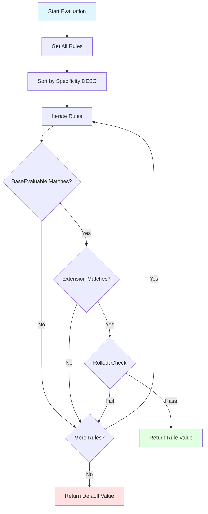
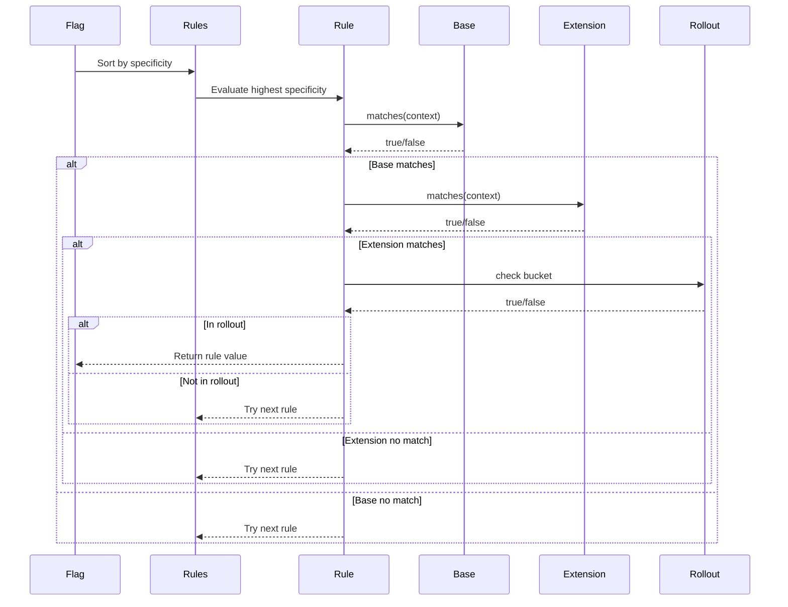

# Rules System

The Rules system provides composable evaluation logic for feature flags. Rules determine which contexts match and return target values based on targeting criteria.

## Rule

A `Rule<C>` combines standard client targeting with extensible custom logic.

```kotlin
data class Rule<C : Context>(
    val rollout: Rollout = Rollout.of(100.0),
    val note: String? = null,
    val baseEvaluable: BaseEvaluable<C> = BaseEvaluable(),
    val extension: Evaluable<C> = object : Evaluable<C>() {}
)
```

### Properties

- **rollout**: Percentage of users (0-100) that should match after criteria are met
- **note**: Optional documentation explaining the rule's purpose
- **baseEvaluable**: Standard targeting (locale, platform, version)
- **extension**: Custom evaluation logic

### Composition Architecture

Rules compose two evaluation strategies:

```kotlin
Rule.matches(context) = baseEvaluable.matches(context) && extension.matches(context)
Rule.specificity() = baseEvaluable.specificity() + extension.specificity()
```

Both evaluators must match for the rule to match, and specificity values are summed.

## ConditionalValue

A `ConditionalValue<S, C>` pairs a rule with its target value.

```kotlin
data class ConditionalValue<S, Any, C : Context>(
    val rule: Rule<C>,
    val value: S
)
```

When a rule matches, its paired value is returned:

```kotlin
// Created via the DSL
rule {
    platforms(Platform.IOS)
} implies true
// Creates: ConditionalValue(rule=..., value=true)
```

## Evaluable

Base abstraction for composable evaluation logic.

```kotlin
abstract class Evaluable<C : Context> {
    open fun matches(context: C): Boolean = true
    open fun specificity(): Int = 0
}
```

### Implementing Custom Evaluables

```kotlin
class PremiumUserEvaluable : Evaluable<EnterpriseContext>() {
    override fun matches(context: EnterpriseContext): Boolean =
        context.subscriptionTier in setOf(
            SubscriptionTier.PREMIUM,
            SubscriptionTier.ENTERPRISE
        )

    override fun specificity(): Int = 1
}

// Usage in rules
rule {
    extension { PremiumUserEvaluable() }
} implies true
```

### Anonymous Evaluables

```kotlin
rule {
    extension {
        object : Evaluable<MyContext>() {
            override fun matches(context: MyContext): Boolean =
                context.customProperty == "value"

            override fun specificity(): Int = 1
        }
    }
} implies true
```

## BaseEvaluable

Standard targeting for locale, platform, and version.

```kotlin
data class BaseEvaluable<C : Context>(
    val locales: Set<AppLocale> = emptySet(),
    val platforms: Set<Platform> = emptySet(),
    val versionRange: VersionRange = Unbounded
) : Evaluable<C>()
```

### Empty Means Match All

BaseEvaluable follows an "empty matches all" semantic:

- Empty `locales` set matches all locales
- Empty `platforms` set matches all platforms
- `Unbounded` version range matches all versions

### Specificity

Each non-empty constraint adds 1 to specificity:

- No constraints: specificity = 0
- Locale only: specificity = 1
- Platform + version: specificity = 2
- All three: specificity = 3

## Version Ranges

Version ranges define which app versions a rule targets.

### VersionRange Types

```kotlin
sealed class VersionRange(
    val type: Type,
    val min: Version? = null,
    val max: Version? = null
) {
    enum class Type {
        MIN_BOUND,        // >= min
        MAX_BOUND,        // < max
        MIN_AND_MAX_BOUND, // >= min and < max
        UNBOUNDED         // All versions
    }

    fun contains(v: Version): Boolean
    fun hasBounds(): Boolean
}
```

### Version Range Variants

#### Unbounded

Matches all versions:

```kotlin
object Unbounded : VersionRange(Type.UNBOUNDED)

// Usage in rules
rule {
    // No version constraint - matches all versions
} implies value
```

#### LeftBound (Minimum)

Matches versions >= min:

```kotlin
data class LeftBound(val min: Version) : VersionRange(Type.MIN_BOUND, min = min)

// Via DSL
rule {
    versions {
        min(Version(2, 0, 0))  // >= 2.0.0
    }
} implies value
```

#### RightBound (Maximum)

Matches versions < max:

```kotlin
data class RightBound(val max: Version) : VersionRange(Type.MAX_BOUND, max = max)

// Via DSL
rule {
    versions {
        max(Version(3, 0, 0))  // < 3.0.0
    }
} implies value
```

#### FullyBound (Range)

Matches versions >= min and < max:

```kotlin
data class FullyBound(
    val min: Version,
    val max: Version
) : VersionRange(Type.MIN_AND_MAX_BOUND, min = min, max = max)

// Via DSL
rule {
    versions {
        min(Version(2, 0, 0))
        max(Version(3, 0, 0))  // >= 2.0.0 and < 3.0.0
    }
} implies value
```

### Version Range Examples

```kotlin
// All versions >= 2.0.0
rule {
    versions { min(Version(2, 0, 0)) }
} implies true

// All versions < 3.0.0
rule {
    versions { max(Version(3, 0, 0)) }
} implies true

// Versions 2.x.x only
rule {
    versions {
        min(Version(2, 0, 0))
        max(Version(3, 0, 0))
    }
} implies true

// Specific version
rule {
    versions { exactly(Version(2, 5, 0)) }
} implies true
```

## Rollout

Type-safe percentage for gradual deployment.

```kotlin
@JvmInline
value class Rollout private constructor(val value: Double) : Comparable<Number>
```

### Creating Rollouts

```kotlin
// From Double
val r1 = Rollout.of(50.0)   // 50%

// From Int
val r2 = Rollout.of(75)     // 75%

// From String
val r3 = Rollout.of("25.5") // 25.5%

// Maximum (100%)
val r4 = Rollout.MAX

// Default (100%)
val r5 = Rollout.default
```

### Rollout Validation

Rollout enforces valid percentage ranges at construction:

```kotlin
Rollout.of(50.0)   // OK
Rollout.of(100.0)  // OK
Rollout.of(0.0)    // OK

// Rollout.of(150.0)  // IllegalArgumentException
// Rollout.of(-10.0)  // IllegalArgumentException
```

### Deterministic Bucketing

Rollout uses consistent hashing with `StableId` for deterministic bucketing:

```kotlin
// Same user always gets the same bucket
val context1 = Context(..., stableId = StableId.of("user-123"))
val context2 = Context(..., stableId = StableId.of("user-123"))

val result1 = evaluateFlag(context1)
val result2 = evaluateFlag(context2)
// result1 == result2 (deterministic)

// Different users get different buckets
val context3 = Context(..., stableId = StableId.of("user-456"))
val result3 = evaluateFlag(context3)
// result3 may differ from result1
```

## Rule Evaluation Flow



## Specificity

Specificity determines rule evaluation order. Higher specificity rules are evaluated first.

### Calculating Specificity

```kotlin
// Rule specificity is sum of components
rule.specificity() = baseEvaluable.specificity() + extension.specificity()

// BaseEvaluable specificity
baseEvaluable.specificity() =
    (if locales.isNotEmpty() then 1 else 0) +
    (if platforms.isNotEmpty() then 1 else 0) +
    (if versionRange.hasBounds() then 1 else 0)
```

### Specificity Examples

```kotlin
// Specificity: 0 (no constraints)
rule {
    rollout = Rollout.of(50.0)
} implies value

// Specificity: 1 (platform only)
rule {
    platforms(Platform.IOS)
} implies value

// Specificity: 2 (platform + locale)
rule {
    platforms(Platform.IOS)
    locales(AppLocale.EN_US)
} implies value

// Specificity: 3 (platform + locale + version)
rule {
    platforms(Platform.IOS)
    locales(AppLocale.EN_US)
    versions { min(Version(2, 0, 0)) }
} implies value

// Specificity: 4 (base=3 + extension=1)
rule {
    platforms(Platform.IOS)
    locales(AppLocale.EN_US)
    versions { min(Version(2, 0, 0)) }
    extension {
        object : Evaluable<MyContext>() {
            override fun matches(context: MyContext) = context.isPremium
            override fun specificity() = 1
        }
    }
} implies value
```

### Evaluation Order

Rules are sorted by specificity before evaluation:

```kotlin
MY_FLAG with {
    default(value = "default")

    // Evaluated 3rd (specificity: 1)
    rule {
        platforms(Platform.IOS)
    } implies "ios"

    // Evaluated 1st (specificity: 3)
    rule {
        platforms(Platform.IOS)
        locales(AppLocale.EN_US)
        versions { min(Version(2, 0, 0)) }
    } implies "ios-us-v2"

    // Evaluated 2nd (specificity: 2)
    rule {
        platforms(Platform.IOS)
        locales(AppLocale.EN_US)
    } implies "ios-us"
}
```

## Rule Composition Patterns

### AND Logic Within Rules

All criteria in a rule must match (AND):

```kotlin
rule {
    platforms(Platform.IOS)           // AND
    locales(AppLocale.EN_US)          // AND
    versions { min(Version(2, 0, 0)) } // AND
    rollout = Rollout.of(50.0)        // AND in rollout bucket
} implies value
```

### OR Logic Across Rules

Multiple rules provide OR logic:

```kotlin
MY_FLAG with {
    default(value = false)

    // iOS users OR
    rule {
        platforms(Platform.IOS)
    } implies true

    // Android users with v2+ OR
    rule {
        platforms(Platform.ANDROID)
        versions { min(Version(2, 0, 0)) }
    } implies true

    // Web users in EN_US
    rule {
        platforms(Platform.WEB)
        locales(AppLocale.EN_US)
    } implies true
}
```

### Hierarchical Targeting

Use specificity for fallback behavior:

```kotlin
CONFIG_FLAG with {
    default(value = DefaultConfig)

    // Most specific: iOS + EN_US + v2+
    rule {
        platforms(Platform.IOS)
        locales(AppLocale.EN_US)
        versions { min(Version(2, 0, 0)) }
    } implies SpecializedConfig

    // Less specific: iOS + EN_US
    rule {
        platforms(Platform.IOS)
        locales(AppLocale.EN_US)
    } implies StandardConfig

    // Least specific: iOS
    rule {
        platforms(Platform.IOS)
    } implies BasicConfig
}
```

### Phased Rollouts

Gradually increase rollout percentage:

```kotlin
BETA_FEATURE with {
    default(value = false)

    // Phase 1: 10% rollout
    rule {
        note("Phase 1: Initial testing")
        rollout = Rollout.of(10.0)
    } implies true

    // Phase 2: 50% rollout
    rule {
        note("Phase 2: Expanded testing")
        rollout = Rollout.of(50.0)
    } implies true

    // Phase 3: 100% rollout
    rule {
        note("Phase 3: General availability")
        rollout = Rollout.of(100.0)
    } implies true
}
```

## Advanced Patterns

### Multi-Dimensional Targeting

Combine base targeting with custom logic:

```kotlin
rule {
    platforms(Platform.IOS)
    locales(AppLocale.EN_US)
    versions { min(Version(2, 0, 0)) }

    extension {
        object : Evaluable<EnterpriseContext>() {
            override fun matches(context: EnterpriseContext): Boolean =
                context.subscriptionTier == SubscriptionTier.PREMIUM &&
                context.organizationSize > 100

            override fun specificity(): Int = 2
        }
    }

    rollout = Rollout.of(50.0)
} implies true
// Matches if: iOS AND EN_US AND v2+ AND premium AND large org AND in rollout
```

### Complex Business Logic

```kotlin
class ComplexBusinessRuleEvaluable : Evaluable<BusinessContext>() {
    override fun matches(context: BusinessContext): Boolean {
        // Complex multi-criteria evaluation
        val hasFeatureAccess = context.entitlements.contains("feature-x")
        val isInBetaProgram = context.betaProgramId != null
        val hasRecentActivity = context.lastActivityDays < 7

        return hasFeatureAccess && (isInBetaProgram || hasRecentActivity)
    }

    override fun specificity(): Int = 3  // High specificity for complex logic
}

rule {
    extension { ComplexBusinessRuleEvaluable() }
} implies true
```

### Time-Based Targeting

```kotlin
class TimeWindowEvaluable(
    private val startTime: Instant,
    private val endTime: Instant
) : Evaluable<MyContext>() {
    override fun matches(context: MyContext): Boolean {
        val now = Instant.now()
        return now in startTime..endTime
    }

    override fun specificity(): Int = 1
}

rule {
    extension {
        TimeWindowEvaluable(
            startTime = Instant.parse("2024-01-01T00:00:00Z"),
            endTime = Instant.parse("2024-12-31T23:59:59Z")
        )
    }
} implies true
```

## Rule Evaluation Diagram



## Best Practices

### 1. Use Specificity Intentionally

Design rules from most to least specific:

```kotlin
MY_FLAG with {
    default(value = "default")

    // Most specific first (automatically ordered)
    rule {
        platforms(Platform.IOS)
        locales(AppLocale.EN_US)
        versions { min(Version(2, 0, 0)) }
    } implies "very-specific"

    rule {
        platforms(Platform.IOS)
    } implies "less-specific"
}
```

### 2. Document Rules with Notes

```kotlin
rule {
    note("iOS beta program - targeting early adopters with v2.1+")
    platforms(Platform.IOS)
    versions { min(Version(2, 1, 0)) }
    rollout = Rollout.of(10.0)
} implies true
```

### 3. Keep Extension Logic Simple

Prefer simple, testable evaluable classes:

```kotlin
// Good - simple, focused
class PremiumUserEvaluable : Evaluable<AppContext>() {
    override fun matches(context: AppContext) = context.isPremium
    override fun specificity() = 1
}

// Avoid - too complex
class ComplexEvaluable : Evaluable<AppContext>() {
    override fun matches(context: AppContext) =
        // Many lines of complex logic...
        // Hard to test and maintain
    override fun specificity() = 5
}
```

### 4. Test Rules in Isolation

```kotlin
@Test
fun testPremiumRule() {
    val rule = Rule<AppContext>(
        extension = PremiumUserEvaluable()
    )

    val premiumContext = TestContexts.premium()
    val freeContext = TestContexts.free()

    assertTrue(rule.matches(premiumContext))
    assertFalse(rule.matches(freeContext))
}
```

### 5. Use Rollout for Gradual Deployment

Start with low rollout and gradually increase:

```kotlin
// Week 1: 10%
FlagRegistry.update(MY_FLAG.flag {
    default(value = false)
    rule { rollout = Rollout.of(10.0) } implies true
})

// Week 2: 25%
FlagRegistry.update(MY_FLAG.flag {
    default(value = false)
    rule { rollout = Rollout.of(25.0) } implies true
})

// Week 3: 100%
FlagRegistry.update(MY_FLAG.flag {
    default(value = false)
    rule { rollout = Rollout.of(100.0) } implies true
})
```

## Related Documentation

- [Core API](Core.md) - Conditional and FeatureFlag types
- [Context](Context.md) - Context types and extension
- [Builders](Builders.md) - DSL for defining rules
- [Examples](examples/) - Complete rule examples
