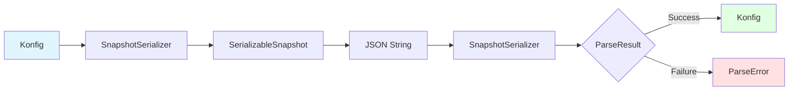

# Serialization

Konditional provides JSON serialization capabilities for feature flag configurations, enabling remote configuration management and distribution.

## SnapshotSerializer

The main serialization interface for Konfig configurations.

```kotlin
class SnapshotSerializer(moshi: Moshi = defaultMoshi())
```

### Default Instance

```kotlin
val serializer = SnapshotSerializer.default
```

### Custom Moshi

```kotlin
val customMoshi = Moshi.Builder()
    .add(FlagValueAdapter.FACTORY)
    .add(VersionRangeAdapter(baseMoshi))
    .add(KotlinJsonAdapterFactory())
    .build()

val serializer = SnapshotSerializer(customMoshi)
```

## Snapshot Operations

### Serializing Konfig

Convert a Konfig to JSON:

```kotlin
val konfig = FlagRegistry.konfig()
val json = SnapshotSerializer.default.serialize(konfig)

// JSON is pretty-printed with 2-space indentation
println(json)
```

### Deserializing Konfig

Parse JSON to Konfig using type-safe ParseResult:

```kotlin
val json = """
{
  "flags": [
    {
      "key": "my_flag",
      "defaultValue": { "type": "boolean", "value": false },
      "isActive": true,
      "salt": "v1",
      "values": []
    }
  ]
}
"""

when (val result = SnapshotSerializer.default.deserialize(json)) {
    is ParseResult.Success -> {
        FlagRegistry.load(result.value)
        println("Loaded ${result.value.flags.size} flags")
    }
    is ParseResult.Failure -> {
        println("Parse error: ${result.error}")
    }
}
```

## Patch Operations

### Serializing Patches

Convert a KonfigPatch to JSON:

```kotlin
val patch = KonfigPatch.patch {
    add(updatedFlag)
    remove(OLD_FLAG)
}

val json = SnapshotSerializer.default.serializePatch(patch)
```

### Deserializing Patches

Parse JSON to KonfigPatch:

```kotlin
val patchJson = """
{
  "flags": [
    {
      "key": "updated_flag",
      "defaultValue": { "type": "boolean", "value": true },
      "isActive": true,
      "salt": "v1",
      "values": []
    }
  ],
  "removeKeys": ["old_flag"]
}
"""

when (val result = SnapshotSerializer.default.deserializePatchToCore(patchJson)) {
    is ParseResult.Success -> {
        FlagRegistry.update(result.value)
        println("Applied patch")
    }
    is ParseResult.Failure -> {
        println("Parse error: ${result.error}")
    }
}
```

### Applying Patches to Snapshots

Apply a patch to an existing Konfig:

```kotlin
val currentKonfig = FlagRegistry.konfig()
val patchJson = fetchPatchFromServer()

when (val result = SnapshotSerializer.default.applyPatchJson(currentKonfig, patchJson)) {
    is ParseResult.Success -> {
        FlagRegistry.load(result.value)
        println("Applied patch")
    }
    is ParseResult.Failure -> {
        println("Failed to apply patch: ${result.error}")
    }
}
```

## ParseResult

Type-safe result type for deserialization operations.

```kotlin
sealed interface ParseResult<out T> {
    data class Success<T>(val value: T) : ParseResult<T>
    data class Failure(val error: ParseError) : ParseResult<Nothing>
}
```

### ParseError Types

```kotlin
sealed interface ParseError {
    data class InvalidJson(val message: String) : ParseError
    data class InvalidSnapshot(val message: String) : ParseError
    data class MissingKey(val key: String) : ParseError
    data class InvalidType(val expected: String, val actual: String) : ParseError
}
```

### Error Handling

```kotlin
when (val result = serializer.deserialize(json)) {
    is ParseResult.Success -> {
        // Use result.value
    }
    is ParseResult.Failure -> when (val error = result.error) {
        is ParseError.InvalidJson -> {
            log.error("Malformed JSON: ${error.message}")
        }
        is ParseError.InvalidSnapshot -> {
            log.error("Invalid snapshot structure: ${error.message}")
        }
        is ParseError.MissingKey -> {
            log.error("Missing required key: ${error.key}")
        }
        is ParseError.InvalidType -> {
            log.error("Type mismatch: expected ${error.expected}, got ${error.actual}")
        }
    }
}
```

## JSON Format

### Snapshot Structure

```json
{
  "flags": [
    {
      "key": "feature_flag",
      "defaultValue": {
        "type": "boolean",
        "value": false
      },
      "isActive": true,
      "salt": "v1",
      "values": [
        {
          "rule": {
            "rollout": 50.0,
            "note": "iOS beta users",
            "baseEvaluable": {
              "locales": ["EN_US"],
              "platforms": ["IOS"],
              "versionRange": {
                "type": "MIN_BOUND",
                "min": {
                  "major": 2,
                  "minor": 0,
                  "patch": 0
                }
              }
            }
          },
          "value": {
            "type": "boolean",
            "value": true
          }
        }
      ]
    }
  ]
}
```

### Patch Structure

```json
{
  "flags": [
    {
      "key": "updated_flag",
      "defaultValue": {
        "type": "string",
        "value": "new-value"
      },
      "isActive": true,
      "salt": "v1",
      "values": []
    }
  ],
  "removeKeys": ["deprecated_flag", "old_feature"]
}
```

### FlagValue Types

The `FlagValue` type is polymorphic based on the value type:

#### Boolean

```json
{
  "type": "boolean",
  "value": true
}
```

#### String

```json
{
  "type": "string",
  "value": "some-value"
}
```

#### Integer

```json
{
  "type": "int",
  "value": 42
}
```

#### Long

```json
{
  "type": "long",
  "value": 9223372036854775807
}
```

#### Double

```json
{
  "type": "double",
  "value": 3.14159
}
```

#### JSON (Complex Objects)

```json
{
  "type": "json",
  "value": {
    "timeout": 5000,
    "retries": 3,
    "endpoint": "https://api.example.com"
  }
}
```

### Version Ranges

#### Unbounded

```json
{
  "type": "UNBOUNDED"
}
```

#### LeftBound (Minimum)

```json
{
  "type": "MIN_BOUND",
  "min": {
    "major": 2,
    "minor": 0,
    "patch": 0
  }
}
```

#### RightBound (Maximum)

```json
{
  "type": "MAX_BOUND",
  "max": {
    "major": 3,
    "minor": 0,
    "patch": 0
  }
}
```

#### FullyBound (Range)

```json
{
  "type": "MIN_AND_MAX_BOUND",
  "min": {
    "major": 2,
    "minor": 0,
    "patch": 0
  },
  "max": {
    "major": 3,
    "minor": 0,
    "patch": 0
  }
}
```

## Serialization Flow



## Custom Type Adapters

### FlagValueAdapter

Handles polymorphic serialization of flag values:

```kotlin
object FlagValueAdapter {
    val FACTORY: JsonAdapter.Factory
}
```

Automatically serializes any type to appropriate FlagValue format.

### VersionRangeAdapter

Handles polymorphic serialization of version ranges:

```kotlin
class VersionRangeAdapter(moshi: Moshi) : JsonAdapter<VersionRange>()
```

Serializes version ranges based on their type and bounds.

## Common Patterns

### Remote Configuration Loading

```kotlin
class RemoteConfigService(
    private val httpClient: HttpClient,
    private val serializer: SnapshotSerializer = SnapshotSerializer.default
) {
    suspend fun loadConfiguration(): Result<Unit> {
        return try {
            val json = httpClient.get("/api/flags/snapshot")

            when (val result = serializer.deserialize(json)) {
                is ParseResult.Success -> {
                    FlagRegistry.load(result.value)
                    Result.success(Unit)
                }
                is ParseResult.Failure -> {
                    Result.failure(Exception("Parse error: ${result.error}"))
                }
            }
        } catch (e: Exception) {
            Result.failure(e)
        }
    }
}
```

### Incremental Updates

```kotlin
class ConfigUpdateService(
    private val httpClient: HttpClient,
    private val serializer: SnapshotSerializer = SnapshotSerializer.default
) {
    private var lastETag: String? = null

    suspend fun checkForUpdates() {
        val response = httpClient.get("/api/flags/patch", headers = mapOf(
            "If-None-Match" to (lastETag ?: "")
        ))

        if (response.statusCode == 304) {
            // No updates
            return
        }

        when (val result = serializer.deserializePatchToCore(response.body)) {
            is ParseResult.Success -> {
                FlagRegistry.update(result.value)
                lastETag = response.headers["ETag"]
                println("Applied patch: ${result.value.flags.size} changes")
            }
            is ParseResult.Failure -> {
                println("Failed to parse patch: ${result.error}")
            }
        }
    }
}
```

### Persistent Storage

```kotlin
class FlagPersistence(
    private val file: File,
    private val serializer: SnapshotSerializer = SnapshotSerializer.default
) {
    fun save() {
        val konfig = FlagRegistry.konfig()
        val json = serializer.serialize(konfig)
        file.writeText(json)
    }

    fun load(): ParseResult<Konfig> {
        if (!file.exists()) {
            return ParseResult.Failure(ParseError.InvalidSnapshot("File not found"))
        }

        val json = file.readText()
        return serializer.deserialize(json)
    }

    fun autoSave() {
        FlagRegistry.konfig()  // Trigger snapshot
        save()
    }
}

// Usage
val persistence = FlagPersistence(File("/path/to/flags.json"))

// Load on startup
when (val result = persistence.load()) {
    is ParseResult.Success -> FlagRegistry.load(result.value)
    is ParseResult.Failure -> println("No saved config: ${result.error}")
}

// Save periodically
Timer().scheduleAtFixedRate(timerTask {
    persistence.save()
}, 60_000, 60_000)  // Every minute
```

### Snapshot Versioning

```kotlin
data class VersionedSnapshot(
    val version: String,
    val timestamp: Long,
    val snapshot: String
)

class VersionedConfigService {
    private val snapshots = mutableListOf<VersionedSnapshot>()

    fun saveSnapshot() {
        val konfig = FlagRegistry.konfig()
        val json = SnapshotSerializer.default.serialize(konfig)

        snapshots.add(VersionedSnapshot(
            version = "v${snapshots.size + 1}",
            timestamp = System.currentTimeMillis(),
            snapshot = json
        ))
    }

    fun rollbackTo(version: String) {
        val snapshot = snapshots.find { it.version == version }
            ?: return

        when (val result = SnapshotSerializer.default.deserialize(snapshot.snapshot)) {
            is ParseResult.Success -> {
                FlagRegistry.load(result.value)
                println("Rolled back to $version")
            }
            is ParseResult.Failure -> {
                println("Rollback failed: ${result.error}")
            }
        }
    }
}
```

### A/B Testing Configuration

```kotlin
data class ExperimentConfig(
    val experimentId: String,
    val variants: List<Variant>,
    val enabled: Boolean
)

data class Variant(
    val name: String,
    val weight: Double
)

val EXPERIMENT: Conditional<ExperimentConfig, AppContext> =
    Conditional("experiment_config")

// Serialize experiment configuration
ConfigBuilder.config {
    EXPERIMENT with {
        default(
            value = ExperimentConfig(
                experimentId = "checkout-v2",
                variants = listOf(
                    Variant("control", 50.0),
                    Variant("variant-a", 25.0),
                    Variant("variant-b", 25.0)
                ),
                enabled = true
            )
        )
    }
}

val json = SnapshotSerializer.default.serialize(FlagRegistry.konfig())
// Distribute to clients
```

## Performance Considerations

### Caching Parsed Configs

```kotlin
class CachedConfigService {
    private var cachedKonfig: Konfig? = null
    private var lastFetch = 0L
    private val cacheDuration = 60_000L // 1 minute

    suspend fun getConfig(): Konfig {
        val now = System.currentTimeMillis()

        if (cachedKonfig != null && now - lastFetch < cacheDuration) {
            return cachedKonfig!!
        }

        val json = fetchFromServer()
        when (val result = SnapshotSerializer.default.deserialize(json)) {
            is ParseResult.Success -> {
                cachedKonfig = result.value
                lastFetch = now
                return result.value
            }
            is ParseResult.Failure -> {
                // Return cached config on error
                return cachedKonfig ?: throw Exception("No cached config")
            }
        }
    }
}
```

### Streaming Large Configs

For very large configurations, consider chunking:

```kotlin
class ChunkedConfigLoader {
    suspend fun loadInChunks(url: String) {
        val chunks = fetchChunks(url)

        chunks.forEach { chunk ->
            when (val result = SnapshotSerializer.default.deserializePatch(chunk)) {
                is ParseResult.Success -> {
                    // Apply each chunk as a patch
                    val patch = result.value.toPatch()
                    FlagRegistry.update(patch)
                }
                is ParseResult.Failure -> {
                    println("Failed to parse chunk: ${result.error}")
                }
            }
        }
    }
}
```

## Best Practices

### 1. Use ParseResult for Error Handling

Never ignore deserialization errors:

```kotlin
// Good - handle all cases
when (val result = serializer.deserialize(json)) {
    is ParseResult.Success -> FlagRegistry.load(result.value)
    is ParseResult.Failure -> logError(result.error)
}

// Bad - ignoring errors
val konfig = serializer.deserialize(json) as? ParseResult.Success
konfig?.let { FlagRegistry.load(it.value) }
```

### 2. Validate Before Loading

```kotlin
fun loadConfig(json: String): Boolean {
    return when (val result = serializer.deserialize(json)) {
        is ParseResult.Success -> {
            // Validate konfig
            if (result.value.flags.isEmpty()) {
                log.warn("Empty configuration")
                false
            } else {
                FlagRegistry.load(result.value)
                true
            }
        }
        is ParseResult.Failure -> {
            log.error("Parse failed: ${result.error}")
            false
        }
    }
}
```

### 3. Graceful Degradation

Keep a fallback configuration:

```kotlin
class ResilientConfigLoader {
    private val fallbackConfig = loadEmbeddedConfig()

    suspend fun load() {
        try {
            val json = fetchRemoteConfig()
            when (val result = serializer.deserialize(json)) {
                is ParseResult.Success -> FlagRegistry.load(result.value)
                is ParseResult.Failure -> {
                    log.error("Using fallback config: ${result.error}")
                    FlagRegistry.load(fallbackConfig)
                }
            }
        } catch (e: Exception) {
            log.error("Network error, using fallback", e)
            FlagRegistry.load(fallbackConfig)
        }
    }
}
```

### 4. Version Your JSON Schema

Include version metadata:

```json
{
  "version": "1.0",
  "schemaVersion": "2024-01",
  "flags": [...]
}
```

### 5. Test Serialization Roundtrips

```kotlin
@Test
fun testSerializationRoundtrip() {
    val original = ConfigBuilder.buildSnapshot {
        MY_FLAG with {
            default(value = false)
            rule { platforms(Platform.IOS) } implies true
        }
    }

    val json = serializer.serialize(original)
    val result = serializer.deserialize(json)

    assertTrue(result is ParseResult.Success)
    val deserialized = (result as ParseResult.Success).value

    assertEquals(original.flags.size, deserialized.flags.size)
}
```

## Related Documentation

- [Core API](Core.md) - ParseResult and error handling
- [Flag Registry](Flags.md) - Loading and updating configurations
- [Builders](Builders.md) - Creating configurations to serialize
- [Examples](examples/) - Complete serialization examples
