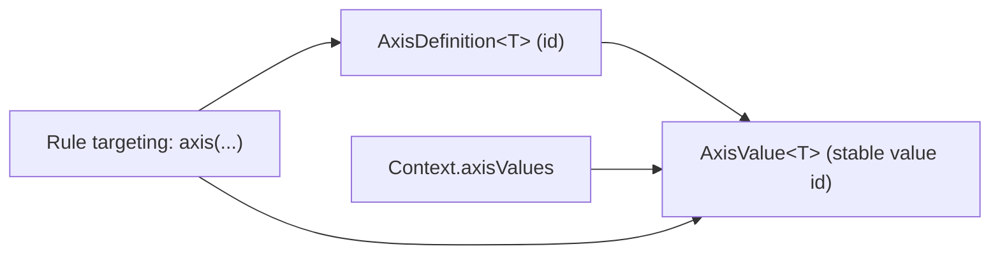

# Context & Targeting Dimensions

Konditional evaluates features against a `Context` value. Instead of forcing you into a single monolithic “user object”,
`Context` is designed as a set of opt-in *capabilities*.

## Context mixins (capabilities)

Common targeting dimensions are exposed as nested interfaces, for example:

- `Context.LocaleContext`
- `Context.PlatformContext`
- `Context.VersionContext`
- `Context.StableIdContext`

**Compile-time guarantee:** a feature defined as `Feature<T, MyContext, *>` can only use targeting operators that are
valid for `MyContext`. If your context type does not implement `Context.PlatformContext`, a `platforms(...)` constraint
is not even expressible in the DSL for that feature.

## Axes (custom, type-safe dimensions)

Axes let you define custom targeting dimensions that are:

- type-safe in Kotlin (enums or sealed types)
- representable in configuration via stable string IDs

Mermaid view of how axes hang together:



Minimal axis example:

```kotlin
enum class Environment(override val id: String) : AxisValue<Environment> {
    DEV("dev"),
    PROD("prod"),
}

object Axes {
    val EnvironmentAxis = Axis.of<Environment>("environment")
}
```

Applying an axis in a rule:

```kotlin
object ReleaseFlags : Namespace("release") {
    val newUi by boolean<Context>(default = false) {
        enable { axis(Environment.PROD) }
    }
}
```

Providing axis values on a context:

```kotlin
val ctx =
    object : Context, Context.AxisContext {
        override val axisValues = axisValues { +Environment.PROD }
    }
```

:::danger Pitfall: Axis IDs must be stable
Axis value IDs are part of your configuration contract. If they change (including through obfuscation), existing
configuration can silently target the wrong segment.
:::

Next:

- [Rollouts & Bucketing](/rollouts-and-bucketing)
