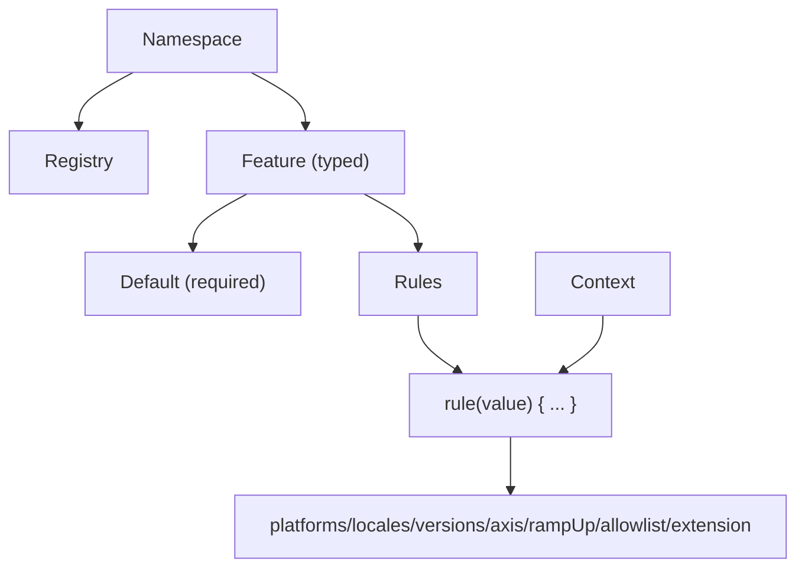

# Core Concepts

Konditional’s public surface is intentionally small. Understanding three primitives—**Features**, **Context**, and **Namespaces**—is enough to reason about correctness, organization, and runtime behavior.



---

## Features

A feature is a typed configuration value with an optional rule set. You define features as delegated properties on a
`Namespace`:

```kotlin
import io.amichne.konditional.api.evaluate
import io.amichne.konditional.context.Context
object AppFeatures : Namespace("app") {
    val darkMode by boolean<Context>(default = false)
    val apiEndpoint by string<Context>(default = "https://api.example.com")
    val maxRetries by integer<Context>(default = 3)
    val timeoutSeconds by double<Context>(default = 30.0)
}

val enabled: Boolean = AppFeatures.darkMode.evaluate(context)
val endpoint: String = AppFeatures.apiEndpoint.evaluate(context)
```

What this buys you:

- **Property name becomes the key** (no string keys at call sites)
- **Type flows from the delegate** (`boolean` → `Boolean`, etc.)
- **Non-null evaluation** (default is required)

### Supported types

| Type       | Namespace method | Kotlin type                          | Example default |
|------------|-------------------------|--------------------------------------|-----------------|
| Boolean    | `boolean(...)`          | `Boolean`                            | `false`         |
| String     | `string(...)`           | `String`                             | `"production"`  |
| Integer    | `integer(...)`          | `Int`                                | `42`            |
| Decimal    | `double(...)`           | `Double`                             | `3.14`          |
| Enum       | `enum(...)`             | `E : Enum<E>`                        | `LogLevel.INFO` |
| Data class | `custom(...)`           | `T : KotlinEncodeable<ObjectSchema>` | `MyConfig()`    |

Custom data classes are decoded via Kotlin reflection at the JSON boundary. Ensure Kotlin reflection is available
at runtime (Konditional bundles it), and keep constructor parameter names stable when using obfuscation.

### Enums instead of strings

```kotlin
enum class LogLevel { DEBUG, INFO, WARN, ERROR }
enum class Theme { LIGHT, DARK, AUTO }

object AppConfig : Namespace("app-config") {
    val LOG_LEVEL by enum<LogLevel, Context>(default = LogLevel.INFO)
    val THEME by enum<Theme, Context>(default = Theme.LIGHT)
}

val level: LogLevel = AppConfig.LOG_LEVEL.evaluate(context)
```

Because variants are enum values, invalid variants cannot compile.

---

## Rules

Rules are a typed mapping from a set of criteria to a concrete return value:

```kotlin
val apiEndpoint by string<Context>(default = "https://api.example.com") {
    rule("https://api-ios.example.com") { platforms(Platform.IOS) }
    rule("https://api-android.example.com") { platforms(Platform.ANDROID) }
}
```

Criteria you can compose (within a single rule):

- `platforms(...)`
- `locales(...)`
- `versions { min(...); max(...) }`
- `rampUp { percent }`
- `allowlist(...)` (ramp-up bypass)
- `axis(...)` (dimensional targeting)
- `extension { ... }` for custom predicates

Within a rule, criteria combine as **AND**: all specified criteria must match for the rule to match.

### Custom predicates via `extension { }`

To keep business targeting logic typed (not string-based), define a custom `Context` and use `extension { }`:

```kotlin
data class EnterpriseContext(
    override val locale: AppLocale,
    override val platform: Platform,
    override val appVersion: Version,
    override val stableId: StableId,
    val subscriptionTier: SubscriptionTier,
    val employeeCount: Int
) : Context

enum class SubscriptionTier { FREE, PRO, ENTERPRISE }

object PremiumFeatures : Namespace("premium") {
    val ADVANCED_ANALYTICS by boolean<EnterpriseContext>(default = false) {
        rule(true) {
            extension { subscriptionTier == SubscriptionTier.ENTERPRISE && employeeCount > 100 }
        }
    }
}
```

Because the feature is parameterized with `EnterpriseContext`, the receiver inside `extension { ... }` is strongly
typed.

---

## Context

Context provides evaluation inputs: it tells Konditional who is asking and where they are.

`locale` and `platform` are modeled as stable identifiers via `LocaleTag` and `PlatformTag`. Use the built-in
`AppLocale` / `Platform` enums or supply your own types with stable `id` values.

Standard fields (the minimum required by the rule DSL):

```kotlin
val context = Context(
    locale = AppLocale.UNITED_STATES,
    platform = Platform.IOS,
    appVersion = Version.of(2, 1, 0),
    stableId = StableId.of("user-123"),
)
```

### StableId (deterministic ramp-ups)

`stableId` is a stable identifier used for deterministic bucketing.
`StableId.of(...)` accepts any non-blank string and normalizes it to a hex representation used for bucketing.

```kotlin
val id = StableId.of("user-123")
```

If you need cross-platform consistency, ensure all platforms pass the same canonical stable identifier string
into `StableId.of(...)` (it lowercases using `Locale.ROOT`). Use `StableId.fromHex(...)` when you already have a
canonical hex identifier.

---

## Namespaces

Namespaces are isolation boundaries: each namespace has its own registry and independent configuration lifecycle.
Define multiple namespaces when you need more isolation boundaries.

```kotlin
sealed class AppDomain(id: String) : Namespace(id) {
    data object Auth : AppDomain("auth") {
        val socialLogin by boolean<Context>(default = false)
        val twoFactorAuth by boolean<Context>(default = true)
    }

    data object Payments : AppDomain("payments") {
        val applePay by boolean<Context>(default = false)
        val stripeIntegration by boolean<Context>(default = true)
    }
}

AppDomain.Auth.load(authConfig)
AppDomain.Payments.load(paymentConfig)
```

### Custom namespaces (governance)

```kotlin
sealed class TeamDomain(id: String) : Namespace(id) {
    data object Recommendations : TeamDomain("recommendations") {
        val COLLABORATIVE_FILTERING by boolean(default = true)
    }

    data object Analytics : TeamDomain("analytics")
}
```

```kotlin
TeamDomain.Recommendations.COLLABORATIVE_FILTERING.evaluate(context)
```

Each namespace has independent configuration lifecycle, registry, and serialization.

---

## Type safety in action (what becomes impossible)

### Wrong value type at call site

```kotlin
object Config : Namespace("config") {
    val maxRetries by integer<Context>(default = 3)
}

val retries: Int = Config.maxRetries.evaluate(context)
```

### Wrong context type for a feature

```kotlin
val basicContext: Context = Context(...)
PremiumFeatures.ADVANCED_ANALYTICS.evaluate(basicContext) // Compile error (requires EnterpriseContext)
```

---

## Next steps

- Understand rule composition and ramp-ups: ["Targeting & Ramp-ups"](/targeting-ramp-ups)
- Understand evaluation order and determinism: ["Evaluation"](/evaluation)
- Understand the runtime JSON boundary: ["Remote Configuration"](/remote-config)
