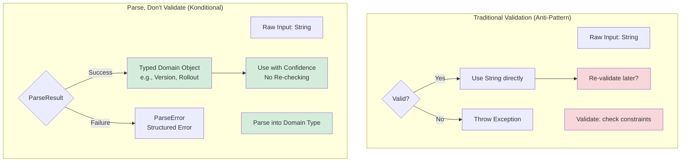
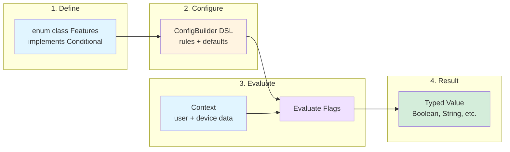
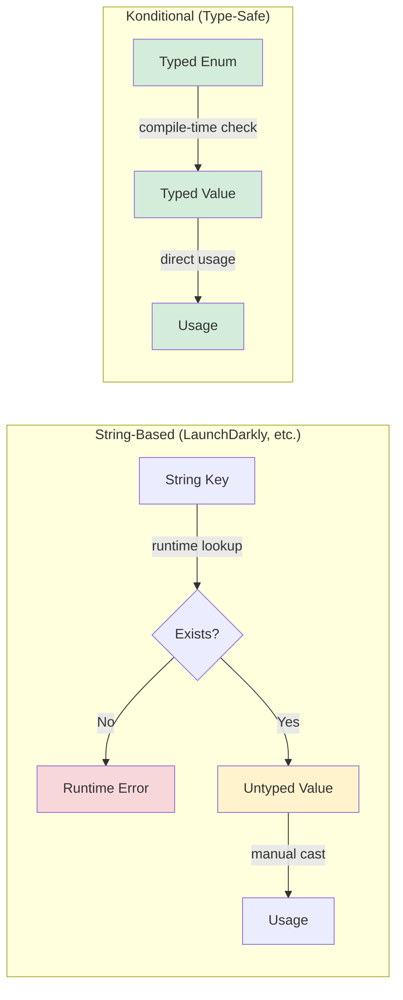
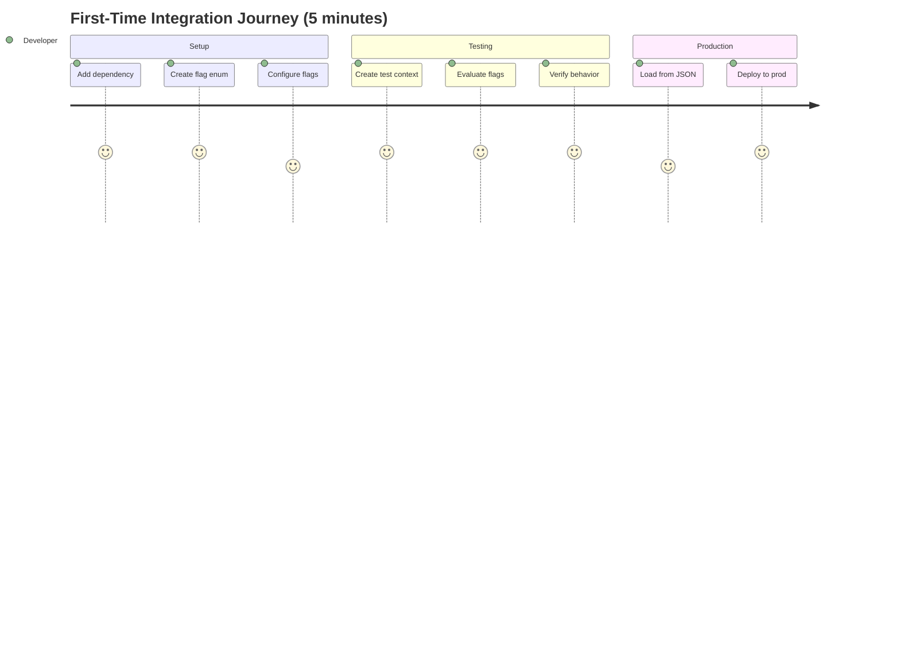
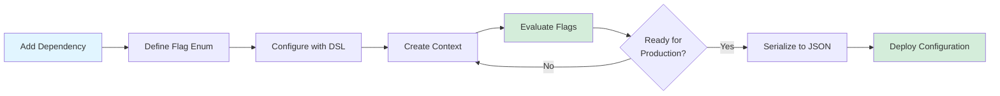

# Introduction to Konditional

Konditional is a type-safe, deterministic feature flag library for Kotlin that provides compile-time safety and runtime flexibility for managing feature flags in your applications.

## What are Feature Flags?

Feature flags (also known as feature toggles) are a software development technique that allows you to enable or disable features without deploying new code. This enables:

- **Progressive rollouts**: Deploy features to a subset of users
- **A/B testing**: Test different implementations with different user groups
- **Emergency kill switches**: Quickly disable problematic features
- **Development flexibility**: Work on features behind flags before they're ready

## Why Konditional?

### Type-Safe

Konditional leverages Kotlin's powerful type system to provide compile-time safety:

- **No stringly-typed APIs**: Feature flags are defined as enum values implementing `Conditional<S, C>`
- **Generic type parameters**: Value type `S` and context type `C` flow through the entire system
- **IDE support**: Full autocomplete and refactoring support across your codebase
- **No runtime casting**: Type safety guaranteed by the compiler

```kotlin
enum class Features(override val key: String) : Conditional<Boolean, Context> {
    DARK_MODE("dark_mode")
}

// Compile-time type safety - returns Boolean
val isEnabled: Boolean = context.evaluate(Features.DARK_MODE)
```

### Deterministic

Flag evaluation uses SHA-256 based bucketing for consistent user experiences:

- **Stable bucketing**: Same user + flag combination always produces the same result
- **Independent rollouts**: Different flags produce independent bucket assignments
- **Granular control**: 0.1% precision for gradual rollouts (1000 buckets)
- **Predictable rules**: Clear specificity-based rule ordering

```kotlin
config {
    Features.NEW_UI with {
        default(false)
        rule {
            rollout = Rollout.of(25.0)  // 25% of users
        } implies true
    }
}
```

### Parse, Don't Validate

Konditional follows the "Parse, Don't Validate" principle for robust error handling:

- **Structured errors**: `ParseResult<T>` instead of throwing exceptions
- **Type-safe values**: Domain types encode invariants (e.g., `Rollout`, `Version`)
- **Illegal states unrepresentable**: Sealed classes prevent invalid configurations
- **Explicit error handling**: Pattern match on success/failure cases



**Benefits:**
- **Type Safety**: Constraints encoded in types
- **No Redundant Checks**: Parse once at boundary
- **Composability**: Parsed types compose cleanly
- **Explicit Errors**: Structured error types
- **Compiler Support**: Type system prevents misuse

```kotlin
when (val result = serializer.deserialize(json)) {
    is ParseResult.Success -> FlagRegistry.load(result.value)
    is ParseResult.Failure -> {
        when (val error = result.error) {
            is ParseError.InvalidJson -> log.error("Bad JSON: ${error.message}")
            is ParseError.ConditionalNotFound -> log.error("Unknown flag: ${error.key}")
        }
    }
}
```

### Composable Architecture

Build reusable evaluation logic through the `Evaluable<C>` abstraction:

- **Standard targeting**: Locale, platform, version constraints via `BaseEvaluable`
- **Custom logic**: Extend `Evaluable<C>` for domain-specific targeting
- **Rule composition**: Combine multiple evaluators with clear semantics
- **Additive specificity**: Rule precedence calculated automatically

```kotlin
class PremiumUserEvaluable : Evaluable<EnterpriseContext>() {
    override fun matches(context: EnterpriseContext) =
        context.subscriptionTier == SubscriptionTier.PREMIUM
    override fun specificity() = 1
}

rule {
    platforms(Platform.IOS)
    extension { PremiumUserEvaluable() }
} implies true
```

### Serializable

Export and import flag configurations with type-safe JSON serialization:

- **Remote configuration**: Load flags from servers or CDNs
- **Incremental updates**: Apply patches without full replacement
- **Type preservation**: `FlagValue<T>` sealed class maintains type safety
- **Round-trip guarantee**: Serialized configs behave identically to programmatic ones

```kotlin
val serializer = SnapshotSerializer()

// Serialize
val json = serializer.serialize(FlagRegistry.konfig())

// Deserialize with error handling
when (val result = serializer.deserialize(json)) {
    is ParseResult.Success -> FlagRegistry.load(result.value)
    is ParseResult.Failure -> handleError(result.error)
}
```

### Flexible

Support for diverse use cases:

- **Version ranges**: Target specific app versions with `VersionRange` sealed class
- **Custom value types**: Use any type for flag values (Boolean, String, Int, custom objects)
- **Custom contexts**: Extend `Context` with domain-specific fields
- **Complex targeting**: Combine multiple criteria with rollout percentages

## How It Works



## Konditional vs. String-Based Systems



**Konditional Advantages:**
- **Compile-time safety**: Typos caught at compile time
- **Refactoring support**: IDE can rename across codebase
- **Type safety**: No runtime casting or type errors
- **Autocomplete**: Full IDE support
- **No dependencies**: Zero external dependencies (except Moshi for serialization)

## Core Concepts

### Flags

A flag is a typed configuration value that can change based on conditions. Each flag has:
- A unique identifier
- A value type (Boolean, String, Int, etc.)
- A default value
- Optional rules for conditional evaluation

### Rules

Rules define when and how flag values should change. Rules can be based on:
- Application version
- User attributes
- Custom conditions
- Time-based criteria

### Conditions

Conditions are the building blocks of rules. They evaluate to true or false based on runtime context.

## Getting Started Journey



**Time to First Value**: ~5 minutes

### Step-by-Step Path

1. **Add Dependency** - Include Konditional in your build.gradle
2. **Define Flags** - Create enum implementing `Conditional<S, C>`
3. **Configure** - Use `ConfigBuilder.config { }` DSL
4. **Create Context** - Provide user/device information
5. **Evaluate** - Call `context.evaluate(FLAG_KEY)`
6. **Deploy** - Serialize to JSON for remote configuration



## Next Steps

Continue to the [Quick Start](quick-start.md) guide to begin using Konditional in your project.
