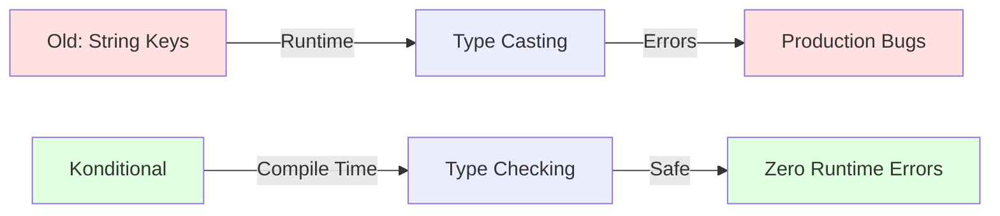

# Welcome to Konditional

Type-safe, deterministic feature flags for Kotlin

## Why Migrate to Konditional?

If you're tired of string-based feature flags with runtime errors, type casting nightmares, and inconsistent user experiences, **Konditional** offers a better way.

```kotlin
// Before: Typical untyped flags
val isEnabled = featureFlags.getBoolean("new_checkout", false)  // Typos, runtime errors
val apiUrl = featureFlags.getString("api_url", "default")       // No type safety

// After: Konditional
val isEnabled = context.evaluate(NEW_CHECKOUT)  // Compile-time safe
val apiUrl = context.evaluate(API_URL)          // Type-safe
```

[Start Migration →](#migration-quick-start){ .md-button .md-button--primary }
[API Reference](api/Overview.md){ .md-button }
[View on GitHub](https://github.com/amichne/konditional){ .md-button }

---

## Migration Quick Start

**Time: 10-15 minutes** to migrate your first feature flag

### Step 1: Add Dependency (2 min)

```kotlin
// build.gradle.kts
dependencies {
    implementation("io.amichne:konditional:0.0.1")
}
```

### Step 2: Define Your Context (3 min)

Replace untyped context with structured `Context`:

<details>
<summary>Before: Untyped context map</summary>

```kotlin
val context = mapOf(
    "userId" to "user-123",
    "platform" to "iOS",
    "version" to "2.1.0",
    "locale" to "en_US"
)
```
</details>

<details>
<summary>After: Type-safe Context</summary>

```kotlin
import io.amichne.konditional.context.*
import io.amichne.konditional.core.id.StableId

val context = Context(
    locale = AppLocale.EN_US,
    platform = Platform.IOS,
    appVersion = Version(2, 1, 0),
    stableId = StableId.of("user-123")
)
```
</details>

### Step 3: Convert Your First Flag (5 min)

Transform string-based flags to type-safe `Conditional`:

<details>
<summary>Before: String-based flag</summary>

```kotlin
// Definition (scattered across codebase)
val FLAG_KEY = "new_checkout_enabled"

// Usage (error-prone)
if (featureFlags.getBoolean(FLAG_KEY, false)) {
    showNewCheckout()
}
```
</details>

<details>
<summary>After: Type-safe Conditional</summary>

```kotlin
import io.amichne.konditional.core.Conditional
import io.amichne.konditional.builders.ConfigBuilder
import io.amichne.konditional.context.evaluate

// Define once
val NEW_CHECKOUT: Conditional<Boolean, Context> =
    Conditional("new_checkout_enabled")

// Configure
ConfigBuilder.config {
    NEW_CHECKOUT with {
        default(value = false)

        rule {
            platforms(Platform.IOS, Platform.ANDROID)
            versions { min(Version(2, 0, 0)) }
        } implies true
    }
}

// Use everywhere (type-safe!)
if (context.evaluate(NEW_CHECKOUT)) {
    showNewCheckout()
}
```
</details>

### Step 4: Test & Verify (3-5 min)

```kotlin
@Test
fun `new checkout flag works correctly`() {
    val iosContext = Context(
        locale = AppLocale.EN_US,
        platform = Platform.IOS,
        appVersion = Version(2, 1, 0),
        stableId = StableId.of("test-user")
    )

    assertTrue(iosContext.evaluate(NEW_CHECKOUT))
}
```

[Complete Migration Guide →](api/examples/README.md)

---

## Why Konditional?

### Compile-Time Type Safety



No more `ClassCastException` or `NullPointerException` from misconfigured flags.

### Deterministic Rollouts

Users get **consistent experiences** across sessions using SHA-256 bucketing:

```kotlin
// Same user always gets the same variant
val variant = context.evaluate(AB_TEST_VARIANT)
```

### Parse, Don't Validate

Structured error handling without exceptions:

```kotlin
when (val result = serializer.deserialize(json)) {
    is ParseResult.Success -> registry.load(result.value)
    is ParseResult.Failure -> handleError(result.error)
}
```

### Powerful Targeting

Combine multiple criteria seamlessly:

```kotlin
rule {
    platforms(Platform.IOS)
    locales(AppLocale.EN_US, AppLocale.EN_CA)
    versions { min(Version(2, 0, 0)) }
    rollout = Rollout.of(50.0)
} implies true
```

### Custom Context Extensions

Add domain-specific targeting without hacks:

```kotlin
data class UserContext(
    // Standard fields
    override val locale: AppLocale,
    override val platform: Platform,
    override val appVersion: Version,
    override val stableId: StableId,
    // Your custom fields
    val isPremium: Boolean,
    val accountAge: Int
) : Context
```

---

## Learn by Example

### Quick Start

Get your first flag running in 10 minutes

[Basic Usage →](api/examples/01-BasicUsage.kt)

### Gradual Rollouts

Deploy features to percentages of users safely

[Rollout Examples →](api/examples/02-Rollouts.kt)

### Custom Targeting

Extend context for your business logic

[Custom Context →](api/examples/03-CustomContext.kt)

### Remote Configuration

Serialize and load flags from your backend

[Serialization →](api/examples/04-Serialization.kt)

---

## Common Migration Patterns

### Boolean Feature Toggles

```kotlin
// Old
val enabled = flags.getBoolean("feature_enabled", false)

// New
val FEATURE_ENABLED: Conditional<Boolean, Context> = Conditional("feature_enabled")
val enabled = context.evaluate(FEATURE_ENABLED)
```

### Configuration Values

```kotlin
// Old
val timeout = flags.getInt("api_timeout", 5000)
val endpoint = flags.getString("api_endpoint", "https://api.example.com")

// New
data class ApiConfig(val timeout: Int, val endpoint: String)
val API_CONFIG: Conditional<ApiConfig, Context> = Conditional("api_config")
val config = context.evaluate(API_CONFIG)
```

### Percentage Rollouts

```kotlin
// Old (often inconsistent)
val userId = user.id.hashCode()
val enabled = (userId % 100) < 25  // 25% rollout

// New (deterministic)
ConfigBuilder.config {
    FEATURE with {
        default(value = false)
        rule { rollout = Rollout.of(25.0) } implies true
    }
}
```

---

## Next Steps

**New to Konditional?**

1. [API Overview](api/Overview.md) - Understand core concepts (10 min)
2. [Examples](api/examples/README.md) - See real code (20 min)
3. [Builder DSL](api/Builders.md) - Learn the configuration syntax (10 min)

**Ready to integrate?**

1. [Core API](api/Core.md) - Conditionals and evaluation
2. [Context System](api/Context.md) - Targeting dimensions
3. [Rules System](api/Rules.md) - Advanced targeting logic
4. [Serialization](api/Serialization.md) - Remote configuration

---

## Features at a Glance

| Feature | Traditional Flags | Konditional |
|---------|------------------|-------------|
| Type Safety | Runtime | Compile-time |
| Consistent Bucketing | Often random | SHA-256 deterministic |
| Error Handling | Exceptions | ParseResult/EvaluationResult |
| Custom Context | Map-based | First-class support |
| Multi-variant Testing | Complex | Built-in |
| JSON Serialization | Manual | Type-safe built-in |
| Version Targeting | String parsing | Semantic versioning |

---

**Total migration time: 30-45 minutes** for your first feature flag system migration.
