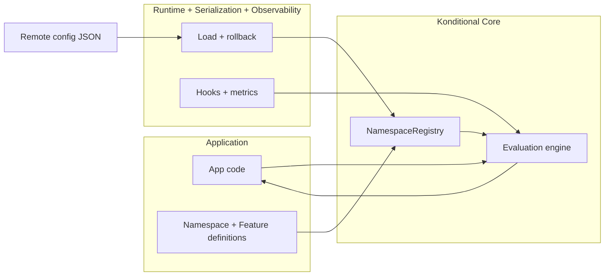
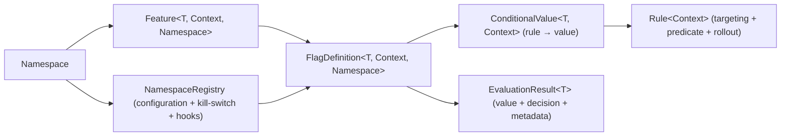

# Konditional Core (The Deterministic, Type-Safe Engine)

Konditional is a Kotlin/JVM feature flag library designed to deliver two outcomes that matter in production:
**compile-time correctness** and **runtime determinism**. The `:konditional-core` module provides the type-safe DSL and
the evaluation engine that turns a `Context` into a value (plus an explanation of why).
The rest of the project exists to operate that core safely: `:konditional-runtime` handles loading and lifecycle,
`:konditional-serialization` owns boundary codecs, and `:konditional-observability` + `:opentelemetry` capture signals.

:::danger Key argument
If you cannot trust your configuration and experimentation engine with absolute certainty, you do not have real control
in production. That is not a tolerable risk.
:::

## The Problem (Why Flags Fail in Production)

### String-keyed systems fail silently

Somewhere in onboarding code:

```kotlin
val newFlow = flagClient.getBool("new_onboaring_flow", false)  // typo
```

Somewhere in config JSON:

```json
{ "new_onboarding_flow": true }  // correct spelling
```

The typo ships. The flag never activates. Your A/B test runs at 0% treatment. You find out in a post‑mortem.

### Boolean-only systems turn into boolean matrices

```kotlin
enum class Capability {
    NEW_CHECKOUT,
    NEW_CHECKOUT_V2,
    NEW_CHECKOUT_V3,
    CHECKOUT_FAST_PATH
}

if (isEnabled(NEW_CHECKOUT) && !isEnabled(NEW_CHECKOUT_V2)) {
    // original new checkout
} else if (isEnabled(NEW_CHECKOUT_V2) && !isEnabled(CHECKOUT_FAST_PATH)) {
    // v2 without fast path
}
```

Boolean-only systems force you to encode variants in control flow. Testing becomes exponential and undefined
combinations creep into production.

### Type safety disappears at the boundary

```kotlin
val maxRetries: Int = flagClient.getInt("max_retries", 3)
```

```json5
{ "max_retries": "5" }
```

```kotlin
maxRetries = 0  // or throws, or returns default (SDK-dependent)
```

Runtime configuration breaks compile-time contracts. This is a frequent production incident pattern.

---

## What Konditional Does

Konditional makes three structural commitments:

1. **Flags are properties, not strings** — keys bound at compile time.
2. **Types flow from definition to call site** — no runtime coercion.
3. **Single evaluation semantics** — deterministic and testable.

```kotlin
enum class CheckoutVariant { CLASSIC, OPTIMIZED, EXPERIMENTAL }

object AppFlags : Namespace("app") {
    val checkoutVariant by enum<CheckoutVariant, Context>(default = CheckoutVariant.CLASSIC) {
        rule(CheckoutVariant.OPTIMIZED) { platforms(Platform.IOS) }
        rule(CheckoutVariant.EXPERIMENTAL) { rampUp { 50.0 } }
    }

    val maxRetries by integer<Context>(default = 3) {
        rule(5) { platforms(Platform.ANDROID) }
    }
}

val variant: CheckoutVariant = AppFlags.checkoutVariant.evaluate(ctx)
val retries: Int = AppFlags.maxRetries.evaluate(ctx)
```

:::note Compile-time vs runtime
The compiler guarantees **property names**, **return types**, and **rule types**. Runtime configuration is validated
at the boundary and either fully accepted or rejected. See [Parsing & Errors](/parsing-and-errors).
:::

---

## Comparison to Alternatives

| Aspect             | String-keyed SDKs                 | Enum + boolean                   | Konditional                     |
|--------------------|-----------------------------------|----------------------------------|---------------------------------|
| **Typo safety**    | Runtime failure (silent or crash) | Compile-time                     | Compile-time                    |
| **Type safety**    | Runtime coercion (often unsafe)   | Boolean only                     | Compile-time types              |
| **Variants**       | Runtime-typed                     | Multiple booleans + control flow | First-class typed values        |
| **Ramp-up logic**  | SDK-dependent                     | Per-team reimplementation        | Centralized, deterministic      |
| **Evaluation**     | SDK-defined, opaque               | Ad-hoc per evaluator             | Single DSL with specificity     |
| **Invalid config** | Fails silently or crashes         | Depends on implementation        | Explicit `ParseResult` boundary |
| **Testing**        | Mock SDK or replay snapshots      | Mock evaluators                  | Typed contexts + deterministic  |

---

## Architecture at a Glance



---

## Why this is high‑ROI

- You ship changes behind flags without creating boolean explosion or conditional sprawl.
- Rollouts are deterministic: the same user stays in/out unless you intentionally change inputs (like `salt`).
- Targeting is type-safe: you cannot target a platform/version/axis that your context cannot provide.
- Configuration is a boundary: invalid remote config is rejected during parsing instead of “kind of working”.

## When Konditional Fits

**Choose Konditional when:**

- You want compile‑time correctness for definitions and call sites.
- You need typed values beyond booleans (variants, thresholds, structured config).
- You run experiments and need deterministic, reproducible ramp‑ups.
- You want explicit validation boundaries for remote configuration.

**Konditional might not fit if:**

- You need vendor-hosted dashboards more than compile‑time safety.
- Your flags are fully dynamic with zero static definitions.
- You are comfortable relying on process/tooling to prevent string key drift.

---

Your mental model is intentionally small:

> Namespace → Feature → FlagDefinition → Rule → EvaluationResult



Next:

- Start with [Quick Start](/quick-start).
- Then read [Core Concepts](/core-concepts) to understand what each type exists to prevent.
