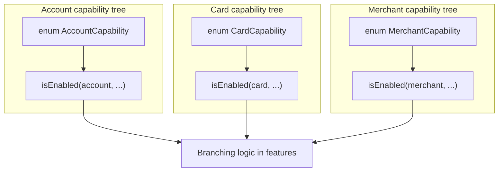
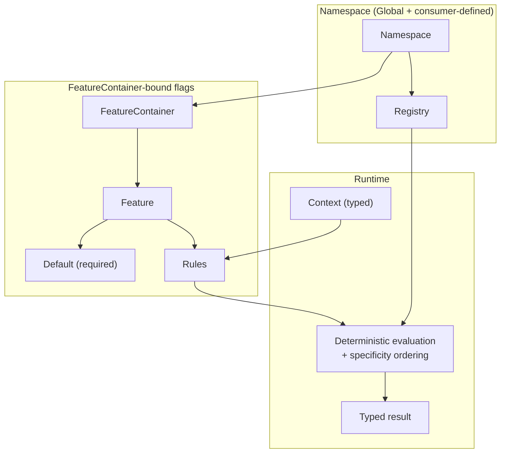
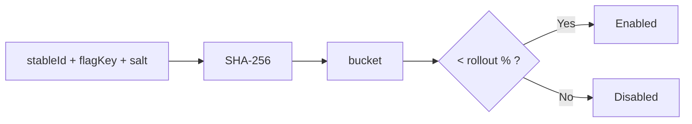

# Konditional: Engineer Pitch Deck (vs Enum + Boolean “Capabilities”)

This document compares Konditional against a common “modern legacy” pattern:
- flags are **enums** (so keys are compile-time)
- flags evaluate to **Boolean only**
- each domain owns its own **hierarchy** (account flags, card flags, etc.)
- evaluation logic is **inline per hierarchy** (context-specific checks live next to the enum)

Konditional’s thesis is narrower and more structural: bind flag identity + value type to Kotlin properties, centralize evaluation semantics (rules + specificity + deterministic rollouts), and treat remote JSON as a validated trust boundary.

---

## Baseline: what the enum/boolean approach already does well

Enum-based capabilities solve one real problem:
- **No string keys at call sites**: `Capability.DARK_MODE` can’t be mistyped.

If all you need is “feature on/off” with hand-written business logic per domain, this can be a reasonable starting point.

---

## The pressure points (why boolean-only enums don’t scale)

### 1) “Boolean-only” turns configuration into control-flow

Once you need *variants* (not just on/off), code tends to devolve into branching:
- multiple booleans (“A enabled”, “B enabled”, “C enabled”)
- switch statements on user cohorts
- ad-hoc precedence rules

Konditional’s public surface explicitly supports typed values (Boolean/String/Int/Double/Enum) so you can model variants and thresholds as configuration, not control-flow.

### 2) Multiple hierarchies duplicate semantics

With per-domain enums (account/card/merchant/etc.), the same targeting concepts get reimplemented repeatedly:
- “platform/iOS only”
- “version >= 2.0.0”
- “roll out to 10%”
- “internal users only”

This is not a key-typo issue; it’s a semantics/consistency issue.

### 3) No shared, deterministic rollout primitive

Most enum-based systems eventually add “percent rollout” logic, but it tends to be:
- inconsistent across domains
- not obviously deterministic
- hard to reason about or test uniformly

Konditional makes deterministic bucketing a first-class concept.

---

## Visual: legacy vs Konditional

### Legacy model: many trees, many evaluators



### Konditional model: one evaluation semantics, typed contexts



---

## What you gain by switching to Konditional

### 0) You keep what enums gave you (no call-site string keys)

Call sites stay property-based and refactor-safe:

```kotlin
val enabled: Boolean = feature { AppFeatures.DARK_MODE }
```

No string key appears at the call site.

---

### 1) Typed configuration beyond booleans

Model “variants” as values:

```kotlin
val RECOMMENDATION_ALGO by string(default = "collaborative") {
    rule { rollout { 50.0 } } returns "content-based"
}
```

Model thresholds as values:

```kotlin
val MAX_RETRIES by int(default = 3) {
    rule { platforms(Platform.WEB) } returns 5
}
```

If you want variant safety, use enums:

```kotlin
enum class Theme { LIGHT, DARK }
val THEME by enum<Theme, Context>(default = Theme.LIGHT)
```

---

### 2) One targeting language (instead of N bespoke evaluators)

Konditional provides a single rule DSL with well-defined semantics:
- criteria are AND-ed within a rule
- rules are ordered by specificity (more targeted wins)
- default is the final fallback

```kotlin
val PREMIUM_FEATURE by boolean(default = false) {
    rule {
        platforms(Platform.IOS, Platform.ANDROID)
        locales(AppLocale.UNITED_STATES)
        versions { min(2, 0, 0) }
        rollout { 50.0 }
    } returns true
}
```

This replaces “per-hierarchy ad-hoc precedence” with a deterministic, explainable model.

---

### 3) Context stays explicit and type-safe (even for “inline” domain context)

If your legacy system has “card-specific” and “account-specific” evaluation, Konditional maps that to **typed contexts**:

```kotlin
data class AccountContext(
    override val locale: AppLocale,
    override val platform: Platform,
    override val appVersion: Version,
    override val stableId: StableId,
    val subscriptionTier: SubscriptionTier
) : Context

enum class SubscriptionTier { FREE, PRO, ENTERPRISE }

val ENTERPRISE_ONLY by boolean<AccountContext>(default = false) {
    rule {
        extension {
            Evaluable.factory { ctx -> ctx.subscriptionTier == SubscriptionTier.ENTERPRISE }
        }
    } returns true
}
```

The “inline context” becomes typed data, and rule predicates are type-checked.

---

### 4) Deterministic rollouts are built-in, testable, and consistent

Konditional’s rollout bucketing is based on stable inputs and SHA-256, so it is deterministic by construction.



This gives you a single, shared rollout primitive across all domains.

---

### 5) Total evaluation (no null propagation)

Defaults are required, which makes evaluation total:
- rule matches → rule value
- no match → default

This is a structural property, not a convention.

---

### 6) Namespaces when you need them (consumer-defined), Global when you don’t

If your current “multiple hierarchies” are really about ownership/isolation, namespaces encode that structurally.
Konditional ships `Namespace.Global`; you define additional ones if desired:

```kotlin
sealed class AppDomain(id: String) : Namespace(id) {
    data object Account : AppDomain("account")
    data object Card : AppDomain("card")
}
```

---

### 7) Remote config is a boundary with explicit failure handling

Enums can avoid typos in code, but as soon as external config enters the system, you still need a boundary.
Konditional makes that boundary explicit:

```kotlin
val json = File("flags.json").readText()
when (val result = SnapshotSerializer.fromJson(json)) {
    is ParseResult.Success -> Namespace.Global.load(result.value)
    is ParseResult.Failure -> logError("Parse failed: ${result.error}")
}
```

Contract:
- `Success` → validated, type-correct internal snapshot (safe to apply)
- `Failure` → rejected before it can affect evaluation

---

## Practical migration shape (from enum capabilities)

0. Mirror existing enum booleans as `boolean(default = ...)` features in a container.
1. Move shared targeting semantics into rules (`platforms/locales/versions/rollout`), eliminating duplicated evaluators.
2. Convert “variants” from multiple booleans into typed values (`string/int/enum`).
3. If you need isolation/ownership boundaries, introduce consumer-defined namespaces; otherwise keep everything in `Namespace.Global`.
4. If you need remote config, treat JSON as an external boundary and rely on `ParseResult` handling.
