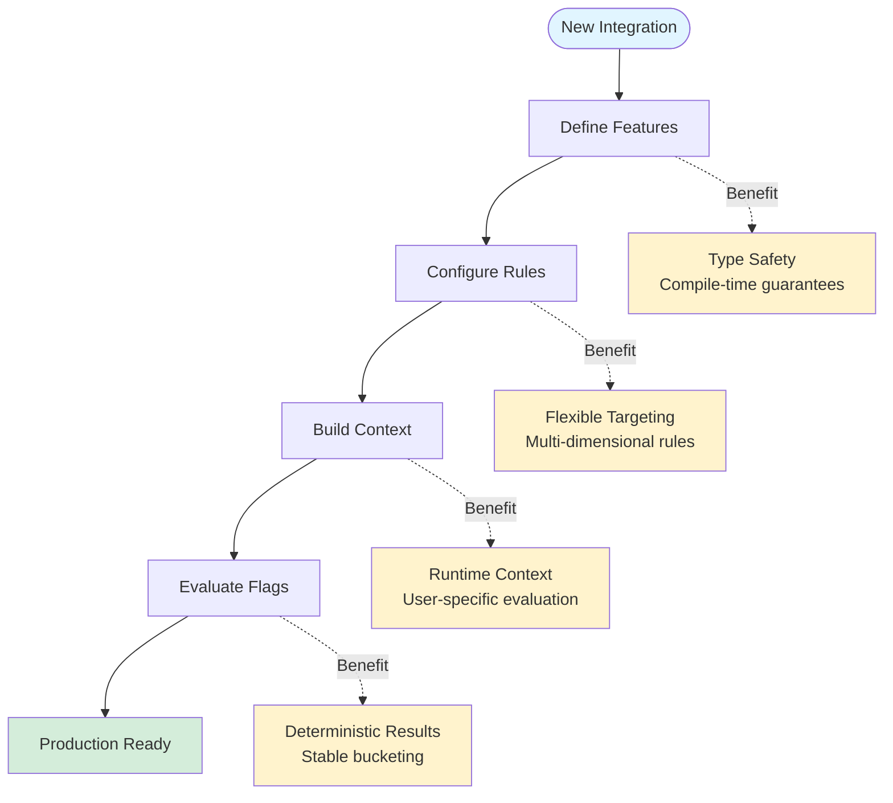
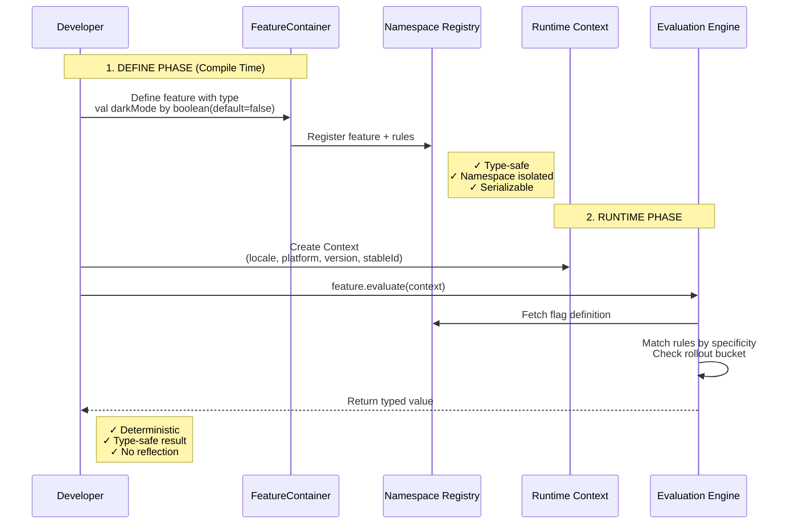
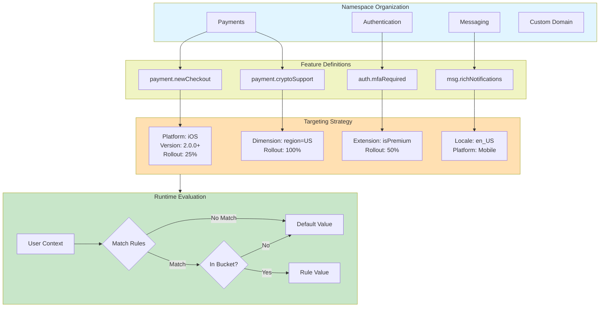
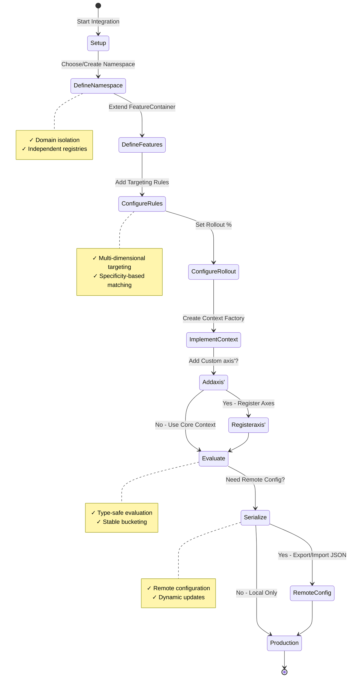
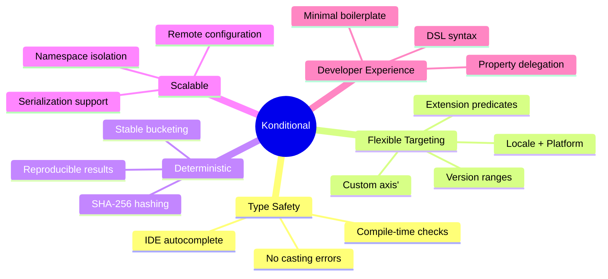

# Konditional: Getting Started Guide

## Value Proposition

Konditional provides **type-safe, flexible feature flags** with powerful targeting capabilities and zero runtime surprises.

## Quick Start Journey



## End-to-End Usage Pattern



## Core Concepts Flow

```mermaid
flowchart LR
    subgraph Define["1️⃣ DEFINE Features"]
        FC[FeatureContainer&ltM&gt]
        FC --> BF[Boolean Features]
        FC --> SF[String Features]
        FC --> CF[Custom Types]
    end

    subgraph Rules["2️⃣ CONFIGURE Rules"]
        R[Rule Builder]
        R --> L[Locale Targeting]
        R --> P[Platform Targeting]
        R --> V[Version Ranges]
        R --> D[Custom axis']
        R --> RO[Rollout %]
    end

    subgraph Context["3️⃣ BUILD Context"]
        CTX[Context]
        CTX --> A[App Properties]
        CTX --> U[User StableId]
        CTX --> CD[Custom axis']
    end

    subgraph Eval["4️⃣ EVALUATE"]
        E[Evaluation]
        E --> M[Rule Matching]
        E --> B[Bucketing]
        E --> T[Typed Result]
    end

    Define --> Rules
    Rules --> Context
    Context --> Eval

    style Define fill:#e3f2fd
    style Rules fill:#f3e5f5
    style Context fill:#e8f5e9
    style Eval fill:#fff3e0
```



## Best Practices Architecture



## Integration Workflow



## Key Benefits Summary



## Sample Code: Complete Example

```kotlin
// 1. Define custom dimension
enum class Environment(override val id: String) : DimensionKey {
    PRODUCTION("prod"),
    STAGING("staging")
}
val ENV_AXIS = dimensionAxis<Environment>("env")

// 2. Create feature container
object PaymentFeatures : FeatureContainer<Namespace.Payments>(Namespace.Payments) {
    val newCheckoutFlow by boolean(default = false) {
        rule {
            platforms(Platform.IOS, Platform.ANDROID)
            versions { min(2, 0, 0) }
            dimension(ENV_AXIS, Environment.PRODUCTION)
            rollout { 25 }
            note("Gradual rollout of new checkout")
        } returns true
    }
}

// 3. Build runtime context
val context = Context(
    locale = AppLocale.EN_US,
    platform = Platform.IOS,
    appVersion = Version(2, 1, 0),
    stableId = StableId.of(userId)
).withaxis' {
    set(ENV_AXIS, Environment.PRODUCTION)
}

// 4. Evaluate feature
val useNewCheckout: Boolean = PaymentFeatures.newCheckoutFlow.evaluate(context)
```

## Next Steps

1. **Choose your namespace** - Use built-in (Global, Authentication, Payments, etc.) or create custom
2. **Define features** - Extend `FeatureContainer<M>` with your flags
3. **Configure targeting** - Add rules with locale, platform, version, axis'
4. **Build context factory** - Create context from request/user data
5. **Evaluate** - Call `feature.evaluate(context)` to get type-safe results
6. **(Optional) Serialize** - Export to JSON for remote configuration

---

**Why Konditional?**
- ✅ **Zero runtime type errors** - Full compile-time safety
- ✅ **Flexible targeting** - Multi-dimensional rules with specificity ordering
- ✅ **Stable rollouts** - Deterministic bucketing via SHA-256
- ✅ **Namespace isolation** - Domain-driven feature organization
- ✅ **Production-ready** - Serialization, patching, and remote config support
