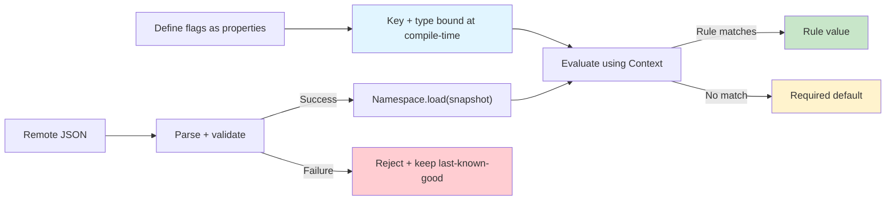
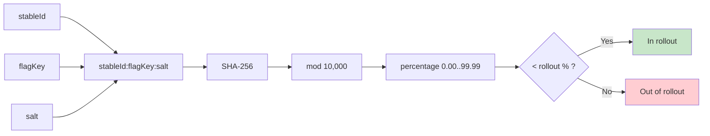

# Konditional: Engineer Pitch Deck

Konditional is a Kotlin feature-flag DSL that makes configuration **typed**, **deterministic**, and **non-null**.
It is designed to reduce runtime failure modes by binding flag identity and value types to Kotlin properties, and by treating dynamic JSON as a validated trust boundary.

---

## The problem: stringly-typed flags fail in ways the compiler can’t see

Traditional systems typically combine:
- a **string key** (`"dark-mode"`)
- a **typed getter** chosen by the caller (`getBoolean`, `getString`, …)

That creates three classes of failures that are syntactically valid but semantically wrong:
1. **Key mismatch** (typos) → silent defaults / nulls
2. **Type mismatch** → wrong “getter” compiles, fails logically at runtime
3. **Null propagation** → missing config becomes `null` in business logic

Konditional moves key/type binding into Kotlin’s type system for statically-defined flags, and makes JSON a validated boundary.

---

## Konditional in 60 seconds



---

## The minimal API surface

### 0. Define a container (a namespace-bound registry owner)

```kotlin
object AppFeatures : FeatureContainer<Namespace.Global>(Namespace.Global) {
    val DARK_MODE by boolean(default = false)
    val API_ENDPOINT by string(default = "https://api.example.com")
    val MAX_RETRIES by int(default = 3)
    val TIMEOUT by double(default = 30.0)
}
```

### 1. Provide evaluation context

```kotlin
val context = Context(
    locale = AppLocale.UNITED_STATES,
    platform = Platform.IOS,
    appVersion = Version.parse("2.1.0"),
    stableId = StableId.of("a1b2c3d4e5f6a7b8c9d0e1f2a3b4c5d6")
)
```

### 2. Evaluate (typed, non-null)

```kotlin
val enabled: Boolean = feature { AppFeatures.DARK_MODE }
val endpoint: String = feature { AppFeatures.API_ENDPOINT }
```

---

## Targeting rules (typed mappings from criteria → value)

Rules combine criteria with AND semantics within a rule; across rules, higher specificity wins.

```kotlin
val API_ENDPOINT by string(default = "https://api.example.com") {
    rule { platforms(Platform.IOS) } returns "https://api-ios.example.com"
    rule { platforms(Platform.ANDROID) } returns "https://api-android.example.com"
}
```

```kotlin
val PREMIUM_FEATURE by boolean(default = false) {
    rule {
        platforms(Platform.IOS, Platform.ANDROID)
        locales(AppLocale.UNITED_STATES)
        versions { min(2, 0, 0) }
        rollout { 50.0 }
    } returns true
}
```

Custom targeting logic stays type-safe via `extension { }`:

```kotlin
data class EnterpriseContext(
    override val locale: AppLocale,
    override val platform: Platform,
    override val appVersion: Version,
    override val stableId: StableId,
    val subscriptionTier: SubscriptionTier,
    val employeeCount: Int
) : Context

enum class SubscriptionTier { FREE, PRO, ENTERPRISE }

val ADVANCED_ANALYTICS by boolean<EnterpriseContext>(default = false) {
    rule {
        extension {
            Evaluable.factory { ctx ->
                ctx.subscriptionTier == SubscriptionTier.ENTERPRISE &&
                    ctx.employeeCount > 100
            }
        }
    } returns true
}
```

---

## Deterministic rollouts (local bucketing)

Rollouts are deterministic: the same `(stableId, flagKey, salt)` yields the same bucket assignment.



---

## Namespaces: Global is built-in; isolation is consumer-defined

Konditional ships `Namespace.Global`. If you need isolation boundaries (team/domain registries), define your own namespaces:

```kotlin
sealed class AppDomain(id: String) : Namespace(id) {
    data object Auth : AppDomain("auth")
    data object Payments : AppDomain("payments")
}

object AuthFeatures : FeatureContainer<AppDomain.Auth>(AppDomain.Auth) {
    val SOCIAL_LOGIN by boolean(default = false)
}

object PaymentFeatures : FeatureContainer<AppDomain.Payments>(AppDomain.Payments) {
    val APPLE_PAY by boolean(default = false)
}
```

This keeps the library’s defaults simple while still allowing compile-time isolation and independent config lifecycles when you opt in.

---

## Remote configuration: validated boundary, not “compile-time magic”

```kotlin
val json = File("flags.json").readText()
when (val result = SnapshotSerializer.fromJson(json)) {
    is ParseResult.Success -> Namespace.Global.load(result.value)
    is ParseResult.Failure -> logError("Parse failed: ${result.error}")
}
```

Contract:
- `ParseResult.Success` means the payload was validated into a typed internal snapshot before being applied.
- `ParseResult.Failure` means the payload is rejected before it can affect evaluation.

---

## What is guaranteed vs what is not

| Claim | Guarantee level | Mechanism |
|---|---|---|
| No call-site string keys | Compile-time | property access (refactor-safe) |
| Return type matches definition | Compile-time | generic type propagation |
| Rule return types are correct | Compile-time | constrained rule DSL |
| Evaluation is never null | Compile-time | required defaults |
| JSON config is type-safe | Runtime (validated boundary) | `ParseResult` + schema/type checks |
| Semantic correctness | Not guaranteed | authoring/process responsibility |

---

## Adoption path (practical)

1. Start with `Namespace.Global` and a single `FeatureContainer`.
2. Replace call sites with `feature { Container.FLAG }` to eliminate key/type drift.
3. Add rules (`platforms`, `locales`, `versions`, `rollout`) and custom context + `extension { }` when needed.
4. If you need remote config, export/load snapshots and treat parse failures as “keep last-known-good”.
