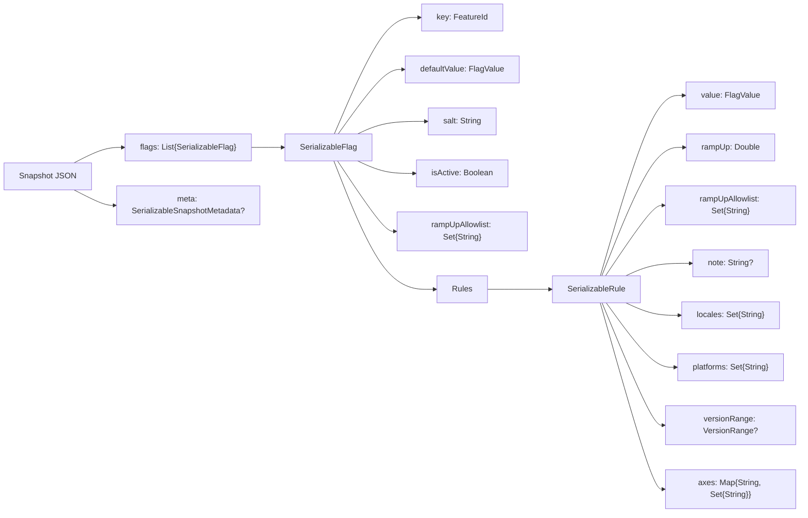

---
hide:
  - navigation
---

# Persistence & Storage Format

This page documents the JSON formats used to persist and transport Konditional configuration:

- **Snapshot**: the full configuration payload (`SnapshotSerializer.serialize(...)`)
- **Patch**: an incremental update payload (`SnapshotSerializer.applyPatchJson(...)`)

These formats are intentionally storage-agnostic: you can store the JSON in files, a database, or ship it over the
network.

---

## Mental model: what is persisted

At persistence time, the library serializes a list of **flag definitions**:



---

## FeatureId format (`key`)

Each flag is stored under a stable **FeatureId** string:

```
feature::${namespaceIdentifierSeed}::${featureKey}
```

Where:

- `${namespaceIdentifierSeed}` is `Namespace.identifierSeed` (defaults to the namespace `id`)
- `${featureKey}` is the feature key (typically the Kotlin property name)

Example (Global namespace, `darkMode`):

```
feature::global::darkMode
```

Backward compatibility: older snapshots may contain `value::${namespaceIdentifierSeed}::${featureKey}`. These are
normalized on load.

---

## Value encoding (`FlagValue`)

Both `defaultValue` and each rule’s `value` are encoded as a tagged object:

```json
{
  "type": "BOOLEAN",
  "value": true
}
```

Supported shapes:

| Kind       | JSON shape                                                                                  |
|------------|---------------------------------------------------------------------------------------------|
| Boolean    | `{ "type": "BOOLEAN", "value": ${boolean} }`                                                |
| String     | `{ "type": "STRING", "value": "${string}" }`                                                |
| Int        | `{ "type": "INT", "value": ${int} }`                                                        |
| Double     | `{ "type": "DOUBLE", "value": ${double} }`                                                  |
| Enum       | `{ "type": "ENUM", "value": "${enumName}", "enumClassName": "${fqcn}" }`                    |
| Data class | `{ "type": "DATA_CLASS", "dataClassName": "${fqcn}", "value": { ...primitive fields... } }` |

The `DATA_CLASS` representation stores a primitive map of fields along with the fully qualified class name.

---

## Version range encoding (`versionRange`)

Rules may include a `versionRange` object. It uses a discriminator and optional bounds:

```json
{
  "type": "MIN_AND_MAX_BOUND",
  "min": {
    "major": 2,
    "minor": 0,
    "patch": 0
  },
  "max": {
    "major": 4,
    "minor": 0,
    "patch": 0
  }
}
```

Valid `type` values:

- `UNBOUNDED`
- `MIN_BOUND` (requires `min`)
- `MAX_BOUND` (requires `max`)
- `MIN_AND_MAX_BOUND` (requires `min` and `max`)

Locale and platform values are serialized as their stable ids (`LocaleTag.id` / `PlatformTag.id`). The built-in
`AppLocale` and `Platform` enums use their enum names as ids, so existing snapshots remain stable.

---

## Ramp-up allowlists (`rampUpAllowlist`)

Both flags and individual rules may include a `rampUpAllowlist` field:

- It is a set of **stable ID hex strings** (the same representation returned by `Context.stableId.id`).
- It does not force a rule to match; it only bypasses the ramp-up check *after* a rule matches by criteria.
- Flag-level and rule-level allowlists are treated as a union (either can bypass ramp-up).
- It does not override `isActive` or the namespace kill-switch (`disableAll`).

To generate a value for remote config, use the same normalization as the runtime:

```kotlin
val stableIdHex = StableId.of("user-123").id // "757365722d313233"
val stableIdFromHex = StableId.fromHex(stableIdHex)
```

---

## Generic templates (Kotlin-style)

### Snapshot template

```kotlin
val snapshotJson = """
{
  "meta": {
    "version": "${optionalVersionOrNull}",
    "generatedAtEpochMillis": ${optionalEpochMillisOrNull},
    "source": "${optionalSourceOrNull}"
  },
  "flags": [
    {
      "key": "feature::${namespaceSeed}::${featureKey}",
      "defaultValue": {
        "type": "${valueType}",
        "value": ${defaultValueJson},
        "...": "${typeSpecificFields}"
      },
      "salt": "${salt}",
      "isActive": ${isActive},
      "rampUpAllowlist": ["${stableIdHex}", "..."],
      "rules": [
        {
          "value": {
            "type": "${valueType}",
            "value": ${ruleValueJson},
            "...": "${typeSpecificFields}"
          },
          "rampUp": ${rampUpPercent},
          "rampUpAllowlist": ["${stableIdHex}", "..."],
          "note": "${optionalNoteOrNull}",
          "locales": ["${APP_LOCALE_ENUM_NAME}", "..."],
          "platforms": ["${PLATFORM_ENUM_NAME}", "..."],
          "axes": {
            "${axisId}": ["${axisValueId}", "..."]
          },
          "versionRange": {
            "type": "${UNBOUNDED|MIN_BOUND|MAX_BOUND|MIN_AND_MAX_BOUND}",
            "min": { "major": ${minMajor}, "minor": ${minMinor}, "patch": ${minPatch} },
            "max": { "major": ${maxMajor}, "minor": ${maxMinor}, "patch": ${maxPatch} }
          }
        }
      ]
    }
  ]
}
"""
```

### Patch template

```kotlin
val patchJson = """
{
  "meta": {
    "version": "${optionalVersionOrNull}",
    "generatedAtEpochMillis": ${optionalEpochMillisOrNull},
    "source": "${optionalSourceOrNull}"
  },
  "flags": [
    { "...": "SerializableFlag objects (same shape as snapshot)" }
  ],
  "removeKeys": [
    "feature::${namespaceSeed}::${featureKeyToRemove}",
    "feature::${namespaceSeed}::${anotherKey}"
  ]
}
"""
```

---

## Parse boundary and failure modes

Deserialization reconstructs configurations by looking up each `key` in an internal registry of known features.

- If a key is not registered, parsing fails with `ParseError.FeatureNotFound`.
- JSON syntax/shape errors fail with `ParseError.InvalidJson` / `ParseError.InvalidSnapshot`.

Operationally: treat parse failures as “reject update, keep last-known-good”.

---

## Snapshot metadata (`meta`)

Snapshots and patches may include an optional `meta` object:

```json
{
  "meta": {
    "version": "rev-123",
    "generatedAtEpochMillis": 1700000000000,
    "source": "s3://configs/global.json"
  },
  "flags": []
}
```

---

## JSON examples

Notes:

- Incoming JSON may omit fields that have defaults (for example `rampUpAllowlist`, `locales`, `platforms`, `axes`, and
  `versionRange`).
- `SnapshotSerializer.serialize(...)` emits explicit values for these fields (including empty arrays/objects).

:::details Snapshot: booleans + string variants, with version ranges

```json
{
  "flags": [
    {
      "key": "feature::global::darkMode",
      "defaultValue": {
        "type": "BOOLEAN",
        "value": false
      },
      "salt": "v1",
      "isActive": true,
      "rampUpAllowlist": [],
      "rules": [
        {
          "value": {
            "type": "BOOLEAN",
            "value": true
          },
          "rampUp": 50.0,
          "rampUpAllowlist": [
            "757365722d313233"
          ],
          "note": "iOS gradual ramp-up",
          "locales": [
            "UNITED_STATES"
          ],
          "platforms": [
            "IOS"
          ],
          "axes": {},
          "versionRange": {
            "type": "MIN_BOUND",
            "min": {
              "major": 2,
              "minor": 0,
              "patch": 0
            }
          }
        }
      ]
    },
    {
      "key": "feature::global::apiEndpoint",
      "defaultValue": {
        "type": "STRING",
        "value": "https://api.example.com"
      },
      "salt": "v1",
      "isActive": true,
      "rampUpAllowlist": [],
      "rules": [
        {
          "value": {
            "type": "STRING",
            "value": "https://api-ios.example.com"
          },
          "rampUp": 100.0,
          "rampUpAllowlist": [],
          "note": "iOS endpoint",
          "locales": [],
          "platforms": [
            "IOS"
          ],
          "axes": {},
          "versionRange": {
            "type": "UNBOUNDED"
          }
        },
        {
          "value": {
            "type": "STRING",
            "value": "https://api-android.example.com"
          },
          "rampUp": 100.0,
          "rampUpAllowlist": [],
          "note": "Android endpoint",
          "locales": [],
          "platforms": [
            "ANDROID"
          ],
          "axes": {},
          "versionRange": {
            "type": "UNBOUNDED"
          }
        }
      ]
    }
  ]
}
```

:::

:::details Snapshot: enum value payload

```json
{
  "flags": [
    {
      "key": "feature::global::theme",
      "defaultValue": {
        "type": "ENUM",
        "value": "LIGHT",
        "enumClassName": "com.example.Theme"
      },
      "salt": "v1",
      "isActive": true,
      "rampUpAllowlist": [],
      "rules": [
        {
          "value": {
            "type": "ENUM",
            "value": "DARK",
            "enumClassName": "com.example.Theme"
          },
          "rampUp": 100.0,
          "rampUpAllowlist": [],
          "note": "Dark theme for iOS",
          "locales": [],
          "platforms": [
            "IOS"
          ],
          "axes": {},
          "versionRange": {
            "type": "UNBOUNDED"
          }
        }
      ]
    }
  ]
}
```

:::

:::details Patch: update one flag, remove one flag

```json
{
  "flags": [
    {
      "key": "feature::global::darkMode",
      "defaultValue": {
        "type": "BOOLEAN",
        "value": false
      },
      "salt": "v1",
      "isActive": true,
      "rampUpAllowlist": [],
      "rules": [
        {
          "value": {
            "type": "BOOLEAN",
            "value": true
          },
          "rampUp": 100.0,
          "rampUpAllowlist": [],
          "note": "Ramp-up complete",
          "locales": [],
          "platforms": [],
          "axes": {},
          "versionRange": {
            "type": "UNBOUNDED"
          }
        }
      ]
    }
  ],
  "removeKeys": [
    "feature::global::LEGACY_SUPPORT"
  ]
}
```

:::

:::details Consumer Configuration Lifecycle Sample

```json
{
  "flags": [
    {
      "key": "feature::consumer-lifecycle-3f02840e-abd0-4447-9bdc-0a8f41ca530e::darkMode",
      "defaultValue": {
        "type": "BOOLEAN",
        "value": false
      },
      "salt": "v1",
      "isActive": true,
      "rules": [
        {
          "value": {
            "type": "BOOLEAN",
            "value": true
          },
          "rampUp": 100.0,
          "note": "iOS fully enabled",
          "locales": [],
          "platforms": [
            "IOS"
          ],
          "versionRange": {
            "type": "UNBOUNDED"
          }
        }
      ]
    },
    {
      "key": "feature::consumer-lifecycle-3f02840e-abd0-4447-9bdc-0a8f41ca530e::apiEndpoint",
      "defaultValue": {
        "type": "STRING",
        "value": "https://api.example.com"
      },
      "salt": "v1",
      "isActive": true,
      "rules": [
        {
          "value": {
            "type": "STRING",
            "value": "https://api-web.example.com"
          },
          "rampUp": 100.0,
          "note": "Web endpoint override",
          "locales": [],
          "platforms": [
            "WEB"
          ],
          "versionRange": {
            "type": "UNBOUNDED"
          }
        }
      ]
    },
    {
      "key": "feature::consumer-lifecycle-3f02840e-abd0-4447-9bdc-0a8f41ca530e::maxRetries",
      "defaultValue": {
        "type": "INT",
        "value": 3
      },
      "salt": "v1",
      "isActive": true,
      "rules": [
        {
          "value": {
            "type": "INT",
            "value": 5
          },
          "rampUp": 100.0,
          "note": "More retries on v2+",
          "locales": [],
          "platforms": [],
          "versionRange": {
            "type": "MIN_BOUND",
            "min": {
              "major": 2,
              "minor": 0,
              "patch": 0
            }
          }
        }
      ]
    },
    {
      "key": "feature::consumer-lifecycle-3f02840e-abd0-4447-9bdc-0a8f41ca530e::theme",
      "defaultValue": {
        "type": "ENUM",
        "value": "LIGHT",
        "enumClassName": "io.amichne.konditional.serialization.ConsumerConfigurationLifecycleTest$Theme"
      },
      "salt": "v1",
      "isActive": true,
      "rules": [
        {
          "value": {
            "type": "ENUM",
            "value": "DARK",
            "enumClassName": "io.amichne.konditional.serialization.ConsumerConfigurationLifecycleTest$Theme"
          },
          "rampUp": 100.0,
          "note": "Dark theme for FR locale",
          "locales": [
            "FRANCE"
          ],
          "platforms": [],
          "versionRange": {
            "type": "UNBOUNDED"
          }
        }
      ]
    },
    {
      "key": "feature::consumer-lifecycle-3f02840e-abd0-4447-9bdc-0a8f41ca530e::userSettings",
      "defaultValue": {
        "type": "DATA_CLASS",
        "dataClassName": "io.amichne.konditional.serialization.ConsumerConfigurationLifecycleTest$UserSettings",
        "value": {
          "enabled": true,
          "maxRetries": 3.0,
          "theme": "light",
          "timeoutSeconds": 30.0
        }
      },
      "salt": "v1",
      "isActive": true,
      "rules": [
        {
          "value": {
            "type": "DATA_CLASS",
            "dataClassName": "io.amichne.konditional.serialization.ConsumerConfigurationLifecycleTest$UserSettings",
            "value": {
              "enabled": false,
              "maxRetries": 5.0,
              "theme": "dark",
              "timeoutSeconds": 10.0
            }
          },
          "rampUp": 100.0,
          "note": "Custom settings for iOS",
          "locales": [],
          "platforms": [
            "IOS"
          ],
          "versionRange": {
            "type": "UNBOUNDED"
          }
        }
      ]
    }
  ]
}
```

:::
