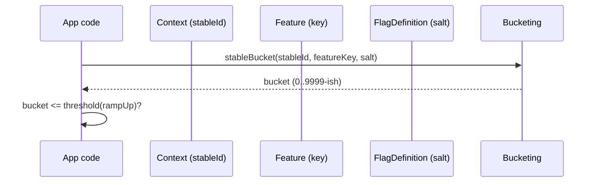

# Rollouts & Bucketing (Determinism You Can Debug)

Konditional’s rollouts are deterministic: if the inputs don’t change, a user’s bucket doesn’t change.
This makes “10% ramp-up” an engineering tool you can reason about (and reproduce) rather than a probabilistic guess.

## RampUp

`RampUp` is a value class representing a percentage from 0.0 to 100.0.

- **Compile-time:** you pass a `RampUp` (not a raw `Double`) at the boundary where the system cares.
- **Runtime:** bucketing uses an integer bucket plus a threshold derived from `RampUp`.

## StableId and allowlists

For deterministic rollouts you provide a stable identifier, typically via `Context.StableIdContext`.

If a stable ID is missing, the system falls back to a deterministic “missing stable id bucket”. That keeps behavior
consistent, but you should not expect fair sampling without stable IDs.

You can also allowlist specific IDs (globally for a flag or per-rule) to force inclusion regardless of ramp-up.

## Salt

Salt is an explicit input to bucketing. Changing `salt` intentionally re-samples your population without changing the
feature key or the stable ID.

:::caution Salt changes distribution
Changing `salt` is a deliberate resample. This is useful when you want a fresh cohort, but it also means historical
analysis across salts is not directly comparable.
:::

## Deterministic bucketing (exact mechanics)

The bucket is computed from `(salt, featureKey, stableId)`:

1. Hash the UTF‑8 bytes of `"$salt:$featureKey:${stableId.hexId.id}"` with SHA‑256.
2. Convert the first 4 bytes to an unsigned 32‑bit integer.
3. Bucket = `hash % 10_000` (range `[0, 9999]`).
4. Threshold = `(rampUp.value * 100.0).roundToInt()` (basis points).
5. In ramp‑up if `bucket < threshold`.



## Bucketing introspection (debugging)

When you need to answer “why is this user in/out?”, use `RampUpBucketing`:

```kotlin
val info = RampUpBucketing.explain(
    stableId = StableId.of("user-123"),
    featureKey = "feature::checkout::newUi",
    salt = "v1",
    rampUp = RampUp.of(10.0),
)

val inRollout = info.inRollout
```

:::note Determinism guarantee
Given the same `(stableId, featureKey, salt)`, `RampUpBucketing` always returns the same bucket and decision.
:::

Next:

- [Registry & Configuration](/registry-and-configuration)
- [Recipes](/recipes) for copy/paste patterns (including “resettable salt”)
