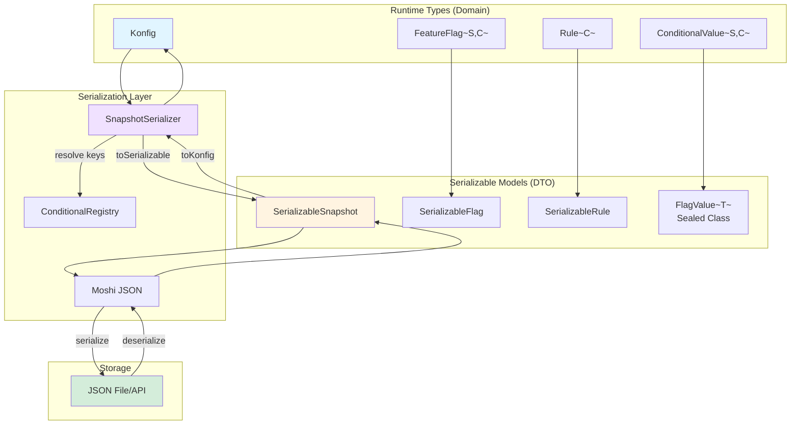
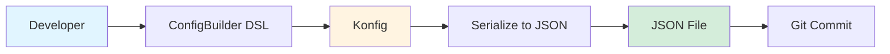
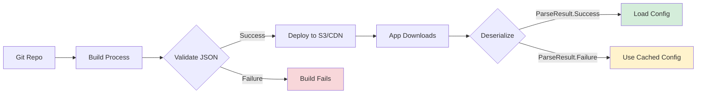
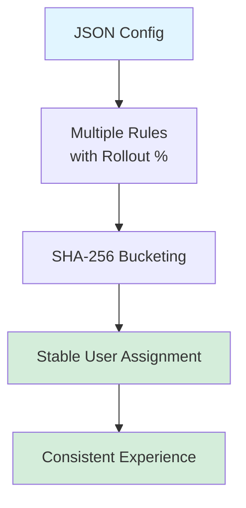

## What is Serialization?

The Konditional serialization system enables you to externalize your feature flag configurations as JSON files. This allows you to:

- **Separate configuration from code** - Update flags without recompiling
- **Version control configurations** - Track flag changes over time
- **Environment-specific settings** - Different configs for dev/staging/prod
- **Remote configuration** - Load flags from a server or CDN
- **Dynamic updates** - Apply changes without app restarts

  
### Type-Safe

    All values are wrapped with their type information, preventing runtime type mismatches
  
  
### Round-Trip Guaranteed

    Serialized configurations behave identically to programmatic ones
  
  
### Patch Updates

    Apply incremental changes without replacing entire configurations
  
  
### Production Ready

    Comprehensive test coverage with real-world examples
  

## Serialization Architecture



**Key Flow:**
1. **Serialize**: `Konfig` → `SerializableSnapshot` → JSON string
2. **Deserialize**: JSON string → `SerializableSnapshot` → `ParseResult<Konfig>`
3. **Type Safety**: `FlagValue<T>` sealed class preserves types through serialization
4. **Key Resolution**: `ConditionalRegistry` maps string keys back to typed instances

## Architecture Components

The serialization system consists of three main components:

### 1. Serializable Models

Type-safe DTOs that represent your configuration in JSON:

```kotlin
@JsonClass(generateAdapter = true)
data class SerializableSnapshot(
    val flags: List<SerializableFlag>
)

@JsonClass(generateAdapter = true)
data class SerializableFlag(
    val key: String,
    val defaultValue: FlagValue<*>,
    val salt: String = "v1",
    val isActive: Boolean = true,
    val rules: List<SerializableRule> = emptyList()
)

// FlagValue is a sealed class for type-safe value representation
sealed class FlagValue<out T : Any> {
    abstract val value: T

    data class BooleanValue(override val value: Boolean) : FlagValue<Boolean>()
    data class StringValue(override val value: String) : FlagValue<String>()
    data class IntValue(override val value: Int) : FlagValue<Int>()
    data class DoubleValue(override val value: Double) : FlagValue<Double>()
}
```

**Key Change**: Replaced `SerializableValue(value: Any, type: ValueType)` with `FlagValue<T>` sealed class to eliminate type erasure and improve type safety.

### 2. Conversion Utilities

Bidirectional conversion between runtime types and JSON:

- **ConditionalRegistry** - Maps flag keys to runtime instances (must register before deserialization)
- **Extension functions** - Convert between `Konfig` and `SerializableSnapshot`
- **Type safety** - No unchecked casts; `FlagValue` preserves types

### 3. Serialization API with ParseResult

Main interface for serialization operations:

```kotlin
val serializer = SnapshotSerializer()

// Serialize (always succeeds)
val json = serializer.serialize(konfig)

// Deserialize with structured error handling
when (val result = serializer.deserialize(json)) {
    is ParseResult.Success -> {
        val konfig = result.value
        FlagRegistry.load(konfig)
    }
    is ParseResult.Failure -> {
        when (val error = result.error) {
            is ParseError.InvalidJson -> log.error("Bad JSON: ${error.message}")
            is ParseError.ConditionalNotFound -> log.error("Unknown flag: ${error.key}")
            else -> log.error("Parse failed: ${error.message}")
        }
    }
}

// Apply patches with error handling
when (val result = serializer.applyPatchJson(FlagRegistry.konfig(), patchJson)) {
    is ParseResult.Success -> FlagRegistry.load(result.value)
    is ParseResult.Failure -> handleError(result.error)
}
```

**Key Change**: All deserialization methods return `ParseResult<T>` instead of throwing exceptions. This follows the "Parse, Don't Validate" principle.

## Key Concepts

### Type Safety with FlagValue

All values are wrapped with their type information using a sealed class:

```json
{
  "defaultValue": {
    "type": "BOOLEAN",
    "value": true
  }
}
```

**Benefits of FlagValue over old SerializableValue**:
- **Compile-time safety**: No `Any` types or unchecked casts
- **Illegal states unrepresentable**: Can't have `INT` type with `Boolean` value
- **Type preservation**: Generic type parameter `<T>` maintains type information
- **Self-describing JSON**: Type discriminator included in serialization

### The Registry Pattern

Before deserialization, you must register all your `Conditional` instances:

```kotlin
// Register an enum of flags
ConditionalRegistry.registerEnum<MyFeatureFlags>()

// Or register individual flags
ConditionalRegistry.register(MyFlags.SOME_FLAG)
```

This allows the deserializer to map string keys back to typed `Conditional` instances.

### ParseResult Error Handling

All deserialization operations return `ParseResult<T>` for structured error handling:

```kotlin
sealed interface ParseResult<out T> {
    data class Success<T>(val value: T) : ParseResult<T>
    data class Failure(val error: ParseError) : ParseResult<Nothing>
}

sealed interface ParseError {
    data class InvalidJson(val message: String) : ParseError
    data class InvalidSnapshot(val message: String) : ParseError
    data class ConditionalNotFound(val key: String) : ParseError
}
```

**Usage patterns**:

```kotlin
// Pattern 1: Quick unwrap (throws on error, useful in tests)
val konfig = serializer.deserialize(json).getOrThrow()

// Pattern 2: Explicit handling
when (val result = serializer.deserialize(json)) {
    is ParseResult.Success -> FlagRegistry.load(result.value)
    is ParseResult.Failure -> log.error("Failed: ${result.error}")
}

// Pattern 3: Fallback value
val konfig = serializer.deserialize(json).getOrDefault(emptyKonfig)
```

### Round-Trip Equality

A core guarantee of the system is that serialized configurations behave identically to the originals:

```kotlin
val original = ConfigBuilder.buildSnapshot { /* ... */ }
val json = serializer.serialize(original)

when (val result = serializer.deserialize(json)) {
    is ParseResult.Success -> {
        val restored = result.value
        // These produce identical results
        assert(context.evaluate(MY_FLAG, original) ==
               context.evaluate(MY_FLAG, restored))
    }
    is ParseResult.Failure -> fail("Deserialization failed")
}
```

## JSON Structure

### Complete Example

```json
{
  "flags": [
    {
      "key": "enable_compact_cards",
      "defaultValue": {
        "type": "BOOLEAN",
        "value": false
      },
      "salt": "v1",
      "isActive": true,
      "rules": [
        {
          "value": {
            "type": "BOOLEAN",
            "value": true
          },
          "rollout": 50.0,
          "note": "US iOS 50% rollout",
          "locales": ["EN_US"],
          "platforms": ["IOS"],
          "versionRange": {
            "type": "LeftBound",
            "min": {
              "major": 7,
              "minor": 10,
              "patch": 0
            }
          }
        }
      ]
    }
  ]
}
```

**Key Changes from Previous Versions**:
- Removed top-level `type` field (type is now in FlagValue)
- Removed redundant `default` field (replaced by `defaultValue` with FlagValue)
- `versionRange.type` uses actual sealed class names (`LeftBound`, `RightBound`, etc.)

### Field Reference

#### Flag Level

| Field | Type | Required | Description |
|-------|------|----------|-------------|
| `key` | String | Yes | Unique identifier matching `Conditional.key` |
| `defaultValue` | FlagValue | Yes | Typed default value when no rules match |
| `salt` | String | No | Salt for bucketing (default: "v1") |
| `isActive` | Boolean | No | Whether flag is active (default: true) |
| `rules` | Array | No | List of targeting rules |

#### Rule Level

| Field | Type | Required | Description |
|-------|------|----------|-------------|
| `value` | FlagValue | Yes | Typed value to return if rule matches |
| `rollout` | Number | No | Percentage 0-100 (default: 100) |
| `note` | String | No | Description of the rule |
| `locales` | Array | No | Set of locales (empty = all) |
| `platforms` | Array | No | Set of platforms (empty = all) |
| `versionRange` | Object | No | Version constraints |

#### Version Range Types (Sealed Class)

| Type | Fields | Description |
|------|--------|-------------|
| `Unbounded` | None | No version constraints |
| `LeftBound` | `min: Version` | `version >= min` |
| `RightBound` | `max: Version` | `version <= max` |
| `FullyBound` | `min: Version`, `max: Version` | `min <= version <= max` |

**Example**:
```json
{
  "type": "FullyBound",
  "min": {"major": 1, "minor": 0, "patch": 0},
  "max": {"major": 2, "minor": 5, "patch": 10}
}
```

## Use Cases

### 1. Development Workflow



### 2. CI/CD Pipeline



### 3. Remote Configuration with Error Handling

```kotlin
// Fetch configuration from server
val json = fetchFromServer()

// Deserialize with error handling
when (val result = serializer.deserialize(json)) {
    is ParseResult.Success -> {
        FlagRegistry.load(result.value)
        log.info("Configuration updated successfully")
    }
    is ParseResult.Failure -> {
        log.error("Failed to load remote config: ${result.error}")
        // Keep using current configuration
    }
}
```

### 4. A/B Testing with Deterministic Bucketing



## Next Steps

  
### Integration Guide

    Learn how to integrate serialization into your existing codebase

    [Read the guide →](integration.md)


### Step-by-Step Tutorial

    Follow detailed steps to implement serialization from scratch

    [Start tutorial →](steps/step-01-dependencies.md)


### Full Runthrough

    See the complete integration in one place

    [View runthrough →](runthrough.md)
  

::: tip
The serialization system is production-ready with comprehensive test coverage. All 11 serialization tests pass, verifying round-trip equality and patch functionality.
:::
