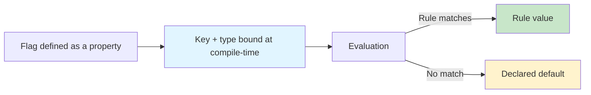

# Getting Started

Konditional is a Kotlin feature-flag DSL designed to make configuration *typed*, *deterministic*, and *non-null*.
The core claim is precise: statically-defined flags have compile-time type correctness, and evaluation is total (you
always get a value back).

---

## Why Konditional (and what it actually guarantees)

Most flag systems are stringly-typed: a string key selects a value and the caller chooses a “typed getter”.
That architecture creates three failure modes that are syntactically valid but semantically wrong at runtime: key typos,
type mismatches, and null propagation.

Konditional changes the failure surface by binding identity and type at definition time via Kotlin properties:

- **No string keys at call sites**: flags are accessed as properties (typos become compile errors).
- **No casts at call sites**: the return type flows from the flag definition (mismatched types become compile errors).
- **No nulls from evaluation**: defaults are required, so evaluation has a total return path.



---

## Installation

```kotlin
// build.gradle.kts
dependencies {
    implementation("io.github.amichne:konditional:0.0.1")
}
```

---

## Your first flag

Define a flag as a delegated property on a `Namespace`:

```kotlin
import io.amichne.konditional.api.evaluate
import io.amichne.konditional.core.Namespace
import io.amichne.konditional.context.*
import io.amichne.konditional.core.id.StableId

object AppFeatures : Namespace("app") {
    val darkMode by boolean<Context>(default = false) {
        rule(true) {
            platforms(Platform.IOS)
            rollout { 50.0 }
        }
    }
}

val context = Context(
    locale = AppLocale.UNITED_STATES,
    platform = Platform.IOS,
    appVersion = Version.of(2, 1, 0),
    stableId = StableId.of("user-123"),
)

val enabled: Boolean = AppFeatures.darkMode.evaluate(context)
```

Notes:

- Evaluation is total for declared features: `evaluate(context)` always returns the flag’s declared Kotlin type (never
  null).
- Use `evaluateWithReason(context)` when you need operational traceability (“why did I get this value?”).

---

## A small API surface, intentionally

Supported value types (out of the box):

| Type       | Namespace method | Kotlin type                          | Example default |
|------------|-------------------------|--------------------------------------|-----------------|
| Boolean    | `boolean(...)`          | `Boolean`                            | `false`         |
| String     | `string(...)`           | `String`                             | `"production"`  |
| Integer    | `integer(...)`          | `Int`                                | `42`            |
| Decimal    | `double(...)`           | `Double`                             | `3.14`          |
| Enum       | `enum(...)`             | `E : Enum<E>`                        | `LogLevel.INFO` |
| Data class | `custom(...)`           | `T : KotlinEncodeable<ObjectSchema>` | `MyConfig()`    |

---

## Common patterns

### Gradual rollout (deterministic)

```kotlin
val newCheckout by boolean<Context>(default = false) {
    rule(true) {
        platforms(Platform.ANDROID)
        rollout { 10.0 }
    }
}
```

Konditional’s rollouts are deterministic: the same `(stableId, flagKey, salt)` yields the same bucket assignment.

### Platform-specific configuration

```kotlin
val apiEndpoint by string<Context>(default = "https://api.example.com") {
    rule("https://api-ios.example.com") { platforms(Platform.IOS) }
    rule("https://api-android.example.com") { platforms(Platform.ANDROID) }
    rule("https://api-web.example.com") { platforms(Platform.WEB) }
}
```

### Rollout allowlisting (internal testers)

Allowlists bypass rollout *after* a rule matches by criteria:

```kotlin
val newUi by boolean<Context>(default = false) {
    allowlist(StableId.of("tester-1"))
    rule(true) { rollout { 5.0 } }
}
```

### Variants via enums (not strings)

```kotlin
enum class Theme { LIGHT, DARK }

val theme by enum<Theme, Context>(default = Theme.LIGHT) {
    rule(Theme.DARK) { platforms(Platform.IOS) }
}
```

---

## Namespaces scale ownership, not prefixes

Define multiple namespaces when you need isolated registries (per-team, per-domain).

```kotlin
sealed class AppDomain(id: String) : Namespace(id) {
    data object Auth : AppDomain("auth") {
        val socialLogin by boolean<Context>(default = false)
    }

    data object Payments : AppDomain("payments") {
        val applePay by boolean<Context>(default = false)
    }
}
```

---

## Next steps

- Learn the building blocks: ["Core Concepts"](core-concepts)
- Write targeting rules and understand rollouts: ["Targeting & Rollouts"](targeting-rollouts)
- Understand evaluation order and determinism: ["Evaluation"](evaluation)
- Add runtime-validated JSON configuration: ["Remote Configuration"](remote-config)
- Understand the exact trust boundary: ["Theory"](theory)
