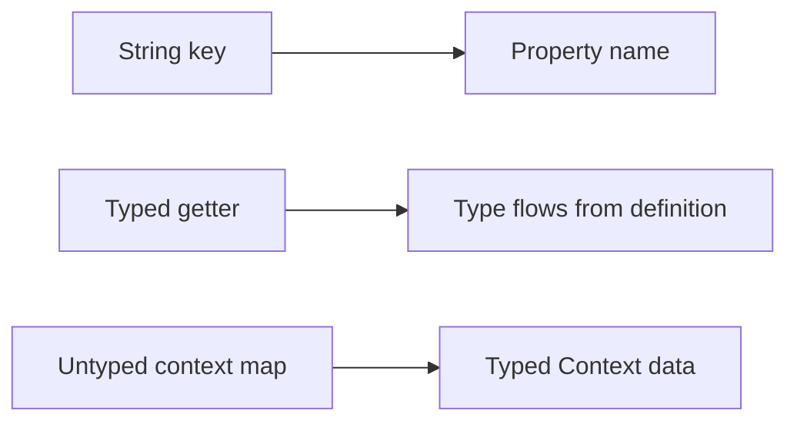

# Migration Guide

This guide maps the conceptual shift from string-based flags to Konditional’s typed, property-based model.
It focuses on what changes at the definition site, at the call site, and at the trust boundary (runtime JSON).

---

## The core mapping

String-based flag systems typically have:

- a **string key** (`"dark-mode"`)
- a **typed getter** chosen by the caller (`getBoolean`, `getString`, …)
- an **untyped context** (often string keys and `Any` values)

Konditional replaces those with:

- a **property** (the property name becomes the key)
- a **declared type** (from the delegate: `boolean`, `string`, `int`, `double`, `enum`)
- a **typed `Context`** (and optionally domain-specific context data classes)



---

## Step-by-step adoption (incremental)

### 0. Start with one namespace

```kotlin
object Features : Namespace("app") {
    val darkMode by boolean<Context>(default = false)
}
```

### 1. Replace call sites first (value safety)

```kotlin
val enabled: Boolean = Features.darkMode.evaluate(context)
```

What you gain immediately:

- key typos are eliminated at the call site (there is no string key)
- return type is concrete (no cast; `Boolean` is enforced)
- evaluation is non-null (default is required)

### 2. Introduce typed context (targeting + ramp-ups)

```kotlin
val context = Context(
    locale = AppLocale.UNITED_STATES,
    platform = Platform.IOS,
    appVersion = Version.parse("2.1.0"),
    stableId = StableId.of("a1b2c3d4e5f6a7b8c9d0e1f2a3b4c5d6")
)
```

`stableId` is the stable input used for deterministic ramp-up bucketing (
see ["Targeting & Ramp-ups"](targeting-ramp-ups)).

### 3. Add rules after defaults exist (behavior safety)

```kotlin
val apiEndpoint by string<Context>(default = "https://api.example.com") {
    rule("https://api-ios.example.com") { platforms(Platform.IOS) }
}
```

---

## Migrating “context maps” to typed contexts

If your current system uses string keys (`"tier"`, `"role"`, …), move that information into a custom context:

```kotlin
data class EnterpriseContext(
    override val locale: AppLocale,
    override val platform: Platform,
    override val appVersion: Version,
    override val stableId: StableId,
    val subscriptionTier: SubscriptionTier,
    val employeeCount: Int
) : Context

enum class SubscriptionTier { FREE, PRO, ENTERPRISE }

object EnterpriseFeatures : Namespace("enterprise") {
    val advancedAnalytics by boolean<EnterpriseContext>(default = false) {
        rule(true) {
            extension {
                subscriptionTier == SubscriptionTier.ENTERPRISE && employeeCount > 100
            }
        }
    }
}
```

Result: business targeting logic becomes type-checked and refactor-safe.

---

## Namespaces replace prefixes

Instead of `"auth.dark-mode"` / `"payments.dark-mode"` style prefixes, use namespace isolation:

```kotlin
sealed class AppDomain(id: String) : Namespace(id) {
    data object Auth : AppDomain("auth") {
        val socialLogin by boolean<Context>(default = false)
    }

    data object Payments : AppDomain("payments") {
        val applePay by boolean<Context>(default = false)
    }
}
```

Each namespace has its own registry and independent configuration lifecycle.

---

## When you need runtime configuration (remote JSON)

Konditional supports JSON configuration as a validated boundary:

```kotlin
val json = File("flags.json").readText()
when (val result = AppDomain.Payments.fromJson(json)) {
    is ParseResult.Success -> Unit // loaded into AppDomain.Payments
    is ParseResult.Failure -> logError("Parse failed: ${result.error}")
}
```

The guarantee is intentionally qualified: JSON is not “always safe”; instead, invalid JSON is rejected before it can
affect evaluation.

---

## Shadow evaluation (parallel migration)

For gradual migrations, you can evaluate against a baseline registry and shadow-evaluate against a candidate:

```kotlin
val value = Features.darkMode.evaluateWithShadow(
    context = context,
    candidateRegistry = candidateRegistry,
    onMismatch = { mismatch ->
        log.warn("Mismatch: ${mismatch.kinds} baseline=${mismatch.baseline.value} candidate=${mismatch.candidate.value}")
    }
)
```

This keeps behavior pinned to the baseline value while generating comparison telemetry for the candidate path.

---

## Next steps

- Learn the primitives: ["Core Concepts"](core-concepts)
- Understand rule evaluation and determinism: ["Evaluation"](evaluation)
- Operate remote config safely: ["Remote Configuration"](remote-config)
