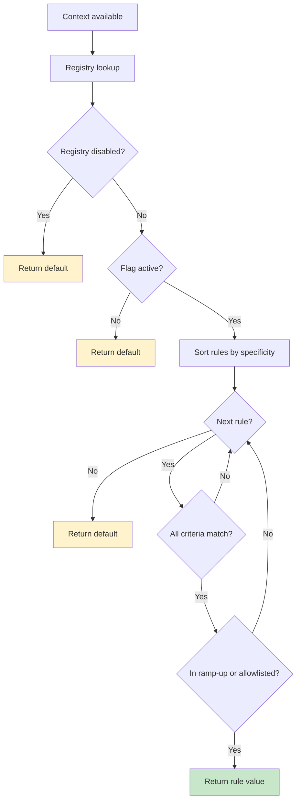

# Evaluation

### Konditional evaluation is designed to be predictable

- **Total** — Evaluation always returns a value (rule value or default).
- **Deterministic** — The same inputs produce the same outputs.
- **Non-null** — Defaults are required, so evaluation does not return `T?`.

---

## `Feature.evaluate(context)` (recommended)

Concise evaluation with an explicit context:

```kotlin
val darkMode = Features.darkMode.evaluate(context)
applyDarkMode(darkMode)
```

Use this when:

- defaults are meaningful
- you want the smallest call-site surface

Evaluation is always via `Feature.evaluate(...)` (or `evaluateWithReason(...)`) and requires an explicit `Context`.

---

## Explain / trace (operational debugging)

When you need to diagnose a specific user’s outcome, evaluate with a structured reason:

```kotlin
val result = Features.darkMode.evaluateWithReason(context)
println(result.decision)
```

`EvaluationResult` includes:

- decision kind (rule/default/inactive/disabled)
- matched rule constraints + specificity
- deterministic ramp-up bucket information

---

## Evaluation flow



---

## Emergency kill switch (namespace-scoped)

```kotlin
Features.disableAll()
// ... all evaluations in this namespace return declared defaults ...
Features.enableAll()
```

---

## Bucketing utility (ramp-up debugging)

```kotlin
val info = RampUpBucketing.explain(
    stableId = context.stableId,
    featureKey = Features.darkMode.key,
    salt = Features.flag(Features.darkMode).salt,
    rampUp = RampUp.of(10.0),
)
println(info)
```

### Rule matching (AND semantics)

All specified criteria must match; empty constraint sets match everything.

Evaluation applies the first matching rule that is in-ramp-up (or allowlisted), otherwise it falls back to the default.

### Specificity ordering (most specific wins)

Rules are sorted by targeting specificity (platforms/locales/version bounds/axes) plus extension specificity.
Ramp-up percentage does not affect specificity; it gates whether a matching rule is applied.

---

## Performance model

The evaluation path is designed to be predictable:

- **Registry lookup:** O(1)
- **Rule iteration:** O(n) where n is rules per flag (typically small)
- **Ramp-up bucketing:** 0 or 1 SHA-256 hash per evaluation (bucket is computed only after a rule matches by criteria)

Space model:

- evaluation allocates a small trace object internally and may allocate for hashing inputs
- rule structures are pre-built and reused across evaluations

---

## Concurrency model

Evaluation is designed for concurrent reads:

- **Lock-free reads**: evaluation does not require synchronization.
- **Atomic updates**: configuration updates swap the active snapshot atomically (`Namespace.load`).

```kotlin
// Thread 1
Features.load(newConfig)

// Thread 2 (during update)
val value = Features.darkMode.evaluate(context) // sees old OR new, never a mixed state
```

---

## Testing evaluation

### Rule matching

```kotlin
@Test
fun `iOS users in US get dark mode`() {
    val context = Context(
        locale = AppLocale.UNITED_STATES,
        platform = Platform.IOS,
        appVersion = Version.of(2, 1, 0),
        stableId = StableId.of("user-123"),
    )

    val enabled = Features.darkMode.evaluate(context)
    assertTrue(enabled)
}
```

### Determinism

```kotlin
@Test
fun `evaluation is deterministic`() {
    val context = Context(/*...*/)
    val results = (1..100).map { Features.darkMode.evaluate(context) }
    assertTrue(results.distinct().size == 1, "Non-deterministic!")
}
```

### Ramp-up distribution (statistical sanity check)

```kotlin
@Test
fun `50 percent ramp-up distributes correctly`() {
    val sampleSize = 10_000
    val enabled = (0 until sampleSize).count { i ->
        val ctx = Context(/*..., */
                          stableId = StableId.of(i.toString(16).padStart(32, '0'))
        )
        Features.rampUpFlag.evaluate(ctx)
    }

    val percentage = (enabled.toDouble() / sampleSize) * 100
    assertTrue(percentage in 48.0..52.0)
}
```

---

## Guarantees (and boundaries)

| Aspect      | Guarantee                      | Boundary                                            |
|-------------|--------------------------------|-----------------------------------------------------|
| Type safety | return type matches definition | compile-time for statically-defined flags           |
| Non-null    | evaluation never returns null  | relies on required defaults                         |
| Determinism | same inputs → same outputs     | excludes malformed runtime JSON (see remote config) |
| Updates     | atomic swap of configuration   | correctness depends on using `Namespace.load`       |

---

## Next steps

- Understand ramp-ups and bucketing inputs: ["Targeting & Ramp-ups"](targeting-ramp-ups)
- Add runtime-validated JSON configuration: ["Remote Configuration"](remote-config)
