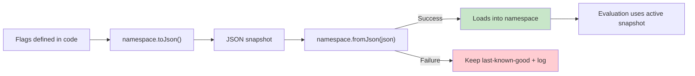

# Remote Configuration

Konditional supports dynamic configuration via JSON, but treats JSON as a **trust boundary**:

- compile-time guarantees apply to statically-defined flags and rules
- runtime JSON is accepted only after validation (`ParseResult.Success`), otherwise rejected (`ParseResult.Failure`)

---

## The lifecycle (end-to-end)



---

## Prerequisite: features must be registered

Deserialization can only succeed for features that exist in the process. In practice, this means your
`Namespace` objects must be initialized (so features are registered) before you call
`SnapshotSerializer.fromJson(...)`.

If a snapshot references a feature that has not been registered yet, deserialization fails with
`ParseError.FeatureNotFound`.

One simple pattern is to reference your namespaces at application startup (t0):

```kotlin
object Payments : Namespace("payments") {
    val applePay by boolean(default = false)
}

val _ = Payments // ensure registration at startup (t0)
```

---

## Exporting configuration

```kotlin
val json = Payments.toJson()
```

Use this when you want to externalize a namespace’s current configuration state into JSON for storage or transport.

---

## Loading configuration (validated boundary)

```kotlin
val json = File("flags.json").readText()
when (val result = Payments.fromJson(json)) {
    is ParseResult.Success -> Unit // loaded into Payments
    is ParseResult.Failure -> handleError(result.error)
}
```

The contract is explicit:

- **Success** means you have a type-correct, internally consistent snapshot representation (validated at the boundary).
- **Failure** means the payload is rejected before it can affect evaluation.

---

## Incremental updates via patching

```kotlin
val currentConfig = Payments.configuration
when (val result = SnapshotSerializer.applyPatchJson(currentConfig, patchJson)) {
    is ParseResult.Success -> Payments.load(result.value)
    is ParseResult.Failure -> handleError(result.error)
}
```

This supports applying incremental JSON updates, then atomically swapping the active configuration via `Namespace.load`.

---

## Error handling model (`ParseResult`)

Remote configuration is designed to force explicit handling of invalid input:

```kotlin
sealed interface ParseResult<out T> {
    data class Success<T>(val value: T) : ParseResult<T>()
    data class Failure(val error: ParseError) : ParseResult<Nothing>()
}
```

Operationally, treat failures as non-fatal: keep last-known-good configuration, log for alerting, and retry on the next
update.

---

## Hot-reload semantics (atomicity)

`Namespace.load(newConfiguration)` applies updates with atomic replacement semantics:

- readers see either the old snapshot or the new snapshot
- readers never see a partially-applied configuration

This aligns with the evaluation model documented in ["Evaluation"](evaluation).

---

## Lenient deserialization (forward compatibility)

During migrations, you may prefer to skip unknown keys instead of failing the entire snapshot:

```kotlin
val options = SnapshotLoadOptions.skipUnknownKeys { warning ->
    log.warn("Skipping unknown key: ${warning.key}")
}

when (val result = SnapshotSerializer.fromJson(json, options)) {
    is ParseResult.Success -> Payments.load(result.value)
    is ParseResult.Failure -> handleError(result.error)
}
```

This preserves strict correctness by default while enabling operationally-safe forward compatibility when needed.

---

## Versioning metadata (audit + rollback)

Snapshots optionally carry `meta` fields (version, timestamp, source). You can also attach metadata after parsing:

```kotlin
when (val result = SnapshotSerializer.fromJson(json)) {
    is ParseResult.Success -> Payments.load(
        result.value.withMetadata(
            version = "rev-123",
            source = "s3://configs/global.json",
        )
    )
    is ParseResult.Failure -> handleError(result.error)
}
```

Registries keep a bounded history of prior configurations for operational rollback:

```kotlin
val rolledBack: Boolean = Payments.rollback(steps = 1)
val history = Payments.historyMetadata
```

---

## What’s validated (and what is not)

Validated at the boundary:

- JSON syntax validity
- schema/structure validity
- value type checking against declared feature types

Not validated by the type system:

- semantic correctness (e.g., whether 50% is the intended rollout)
- business correctness (e.g., whether the targeted segment is correct)

---

## Integration patterns

### Polling

```kotlin
while (running) {
    val json = fetchFromServer()
    when (val result = SnapshotSerializer.fromJson(json)) {
        is ParseResult.Success -> Payments.load(result.value)
        is ParseResult.Failure -> log.error("Config parse failed: ${result.error}")
    }
    delay(pollInterval)
}
```

### Push-based (streams)

```kotlin
configStream.collect { json ->
    when (val result = SnapshotSerializer.fromJson(json)) {
        is ParseResult.Success -> Payments.load(result.value)
        is ParseResult.Failure -> log.error("Config parse failed: ${result.error}")
    }
}
```

---

## Where Kontracts fits

Konditional uses Kontracts (a standalone, zero-dependency JSON Schema DSL) for schema validation of configuration
payloads.

---

## Next steps

- Understand the “if it compiles” claim boundary: ["Theory"](theory)
- Understand bucketing determinism inputs: ["Targeting & Rollouts"](targeting-rollouts)
- See the concrete snapshot/patch payload shapes: ["Persistence & Storage Format"](persistence-format)
