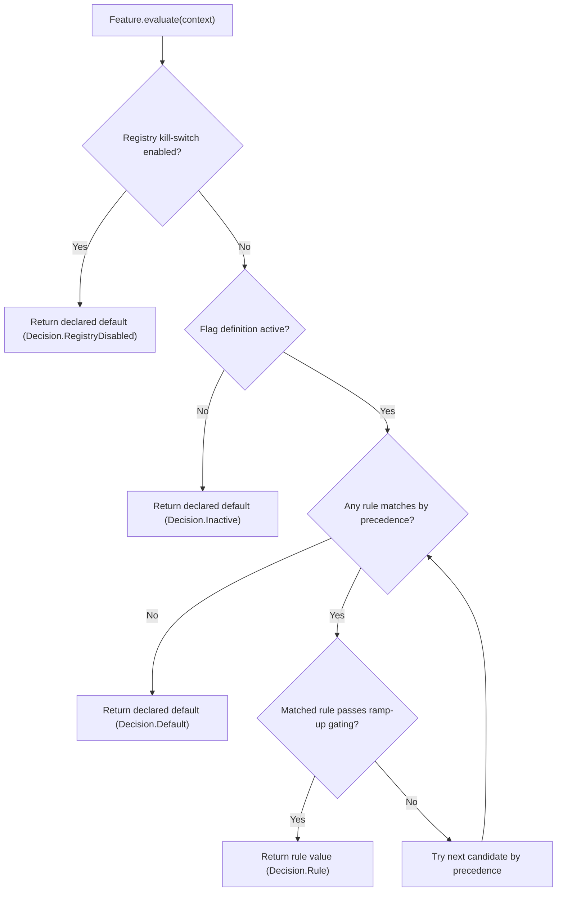

# Evaluation Flow (Step-by-step)

Konditional provides two public entrypoints:

- `Feature.evaluate(context)`: returns the evaluated value (`T`) for hot-path usage.
- `Feature.explain(context)`: returns an `EvaluationResult<T>` with rule matches, bucket info, and decisions for debugging.

## `evaluate` vs `explain`

Both functions compute the same value. `explain` additionally returns:

- Which decision was taken (registry disabled / inactive / rule / default)
- Which rule matched (and which one was skipped by rollout, if any)
- Bucket computation details (feature key, salt, threshold, in/out)

`explain` is intended for debugging, logging, and tooling; treat it as more expensive than `evaluate`.

:::caution Explain is not free
`explain` includes extra rule/bucket metadata and can emit debug logging via hooks. Use it for debugging and tooling,
not for every hot-path evaluation.
:::

| API                | Returns                         | Typical use                         |
|--------------------|----------------------------------|-------------------------------------|
| `evaluate(context)`| `T`                              | Hot‑path feature evaluation         |
| `explain(context)` | `EvaluationResult<T>`            | Debugging, diagnostics, tooling     |

## Decision order (what happens first)

The top-level decision flow is:

Key points:

- **Kill-switch wins**: when `NamespaceRegistry.isAllDisabled` is true, evaluation returns the declared default.
- **Inactive wins**: an inactive flag definition returns the declared default (even if rules exist).
- **Rules are not declaration-ordered**: candidates are evaluated in **precedence order**.
- **Rollout can skip a matching rule**: a rule may match targeting but still be gated out by ramp-up bucketing.

## Total + deterministic evaluation

- **Total**: evaluation always returns a value (default if no rule matches).
- **Deterministic**: same inputs + same config yield the same output.

## Rule precedence (specificity)

Rules are evaluated in descending order of **specificity**, not by the order you wrote them in Kotlin.
This is why your DSL can stay composable: you can include rule sets without worrying about declaration order accidentally
becoming a “hidden policy”.

`explain(...)` includes specificity breakdowns so you can see *why* a rule won.

## Specificity system (how precedence is computed)

Specificity is the sum of constraints in the base targeting plus custom predicate specificity.

**Base targeting specificity:**

- `locales(...)` adds 1 if non-empty
- `platforms(...)` adds 1 if non-empty
- `versions { ... }` adds 1 if bounded
- `axis(...)` adds 1 per axis constraint

**Custom predicate specificity:**

- A custom predicate can define its own `specificity()`
- Default predicate specificity is 1

:::note Guarantee
More specific rules are evaluated before less specific rules. Ramp-up percentage does not affect specificity.
:::

Next:

- [Rules](/rules)
- [Context & Axes](/context-and-axes)
