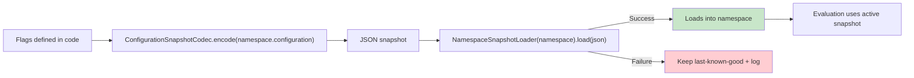

# Configuration Lifecycle

From JSON to evaluation: how configuration flows through Konditional's validated boundary and into the active snapshot.



---

## The Five-Step Lifecycle

### 1. JSON Payload Arrives

Configuration is fetched from remote storage, read from a file, or received over the network:

```kotlin
val json = File("flags.json").readText()
// or: val json = fetchFromRemoteServer()
```

### 2. Validation via `fromJson(...)`

The payload is parsed and validated against registered features:

```kotlin
when (val result = NamespaceSnapshotLoader(AppFeatures).load(json)) {
    is ParseResult.Success -> {
        // Valid configuration, ready to load
    }
    is ParseResult.Failure -> {
        // Invalid JSON rejected
        // This will error
        logError("Parse failed: ${result.error.message}")
    }
}
```

**What's validated:**

- JSON syntax (well-formed JSON)
- Schema structure (matches expected shape)
- Feature existence (keys must be registered)
- Type correctness (values match declared types)

**What's NOT validated:**

- Semantic correctness (whether 50% is the "right" ramp-up)
- Business logic (whether targeting is correct)

### 3. On Success: Atomic Load via `load(...)`

If validation succeeds, the new configuration is loaded atomically:

```kotlin
when (val result = NamespaceSnapshotLoader(AppFeatures).load(json)) {
    is ParseResult.Success -> {
        // Configuration is already loaded (fromJson calls load internally)
        logger.info("Config updated successfully")
    }
    is ParseResult.Failure -> {
        // Failure path (see step 4)
    }
}
```

**How atomic loading works:**

- Registry stores configuration in an `AtomicReference<Configuration>`
- `load(...)` performs a single atomic swap
- Readers see either the old snapshot or the new snapshot — never a partial state

### 4. On Failure: Reject and Log

If validation fails, the payload is rejected and the last-known-good configuration remains active:

```kotlin
when (val result = NamespaceSnapshotLoader(AppFeatures).load(json)) {
    is ParseResult.Success -> Unit
    is ParseResult.Failure -> {
        // Last-known-good config is still active
        logger.error("Config parse failed: ${result.error.message}")
        metrics.increment("config.parse.failure")
        // Optionally: alert on-call, retry later
    }
}
```

**Operational guarantees:**

- No crashes from invalid JSON
- No partial config updates
- Evaluation continues with last-known-good config

### 5. Evaluation Reads Current Snapshot

Evaluation always reads the current active snapshot (lock-free):

```kotlin
// Thread 1: Update configuration
NamespaceSnapshotLoader(AppFeatures).load(newJson)

// Thread 2: Concurrent evaluation
val enabled = AppFeatures.darkMode.evaluate(context)  // Sees old OR new, never mixed
```

---

## Precondition: Features Must Be Registered

Before loading JSON, ensure your `Namespace` objects have been initialized (see [Definition vs Initialization](/fundamentals/definition-vs-initialization)):

```kotlin
// Startup (t0): Initialize namespaces
val _ = AppFeatures

// Later: Load JSON
when (val result = NamespaceSnapshotLoader(AppFeatures).load(json)) {
    is ParseResult.Success -> Unit
    is ParseResult.Failure -> logError(result.error.message)
}
```

If JSON references a feature that hasn't been registered, deserialization fails with `ParseError.FeatureNotFound`.

---

## Exporting Configuration

Export the current snapshot to JSON for storage or transport:

```kotlin
val json = ConfigurationSnapshotCodec.encode(AppFeatures.configuration)
File("flags.json").writeText(json)
```

This captures the current state of all features in the namespace.

---

## Incremental Updates via Patches

Instead of shipping full snapshots, send incremental updates:

```kotlin
val patchJson = """
{
  "flags": [
    {
      "key": "feature::app::darkMode",
      "defaultValue": { "type": "BOOLEAN", "value": false },
      "rules": [ ... ]
    }
  ],
  "removeKeys": ["feature::app::LEGACY_FEATURE"]
}
"""

val currentConfig = AppFeatures.configuration
when (val result = ConfigurationSnapshotCodec.applyPatchJson(currentConfig, patchJson)) {
    is ParseResult.Success -> AppFeatures.load(result.value)
    is ParseResult.Failure -> logError(result.error.message)
}
```

Patches support:
- Adding new flags
- Modifying existing flags
- Removing flags (via `removeKeys`)

---

## Rollback Support

Registries keep a bounded history of prior configurations for operational recovery:

```kotlin
// Rollback to previous config
val success: Boolean = AppFeatures.rollback(steps = 1)

// Inspect rollback history
val history: List<ConfigurationMetadata> = AppFeatures.historyMetadata
```

---

## Integration Patterns

### Polling

```kotlin
while (running) {
    val json = fetchFromServer()
    when (val result = NamespaceSnapshotLoader(AppFeatures).load(json)) {
        is ParseResult.Success -> logger.info("Config updated")
        is ParseResult.Failure -> logger.error("Parse failed: ${result.error}")
    }
    delay(pollInterval)
}
```

### Push-Based (Streams)

```kotlin
configStream.collect { json ->
    when (val result = NamespaceSnapshotLoader(AppFeatures).load(json)) {
        is ParseResult.Success -> logger.info("Config updated")
        is ParseResult.Failure -> logger.error("Parse failed: ${result.error}")
    }
}
```

---

## Next Steps

- [Refresh Safety](/fundamentals/refresh-safety) — Why hot-reload is safe
- [Failure Modes](/fundamentals/failure-modes) — What can go wrong and how to handle it
- [API Reference: Serialization](/api-reference/serialization) — Full API for snapshot/patch operations
- [Persistence Format](/persistence-format) — JSON schema reference
