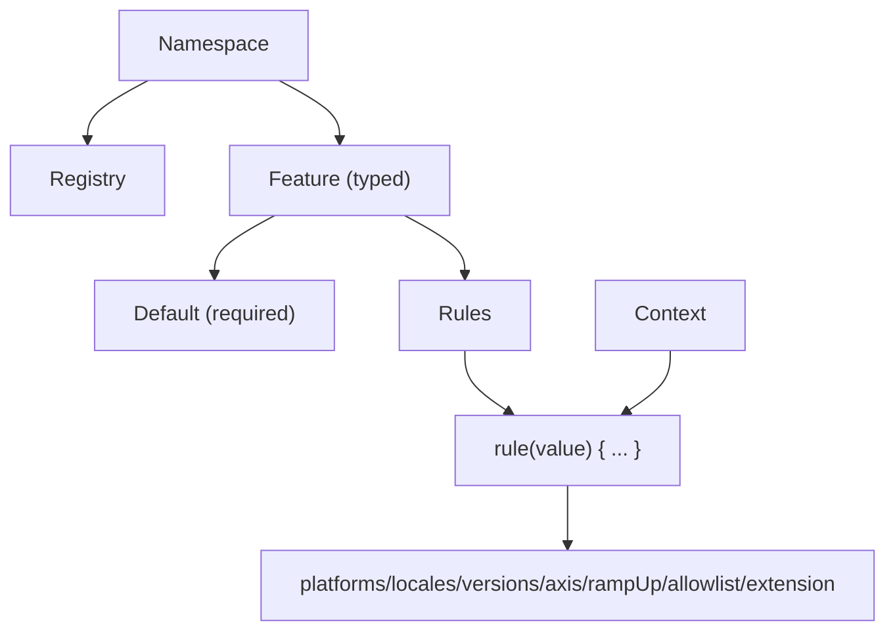

# Core Primitives

Konditional's public surface is intentionally small. Understanding three primitives—**Features**, **Context**, and **Namespaces**—is enough to reason about correctness, organization, and runtime behavior.



---

## Feature

A **Feature** is a typed configuration value with an optional rule set. You define features as delegated properties on a `Namespace`:

```kotlin
import io.amichne.konditional.api.evaluate
import io.amichne.konditional.context.Context

object AppFeatures : Namespace("app") {
    val darkMode by boolean<Context>(default = false)
    val apiEndpoint by string<Context>(default = "https://api.example.com")
    val maxRetries by integer<Context>(default = 3)
    val timeoutSeconds by double<Context>(default = 30.0)
}

val enabled: Boolean = AppFeatures.darkMode.evaluate(context)
val endpoint: String = AppFeatures.apiEndpoint.evaluate(context)
```

**What property delegation buys you:**

- **Property name becomes the key** — No string keys at call sites (typos become compile errors)
- **Type flows from the delegate** — `boolean` → `Boolean`, `string` → `String`, etc.
- **Non-null evaluation** — `default` is required, so evaluation always returns a value

### Supported Types

| Type       | Namespace method | Kotlin type                          | Example default       |
|------------|------------------|--------------------------------------|-----------------------|
| Boolean    | `boolean(...)`   | `Boolean`                            | `false`               |
| String     | `string(...)`    | `String`                             | `"production"`        |
| Integer    | `integer(...)`   | `Int`                                | `42`                  |
| Decimal    | `double(...)`    | `Double`                             | `3.14`                |
| Enum       | `enum(...)`      | `E : Enum<E>`                        | `LogLevel.INFO`       |
| Data class | `custom(...)`    | `T : KotlinEncodeable<ObjectSchema>` | `MyConfig()`          |

Custom data classes are decoded via Kotlin reflection at the JSON boundary. Ensure Kotlin reflection is available at runtime (Konditional bundles it), and keep constructor parameter names stable when using obfuscation.

### Enums Instead of Strings

```kotlin
enum class LogLevel { DEBUG, INFO, WARN, ERROR }
enum class Theme { LIGHT, DARK, AUTO }

object AppConfig : Namespace("app-config") {
    val LOG_LEVEL by enum<LogLevel, Context>(default = LogLevel.INFO)
    val THEME by enum<Theme, Context>(default = Theme.LIGHT)
}

val level: LogLevel = AppConfig.LOG_LEVEL.evaluate(context)
```

Because variants are enum values, invalid variants cannot compile.

---

## Context

**Context** provides evaluation inputs: it tells Konditional who is asking and where they are.

Standard fields (the minimum required by the rule DSL):

```kotlin
val context = Context(
    locale = AppLocale.UNITED_STATES,
    platform = Platform.IOS,
    appVersion = Version.of(2, 1, 0),
    stableId = StableId.of("user-123"),
)
```

### Key Fields

- **`locale`** — Geographic/language targeting (implements `LocaleTag`)
- **`platform`** — iOS, Android, Web, etc. (implements `PlatformTag`)
- **`appVersion`** — Semantic versioning for version-based rollouts
- **`stableId`** — Deterministic identifier for ramp-up bucketing

### StableId (Deterministic Ramp-Ups)

`stableId` is a stable identifier used for deterministic bucketing. `StableId.of(...)` accepts any non-blank string and normalizes it to a hex representation used for bucketing.

```kotlin
val id = StableId.of("user-123")
```

If you need cross-platform consistency, ensure all platforms pass the same canonical stable identifier string into `StableId.of(...)` (it lowercases using `Locale.ROOT`). Use `StableId.fromHex(...)` when you already have a canonical hex identifier.

### Custom Context Types

To keep business targeting logic typed (not string-based), define a custom `Context`:

```kotlin
data class EnterpriseContext(
    override val locale: AppLocale,
    override val platform: Platform,
    override val appVersion: Version,
    override val stableId: StableId,
    val subscriptionTier: SubscriptionTier,
    val employeeCount: Int
) : Context

enum class SubscriptionTier { FREE, PRO, ENTERPRISE }

object PremiumFeatures : Namespace("premium") {
    val ADVANCED_ANALYTICS by boolean<EnterpriseContext>(default = false) {
        rule(true) {
            extension { subscriptionTier == SubscriptionTier.ENTERPRISE && employeeCount > 100 }
        }
    }
}
```

Because the feature is parameterized with `EnterpriseContext`, the receiver inside `extension { ... }` is strongly typed.

---

## Namespace

**Namespaces** are isolation boundaries: each namespace has its own registry and independent configuration lifecycle.

Define multiple namespaces when you need isolated registries (per-team, per-domain):

```kotlin
sealed class AppDomain(id: String) : Namespace(id) {
    data object Auth : AppDomain("auth") {
        val socialLogin by boolean<Context>(default = false)
        val twoFactorAuth by boolean<Context>(default = true)
    }

    data object Payments : AppDomain("payments") {
        val applePay by boolean<Context>(default = false)
        val stripeIntegration by boolean<Context>(default = true)
    }
}

AppDomain.Auth.load(authConfig)
AppDomain.Payments.load(paymentConfig)
```

**What namespace isolation provides:**

- Separate `NamespaceRegistry` instances (no shared state)
- Independent configuration lifecycle (load/rollback separately)
- Namespace kill-switch (`disableAll()`) scoped to that namespace only

---

## Type Safety in Action (What Becomes Impossible)

### Wrong Value Type at Call Site

```kotlin
object Config : Namespace("config") {
    val maxRetries by integer<Context>(default = 3)
}

val retries: Int = Config.maxRetries.evaluate(context)
    // This will error
val retries: String = Config.maxRetries.evaluate(context)  // Compile error
```

### Wrong Context Type for a Feature

```kotlin
val basicContext: Context = Context(...)
// This will error
// PremiumFeatures.ADVANCED_ANALYTICS.evaluate(basicContext)  // Compile error (requires EnterpriseContext)
```

---

## Next Steps

- [Trust Boundaries](/fundamentals/trust-boundaries) — Where compile-time ends and runtime begins
- [Definition vs Initialization](/fundamentals/definition-vs-initialization) — The two-phase lifecycle
- [Evaluation Semantics](/fundamentals/evaluation-semantics) — Total, deterministic, non-null
