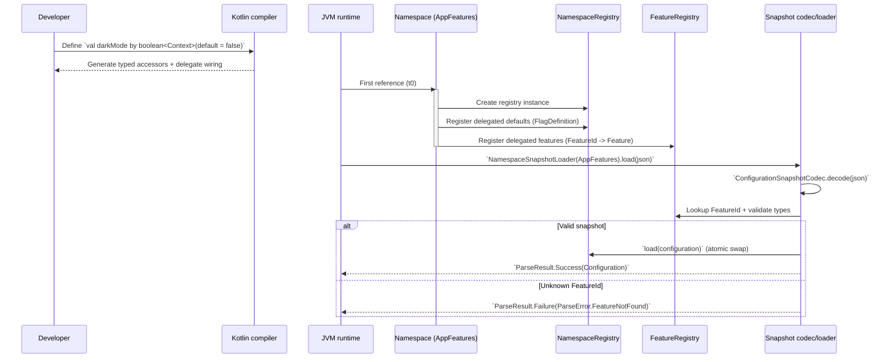

# Definition vs Initialization

Konditional has two distinct phases: **definition** (compile-time type-checking of your flag declarations) and
**initialization** (runtime registration of those declarations). Understanding this distinction is critical for working
with JSON-loaded configuration.



---

## Phase 1: Definition (Compile-Time)

When you write delegated properties, the Kotlin compiler processes them at compile-time:

```kotlin
object AppFeatures : Namespace("app") {
    val darkMode by boolean<Context>(default = false)  // Definition happens here
    val apiEndpoint by string<Context>(default = "https://api.example.com")
}
```

**What happens:**

- The delegated-property wiring is generated (accessors and a backing delegate field)
- Type information is enforced (`BooleanFeature<C, M>` cannot be used where `StringFeature<C, M>` is expected)
- Default values and DSL blocks are type-checked

**Scope:** This is compile-time type checking only. No runtime registration has happened yet.

---

## Phase 2: Initialization (Runtime, t0)

When the `Namespace` class is first accessed, Kotlin's class initialization runs:

```kotlin
// First access triggers class initialization (t0)
val _ = AppFeatures  // or: val flag = AppFeatures.darkMode

// During initialization:
// 1. Namespace("app") constructor runs
// 2. Each delegated property initializes and registers its Feature
// 3. The namespace registry records the initial FlagDefinition (defaults + rules)
// 4. FeatureRegistry records FeatureId -> Feature for snapshot deserialization
```

**What happens at initialization:**

1. `Namespace` constructor creates its `NamespaceRegistry` (one registry per namespace instance)
2. Each property delegate creates a `Feature` instance
3. The namespace registry snapshot is updated with a `FlagDefinition` (default + rules + salt + active state)
4. The feature is registered in an internal lookup registry (`FeatureRegistry`) used by JSON deserialization

**Critical invariant:** Every `FeatureId` that might appear in a snapshot must be registered **before** decoding the
snapshot.

---

## Why This Matters: The Precondition

Snapshot decoding reconstructs the typed `Configuration` by looking up each serialized `FeatureId` in
`FeatureRegistry`. If a feature hasn't been registered (most commonly because its namespace hasn't been initialized),
decoding fails in strict mode:

`FeatureId` values are stable as long as both of these stay stable:
- The namespace id you pass to `Namespace("...")`
- The delegated property name (e.g. `darkMode`)

Snapshots serialize the resulting identifier (format: `feature::<namespaceId>::<propertyName>`). If you rename a
property or change a namespace id, old snapshots will contain unknown `FeatureId` values and strict decoding will fail.

```kotlin
// ✗ Incorrect order
val json = fetchRemoteConfig()
when (val result = ConfigurationSnapshotCodec.decode(json)) {
    // Fails with ParseError.FeatureNotFound if required namespaces were not initialized
    // This will error
    is ParseResult.Failure -> println(result.error)
}
```

```kotlin
// ✓ Correct order
val _ = AppFeatures  // Ensure this namespace is initialized (t0)

val json = fetchRemoteConfig()
when (val result = NamespaceSnapshotLoader(AppFeatures).load(json)) {
    is ParseResult.Success -> Unit
    is ParseResult.Failure -> logError(result.error.message)
}
```

If you need forward compatibility during migrations (old snapshots containing removed/renamed flags), you can opt into
skipping unknown keys:

```kotlin
val result =
    NamespaceSnapshotLoader(AppFeatures).load(
        json,
        SnapshotLoadOptions.skipUnknownKeys { warning -> logWarning(warning.message) },
    )
```

---

## Initialization Patterns

### Pattern 1: Explicit Reference at Startup

```kotlin
fun main() {
    // Force initialization of all namespaces
    val _ = AppFeatures
    val _ = PaymentFeatures
    val _ = AnalyticsFeatures

    // Now safe to deserialize JSON
    loadRemoteConfig()
}
```

### Pattern 2: Lazy Initialization (Use with Caution)

```kotlin
val appFeatures by lazy { AppFeatures }

fun loadConfig() {
    appFeatures  // Initializes on first access
    when (val result = NamespaceSnapshotLoader(appFeatures).load(json)) {
        is ParseResult.Success -> Unit
        is ParseResult.Failure -> logError(result.error.message)
    }
}
```

**Warning:** Ensure the lazy initialization completes **before** JSON deserialization.

### Pattern 3: Dependency Injection

```kotlin
@Singleton
class KonditionalBootstrap {
    init {
        // Initialize all namespaces at DI container startup
        AppFeatures
        PaymentFeatures
        AnalyticsFeatures
    }
}
```

---

## Definition vs Initialization: Summary

| Phase              | When         | What Happens                                        | Guarantees                                   |
|--------------------|--------------|-----------------------------------------------------|----------------------------------------------|
| **Definition**     | Compile-time | Delegation wiring + type checking                   | Types are correct (but nothing is registered) |
| **Initialization** | Runtime (t0) | Delegate runs: define defaults + register features  | Namespace/Feature registries are ready for snapshot decoding |

---

## The Two-Phase Contract

1. **Define** flags as properties (compile-time type safety)
2. **Initialize** the namespaces that appear in your snapshots (runtime registration)
3. **Load** JSON configuration (runtime validation + atomic swap)

Violating this order (decoding JSON before required namespaces are initialized) can result in
`ParseError.FeatureNotFound` (unless you opt into skipping unknown keys).

---

## Next Steps

- [Configuration Lifecycle](/fundamentals/configuration-lifecycle) — JSON → ParseResult → load → evaluation
- [Trust Boundaries](/fundamentals/trust-boundaries) — Compile-time vs runtime guarantees
- [Failure Modes](/fundamentals/failure-modes) — What happens when things go wrong
