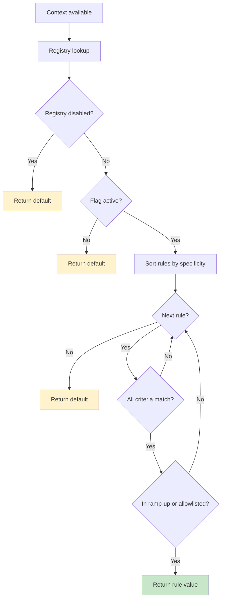

# Evaluation Semantics

Konditional evaluation is designed to be **total**, **deterministic**, and **atomic**. Same inputs always produce the same outputs, and evaluation always returns a value.

---

## Three Core Guarantees

### 1. Total (Always Returns a Value)

Evaluation never returns `null` or throws:

```kotlin
val enabled: Boolean = AppFeatures.darkMode.evaluate(context)
```

**Why:** Every feature requires a `default`, so there's always a fallback value when no rules match.

### 2. Deterministic (Same Inputs → Same Outputs)

The same context always produces the same result:

```kotlin
val ctx = Context(
    locale = AppLocale.UNITED_STATES,
    platform = Platform.IOS,
    appVersion = Version.of(2, 1, 0),
    stableId = StableId.of("user-123"),
)

val result1 = AppFeatures.darkMode.evaluate(ctx)
val result2 = AppFeatures.darkMode.evaluate(ctx)
// result1 == result2  (guaranteed)
```

**How:** Ramp-up bucketing is based on SHA-256 hashing (deterministic), and rule ordering is stable (by specificity, then definition order).

### 3. Atomic (Readers See Consistent Snapshots)

Configuration updates are atomic; readers never see partial updates:

```kotlin
// Thread 1: Update configuration
AppFeatures.load(newConfig)

// Thread 2: Concurrent evaluation
val value = AppFeatures.darkMode.evaluate(context)  // Sees old OR new, never mixed
```

**How:** Registry stores configuration in an `AtomicReference`; `load(...)` performs a single atomic swap.

---

## Evaluation Flow



1. **Registry lookup** — O(1) lookup by feature key
2. **Kill-switch check** — If namespace is disabled via `disableAll()`, return default
3. **Active check** — If flag is inactive, return default
4. **Sort rules** — Rules are pre-sorted by specificity (highest first)
5. **Iterate rules** — For each rule (in order):
   - Check if all criteria match (AND semantics)
   - If match, check ramp-up bucket (or allowlist bypass)
   - If in ramp-up, return rule value
6. **Default fallback** — If no rules match, return default

---

## AND Semantics (Within a Rule)

All criteria in a rule must match:

```kotlin
val premiumFeature by boolean<Context>(default = false) {
    rule(true) {
        platforms(Platform.IOS, Platform.ANDROID)
        locales(AppLocale.UNITED_STATES)
        versions { min(2, 0, 0) }
        rampUp { 50.0 }
    }
}
```

For this rule to apply:
- Platform must be iOS **OR** Android
- **AND** locale must be UNITED_STATES
- **AND** version must be >= 2.0.0
- **AND** user must be in the 50% ramp-up bucket

---

## Specificity Ordering (Across Rules)

Rules are sorted by **specificity** (count of targeting criteria):

```
specificity(rule):
  +1 if platforms is set
  +1 if locales is set
  +1 if versions has bounds
  +N for axis constraints (one per axis)
  +extensionSpecificity (defaults to 1 when `extension { ... }` is used)
```

Most-specific rule wins. If multiple rules have the same specificity, definition order is used as tie-breaker.

```kotlin
val apiEndpoint by string<Context>(default = "https://api.example.com") {
    rule("https://api-ios-us.example.com") {  // specificity = 2 (platform + locale)
        platforms(Platform.IOS)
        locales(AppLocale.UNITED_STATES)
    }
    rule("https://api-ios.example.com") {  // specificity = 1 (platform only)
        platforms(Platform.IOS)
    }
}

// iOS + US users → first rule (more specific)
// iOS + other locales → second rule
// Other platforms → default
```

See [Rules & Targeting: Specificity System](/rules-and-targeting/specificity-system) for details.

---

## Deterministic Ramp-Up Bucketing

Ramp-ups use SHA-256 bucketing for deterministic, reproducible results:

```
input = "$salt:$flagKey:${stableIdHex}"
hash = sha256(input)
bucket = uint32(hash[0..3]) % 10_000  // [0, 10_000)
thresholdBasisPoints = round(rampUpPercent * 100)
inRampUp = bucket < thresholdBasisPoints
```

**Properties:**

- Same `(stableId, flagKey, salt)` → same bucket
- Increasing ramp-up percentage only adds users (no reshuffle)
- Changing `salt` redistributes buckets (useful for re-running experiments)

See [Rules & Targeting: Rollout Strategies](/rules-and-targeting/rollout-strategies) for details.

---

## Evaluation API

### `evaluate(context): T`

Concise evaluation with an explicit context:

```kotlin
val darkMode = AppFeatures.darkMode.evaluate(context)
```

Use when defaults are meaningful and you want minimal call-site surface.

### `evaluateWithReason(context): EvaluationResult<T>`

Explainable evaluation for debugging:

```kotlin
val result = AppFeatures.darkMode.evaluateWithReason(context)
println(result.decision)  // Why this value was chosen
```

`EvaluationResult` includes:
- Decision kind (rule/default/inactive/disabled)
- Matched rule constraints + specificity
- Deterministic ramp-up bucket information

---

## Performance Model

**Time complexity:**

- **Registry lookup:** O(1)
- **Rule iteration:** O(n) where n = rules per flag (typically small, fewer than 10)
- **Ramp-up bucketing:** 0 or 1 SHA-256 hash per evaluation (only when a rule matches by criteria)

**Space:**

- Evaluation allocates a small trace object internally
- Rule structures are pre-built and reused across evaluations

---

## Concurrency Model

Evaluation is designed for concurrent reads:

- **Lock-free reads** — No synchronization required for evaluation
- **Atomic updates** — `Namespace.load(...)` swaps configuration atomically

```kotlin
// Thread 1
AppFeatures.load(newConfig)

// Thread 2 (during update)
val value = AppFeatures.darkMode.evaluate(context)  // Sees old OR new, never mixed
```

See [Refresh Safety](/fundamentals/refresh-safety) for details.

---

## Emergency Kill-Switch

Disable all evaluations in a namespace (return defaults):

```kotlin
AppFeatures.disableAll()
// ... all evaluations return declared defaults ...
AppFeatures.enableAll()
```

This affects only the specific namespace (other namespaces are unaffected).

---

## Next Steps

- [Refresh Safety](/fundamentals/refresh-safety) — Why atomic updates are safe
- [Rules & Targeting: Specificity System](/rules-and-targeting/specificity-system) — Rule ordering details
- [Rules & Targeting: Rollout Strategies](/rules-and-targeting/rollout-strategies) — Bucketing mechanics
- [Theory: Determinism Proofs](/theory/determinism-proofs) — SHA-256 bucketing guarantees
